# Arquitetura do Sistema — PowerCell CRM

> Normas de UX/UI e convenções técnicas do frontend (Progressive Disclosure, layout 2/3+1/3, tokens Shadcn, `sonner`, ESLint `no-restricted-syntax`, utilitários centralizados): ver **`FRONTEND_GUIDELINES.md`**.

## Visão Geral

O PowerCell é um sistema de gestão de processos de crédito habitacional, concebido para a intermediação imobiliária e financeira em Portugal. A arquitetura segue o padrão **monolito modular** com separação clara entre frontend, backend API e serviços de infraestrutura.

---

## Diagrama de Arquitetura

```mermaid
graph TB
    subgraph Clientes["🖥️ Clientes (Browser)"]
        User["Utilizador"]
        Portal["Portal do Cliente<br/>(Magic Link)"]
        PublicForm["Formulário Público<br/>/registo"]
        RGPDForm["Página RGPD<br/>/rgpd/:token"]
    end

    subgraph Frontend["⚛️ Frontend — React 19 + Vite"]
        Router["React Router<br/>(Rotas protegidas por role)"]
        AuthCtx["AuthContext<br/>(JWT + Impersonate)"]
        TasksCtx["TasksContext<br/>(Polling + Circuit Breaker)"]
        UploadCtx["UploadProgressContext"]
        ThemeCtx["ThemeContext<br/>(Light/Dark)"]
        API_SVC["api.js<br/>(Axios + 429 Retry)"]
        WSClient["useWebSocket<br/>(Singleton + Backoff)"]
        TanStack["TanStack Query<br/>(Cache + Mutations)"]
        LazyChunk["LazyChunkErrorBoundary<br/>(Stale Deploy Recovery)"]
        Pages["Páginas<br/>(~50, Lazy Loaded)"]
    end

    subgraph API["🐍 Backend API — FastAPI (Python 3.12)"]
        CORS["CORS Middleware<br/>(Fail-Secure)"]
        RateLimit["Rate Limiting<br/>(Por role: slowapi)"]
        SecurityHeaders["Security Headers<br/>(HSTS, CSP, X-Frame)"]
        SentryMW["Sentry Integration"]
        InputSanitize["Input Sanitization"]

        subgraph Rotas["Rotas da API (/api) — thin stubs"]
            AuthR["/auth"]
            ProcessesR["/processes<br/>(→ services/process_*)"]
            DocumentsR["/documents<br/>(→ services/document_*)"]
            TasksR["/tasks<br/>(BG jobs + CRUD)"]
            ClientsR["/clients"]
            PortalR["/portal<br/>(cliente + fulfill)"]
            OtherR["+40 rotas (ver AGENTS.md)"]
        end

        subgraph Servicos["Camada de Serviços"]
            ProcessSvc["ProcessService"]
            AI_DocSvc["AIDocumentService<br/>(GPT-4o, Gemini)"]
            WSManager["WebSocketManager<br/>(ConnectionManager)"]
            RedisCache["RedisCache<br/>(Cache + Queue)"]
            EmailSvc["EmailService<br/>(SendGrid/Resend)"]
            EncryptionSvc["EncryptionService<br/>(Fernet + Blind Indexing)"]
            AuditCDC["AuditCDC<br/>(Change Data Capture)"]
            NotificationSvc["NotificationService"]
            TaskQueue["TaskQueue (ARQ)"]
            S3Storage["S3Storage<br/>(Pre-signed URLs)"]
            WorkflowEngine["WorkflowEngine"]
            ScraperSvc["PropertyScraper<br/>(Idealista)"]
            AIConfidence["Confidence Scorer<br/>(Score por campo)"]
            OrganizerSvc["Document Organizer<br/>(Categorização automática)"]
            EmailB2BSvc["EmailB2BService<br/>(Enviar p/ Balcões)"]
            ChangelogSvc["ChangelogService<br/>(Gerar notas IA)"]
            AnnotationSvc["AnnotationService<br/>(5 tipos de anotação)"]
            StorageFactory["StorageService<br/>(Factory: Local/S3/OneDrive)"]
            SystemSMTPSvc["SystemSMTPConfig<br/>(Bloco A - Email Transacional)"]
            SystemWebmail["SystemWebmailConfig<br/>(Bloco C - Webmail Partilhado)"]
            SharedEmailSync["SharedEmailSync<br/>(Role-based IMAP Sync)"]
        end

        subgraph Middleware_Backend["Middleware"]
            RateLimitMW["User Rate Limiter"]
            UserRL["user_rate_limit<br/>(admin: 1000, staff: 200)"]
        end
    end

    subgraph Infra["📦 Infraestrutura"]
        MongoDB[("MongoDB Atlas - Base de Dados")]
        Redis[("Redis (Upstash) - Cache + Task Queue")]
        S3[("AWS S3 - Armazenamento")]
        Sentry["Sentry<br/>(Observabilidade)"]
        SystemSMTP["System SMTP<br/>(Email Transacional via Bloco A)"]
        OpenAI["OpenAI GPT-4o<br/>(Análise de Documentos)"]
        Gemini["Gemini Flash<br/>(Análise de Documentos)"]
        TrelloAPI["Trello API<br/>(Integração)"]
        GmailAPI["Gmail API<br/>(Sincronização Email)"]
    end

    subgraph Worker["⚙️ Background Worker"]
        ARQWorker["ARQ Worker<br/>(async tasks)"]
        JobMonitor["Job Monitor<br/>(Stuck Detection)"]
        BackupSched["Backup Scheduler<br/>(Diário 03:00 UTC)"]
        RestorePipeline["restore_dev_from_backup<br/>(RGPD Fail-Safe)"]
        SyncPipeline["sync_prod_to_dev<br/>(Sanitização PII)"]
    end

    subgraph Deploy["🚀 Deploy"]
        Vercel["Vercel<br/>(Frontend CDN)"]
        Render["Render<br/>(Backend API)"]
        GHA["GitHub Actions<br/>(CI/CD Pipeline)"]
    end

    %% Clientes → Frontend
    User --> Router
    Portal --> Router
    PublicForm --> Router
    RGPDForm --> Router

    %% Frontend Interno
    Router --> AuthCtx
    Router --> Pages
    Pages --> API_SVC
    Pages --> TanStack
    Pages --> WSClient
    WSClient --> AuthCtx
    LazyChunk --> Pages

    %% Frontend → Backend
    API_SVC -->|HTTPS + JWT| CORS
    WSClient -->|WSS + JWT| OtherR

    %% Backend Pipeline
    CORS --> RateLimitMW
    RateLimitMW --> SecurityHeaders
    SecurityHeaders --> InputSanitize
    InputSanitize --> Rotas
    Rotas --> Servicos

    %% Serviços → Infraestrutura
    ProcessSvc --> MongoDB
    AI_DocSvc --> OpenAI
    AI_DocSvc --> Gemini
    AI_DocSvc --> MongoDB
    AIConfidence --> AI_DocSvc
    RedisCache --> Redis
    TaskQueue --> Redis
    EmailSvc --> SystemSMTP
    S3Storage --> S3
    OrganizerSvc --> S3Storage
    ScraperSvc -->|Scraping| ExternalSites["Sites Externos<br/>(Idealista)"]
    OtherR --> GmailAPI
    TrelloAPI -.->|Opcional| OtherR
    DocumentsR --> S3Storage
    PortalR --> DocumentsR
    TasksCtx --> TasksR
    Pages --> TasksCtx

    %% Background Worker
    TaskQueue -->|Enqueue| ARQWorker
    ARQWorker --> AI_DocSvc
    ARQWorker --> MongoDB
    ARQWorker --> Redis
    JobMonitor --> MongoDB
    BackupSched --> MongoDB
    BackupSched -->|Upload ZIP| S3
    RestorePipeline -->|Localizar backup| S3
    RestorePipeline -->|Download ZIP| S3
    RestorePipeline -->|Import temp + Swap| MongoDB
    SyncPipeline -->|Leitura| MongoDB
    SyncPipeline -->|Escrita sanitized| MongoDB

    %% Observabilidade
    SentryMW --> Sentry

    %% Deploy
    GHA -->|Deploy| Vercel
    GHA -->|Deploy| Render
    Vercel -->|CDN + SPA Rewrite| User
    Render -->|API| API_SVC

    %% Estilos
    classDef frontend fill:#0ea5e9,stroke:#0369a1,color:#fff,font-weight:bold
    classDef backend fill:#10b981,stroke:#047857,color:#fff,font-weight:bold
    classDef infra fill:#f59e0b,stroke:#b45309,color:#fff,font-weight:bold
    classDef worker fill:#8b5cf6,stroke:#6d28d9,color:#fff,font-weight:bold
    classDef deploy fill:#ef4444,stroke:#b91c1c,color:#fff,font-weight:bold

    class Frontend frontend
    class API,Middleware_Backend backend
    class Infra infra
    class Worker worker
    class Deploy deploy
```

---

## Fluxo de Dados Principal

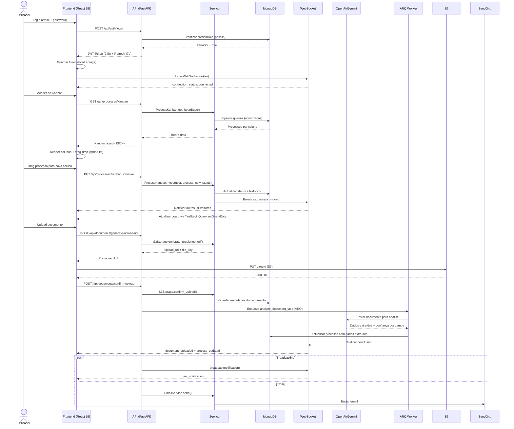

---

## Autenticação e Autorização


---

## Modelos de Dados Principais


---

## Refatoração Fase 1: Separação Cliente ↔ Processo

### Princípio

A entidade **Cliente** representa a pessoa/fiscal entity — dados que são intrínsecos à pessoa e não mudam entre processos (nome, NIF, email, telefone, estado civil, etc.).

A entidade **Processo** representa o negócio/dossier — dados específicos de cada operação de crédito ou intermediação (valores, banco atribuído, dados financeiros, imobiliários, etc.).

### Diagrama da Nova Arquitetura

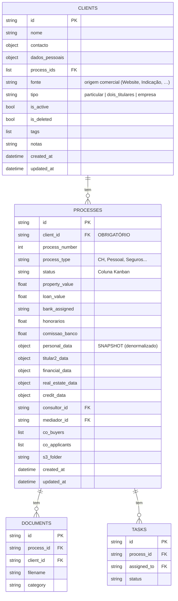

### O que mudou

| Antes (misturado) | Depois (separado) |
|---|---|
| Cliente tinha `dados_financeiros` | ❌ Removido — financeiros pertencem ao Processo |
| Cliente tinha `co_buyers`, `co_applicants` | ❌ Removido — pertencem ao Processo |
| Processo tinha `client_id` opcional | ✅ `client_id` agora é **OBRIGATÓRIO** |
| Processo sem campos de negócio raiz | ✅ Adicionados: `property_value`, `loan_value`, `bank_assigned`, `honorarios`, `comissao_banco` |
| `ClientFinancialData` existia | ❌ Removido — financeiros estão em `Process.financial_data` |
| `personal_data` no Processo era fonte de verdade | ⚠️ Agora é SNAPSHOT (denormalizado) — fonte de verdade é `clients.dados_pessoais` |

### Sincronização Bidirecional (Pacote P)

Para garantir a integridade do SNAPSHOT denormalizado, o sistema implementa sincronização bidirecional:

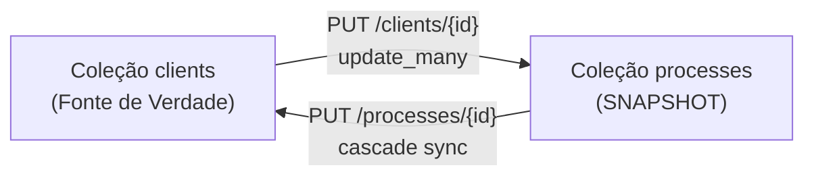

**Cliente → Processos (PUT /clients/{id})**: Quando o cliente é editado, o endpoint propaga automaticamente:
- `nome` → `client_name`, `personal_data.nome`, `personal_data.name` (update_many em todos os process_ids)
- `contacto.email/telefone` → `client_email/client_phone` + `personal_data.*`
- `dados_pessoais.*` → `personal_data.*` correspondente (NIF, morada, estado civil, etc.)
- Blind indexes (`nif_hash`, `email_hash`) são regenerados quando necessário

**Processo → Cliente → Restantes Processos (PUT /processes/{id})**: Quando o nome é editado dentro do processo:
1. `extract_client_updates_from_body()` extrai campos pessoais do body
2. Atualiza o documento do cliente na coleção `clients`
3. **Cascade sync**: Propaga o novo nome para todos os restantes processos do mesmo cliente

### Script de Migração

O script `backend/scripts/migrate_clients_to_processes.py` executa a migração segura:

1. **Backup** automático das coleções originais (`clients_legacy`, `processes_legacy`)
2. **Deduplicação** de clientes por NIF/Email/Nome
3. **Extração** de dados pessoais dos processos → criar/encontrar Clientes
4. **client_id** obrigatório adicionado a todos os processos
5. **Campos de negócio** extraídos para o nível raiz do processo
6. **Validação** de integridade pós-migração
7. **Rollback** disponível com `--rollback`

### Fases Futuras

| Fase | Descrição | Estado |
|------|-----------|--------|
| **Fase 1** | Modelos + Migração | ✅ Concluída |
| **Fase 2a — Listagens** | Filtros de listagem separados (Cliente vs Processo) + `assigned_user_ids` AND/OR | ✅ Pacotes FK/FL |
| **Fase 2** | Remover campos deprecados nas rotas de escrita / snapshots | 🔜 Pendente |
| **Fase 3** | Remover `personal_data` do Processo (apenas referência) | 🔜 Pendente |

---

## Componentes e Tecnologias

| Camada | Tecnologia | Finalidade |
|--------|-----------|------------|
| **Frontend** | React 19 + Vite 6 | SPA com code splitting e lazy loading |
| **Estado Cliente** | Zustand | Estado local leve |
| **Estado Servidor** | TanStack Query v5 | Cache, mutations, optimistic updates. Factory `queryKeys` em `frontend/src/lib/queryClient.js` |
| **UI** | shadcn/ui (New York) + Tailwind CSS 4 | Componentes e estilização |
| **Drag-Drop** | @dnd-kit/core | Kanban board interativo |
| **Backend** | FastAPI (Python 3.12) | API REST async com Pydantic |
| **Base de Dados** | MongoDB Atlas | Persistência de dados (Motor async) |
| **Cache** | Upstash Redis | Cache de sessões e fila de tarefas |
| **Armazenamento** | AWS S3 | Ficheiros com pre-signed URLs |
| **Filas** | ARQ (Redis-based) | Tarefas em background (análise IA) |
| **WebSocket** | FastAPI WebSocket | Notificações em tempo real |
| **IA** | OpenAI GPT-4o + Gemini Flash | Análise de documentos e extração |
| **Email** | SendGrid / Resend | Email transacional e rascunhos automáticos |
| **Observabilidade** | Sentry | Monitoring de erros e performance |
| **CI/CD** | GitHub Actions | Pipeline de testes e deploy |
| **Hosting FE** | Vercel | CDN + SPA rewrites |
| **Hosting BE** | Render | Docker container + auto-deploy |

---

## Padrões de Design Utilizados

| Padrão | Onde é aplicado |
|--------|----------------|
| **Singleton** | `DatabaseProxy` (MongoDB), `WebSocketManager`, `useWebSocket` (frontend) |
| **Circuit Breaker** | `TasksContext` — polling de tarefas com falhas consecutivas |
| **Reference Counting** | `useWebSocket` — uma ligação partilhada entre componentes |
| **Exponential Backoff** | `useWebSocket` (1s→30s), API interceptor 429 retry (2s→4s→8s), Notifications polling (30s→5min) |
| **Retry with Jitter** | API interceptor — 3 retries com jitter ±500ms para evitar thundering herd |
| **Lazy Loading** | 50+ páginas com `React.lazy()` + `Suspense` |
| **Chunk Error Recovery** | `LazyChunkErrorBoundary` — deteta stale deployments e faz reload automático |
| **Proxy (Lazy)** | `DatabaseProxy`, `ClientProxy` — ligação on-demand |
| **Repository** | `services/*` — abstracção sobre acesso à base de dados |
| **Middleware Chain** | CORS → Rate Limiting → Security Headers → Input Sanitization → Route Handler |
| **Observer (Pub/Sub)** | WebSocket events — `broadcast()` para notificações em tempo real |
| **Change Data Capture** | `AuditCDC` — monitoriza alterações via MongoDB Change Stream |
| **Strategy** | `AI_CONFIG_DEFAULTS` — seleção de modelo IA por tipo de tarefa |
| **Pre-signed URL** | `S3Storage` — upload directo do frontend para S3 sem passar pelo backend |
| **Blind Indexing** | `EncryptionService` — HMAC-SHA256 para pesquisa em campos encriptados |
| **Dedicated Collection** | `history`, `audit_trail` — colecções separadas para evitar 16MB limit |
| **Confidence Scoring** | `AIDocumentService` — score 0.0-1.0 por campo extraído, alertas para < 0.8 |
| **Fail-Safe Swap** | `restore_dev_from_backup.py` — BD de Dev não é modificada se o backup estiver corrompido |
| **Temporary Collection** | `_restore_temp_*` — coleções temporárias para migração atómica de dados |
| **RGPD Sanitization Pipeline** | `sync_prod_to_dev.py`, `restore_dev_from_backup.py` — anonimização determinística de PII (nome, NIF, email, telefone, IBAN) |
| **Factory (Storage)** | `storage_service.py` — `get_storage_adapter()` retorna adapter correto (Local, S3, OneDrive) baseado em `system_settings.storage.provider` |
| **Strategy (Email)** | `send_email(force_system=True)` — tenta contas nomeadas, depois SystemSMTP (Bloco A), depois erro |
| **Fallback Chain (Webmail)** | `sync_shared_role_emails()` — tenta `shared_role_email_configs`, depois `system_webmail` (Bloco C), depois erro |
| **Provider-Agnostic** | Storage, Email, Webmail configuráveis via Admin Settings sem alteração de código |
| **Thin Route + Service** | `routes/documents.py` / `routes/processes.py` — stubs FastAPI; lógica em `services/document_*.py` e `services/process_*.py` (ver `AGENTS.md`) |
| **Safe Partial Update** | `sanitizeProcessUpdatePayload` (frontend) — omite arrays vazios / `documents` / `onedrive_links` no PUT processo |
| **Sticky Toast** | `TasksContext` — `toast.loading` com `duration: Infinity` e id estável; sem auto-dismiss na navegação |
| **Passive Cache Invalidation** | Webmail — WS `new_email` → `invalidateQueries(['emails'])` com `staleTime: 60s`; refetch silencioso sem skeleton |
| **Last-Access Guard** | UCR — `run_delete_user_company_role` recusa HTTP 400 se for o único acesso do utilizador |
| **Portal Checklist Fulfill** | `document_portal_fulfill` — upload staff CRM satisfaz REQUESTED do portal |
| **MongoDB `$set` Partial Write** | Todas as escritas em `services/*.py` usam `update_one({...}, {"$set": {...}})` — nunca substituem o documento inteiro. Preserva campos não incluídos no payload (ex: `document_metadata.ai_analyzed`, mapeamentos S3, timestamps de outros subsistemas) |

### Regra: escrita em MongoDB com `$set`

Todo o código em `backend/services/*.py` que atualiza um documento existente **deve** usar `update_one`/`update_many` com o operador `$set` sobre os campos alterados, nunca `replace_one` ou um `update_one` sem `$set` (que substitui o documento inteiro e apaga silenciosamente metadados não incluídos no payload).

```python
# ✅ Correto — só os campos passados são escritos, o resto do documento sobrevive
await db.documents.update_one({"id": document_id}, {"$set": {"category": nova_categoria}})

# ❌ Errado — substitui o documento inteiro, perde document_metadata.ai_analyzed,
#    mapeamentos S3, e qualquer campo não incluído no payload
await db.documents.update_one({"id": document_id}, {"category": nova_categoria})
```

Isto é particularmente crítico em coleções com metadados gerados por subsistemas diferentes ao longo do tempo (`documents.document_metadata`, `processes.s3_folder` / mapeamentos S3, `clients.dados_pessoais`) — uma escrita parcial mal feita apaga silenciosamente trabalho de outro fluxo (ex: uma categorização manual apagar o flag `ai_analyzed`, ou um `PUT /processes/{id}` apagar o `s3_folder` calculado pelo `admin_s3_process_mappings`).

### Proteção de mapeamentos S3

Os mapeamentos S3 (`admin_s3_client_mappings.py`, `admin_s3_process_mappings.py`, `admin_s3_user_mappings.py`) são tratados como dados sensíveis a preservar:

- Nunca reescrever `services/admin_storage.py` — o nome colide com a rota `routes/admin_storage.py` (ver `AGENTS.md`); os serviços vivem em `services/admin_s3_*.py`.
- Endpoints de atualização de mapeamentos usam `$set` sobre os campos específicos (`s3_folder`, `client_folder_id`, etc.), nunca substituem o documento do processo/cliente.
- Aliases legados (`client-s3-mappings`) mantêm-se como stubs de compatibilidade — não remover sem migração explícita.

Ver `AGENTS.md` (secção "Route thinning") para o mapa completo `routes/* ↔ services/*` e as colisões de nomes a evitar.

---

## Estratégia de Resiliência

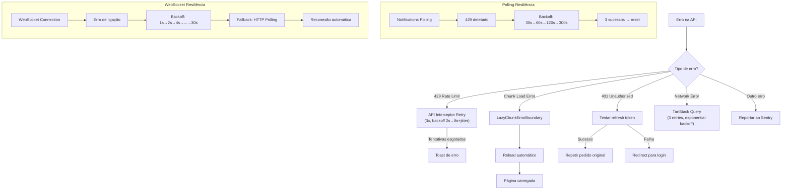

---

## Fluxo de Restauro Seguro (Dev ← S3 Backup)

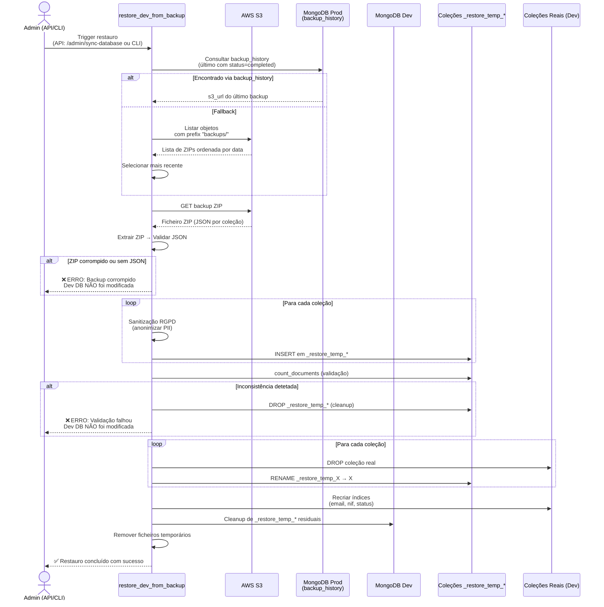

**Propriedades de segurança do pipeline:**

| Propriedade | Descrição |
|-------------|-----------|
| **Fail-Safe** | A BD de Dev **nunca** é modificada se qualquer passo falhar |
| **Não toca em Prod** | Não acede ao MongoDB de Produção diretamente (apenas S3) |
| **Atomicidade** | Swap por rename garante consistência |
| **Rastreabilidade** | Cada documento recebe `_sanitized_at` e `_sanitized_source` |
| **Cleanup automático** | Coleções temporárias são removidas em caso de sucesso ou erro |

---

## Navegação e Controlo de Acessos (RBAC)

### Separação das áreas de Administração (v2.0)

A Administração deixou de ser um único hub. Existem **duas superfícies distintas**, ambas restritas aos perfis activos `admin` e `ceo` (`canAccessOrgAdmin` / `ADMIN_PANEL_ROLES`):

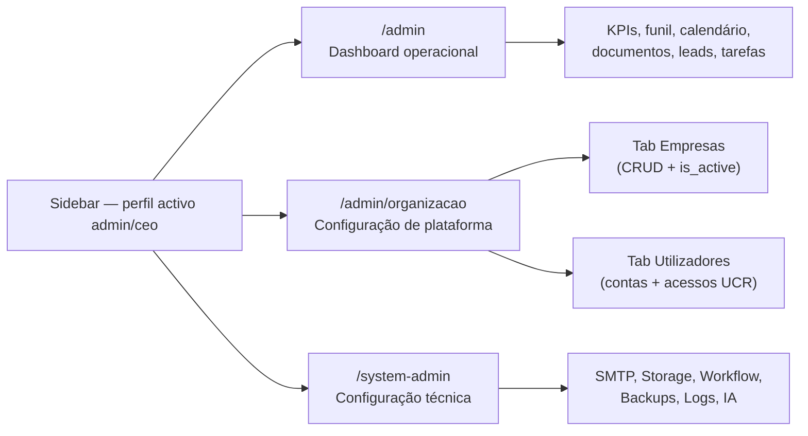

| Rota | Superfície | Quem acede | Conteúdo |
|------|------------|------------|----------|
| **`/admin`** | Dashboard **operacional** | admin, ceo | KPIs, funil de conversão, calendário, documentos a expirar, pesquisa, tarefas, leads — o dia-a-dia da operação |
| **`/admin/organizacao`** | Área de **configuração de plataforma** | **apenas** perfil activo `admin` ou `ceo` | Tab **Empresas** + tab **Utilizadores** (contas, cargos UCR, Parceiro/Indexação). Substitui `/utilizadores` (redirect) |
| **`/system-admin`** | Painel técnico / sistema | admin, ceo (tabs técnicas só admin) | Configurações, automações, permissões, backups, logs, IA, RGPD |

O gate usa o **perfil activo** (`effectiveRole` / `X-Active-Role`), não só o `user.role` do JWT: um CEO que muda o ContextSwitcher para Consultor deixa de ver Administração.

**Dashboard operacional (`/admin`) — tabs de negócio:**

| Tab | Visível para | Descrição |
|-----|-------------|-----------|
| Visão Geral | admin, CEO | Quadro Kanban de processos com filtros |
| Calendário | admin, CEO | Prazos e eventos do pipeline |
| Documentos | admin, CEO | Documentos com validades próximas |
| Análise IA | admin, CEO | Análise inteligente de documentos |
| Pesquisar | admin, CEO | Pesquisa global de clientes |
| Tarefas | admin, CEO | Gestão de tarefas assíncronas |
| Leads | admin, CEO | Pipeline de leads |

**Área de configuração de plataforma (`/admin/organizacao`):**

| Tab | Visível para | Descrição |
|-----|-------------|-----------|
| **Empresas** | admin, ceo | CRUD de empresas do grupo; `is_active` (soft-delete) em vez de eliminar o documento |
| **Utilizadores** | admin, ceo | Contas + acessos UCR (vários cargos por empresa, proteção do último acesso, cargos oficiais Parceiro e Indexação) |

**Painel técnico (`/system-admin`) — tabs de sistema:**

| Tab | Visível para | Descrição |
|-----|-------------|-----------|
| **Configurações** | admin, CEO | Configurações gerais do sistema (SystemConfigPage) |
| **Automações** | admin, CEO | Regras de automação "Se X, Então Y" |
| **Permissões** | admin, CEO | Capabilities por utilizador / role |
| **Segurança & Backups** | **apenas admin** | Backups da BD e verificação de integridade |
| **Logs & Diagnósticos** | **apenas admin** | Logs do sistema, importação IA e diagnósticos |

### Sidebar Principal por Role

| Role | Menu Visível | Observações |
|------|-------------|-------------|
| **indexação** | Listas de Trabalho (Registos, Processos, Doc. Pendentes) | SEM Dashboard, SEM Estatísticas, SEM Configuração |
| **consultor/mediador/intermediário** | Dashboard + O Meu Negócio + Visão Global + Comunicações | Acesso operacional standard |
| **diretor** | Dashboard + O Meu Negócio + Visão Global + Comunicações + Gestão e Operações | Vê Estatísticas e Rascunhos; sem Painel Admin |
| **administrativo** | Dashboard + O Meu Negócio + Visão Global + Comunicações + Gestão (com RGPD) | Vê RGPD; sem Painel Admin |
| **CEO** | Dashboard + O Meu Negócio + Visão Global + Comunicações + Gestão + ⚙️ Administração (`/admin/organizacao`) + Painel operacional (`/admin`) | Acesso total ao negócio; tabs técnicas de `/system-admin` escondidas |
| **admin** | Dashboard + O Meu Negócio + Visão Global + Comunicações + Gestão + ⚙️ Administração (`/admin/organizacao`) + Painel operacional (`/admin`) | Acesso total incluindo tabs técnicas |

### Rotas Obsoletas na Sidebar

As rotas `/rgpd-admin` e `/templates` foram removidas da navegação principal da Sidebar. As páginas continuam acessíveis via URLs diretas e através do Painel de Administração (Tabs de Configurações e Utilizadores).

`/utilizadores` redirecciona para `/admin/organizacao?tab=utilizadores` (Pacote DY).

### Arquitetura de Páginas Embedded

As páginas integradas como Tabs no Painel de Administração suportam um modo `embedded` que omite o wrapper `<DashboardLayout>`, permitindo que o conteúdo seja renderizado dentro das Tabs sem duplicar a sidebar e o header.

Componentes com suporte `embedded`:
- `UsersAccessAdminTab` — Gestão de utilizadores e acessos UCR (`/admin/organizacao`); cache `queryKeys.orgAdmin`
- `CompaniesAdminTab` — Empresas (substitui a página removida `CompaniesManagementPage.jsx`)
- `UsersManagementPage` — Gestão de utilizadores (legado / atalho técnico)
- `SystemConfigPage` — Configurações do sistema
- `AutomationPage` — Automações de workflow
- `BackupsPage` — Backups da base de dados; toggle `auto_backup_enabled` (Pacote FL)
- `UnifiedLogsPage` — Logs unificados
- `DiagnosticsPage` — Diagnósticos do sistema
- `ProcessMigrationTab` — Migração Fase 1 (Separação Cliente ↔ Processo)

### Dashboard de Performance de Balcões e Bancos (Pacote S)

**Endpoint**: `GET /api/stats/branches`
**Rota Frontend**: `/performance-balcoes` (sidebar: Gestão e Operações)
**Acesso**: Staff com capability `STATS_VIEW`

Utiliza MongoDB Aggregation Pipeline na coleção `processes` para calcular métricas por balcão bancário:

| Métrica | Cálculo |
|---------|---------|
| `total_processes` | Total de processos associados ao balcão |
| `active_processes` | Processos em fases ativas do workflow |
| `approval_rate` (%) | Processos que atingiram `credito_aprovado` ou fase posterior / total |
| `avg_closing_time_days` | Tempo médio (created_at → updated_at) para processos concluídos/arquivados |
| `total_volume` (€) | Soma de `credit_data.requested_amount` |

**Top Cards**: Banco Mais Rápido, Balcão com Maior Volume, Taxa de Aprovação Global.
**Cache**: Redis com TTL de 1 hora. Pipeline com `allowDiskUse=True`.

### Fix "Ver como Cliente" sem E-mail + Apelido Interno (Pacote T)

#### Tarefa 1 — Impersonate com validação de e-mail

**Endpoint**: `GET /api/portal/impersonate/{process_id}`
**Alteração**: Quando o processo não tem e-mail associado (nem no processo nem no cliente ligado), o endpoint devolve agora **HTTP 400** com a mensagem amigável:

> "Para usar esta função, o cliente precisa de ter um e-mail configurado."

Anteriormente gerava o link na mesma, mas o Portal do Cliente poderia ter funcionalidades limitadas sem e-mail. O frontend (`ProcessDetails.js`) já exibe o `detail` do erro via `toast.error()`, pelo que a mensagem chega ao utilizador sem alterações no frontend.

#### Tarefa 2 — Campo "Apelido Interno / Título"

**Modelo**: `ProcessUpdate.apelido` (string, max 120 chars) e `ProcessResponse.apelido` — já existiam no `backend/models/process.py`.
**Frontend**: Componente `InlineApelido` em `ProcessDetails.js` — edição rápida no cabeçalho do processo com ícone de lápis, visível apenas para staff (não para clientes). Guarda via `PUT /api/processes/{id}` com `{ apelido: "valor" }`.

### Gestão de Empresas — Multi-Tenant (Pacote V)

**Novo backend CRUD** para a entidade "Empresa" (não existia anteriormente — as empresas eram derivadas implicitamente da coleção `system_config`).

**Coleção MongoDB**: `companies` | **Modelo**: `backend/models/company.py`

| Endpoint | Método | Descrição |
|----------|--------|-----------|
| `/admin/companies` | GET | Lista empresas (com `?search=` por nome/NIF) |
| `/admin/companies/available` | GET | Lista id+name para dropdowns |
| `/admin/companies/{id}` | GET | Detalhe de uma empresa |
| `/admin/companies` | POST | Criar empresa |
| `/admin/companies/{id}` | PUT | Atualizar empresa (cascade: renomeia `user.company` se o nome mudar) |
| `/admin/companies/{id}` | DELETE | Eliminar empresa (bloqueia se tem utilizadores associados) |
| `/admin/companies/{id}/logo` | POST | Upload de logótipo para S3 (max 2MB, PNG/JPEG/GIF/WebP/SVG) |

**Campos**: name, nif, address, phone, email, website, logo_url, email_sync_enabled, **`is_active`** (default `true`), total_users (computado).

**Soft-delete (`is_active`)**: o modelo `Company` passou a suportar `is_active`. A UI de Administração (`CompaniesAdminTab`) **não apaga** a empresa — o Switch Activa/Inactiva faz `PUT` com `is_active: false`. Empresas inactivas deixam de aparecer no Select de "Novo acesso" UCR (`companiesForNewAccess` filtra `is_active !== false`). O endpoint `DELETE /admin/companies/{id}` continua a existir para limpeza administrativa (bloqueia se há utilizadores cuja única empresa é esta).

**Frontend**: rota canónica **`/admin/organizacao`** (tab Empresas). Página `OrganizationAdminPage.jsx` + `CompaniesAdminTab.jsx`. A tab "Empresas" no SystemAdminPanel permanece como atalho técnico.

**Acesso**: perfil activo admin ou ceo (`canAccessOrgAdmin`).

---

## Gestão UCR (User-Company-Role) — v2.0

A plataforma deixa de ter **um único cargo por empresa**. A coleção `user_company_roles` é a fonte de verdade dos acessos: um utilizador pode ter **vários cargos na mesma empresa em simultâneo** (ex.: Diretor **e** Consultor na "Empresa A") e cargos diferentes em empresas diferentes.

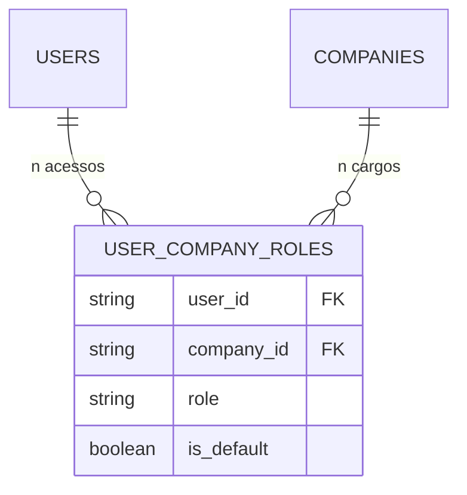

### Índice único composto

| Antes (v1) | Depois (v2.0) |
|---|---|
| Unique `{ user_id, company_id }` — um cargo por empresa | Unique `{ user_id, company_id, role }` — vários cargos por empresa |
| Select de "Novo acesso" excluía empresas já atribuídas | Select lista **todas** as empresas activas; só bloqueia a combinação exacta Empresa+Cargo (`isUcrComboTaken`) |

Modelo: `backend/models/user_company_role.py` (`CompanyRoleEnum`). Serviço: `services/user_company_roles_api_crud.py`. Helper de UI: `frontend/src/utils/organizationAdmin.js`.

### Cargos oficiais

`CompanyRoleEnum` / `UCR_ASSIGNABLE_ROLES` incluem os cargos oficiais de sistema:

| Cargo | Notas |
|-------|-------|
| `admin` | Administrador do sistema |
| `ceo` | CEO |
| `diretor` | Diretor(a) |
| `administrativo` | Apoio Administrativo |
| `consultor` | Consultor(a) |
| `intermediario` | Intermediário(a) de Crédito |
| **`indexacao`** | Indexação de Dados — cargo oficial (não é um "extra") |
| **`parceiro`** | Parceiro — utilizador fantasma (sem login operacional típico; visível na gestão de acessos) |

O perfil legado `mediador` continua mapeado para `intermediario` (`normalizeRole`).

### Proteção contra a eliminação do último acesso

Remover um UCR **não** pode deixar o utilizador sem nenhum acesso:

```python
# services/user_company_roles_api_crud.py — run_delete_user_company_role
LAST_UCR_DELETE_DETAIL = (
    "Não é possível remover o único acesso deste utilizador. "
    "Um utilizador tem de ter pelo menos um acesso UCR."
)
# HTTP 400 se count_documents({user_id}) <= 1
```

A UI (`UsersAccessAdminTab` / `LAST_UCR_DELETE_MESSAGE`) mostra a mesma mensagem. Para revogar o acesso total, desactivar a conta (`users.is_active = false`) em vez de apagar o último UCR.

### Empresa activa vs. inactiva

Novos acessos UCR só podem ser criados contra empresas com `is_active !== false`. Uma empresa inactivada deixa de ser oferecida no formulário de novo acesso, mas os UCRs já existentes **não** são apagados automaticamente (soft-delete da empresa, não cascade).

### Resolução de cargo e empresa activos (Pacote FN)

Alguns UCRs legados guardam o **nome** da empresa (`Precision Crédito`) em `company_id` / `company` em vez do id canónico. Um match estrito por id falhava: o backend fazia fallback silencioso para o cargo JWT e `GET /processes/me` devolvia lista vazia (o utilizador via o ContextSwitcher certo, mas a API filtrava outro contexto).

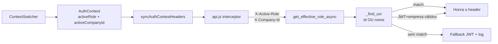

Regras:

1. **Frontend envia id canónico.** `resolveCompanyIdFromUser` aceita um hint que seja id **ou** nome e devolve o `company_id` do UCR. `AuthContext` persiste esse id em `sessionStorage.activeCompanyId` — **nunca** `user.company` (display name).
2. **Backend aceita id ou nome.** `_find_ucr` / `_company_match_or` comparam `company_id`, `company_name` e `company` (exacto + regex case-insensitive).
3. **Header honrado se o JWT já tem o cargo** e o utilizador pertence à empresa (por id ou nome), mesmo sem linha UCR `{user_id, role, company_id}` exacta. Evita esvaziar `/processes/me` após fallback.
4. **Sentinel `all`**: só o ContextSwitcher (vista multi-cargo) pode pôr `X-Active-Role: all` → `__all_roles__` para filtragem. `ProcessesPage` **não** escreve `"all"` no `sessionStorage` — esse valor não é um UCR e desincronizava todos os pedidos seguintes.
5. **Sentinel `default`**: aceite sem validação UCR quando o utilizador não tem empresas (gravação de assinatura, etc.).

Código: `services/auth.py` (`_find_ucr`, `get_effective_role_async`, `get_active_company_id_async`); `frontend/src/utils/userProfiles.js`; `AuthContext.js`; `services/api.js`.

---

## Segurança

- **CORS Fail-Secure**: A aplicação arranca apenas com origens explicitamente configuradas (sem wildcards)
- **JWT com Validação Robusta**: Secret validado para entropia mínima, tokens com 24h de validade
- **Refresh Tokens**: Tokens de refresh de 7 dias, revogáveis via MongoDB
- **Rate Limiting por Role**: Limites diferenciados (admin: 1000, consultor: 200, cliente: 100 req/min)
- **Security Headers**: HSTS, CSP, X-Frame-Options, X-Content-Type-Options, Referrer-Policy em todas as respostas
- **Encriptação de Campos**: Campos sensíveis (NIF, rendimentos) encriptados com Fernet (AES-128-CBC)
- **Blind Indexing**: Hashes HMAC-SHA256 para pesquisa em campos encriptados
- **Input Sanitization**: Todas as rotas da API sanitizam inputs (strings, emails, nomes)
- **MIME Validation**: Validação por magic bytes para uploads de documentos
- **DOMPurify**: Sanitização XSS no frontend para rich text
- **Password Strength**: Validação com passlib bcrypt
- **Impersonate Control**: Admin pode visualizar como outro utilizador, com restauro automático
- **OpenAI PII Opt-out**: Configuração de opt-out de treino de dados na conta OpenAI
- **Prompt Injection Protection**: Mitigação de prompt injection em análise de PDFs
- **SPA Rewrite Security**: Vercel rewrites excluem `/assets/` para evitar MIME type attacks

---

## Arquitetura de Webmail e Email

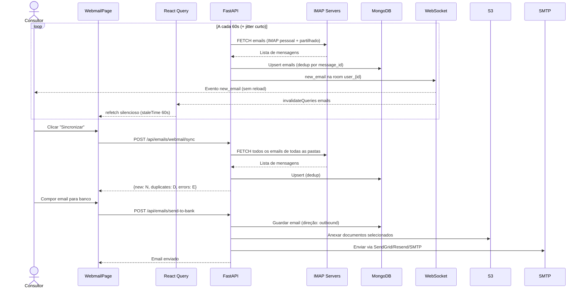

### Motor Real-Time do Webmail (v2.0 — Pacote EC)

O sync IMAP **já não corre no ARQ Worker a cada 15 minutos**. O `ConnectionManager` WebSocket vive **em memória no processo da API** (`uvicorn`); um worker separado não consegue emitir eventos para os clientes ligados. Por isso o loop de auto-sync passou a correr **no próprio processo da API**.

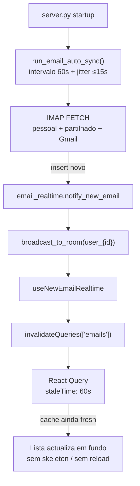

| Peça | Onde | Comportamento |
|------|------|----------------|
| Loop IMAP | `scheduled_tasks.run_email_auto_sync` no processo FastAPI | Default **60s** (`EMAIL_AUTO_SYNC_INTERVAL_SECONDS`, clamp 30–300). Sleep **depois** do sync + jitter curto |
| Evento | `services/email_realtime.py` | `new_email` (`WSEventType.NEW_EMAIL`) para a room `user_{id}` (e rooms de mailbox global / role partilhado) |
| Join da room | WebSocket connect | `join_user_email_room(user_id)` para o broadcast chegar ao cliente |
| Frontend | `useNewEmailRealtime` + `useWebmailEmails` | Listener WS → `invalidateQueries({ queryKey: queryKeys.emails.all })`. `staleTime: 60s` + `keepPreviousData` — a lista **não** mostra skeleton no refetch |
| Kill switch | `ENVIRONMENT=production` **ou** `EMAIL_SYNC_ENABLED=true` | Em DEV o loop não arranca (evita OOM no Render free) |
| Sync manual | Botão "Sincronizar" | Continua a existir (`POST /api/emails/webmail/sync`) para FETCH imediato de todas as pastas |

O resultado: a caixa de correio **sincroniza em tempo real** sem interrupções de UI — o utilizador continua a ler/compor enquanto a cache é invalidada em background.

**Contas de email suportadas:**

| Conta | Variáveis de Configuração | Servidor IMAP |
|-------|--------------------------|---------------|
| Precision Crédito | `PRECISION_EMAIL`, `PRECISION_PASSWORD`, `PRECISION_IMAP_SERVER/PORT` | `mail.precisioncredito.pt:993` |
| Power Real Estate | `POWER_EMAIL`, `POWER_PASSWORD`, `POWER_IMAP_SERVER/PORT` | `webmail2.hcpro.pt:993` |

**Email Transacional do Sistema (Bloco A):**

Quando `send_email(force_system=True)` é chamado (ex: alertas de sistema):

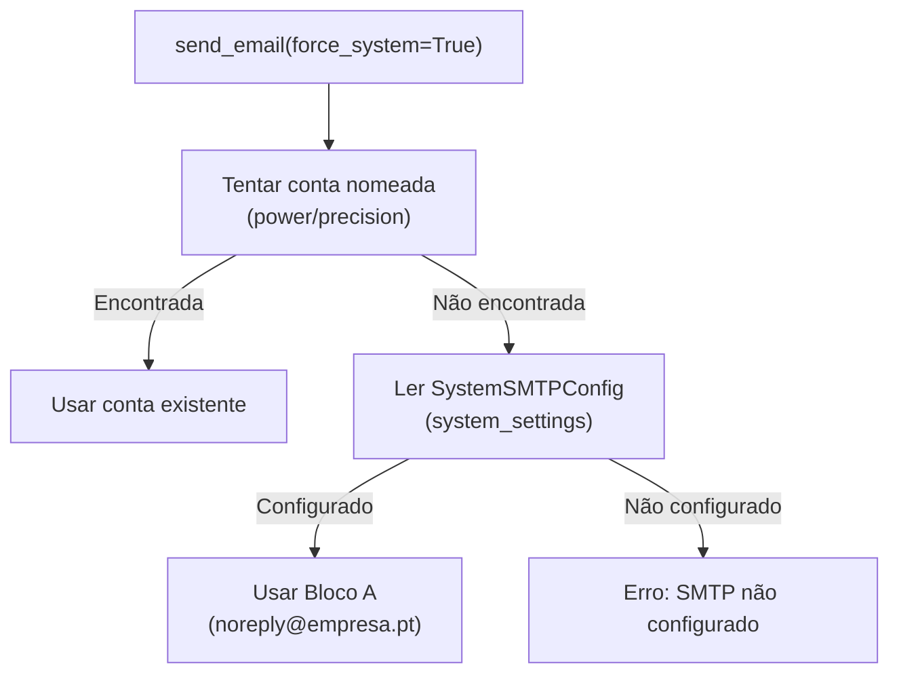

O envio de documentação para balcões **não** usa `force_system` + `DOCUMENTS`: resolve primeiro o SMTP do perfil UCR activo (password desencriptada) e cai na Caixa Geral.

**Webmail Partilhado por Role (Bloco C):**

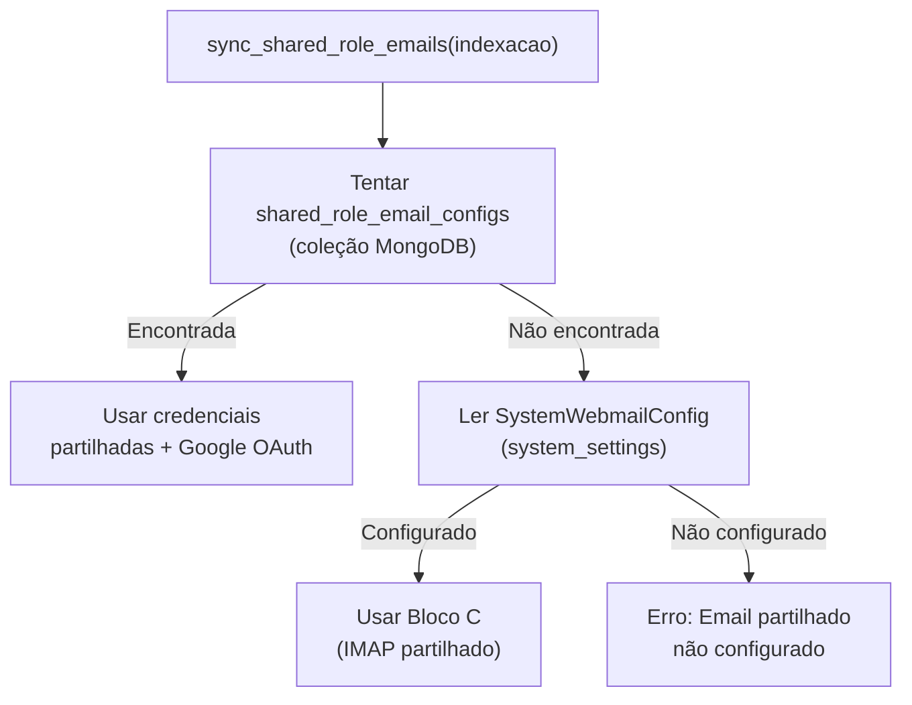

**Isolamento por perfil activo (Pacote DN.1+2):**

O Webmail respeita o UCR escolhido no Header (`ContextSwitcher`):

1. O frontend envia `X-Company-Id` e `X-Active-Role` em **todos** os `fetch` do Webmail (não só via interceptor Axios).
2. Listagem (`GET /api/emails/webmail`) e stats filtram pela mailbox da UCR activa: `company_id` **ou** `account` = endereço IMAP dessa config. Emails globais / de outros perfis do mesmo user **não** entram.
3. Sync pessoal (`POST /api/emails/webmail/sync-user`) resolve `user_email_configs` com a empresa activa (e `account_id` / `mailbox` se o utilizador escolheu uma conta) e grava `company_id` em cada email sincronizado.
4. Anexos: `GET /api/webmail/attachments/{id}` (auth JWT) devolve `StreamingResponse` com `Content-Disposition: attachment`. Fonte: S3 (`s3_key`) → conteúdo na BD → IMAP on-demand. 404 se o anexo não existir.
5. **Pacote DN.4:** um perfil pode ter várias contas (`user_email_configs` único em `{user_id, company_id, email_address}`). A Área Pessoal lista-as e o Webmail troca com um Select (`mailbox=`). `is_primary` é a conta por omissão (dual-write no `user.email_config` embebido).
6. **Pacote DO.3:** se o cargo activo do UCR for `diretor`, `GET /users/me/email-accounts` injeta a **Caixa Geral** da empresa (`system_config.email` / contas globais) na lista, com `is_caixa_geral=true`, sem exigir password pessoal. A conta virtual `id=caixa-geral` é só de leitura.

**Emails do processo (Pacote DN.3):** `GET /api/emails/process/{id}` devolve mensagens com `process_id` **ou** sem processo ligado cujo `from_email` / `to_emails` / `cc_emails` corresponde ao email do cliente (processo, 2º titular, emails monitorizados, `clients.contacto.email`). Clicar na linha abre o `EmailViewerModal`.

**Envio para balcões (Pacote DO.4):** `POST /api/emails/send-documentation/{id}` autentica SMTP com a password desencriptada do **perfil de email activo**; se não houver, usa a Caixa Geral. Já não usa o transporter `system_purpose=DOCUMENTS` por omissão. Falhas de autenticação são logadas (host/user, sem password) e o cliente recebe uma mensagem genérica — sem stack trace.

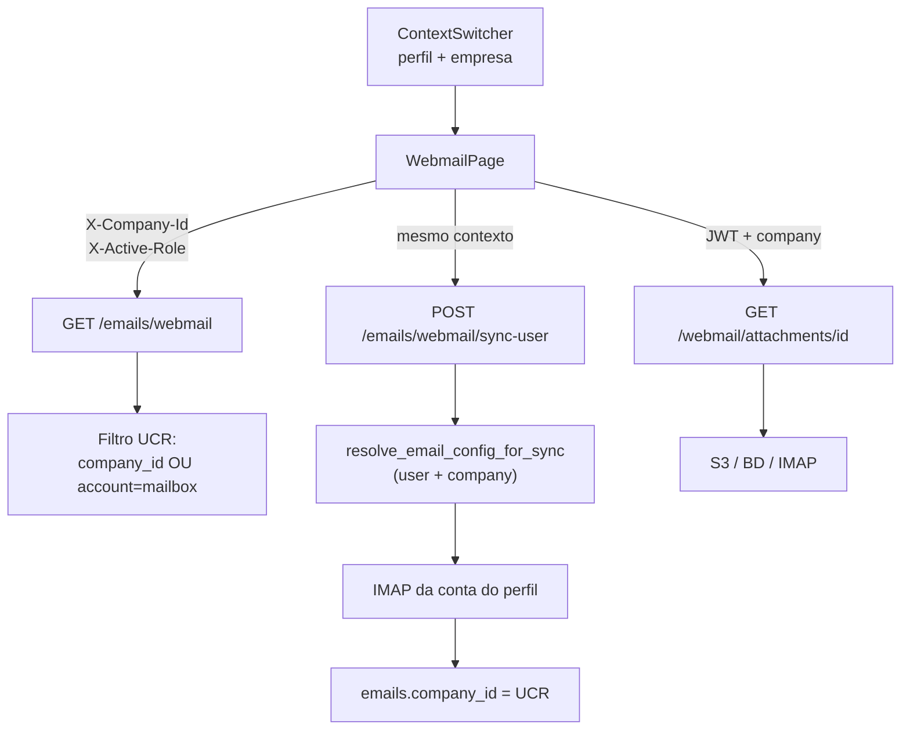

**Storage Factory Pattern:**

```mermaid
flowchart TD
    API["Rota API<br/>(upload/download)"] --> Factory["get_storage_adapter()"]
    Factory --> ReadConfig["Ler system_settings<br/>.storage.provider"]
    ReadConfig -->|aws_s3| S3["S3StorageAdapter"]
    ReadConfig -->|local| Local["LocalStorageAdapter"]
    ReadConfig -->|onedrive| OneDrive["OneDriveAdapter<br/>(placeholder)"]
    ReadConfig|unknown| LocalFallback["LocalAdapter<br/>(fallback)"]
    S3 --> S3Client["AWS S3 Client"]
    Local --> FileSystem["/tmp/powercell_uploads"]
```

---

## Arquitetura de Push Notifications

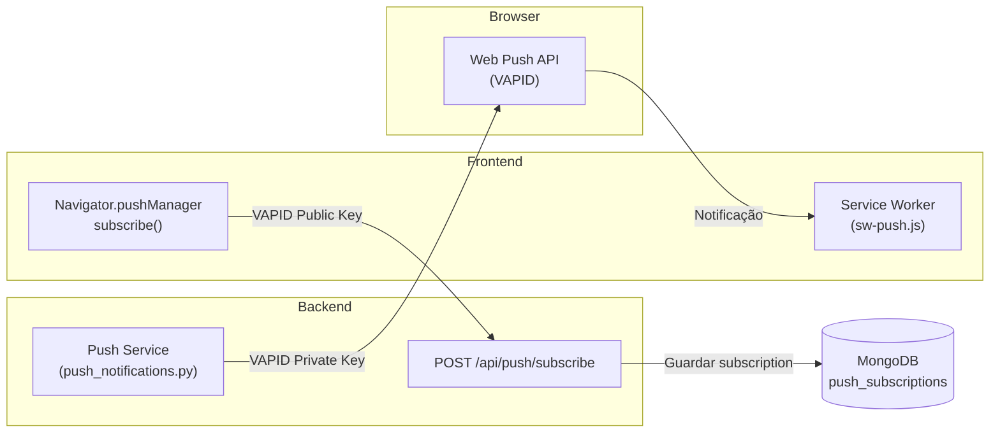

**Configuração VAPID:**
- `VAPID_PRIVATE_KEY` — Chave privada para assinar notificações (backend)
- `VAPID_PUBLIC_KEY` — Chave pública para subscrição (frontend via `REACT_APP_VAPID_PUBLIC_KEY`)
- `VAPID_MAILTO` — Contacto admin para VAPID (`mailto:admin@creditoimo.pt`)

---

## Arquitetura de Rate Limiting

O sistema utiliza rate limiting em duas camadas:

### Backend (slowapi)

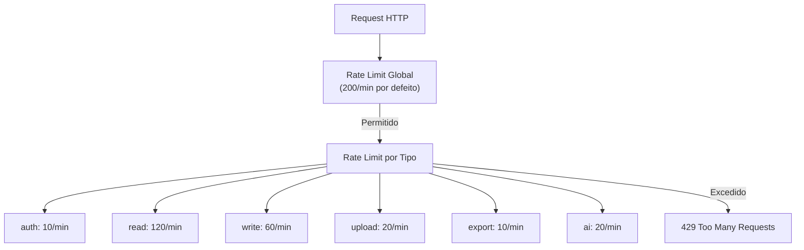

**Variáveis de ambiente:**

| Variável | Predefinição | Descrição |
|----------|-------------|-----------|
| `RATE_LIMIT_AUTH` | `10/minute` | Login e registo |
| `RATE_LIMIT_READ` | `120/minute` | GET requests |
| `RATE_LIMIT_WRITE` | `60/minute` | POST/PUT/PATCH |
| `RATE_LIMIT_UPLOAD` | `20/minute` | Uploads de ficheiros |
| `RATE_LIMIT_EXPORT` | `10/minute` | Exportações (CSV, ZIP) |
| `RATE_LIMIT_AI` | `20/minute` | Chamadas à API de IA |
| `RATE_LIMIT_DEFAULT` | `200/minute` | Qualquer outro endpoint |

### Frontend (429 Retry)

- **API Interceptor**: 3 retries com exponential backoff (2s → 4s → 8s + jitter ±500ms)
- Respeita header `Retry-After` quando presente
- Suprime toast de erro durante retries para evitar spam
- **Notifications Polling**: Backoff em 429 (30s → 60s → 120s → 5min), reset após 3 sucessos

---

## ProcessDetails + Documentos + Portal (estado actual)

```mermaid
flowchart LR
  subgraph FE["Frontend"]
    PD["ProcessDetails"]
    Q["useProcessFullData<br/>TanStack Query"]
    M["useProcessMutations"]
    Safe["sanitizeProcessUpdatePayload"]
    Toast["TasksContext<br/>sticky toasts"]
  end

  subgraph BE["Backend services"]
    PU["process_update"]
    DAI["document_ai_analyze<br/>+ titular_match"]
    DPF["document_portal_fulfill"]
    DU["document_upload / confirm"]
  end

  PD --> Q
  PD --> M
  M --> Safe --> PU
  PD -->|Analisar IA"| DAI
  DU -->|staff ou cliente| DPF
  Toast -->|GET /tasks/active| BE
```

| Fluxo | Comportamento |
|-------|----------------|
| Load ficha | Query → hydration (`processDetailsHydration.js`) → state local editável |
| Save ficha | Mutation + sanitize (sem `documents` / arrays vazios) → invalidação TanStack |
| IA ambígua | Dialog titular 1/2; apply com `target_titular` → `titular2_data` |
| Upload portal cliente | `confirm-upload` → REQUESTED→RECEIVED |
| Upload staff CRM | `document_portal_fulfill` após upload / auto-cat → mesmo efeito no portal |
| Onboarding | Registo = cliente + checklist SystemConfig; processo só após docs obrigatórios |

Detalhe operacional e mapa `document_*` / `process_*`: **`AGENTS.md`**.

---

## Arquitetura de Scraping (Idealista)

```mermaid
flowchart TD
    Admin["Admin Dashboard"] -->|"Importar Imóvel"| API["POST /api/scraper/scrape"]
    API --> ScraperSvc["PropertyScraper"]
    ScraperSvc -->|"Tentativa 1"| Direct["HTTP Request direta"]
    Direct -->|Bloqueado| ScraperAPI["ScraperAPI<br/>(premium+render)"]
    ScraperSvc -->|"Tentativa 2"| ScraperAPI
    ScraperAPI -->|Sucesso| Parse["Parse HTML"]
    Parse -->|"Extração"| Gemini["Gemini Flash<br/>(AI extraction)"]
    Gemini -->|"Dados estruturados"| DB[(MongoDB<br/>properties)]
```

**Configuração:**
- `SCRAPERAPI_API_KEY` — API key do ScraperAPI (para sites protegidos)
- `GEMINI_API_KEY` — Gemini Flash para extração de dados de páginas
- Fallback: HTTP direto → ScraperAPI basic → ScraperAPI premium → ScraperAPI premium+render

---

## Pipeline de IA — Extração de Dados e Validade de Documentos (Pacote DD)

A IA extrai dados estruturados de documentos PDF em dois passos complementares. Ambos persistem em `document_metadata`:

```mermaid
flowchart TD
    Upload["Upload de documento<br/>(staff ou portal)"] --> AutoCat["auto_categorize_document_background"]
    AutoCat -->|"1. Extrair texto PDF"| CatAI["categorize_document_with_ai<br/>(GPT-4o-mini)"]
    CatAI -->|"category, subcategory,<br/>tags, summary, expiry_date"| Meta1["document_metadata"]
    AutoCat -->|"2. Se categoria = Identificação"| OCR["analyze_document_from_base64<br/>(OCR GPT-4o vision)"]
    OCR -->|"validade → cc_validity<br/>nome, nif, morada, …"| Extracted["extracted_data"]
    Extracted --> Meta2["document_metadata.extracted_data"]
    Extracted -->|"se is_data_confirmed = false"| Conflict["data_conflict<br/>(sugestões de preenchimento)"]
    Meta1 --> Dashboard["Dashboard Documentos a Expirar<br/>(lê document_metadata.expiry_date)"]
    Meta2 -.->|"PACOTE DD — fallback"| Meta1
```

### Extração da data de validade (`expiry_date`)

O dashboard **"Documentos a Expirar (Próximos 60 dias)"** lê `document_metadata.expiry_date`. A data é preenchida por:

1. **Categorização IA** (`categorize_document_with_ai`): o prompt pede à IA para extrair `expiry_date` no formato `YYYY-MM-DD` do texto do PDF. Funciona para documentos com texto extraível (declarações IRS, extratos, certidões com texto).
2. **OCR de visão** (`analyze_document_from_base64`): para CC/Passaporte (PDFs de imagem sem texto extraível), o OCR extrai `validade` → mapeado para `cc_validity` no `extracted_data`.

**PACOTE DD — Fallback de validade**: `build_auto_cat_metadata` em `document_auto_categorize.py` agora usa fallback encadeado quando `categorize_document_with_ai` não devolve `expiry_date`:

```
expiry_date = result.expiry_date
           || _extract_validade_from_ocr(extracted_data)   # cc_validity / validade / data_validade / expiry_date / validity_date
```

O helper `_extract_validade_from_ocr()` valida o formato `YYYY-MM-DD` via `datetime.strptime` e devolve a primeira data válida encontrada. Isto garante que CCs analisados por OCR (sem texto extraível) também alimentam o dashboard de documentos a expirar.

### Persistência e encriptação de dados IA

Quando o utilizador aplica sugestões de IA (`run_apply_ai_suggestions` em `document_ai_analyze.py`), os campos sensíveis (`personal_data.nif`, `personal_data.documento_id`) são encriptados antes de `$set` no MongoDB via `_encrypt_mongo_update_paths()` (Pacote DD). Isto garante que dados PII extraídos pela IA ficam protegidos em repouso, consistentes com o resto da camada de encriptação (`encrypt_sensitive_data`).

### Campos encriptados (Pacote DD)

`financial_data.iban` e `financial_data.conta_bancaria` foram adicionados à lista de campos sensíveis em `encrypt_sensitive_data` / `decrypt_sensitive_data` (`process_service.py`) e em `SENSITIVE_FIELDS` (`encryption.py`). IBANs existentes em plain text passam through `decrypt_sensitive_data` sem alteração (não há migração); novos writes são encriptados.


---

## Portal do Cliente — Upload Múltiplo com Append (Pacote DE)

O Portal do Cliente permite uploads faseados por categoria. Cada categoria (Recibos de Vencimento, Extratos Bancários, IRS, Identificação, etc.) mantém um array `attached_files` que cresce com cada upload — **nunca** se substitui ficheiros anteriores.

```mermaid
flowchart TD
    Client["Cliente no Portal"] -->|"1. POST /portal/upload-url"| Backend1["run_generate_portal_upload_url<br/>(presigned S3 PUT URL)"]
    Backend1 -->|"upload_url + file_key"| Client
    Client -->|"2. PUT direto para S3"| S3["AWS S3<br/>(pasta Index)"]
    Client -->|"3. POST /portal/confirm-upload<br/>{file_key, category, document_id}"| Backend2["run_confirm_portal_upload"]
    Backend2 -->|"verifica S3 file_exists"| S3
    Backend2 -->|"$set: status=RECEIVED<br/>$push: attached_files[+file_entry]"| DB[(MongoDB<br/>documents)]
    DB -->|"attached_files[]"| PortalStatus["GET /portal/status<br/>→ frontend mostra lista"]
```

### Lógica de Append (`attached_files`)

Cada documento pedido (REQUESTED) tem um array `attached_files` que acumula todos os ficheiros carregados pelo cliente para essa categoria:

```python
# services/portal_upload_ops.py — run_confirm_portal_upload
file_entry = {
    "file_id": str(uuid.uuid4()),
    "filename": original_filename,
    "s3_path": file_key,
    "file_size": file_size,
    "content_type": content_type,
    "uploaded_at": now,
    "uploaded_by": "portal_client",
}
await db.documents.update_one(match_q, {
    "$set": {"status": "RECEIVED", ...},  # status + top-level fields (backward compat)
    "$push": {"attached_files": file_entry},  # APPEND — nunca replace
})
```

Os campos top-level (`filename`, `s3_path`, `file_size`) são atualizados para refletir o upload mais recente (backward compat com serializers que leem estes campos), mas o array `attached_files` preserva o histórico completo de todos os uploads. O mesmo padrão aplica-se a `fulfill_portal_requests_on_staff_upload` (`document_portal_fulfill.py`) para uploads do staff.

### Presigned URLs (não List[UploadFile])

O upload usa o padrão presigned S3: o backend gera uma URL de upload assinada (5 min de validade), o cliente faz PUT direto para S3, depois confirma com o backend. O backend **nunca** recebe bytes de ficheiros — isto evita gargalos de bandwidth e limites de body do FastAPI. **Não** usar `List[UploadFile]` (regressão arquitetural).

---

## Documentos Legais Gerados — RGPD PDF Pré-preenchido (Pacote DE)

Documentos legais gerados pelo sistema (RGPD, Minuta, CPCV) são sempre pré-preenchidos no backend com os dados reais do cliente/processo. O frontend não pré-preenche — apenas descarrega o PDF pronto.

### Endpoint `GET /api/rgpd/pdf/{process_id}`

Gera um PDF do RGPD com o template ativo, substituindo placeholders (`{{NOME}}`, `{{CONTRIBUINTE}}`, `{{MORADA}}`, etc.) pelos dados desencriptados do cliente:

```mermaid
flowchart LR
    Endpoint["GET /rgpd/pdf/{process_id}"] --> Service["services/rgpd_pdf.py<br/>run_generate_prefilled_rgpd_pdf"]
    Service -->|"fetch + decrypt_sensitive_data"| Process["process.personal_data<br/>{nif, morada_fiscal, documento_id}"]
    Service -->|"build consent_data"| Consent["{nome, contribuinte,<br/>morada, ...}"]
    Consent --> Render["_get_rendered_rgpd_text<br/>(template + placeholders)"]
    Render --> PDF["_generate_rgpd_pdf_bytes<br/>(reportlab Canvas A4)"]
    PDF --> Response["StreamingResponse<br/>application/pdf"]
    Service -.->|"audit"| Activity["activities<br/>'RGPD descarregado'"]
```

- **Reutilização**: usa `_get_rendered_rgpd_text` e `_generate_rgpd_pdf_bytes` de `services/rgpd_service.py` (mesma pipeline dos PDFs assinados digitalmente).
- **Dados**: `consent_data` é construído a partir de `process.personal_data` (desencriptado via `decrypt_sensitive_data`), com fallback para strings vazias quando campos não existem.
- **Auth**: `require_staff()` — o PDF expõe PII do cliente.
- **Filename**: `RGPD_{safe_client_name}.pdf` (normalizado, sem acentos/caracteres especiais).

---

## Separação Estrita: User (Global) vs Role/Perfil (Local) — Pacote DF

A Área Pessoal (`ProfilePage`) segue uma separação estrita entre o que pertence à **pessoa** (global) e o que pertence a cada **perfil/role** (local por `user_company_role`). Isto evita perfis fantasma, mistura de contextos e a falsa noção de "conta principal".

```mermaid
flowchart LR
    subgraph Global["User (Global — pessoa)"]
        Auth["Informação de Login<br/>(email, password)"]
        Sessions["Sessões Ativas<br/>(JWT tokens)"]
    end
    subgraph UCR1a["UCR: Diretor @ Power RE"]
        Sig1a["Assinatura / Telefone / Cargo"]
    end
    subgraph UCR1b["UCR: Consultor @ Power RE"]
        Sig1b["Assinatura / Telefone / Cargo"]
        Mail1["Config Webmail (IMAP/SMTP)"]
    end
    subgraph UCR2["UCR: Intermediário @ Precision"]
        Sig2["Assinatura de Email"]
        Phone2["Telefone Profissional"]
        Job2["Cargo"]
        Mail2["Config Webmail"]
        Google2["Google OAuth"]
        Notif2["Preferências de<br/>Notificação"]
    end
    User["Utilador"] --> Global
    User -->|"UCR Diretor + Consultor<br/>na mesma empresa"| UCR1a
    User --> UCR1b
    User -->|"user.companies[]"| UCR2
```

### User (Global) — pertence à pessoa

| Campo | Coleção | Notas |
|---|---|---|
| `email` | `users` | Identidade de login |
| `password_hash` | `users` | Autenticação |
| `role` | `users` | Role primária (JWT) — apenas para fallback |
| `created_at` | `users` | "Membro desde" |
| `additional_roles` | `users` | Array de roles (legacy) — não usado para renderizar perfis |
| Sessões | `refresh_tokens` | JWT refresh tokens ativos |

A aba "Conta Global" da Área Pessoal contém APENAS estes cartões: Informação de Login + Sessões Ativas.

### Role/Perfil (Local) — pertence ao `user_company_role`

Cada UCR (`user_company_roles` collection, chave única `{user_id, company_id, role}` — v2.0 permite **vários cargos na mesma empresa**) tem os seus próprios:

| Campo | Coleção | Scoping |
|---|---|---|
| `signature` | `user_company_roles` | Assinatura de email para esta empresa |
| `professional_phone` | `user_company_roles` | Telefone profissional para esta empresa |
| `job_title` | `user_company_roles` | Cargo para esta empresa |
| `display_name` | `user_company_roles` | Nome de exibição para esta empresa |
| `notification_preferences` | `user_company_roles` | Preferências de notificação (14 bools) — **PACOTE DF** |
| Webmail IMAP/SMTP | `user_email_configs` | Keyed by `{user_id, company_id, email_address}` — várias contas por perfil (`is_primary`) |
| Google OAuth tokens | `user_email_configs` + `users.email_config["company:<id>"]` | Dual-write per-UCR |

A Área Pessoal gera **uma aba dinâmica por UCR real** (iterando `user.companies` / `user_company_roles`), cada uma com os cartões: Dados Profissionais + Assinatura + Webmail. **Sem hardcode de roles** — só perfis que o utilizador realmente tem aparecem. Na v2.0, o mesmo utilizador pode ter **duas abas para a mesma empresa** (ex.: Diretor e Consultor).

### `X-Company-Id` header — o mecanismo de scoping

O backend recebe o contexto de UCR ativo via header `X-Company-Id` (e `X-Active-Role`), injetado automaticamente pelo interceptor do `api.js` no frontend.

**Pacote DM:** o interceptor **não sobrescreve** estes headers se o pedido já os definiu (tabs da Área Pessoal). `POST /users/me/email-config` resolve `company_id` por ordem: body → query → header.

**Pacote FN:** a fonte de verdade dos headers é o snapshot do AuthContext (`syncAuthContextHeaders`), não o `sessionStorage` (páginas já chegaram a escrever o sentinel `"all"` em `activeRole`). O valor de `X-Company-Id` é o **id canónico** do UCR; o backend ainda aceita um nome de exibição e devolve o `company_id` da associação encontrada.

```python
# services/auth.py
async def get_active_company_id_async(request, user):
    hint = request.headers.get("X-Company-Id")
    assoc = await _find_ucr(user["id"], company_hint=hint)  # id OU nome
    return (assoc.get("company_id") if assoc else None) or fallback
```

### Assinatura de email (Pacote DM)

A assinatura por UCR (`user_company_roles.signature`) é HTML. A Área Pessoal pré-visualiza com `RichTextViewer`; o compositor do Webmail usa `sanitizeEmailHtml` (DOMPurify, tags `<p>`, `<br>`, `` com `data:`/`https`/`cid`). HTML gravado como entidades é desescapado uma vez antes de sanitizar.

### Impersonate e navegação (Pacote DM)

Ao iniciar impersonate, `AuthContext.applyUserContext` redefine `activeRole` / `activeCompanyId` para o utilizador alvo. O `DashboardLayout` constrói o menu a partir de `user.role` (não do `effectiveRole` residual do admin). Menus de Administração só aparecem se o impersonado for `admin` ou `ceo`.

### Os Meus Processos — `GET /processes/me` (Pacote FN)

`/processos` (`ProcessesPage`) lista **só** os processos atribuídos ao utilizador autenticado. `/lista-processos` (visão global) usa `GET /processes?show_all=true`.

`GET /processes/me` (`mine_only`) em `services/process_list_filters.py`:

- Filtra **sempre** por atribuição (`consultant_id` / `manager_id` / utilizadores assigned), independentemente do cargo efectivo.
- Isola pela empresa activa: `build_company_scope_condition` casa `company_id`, `company` **ou** `company_name` com o hint do header (id ou nome). Processos sem empresa só entram no sentinel `default`.
- Não depende de `X-Active-Role: all`. A página **não** deve escrever `"all"` no `sessionStorage` — o AuthContext é dono do cargo activo.

O fetch da lista usa dependências estáveis (`useMemo` no filtro `assigned_user_ids`). Reconstruir o array em cada render relançava o `useCallback`/`useEffect` em loop, sobretudo quando a resposta vinha vazia (o sintoma de produção).

### Perfil Mediador removido

O role `mediador` não é um perfil de sistema. `normalizeRole` mapeia legado → `intermediario`. Campos de processo `assigned_mediador_id(s)` mantêm-se (atribuição de intermediários). A dropbox extra de empresa no Header para Diretor foi removida — a empresa está no selector de perfil.

### Preferências de Notificação — per-UCR com fallback (PACOTE DF)

As preferências de notificação (14 campos booleanos: `email_*`, `inapp_*`) são agora persistidas no UCR (`user_company_roles.notification_preferences`) com fallback gracioso ao store global (`db.notification_preferences`):

- **Write** (`PUT /auth/preferences`): escreve no UCR ativo (via `X-Company-Id`); dual-write no global para backward compat.
- **Read** (`GET /auth/preferences`): lê do UCR ativo primeiro; se vazio/None, fall back ao global.
- **Consumers** (`notification_service.py`, `email_v2.py`): aceitam `company_id=None` opcional; quando fornecido, procuram o UCR primeiro com fallback global.

Isto permite que um consultor tenha notificações de email ativas para a Power Real Estate mas desativadas para a Precision, por exemplo.

### O que NÃO é per-UCR (tech debt)

- **OneDrive**: system-level apenas (env var `ONEDRIVE_SHARED_LINK`), sem store per-user. Defer para futuro.

---

## PDFs Gerados para Assinatura Manual (Pacote DG)

Documentos legais gerados para assinatura manual (RGPD, Minuta, CPCV) seguem regras estritas para serem imprimíveis e preenchíveis à caneta:

### Template dinâmico + paginação automática

O template do RGPD é **dinâmico** (editado pelo admin via `SmartRichEditor` em `RGPDAdminPage`, armazenado em `rgpd_template_versions` ou cache em `system_config`). Pode ser plain text ou HTML/Rich Text. O gerador de PDF lê o template ativo via `_get_active_rgpd_template()` e substitui os placeholders (`{{NOME}}`, `{{CONTRIBUINTE}}`, `{{MORADA}}`, etc.) pelos dados do cliente.

O PDF é gerado com `reportlab.platypus` (`SimpleDocTemplate` + `Paragraph` + `Spacer` + `HRFlowable`), que suporta **quebras de página automáticas** — quando um Flowable não cabe na página atual, uma nova página é criada. Isto é essencial porque o RGPD tem 11 secções e pode ocupar várias páginas.

```python
# services/rgpd_pdf.py — _build_prefilled_rgpd_pdf
doc = SimpleDocTemplate(buffer, pagesize=A4, ...)
story = []
for line in rgpd_text.split("\n"):
    story.append(Paragraph(line, body_style))  # auto-paginates
doc.build(story)  # SimpleDocTemplate handles page breaks
```

A fonte **DejaVuSans** (TTF) é registada para suportar acentos portugueses (ã, ç, é) e o caractere Unicode `☐` (U+2610, checkbox vazia). Fallback para Helvetica se a fonte não estiver disponível.

### Fallbacks para campos nulos — linhas em branco

Quando um dado do cliente falta (ex: morada, NIF, código postal), o PDF **não** imprime "N/A". Em vez disso, imprime uma linha em branco contínua (`___________________`) para o cliente preencher à caneta:

```python
# services/rgpd_pdf.py
def _blank_line(width: int = 30) -> str:
    return "_" * width

consent_data = {
    "nome": process.get("client_name") or _blank_line(50),
    "contribuinte": personal.get("nif") or _blank_line(15),
    "morada": personal.get("morada_fiscal") or _blank_line(60),
    ...
}
```

### Data e Local em branco

A data e o local de assinatura **não** são pré-preenchidos. O placeholder `{{DATA_ASSINATURA}}` é substituído por `___/___/______` e o local por `___________________` — o cliente preenche à caneta no momento da assinatura.

### Checkboxes vazias

Os 4 pontos de consentimento (A/B/C/D) usam checkboxes **vazias** (`☐`) para o cliente picar fisicamente:

```
A) Autorizo o tratamento dos meus dados pessoais...
   ☐ Autorizo     ☐ Não Autorizo
```

O caractere `☐` (U+2610) é suportado pela fonte DejaVuSans. No fluxo de assinatura digital (`sign_rgpd`), a checkbox escolhida torna-se `☑` (U+2611) — mas no PDF pré-preenchido para assinatura manual, ambas ficam vazias.

---

## Entidade "Cliente" — sem lifecycle (Pacote DG)

A entidade **Cliente** **não possui estado de ciclo de vida** (Ativo/Concluído/Inativo). O conceito de fases/status pertence apenas aos **Processos**. Um cliente é sempre um "Cliente Registado" — o que muda é o número e estado dos seus processos.

| Entidade | Tem `status`? | Tem `fase`? | Lifecycle |
|---|---|---|---|
| **Cliente** | ❌ Não (a ficha tem `is_active` / `is_deleted`, não fase de workflow) | ❌ Não | Soft-delete + activo/inactivo da ficha |
| **Processo** | ✅ Sim (16 fases) | ✅ Sim (`workflow_statuses`) | `pre_registo` → `clientes_espera` → ... → `concluido` |

### Listagem de Clientes

O ecrã de Clientes (`ClientsPage.js`, rota `/clientes`) é uma **lista unificada de "Clientes Registados"** — sem tabs de Ativos/Concluídos no sentido de workflow. A métrica útil exibida por cliente é o **número de processos associados** (`client.process_ids.length`), não uma fase.

```jsx
// ClientsPage.js — coluna "Processos" (Pacote DG)
<Badge variant="secondary" className="gap-1">
  <FileText className="h-3 w-3" />
  {client.process_ids?.length || 0} Processos
</Badge>
```

**Pacote FK** — os filtros desta página são **exclusivos da entidade Cliente**. Não há dropdown de fase, atribuição ou indexação (isso vive em Processos). UI: `components/filters/ClientFilters.jsx`. Query string da página:

| Param URL | API `GET /clients` | Valores | Semântica |
|-----------|--------------------|---------|-----------|
| `search` | `search` | texto | Nome, email ou NIF (accent-insensitive) |
| `fonte` | `fonte` | `staff_created`, `Website`, `Manual`, `Indicação`, `Telefone`, `Email`, `Feira`, `trello`, `auto_created` | Origem comercial (`clients.fonte`, match exacto case-insensitive) |
| `tipo` | `tipo` | `particular`, `dois_titulares`, `empresa` | Tipo de ficha — **não** é `process_type`. Particular = sem 2.º titular; dois titulares = `titular2_data` / `titular2_name` preenchido; empresa = `tipo` / `tipo_cliente` |
| `status` | `status` | `active`, `inactive`, `deleted` | Estado da **ficha**: activo (`is_deleted ≠ true` e `is_active ≠ false`); inactivo (`is_active = false`); eliminado (`is_deleted = true`) |

Builders: `services/client_list_filters.py` (`build_client_entity_query`). A listagem (`client_list_search.run_list_clients`) aplica primeiro o filtro na colecção `clients`; se não houver IDs, devolve vazio. Clientes sem processo que casem o filtro são fundidos na resposta (`_merge_entity_client_docs`). Params legados (`status_filter`, `assignment_filter`, `indexacao_filter`) continuam no endpoint por compatibilidade mas **não** são expostos na UI de Clientes.

### Listagem de Processos (contexto separado)

`ProcessesPage.js` serve duas rotas com o **mesmo** componente e **filtros de processo**:

| Rota | Título | Endpoint | Âmbito |
|------|--------|----------|--------|
| `/processos` | Os Meus Processos | `GET /processes/me` | Sempre `mine_only`: atribuído ao utilizador actual **e** `company_id` da empresa activa (incl. director/admin/ceo). `show_all` não se aplica. |
| `/lista-processos` | Todos os Processos | `GET /processes?show_all=true` | Visão global (RBAC de role). |

UI: `components/filters/ProcessFilters.jsx`. Query string:

| Param URL | API | Valores | Semântica |
|-----------|-----|---------|-----------|
| `search` | `search` | texto | Nome / email / NIF / nº processo |
| `status` | `status` | slug do workflow | Fase do **processo** (não o estado da ficha de cliente) |
| `process_type` | `process_type` | chaves de `PROCESS_TYPE_LABELS` | Tipo de operação (`process_type` ou alias legado `type`) |
| `assigned_user_ids` | `assigned_user_ids` | CSV de user ids | Multi-select de staff atribuído |
| `assigned_logic` | `assigned_logic` | `OR` (default) / `AND` | OR = pelo menos um dos IDs; AND = todos os IDs têm de aparecer nos campos de atribuição |
| `assigned_user_id` | `assigned_user_id` | um id | Alias legado (Pacote FK); o frontend migra para `assigned_user_ids` |
| `view_mode` | `view_mode` | `active_only` / `all` / `historical` / `deleted` | Activos vs arquivo vs eliminados |
| `is_indexed` | `is_indexed` | `true` / `false` | Estado de indexação |

Builders: `services/process_list_filters.py`. O filtro de atribuição percorre um conjunto canónico **e** aliases legados (`assigned_to`, `assigned_consultor_id(s)`, `assigned_mediador_id(s)`, `assigned_indexacao_id`, `consultant_id`, `manager_id`, `assigned_users`, …) para dados antigos não desaparecerem da lista.

**AND com `GET /processes/me`:** `mine_only` **não** é substituído por `assigned_user_ids`. O resultado é sempre «processos meus nesta empresa» ∩ «atribuídos aos IDs escolhidos».

Staff do dropdown: `GET /users?for_assignment=true` (exclui `admin`; inclui indexação). Hook: `useAssignmentUsersQuery` com `queryKeys.users.forAssignment()`.

Os mesmos query params existem em `GET /processes/paginated` (cursor).

```mermaid
flowchart LR
    subgraph UI_C["/clientes"]
        CF["ClientFilters<br/>fonte / tipo / status ficha"]
    end
    subgraph UI_P["/processos e /lista-processos"]
        PF["ProcessFilters<br/>fase / tipo processo / atribuído a"]
    end
    CF --> API_C["GET /clients"]
    PF --> API_P["GET /processes ou /processes/me"]
    API_C --> SvcC["client_list_filters<br/>só colecção clients"]
    API_P --> SvcP["process_list_filters<br/>só colecção processes"]
```

### Soft-delete de Clientes

Todas as queries de listagem/pesquisa de clientes filtram ativamente `is_deleted: {"$ne": True}` (defense-in-depth com `status: {"$ne": "eliminado"}`), excepto quando o filtro de ficha é `status=deleted`. O soft-delete (`client_delete.py`) define `is_deleted: True`, `deleted_at: <timestamp>`, `is_active: False`, `status: "eliminado"` — todos os 4 campos para compatibilidade.

---

## TanStack Query — factory `queryKeys` (`queryClient.js`)

Fonte única: `frontend/src/lib/queryClient.js`. **Não** declarar arrays literais (`['org-admin-companies']`) nem constantes locais (`USERS_QUERY_KEY`) nos ecrãs admin — invalidações parciais partem-se.

Hierarquia relevante para listagens e org-admin:

```
queryKeys.processes.list(filters)     // GET /processes — filters inclui assigned_user_ids / assigned_logic
queryKeys.processes.kanban(filters)   // prefixo kanbanAll: invalidar só o board, nunca ['processes'] inteiro
queryKeys.clients.list(filters)       // GET /clients — filters de entidade (fonte/tipo/status)
queryKeys.users.forAssignment()       // ['users','list',{ for_assignment: true }]
queryKeys.orgAdmin.all                // ['org-admin']
queryKeys.orgAdmin.companies(search)
queryKeys.orgAdmin.users()
queryKeys.orgAdmin.ucrs()
queryKeys.orgAdmin.ucrByUser(userId)
```

`CompaniesAdminTab` e `UsersAccessAdminTab` usam `queryKeys.orgAdmin.*`. A página obsoleta `CompaniesManagementPage.jsx` foi removida (Pacote FJ); o painel `SystemAdminPanel` embute `CompaniesAdminTab`.

---

## Índices MongoDB e TTL nativo

Índices de query e de ciclo de vida vivem em `services/db_indexes.py`, criados no arranque (`create_indexes` → `cleanup_deprecated_indexes` + `create_ttl_indexes`). `get_index_stats` reporta nomes/contagens (incl. `emails`, `user_company_roles`).

**Query (amostra, colecção `processes` / `clients`):** `idx_status`, `idx_consultor` / `idx_mediador`, compostos `status+assigned_*`, `idx_process_type`, `idx_client_assigned_to`, blind indexes `*_hash` (nunca no NIF/email em claro).

**TTL nativo (`expireAfterSeconds`)** — o mongod apaga documentos automaticamente. O campo **tem** de ser BSON Date (`datetime` Python), não ISO string. Serviços que escrevem dados efémeros carimbam `*_dt` (ex.: `stamp_draft_ttl_fields` em `email_draft_service.py`).

| Colecção | Campo | TTL | Nome | Notas |
|----------|-------|-----|------|--------|
| `refresh_tokens` | `created_at_dt` | 24 h | `ttl_refresh_tokens` | Extra à expiração lógica `expires_at` |
| `system_error_logs` | `timestamp_dt` | 30 dias | `ttl_system_error_logs` | Substitui o `idx_ttl` antigo em ISO string |
| `emails` | `updated_at_dt` | 7 dias | `ttl_email_drafts` | Partial index `status: draft` |
| `oauth_states` | `created_at` | 10 min | `idx_oauth_state_ttl` | CSRF state OAuth |

Diagnóstico: `GET /diagnostics/ttl-status` e migração `POST /diagnostics/migrate-ttl-fields` (documentos antigos só com ISO string).

---

## Agenda — Dualidade Prazo/Evento (Pacote DH)

O modelo de **Agenda** (coleção `deadlines`) evoluiu para suportar dois tipos de entradas com comportamentos distintos: **prazos limite** (deadlines) e **marcações** (events). Esta dualidade reflete a realidade do negócio — nem tudo no calendário é um prazo; muitas vezes é uma marcação (ex: Escritura, reunião com banco).

### Modelo de dados

```python
# models/deadline.py
class DeadlineCreate(BaseModel):
    title: str
    description: Optional[str]
    due_date: str  # ISO "yyyy-MM-dd"
    priority: str = "medium"
    type: Literal["deadline", "event"] = "deadline"       # PACOTE DH
    visible_to_client: bool = False                        # PACOTE DH
    reminder_time: Optional[List[str]] = None              # PACOTE DH — ["1h","3h","1d","3d","7d"]
```

| Campo | Tipo | Descrição |
|---|---|---|
| `type` | `"deadline"` \| `"event"` | Distingue prazos limite de marcações |
| `visible_to_client` | `bool` | Se `True`, o evento aparece na agenda do Portal do Cliente |
| `reminder_time` | `List[str]` | Configurações de lembrete: `"1h"`, `"3h"`, `"1d"`, `"3d"`, `"7d"` (multi-select) |

### Lógica de alertas baseada no tipo

O cron `check_upcoming_deadlines` (`services/scheduled_tasks.py`, corre a cada 1h em PROD) comporta-se de forma diferente conforme o `type`:

| Type | Comportamento | Defaults `reminder_time` |
|---|---|---|
| **`deadline`** | Dispara `DEADLINE_APPROACHING` (urgência) nos dias configurados + `DEADLINE_MISSED` se atrasado | `["1d", "3d"]` |
| **`event`** | Dispara `EVENT_REMINDER` (lembrete) respeitando `reminder_time` | `["1h", "1d"]` |

Ambos usam `notification_service.send_notification_with_preference_check` para email + `realtime_notifications.notify_deadline_reminder` para in-app/WebSocket. A idempotência é garantida por um array `sent_reminders` no documento da deadline — cada lembrete só é enviado uma vez por janela.

### Portal do Cliente — eventos visíveis

O endpoint `GET /api/portal/events` retorna apenas eventos onde `visible_to_client == True`, `completed != True`, e `due_date >= today`. O frontend (`ClientPortal.jsx`) mostra uma secção "Próximos Eventos" na TOP SECTION — oculta quando vazia, com `EmptyState` quando não há eventos.

```mermaid
flowchart LR
    Staff["Staff cria entrada na Agenda"] -->|"type: deadline/event"| DB[(deadlines)]
    DB -->|"cron 1h"| Cron["check_upcoming_deadlines"]
    Cron -->|"type=deadline"| Alert["DEADLINE_APPROACHING/MISS<br/>(urgência)"]
    Cron -->|"type=event"| Reminder["EVENT_REMINDER<br/>(lembrete)"]
    Alert --> Notif["notification_service"]
    Reminder --> Notif
    Notif --> Consultor["Consultor (email + in-app)"]
    DB -->|"visible_to_client=true"| Portal["GET /portal/events"]
    Portal --> ClientUI["ClientPortal — Próximos Eventos + Calendário (DO.2)"]
```

---

## Resumo do Processo e Calendário Visual (Pacote DO.1 + DO.2)

### DO.1 — Observações + Timeline no Resumo

O modelo de Processo tem o campo `observations` (string). Na persistência (`apply_cpcv_and_metadata_fields`) o valor sincroniza com `notes` quando só um dos dois é enviado — `notes` continua a alimentar o Kanban / "Notas do Consultor".

O histórico de estados **já existia** (`GET /api/history`, coleção `history` via `log_history`). O Pacote DO.1 acrescenta um endpoint compacto para o Resumo:

- `GET /api/processes/{id}/timeline` → `{ events, total }` com criação, mudanças de fase e restantes eventos, ordenados do mais recente para o mais antigo.
- UI: `ProcessObservationsCard` (Textarea Shadcn, guardar no botão e no `onBlur`) + `ProcessSummaryTimeline` (linha vertical + nós) no separador Resumo. O histórico completo permanece no tab Histórico.

### DO.2 — Calendário visual (Dashboard + Portal)

`AgendaCalendar` (Shadcn `Calendar` + vista semanal) consome os prazos/eventos da Agenda (Pacote DH, `GET /deadlines/calendar`).

| Superfície | Fonte | Filtro |
|---|---|---|
| Dashboard do Consultor | `getCalendarDeadlines()` | Processos/prazos do utilizador (já scoped no backend) |
| Portal do Cliente | `GET /portal/events?include_past=true` | Apenas `visible_to_client=true` e não concluídos |

Dias com agendamentos mostram um ponto; o dia seleccionado lista os títulos. O calendário vive numa tab (Progressive Disclosure), não no fluxo principal.

### Calendário de precisão (v2.0 — Pacote FA)

A página `/calendario` (`CalendarPage.jsx`) passou a ser um calendário de **hora exacta**, não só de dia civil:

| Capacidade | Implementação |
|------------|----------------|
| **Hora de início/fim** | Inputs `type="time"` em `CreateEventDialog` (`start_time` / `end_time`). Persistidos em `due_date` / `end_date` como ISO local `YYYY-MM-DDTHH:mm:00` via `combineDateAndTime` (`utils/agendaCalendar.js`). Default 09:00–10:00 |
| **Dia inteiro** | Switch `all_day` — omite a hora (ausências/férias forçam dia inteiro) |
| **Edição** | Clique no evento abre o mesmo dialog em modo edição (`editingEvent`); `PUT /deadlines/{id}` |
| **Eliminação** | Botão eliminar no dialog de edição (`Trash2`) → `DELETE /deadlines/{id}` |
| **Vista** | Chip no calendário mostra o intervalo (`formatEventClockRange`, ex.: `09:00–10:30`) |

`due_date` continua a aceitar `YYYY-MM-DD` (legado, dia inteiro). Eventos novos com hora usam datetime ISO sem `Z` (hora local, evita o salto UTC).

```mermaid
flowchart LR
    DH["Agenda DH<br/>deadlines"] --> CalAPI["GET /deadlines/calendar"]
    DH -->|"visible_to_client"| PortalAPI["GET /portal/events"]
    CalAPI --> Dash["ConsultorDashboard<br/>tab Calendário"]
    PortalAPI --> PortalCal["ClientPortal<br/>tab Agenda"]
```

---

## IA Híbrida — Sistema de Confiança para Documentos (Pacote DJ)

A IA analisa documentos e aplica um **Sistema Híbrido baseado em Confiança**: confiança alta (≥85%) resulta em auto-aprovação (Zero-Touch); confiança baixa (<85%) entra em Human-in-the-Loop (revisão manual).

```mermaid
flowchart TD
    Trigger["Consultor clica BrainCircuit<br/>num documento"] -->|"POST /documents/{doc_id}/ai-analyze-review"| Backend["document_review.py<br/>run_analyze_document_for_review"]
    Backend -->|"categorize_document_with_ai<br/>+ OCR"| LLM["GPT-4o-mini"]
    LLM -->|"JSON: categoria, validade,<br/>nome, confidence"| Backend
    Backend -->|"confidence_score = int(confidence * 100)"| Check{"confidence_score >= 85?"}
    Check -->|"Sim — Alta confiança"| Auto["AUTO_APPROVED (Zero-Touch)<br/>escreve em suggested_* E ai_*<br/>ai_review_status=auto_approved"]
    Check -->|"Não — Baixa confiança"| Pending["PENDING_REVIEW (HITL)<br/>escreve apenas em suggested_*<br/>ai_review_status=pending_review"]
    Auto --> DB[(document_metadata)]
    Pending --> DB
    DB -->|"GET /client/{id}/files"| Frontend["S3FileManager badges"]
    Frontend -->|"auto_approved: ✨ Auto-Aprovado (verde)"| AutoBadge["Badge verde informativo"]
    Frontend -->|"pending_review: ⚠️ Revisão Necessária (âmbar)"| ReviewBadge["Badge âmbar clickable"]
    ReviewBadge -->|"click"| Modal["DocumentReviewModal<br/>Atual vs Sugerido<br/>+ Aprovar/Rejeitar"]
    Modal -->|"POST /apply-ai-review"| Apply["copia suggested_* → ai_*<br/>status=approved/edited"]
    Modal -->|"POST /reject-ai-review"| Reject["status=rejected"]
```

### Lógica de Threshold (Limiar de Confiança)

```python
# services/document_review.py
AI_CONFIDENCE_THRESHOLD = 85

# Na análise:
confidence_score = int(round(raw_confidence * 100))  # 0.0-1.0 → 0-100

if confidence_score >= AI_CONFIDENCE_THRESHOLD:
    # AUTO_APPROVED: IA aplica directamente em ai_* (Zero-Touch)
    ai_review_status = "auto_approved"
else:
    # PENDING_REVIEW: IA sugere em suggested_* (HITL)
    ai_review_status = "pending_review"
```

### Modelo de dados — `suggested_*` vs `ai_*`

A coleção `document_metadata` tem dois conjuntos de campos:

| Campo `suggested_*` (IA sugere) | Campo `ai_*` (aplicado) | Quando é escrito |
|---|---|---|
| `suggested_category` | `ai_category` | `suggested_*` sempre; `ai_*` se auto_approved ou consultor aprova |
| `suggested_subcategory` | `ai_subcategory` | mesmo padrão |
| `suggested_confidence` | `ai_confidence` | mesmo padrão |
| `suggested_expiry_date` | `expiry_date` | mesmo padrão |
| `suggested_filename` | `filename` | mesmo padrão |
| `suggested_nome` | `extracted_data.nome` | mesmo padrão |

O campo `ai_review_status` controla o estado: `auto_approved` | `pending_review` → `approved` | `rejected` | `edited`.

### Endpoints do fluxo HITL

| Endpoint | Método | Descrição |
|---|---|---|
| `/documents/{doc_id}/ai-analyze-review` | POST | Triggera IA, aplica threshold (auto_approved ou pending_review) |
| `/documents/{doc_id}/apply-ai-review` | POST | Aplica sugestões selecionadas (`suggested_*` → `ai_*`) |
| `/documents/{doc_id}/reject-ai-review` | POST | Rejeita sugestões |
| `/documents/process/{process_id}/pending-review` | GET | Lista documentos pendentes de revisão (`pending_review`) |

### Estados visuais no frontend (S3FileManager)

| `ai_review_status` | Badge | Cor | Clickable? |
|---|---|---|---|
| `auto_approved` | ✨ Auto-Aprovado | verde (`bg-primary/10`) | Não (informativo) |
| `pending_review` | ⚠️ Revisão Necessária | âmbar (`bg-accent/15`) | Sim (abre modal) |
| `approved` | Aprovado | verde (`variant=secondary`) | Não |
| `rejected` | Rejeitado | muted (`variant=outline`) | Não |
| `edited` | Editado | azul | Não |
| (analisando) | A analisar... | roxo com spinner | Não |

### Fluxo paralelo — auto-categorização em background

A auto-categorização em background (`document_auto_categorize.py`) continua a escrever **diretamente** em `ai_*` (sem HITL) para uploads novos. O fluxo HITL é **paralelo** — accionado on-demand pelo consultor quando quer rever/refinar os metadados de um documento específico.


## Fluxo de Onboarding: Registo → Pré-Registo → Índice → Atribuição (Auditoria 2026-08-31)

> **Nota**: Esta secção documenta o resultado de uma auditoria ao fluxo real de
> negócio (registo do cliente até atribuição a consultor/intermediário),
> comparando o **código existente** com o **fluxo desejado** validado com o
> Product Owner. As correções descritas em "Decisões Confirmadas" foram
> **implementadas em 2026-09-01** (commit `245cc4a5`, ver detalhe no fim da
> secção "Próximos passos").

### Fluxo desejado (confirmado com o Product Owner)

1. Cliente registado (formulário público OU criado por um user).
2. Cliente recebe email com acessos ao Portal.
3. Cliente fica em **pré-registo**: sem fase, não conta para quadros/gráficos/contas. Aparece em "Registos de Clientes".
4. Cliente carrega documentos e preenche "Meu Perfil":
   - **Obrigatórios**: Cartão de Cidadão, Extratos (3 últimos), Mapa de Responsabilidades.
   - **Opcionais**: Recibos (3 últimos), IRS, Declaração Patronal.
5. Ao completar os obrigatórios → processo é criado e atribuído automaticamente ao **Índice** (regras de carga/fila).
6. Documentação do cliente cai sempre na pasta/categoria **Índice** do CRM — só acessível a Índice e perfis de alto nível.
7. Índice trata a documentação, categoriza-a (deixa de estar em "Índice", fica acessível a todos). **As ações do Índice não devem ficar no histórico do processo.**
8. Após indexado → atribuição automática a consultor **e** intermediário (least-busy); campos de "Meu Perfil" no Portal ficam bloqueados à edição.
9. Notificação (email + in-app) ao intermediário a avisar que o cliente está pronto para avançar.
10. Tarefas automáticas para consultor/intermediário (**ainda por definir** quais — backlog futuro, fora desta auditoria).
11. Processo segue o pipeline normal.

### Estado actual do código — mapeamento ficheiro a ficheiro

| Passo | Implementação actual | Ficheiro/função |
|---|---|---|
| Registo público | Cria `client` + pedidos `REQUESTED` (source=`mandatory_checklist`) | `services/public_registration.py` |
| Pré-registo (sem fase) | Processo só é criado quando checklist completa (não existe "processo pré-registo" antes disso — o cliente fica em `lead_status=new` sem processo) | `services/onboarding_mandatory_config.py` |
| Exclusão de quadros/contas | `apply_pre_registo_exclusion`, `INDEXER_INACTIVE_STATUSES` inclui `pre_registo` | `services/my_clients_api_helpers.py`, `services/process_assignment.py` |
| Menu "Registos de Clientes" / Sala de Triagem | Lista leads + processos em `pre_registo`/sem indexador | `services/client_registered.py::run_list_registered_clients` |
| Checklist de documentos obrigatórios | **Lista única, hardcoded como default, editável em SystemConfig, mas SEM conceito de "opcional"** | `models/system_config.py::MandatoryDocumentsConfig` (default: CC, IRS, Recibos, Comprovativo Morada, Extratos) |
| Criação automática do processo | Quando `is_mandatory_checklist_complete()` → `create_process_from_client_onboarding()` | `services/onboarding_mandatory_config.py` |
| Auto-avanço pré-registo → 1ª fase Kanban (silencioso) | `_auto_advance_from_pre_registo` usa `stealth_system_user` (track_history=False) — **já está silencioso**, serve de referência para o Índice (ver gap #3) | `services/portal_onboarding_advance.py` |
| Atribuição automática ao Índice | `assign_to_indexer()` — menor carga, limite `MAX_ACTIVE_PROCESSES_PER_INDEXER=15`, fila de espera | `services/process_assignment.py` |
| Pasta/categoria Índice (acesso restrito) | Categoria `Index` nos documentos; ver regras de acesso em ProcessDetails/S3FileManager | `routes/documents.py`, ACLs de categoria |
| Índice marca como concluído | `run_mark_process_indexed` → grava `is_indexed`, `is_data_confirmed`, salto de estado | `services/process_indexing.py::run_mark_process_indexed` |
| Histórico das ações do Índice | **Regista no histórico** (`INDEXACAO_CONCLUIDA`, `DADOS_CONFIRMADOS_INDEXACAO`, salto de estado, limpeza do indexador) — ver gap #3 | `services/process_indexing.py::log_mark_indexed_history` |
| Atribuição automática a consultor + intermediário | `dual_auto_assign_on_pre_registo_transition()` — least-busy para ambos, só se campo vazio | `services/process_assignment.py` |
| Bloqueio de "Meu Perfil" após indexado | `is_data_confirmed=True` lido pelo Portal | `services/portal_profile.py`, `frontend/src/pages/ClientPortal.jsx` |
| Notificação ao intermediário recém-atribuído | **Não existe** — ver gap #4 | — |
| Tarefas automáticas | **Não existe** (backlog, ainda por definir pelo PO) | — |

### Gaps identificados vs. fluxo desejado

1. **Checklist obrigatória não corresponde à lista confirmada e não distingue obrigatório/opcional.**
   `MandatoryDocumentsConfig` tem apenas uma lista (`documents`), toda ela bloqueante, com o default `[CC, IRS, Recibos, Comprovativo_Morada, Extratos]`. Falta "Mapa de Responsabilidades" e o sistema não tem forma de marcar Recibos/IRS/Declaração Patronal como **opcionais** (visíveis no Portal mas não bloqueantes para a criação do processo).
   **Decisão confirmada**: Obrigatórios = CC + Extratos + Mapa de Responsabilidades. Opcionais = Recibos + IRS + Declaração Patronal.
   **Requisito explícito do PO**: nada hardcoded — o admin deve poder configurar livremente quais documentos são obrigatórios vs. opcionais (extensão a `MandatoryDocumentsConfig`, não uma lista fixa no código).

2. **Motor de onboarding legado morto.** `services/onboarding_service.py::check_onboarding_completion` (com `REQUIREMENTS_BY_CONTRACT_TYPE` hardcoded por tipo de contrato) não é chamado por nenhuma rota — foi substituído por `onboarding_mandatory_config.py`. Candidato a remoção segura (a confirmar antes de apagar, por precaução).

3. **Ações do Índice ficam no histórico do processo** (contradiz o requisito "as ações do Índice não ficam guardadas no histórico"). O padrão correto já existe no próprio código — `_auto_advance_from_pre_registo` usa um `stealth_system_user` com `track_history=False` para o avanço pré-registo → 1ª fase. O mesmo padrão deve ser aplicado a `log_mark_indexed_history` (INDEXACAO_CONCLUIDA, DADOS_CONFIRMADOS_INDEXACAO, salto de estado, limpeza do indexador).
   **Decisão confirmada**: silenciar completamente (mesmo padrão stealth).

4. **Sem notificação ao intermediário recém-atribuído.** `notify_assigned_users_indexing_complete` notifica os utilizadores já atribuídos ao processo **antes** da dupla auto-atribuição correr — o intermediário/consultor recém-atribuídos não recebem aviso.
   **Decisão confirmada**: notificar via email **e** in-app (infra já existe: `notification_service.send_notification_with_preference_check` + `realtime_notifications.send_realtime_notification`), disparado a partir de `dual_auto_assign_on_pre_registo_transition` para os IDs recém-atribuídos.

5. **Tarefas automáticas para consultor/intermediário**: não implementado. Backlog — regras ainda por definir pelo PO (fora do âmbito desta auditoria).

### Próximos passos (backlog, aguarda ordem de implementação)

- Estender `MandatoryDocumentsConfig` com dois campos configuráveis (`mandatory_documents` / `optional_documents`) em vez de uma lista única — gerido no `SystemConfigPage`, sem defaults hardcoded no motor de decisão.
- Ajustar `onboarding_mandatory_config.py` para só bloquear criação do processo pelos documentos marcados como obrigatórios na config activa.
- Aplicar `stealth_system_user` (track_history=False) em `log_mark_indexed_history`.
- Adicionar notificação (email + in-app) ao consultor/intermediário recém-atribuído dentro de `dual_auto_assign_on_pre_registo_transition`.
- Confirmar e remover `services/onboarding_service.py` (motor morto) se não houver dependências ocultas.

### Implementação (2026-09-01, commit `245cc4a5`) — Fase 1 + Fase 2 (backend)

Todos os 5 gaps foram corrigidos nesta ronda (sem construir UI de administração, conforme âmbito acordado):

1. **Checklist obrigatório/opcional**: `MandatoryDocumentsConfig` ganhou o campo `optional_documents` (além de `documents`). Novo default: Obrigatórios = `identificacao` (CC), `extrato_bancario`, `mapa_responsabilidades`. Opcionais = `recibo_vencimento`, `irs`, `declaracao_patronal`. `generate_mandatory_document_requests` (em `services/portal_documents_notify.py`) gera as duas listas com `source` distinto (`mandatory_checklist` vs `mandatory_checklist_optional`) e `is_optional` explícito na API — os opcionais nunca bloqueiam `is_mandatory_checklist_complete` nem `check_and_notify_documents_complete`. Continua **totalmente configurável** via `SystemConfig` (sem hardcode no motor de decisão), apenas sem UI dedicada ainda.
2. **Motor morto removido**: `services/onboarding_service.py` apagado (confirmado sem imports).
3. **Auditoria Stealth**: `log_mark_indexed_history` e `dual_auto_assign_on_pre_registo_transition` propagam agora `track_history=False` para os registos sintéticos de "Sistema" quando o actor real tem role `indexacao` — nenhuma acção do Índice (incl. salto de estado, limpeza do indexador, dupla auto-atribuição) fica no histórico. Actores admin/ceo continuam a gerar histórico normal (sem regressão).
4. **Notificação de atribuição**: `dual_auto_assign_on_pre_registo_transition` chama `_notify_newly_assigned_users` (novo, em `process_assignment.py`) — email via `send_notification_with_preference_check` + in-app via `send_realtime_notification`, disparado só para quem foi atribuído NAQUELA chamada (não repete para quem já estava atribuído).
5. **Bug bónus corrigido (reportado pelo utilizador)**: `GET /api/processes/{id}` devolvia 500 (`ResponseValidationError`) quando `updated_at`/`created_at` estava gravado como BSON Date nativo (raiz: `soft_delete_process` grava `datetime.now(timezone.utc)` sem `.isoformat()`). Fix: `ProcessResponse` agora usa `Optional[datetime]` + `@field_serializer` (aceita datetime OU string, serializa sempre ISO). Também corrigido `GET /portal-messages/unread` 404 — causa raiz era `CORS_ORIGINS` desatualizado em `backend/.env` (preview URL antigo) enquanto `frontend/.env` já usava o domínio estável `powercell-crm.preview.emergentagent.com`.

Testado via `testing_agent_v3_fork` (iteration_2.json): 1176 passed, 0 falhas. Ficheiros novos: `tests/unit/test_process_response_datetime_fix.py`, `tests/integration/test_onboarding_checklist_split.py`, `tests/integration/test_index_stealth_and_notification.py`.

**Ainda por fazer** (fora do âmbito desta ronda, backlog): UI de administração da checklist obrigatória/opcional no SystemConfigPage; tarefas automáticas para consultor/intermediário (regras ainda por definir pelo PO).

## Refactor UX — EmailAccountsPage split + Testar Ligação (Fev 2026)

1. **`EmailAccountsPage.js` dividida em componentes**: os 3 cartões ativos (`SystemSmtpCard`, `IndexationImapCard`, `SharedEmailCard`) foram extraídos para `frontend/src/components/emailAccounts/` (um ficheiro `.jsx` por cartão + `emailAccountsApi.js` com o helper `fetchSystemConfig` partilhado). A página passou a ser um wrapper de ~75 linhas (guarda de role + grid), sem qualquer alteração de lógica, hooks ou comportamento (ver `FRONTEND_GUIDELINES.md §12`).
2. **Badges de prioridade de tarefas**: `TasksPanel.js::getPriorityBadge` passou a ler primeiro o campo explícito `task.priority` (Alta/High→vermelho `destructive`, Média/Medium→amarelo, Baixa/Low→cinzento), caindo de volta para a heurística de prazo anterior quando o campo não existe (ver `FRONTEND_GUIDELINES.md §13`). `TasksDropdown.js` já tinha um badge de prioridade equivalente (sistema de background jobs, independente) e não foi alterado.
3. **Botão "Testar Ligação" (SMTP/IMAP) em Empresas/Admin**: `CompaniesAdminTab.jsx` ganhou um botão `type="button"` no `DialogFooter` (entre Cancelar e Guardar/Criar Empresa) que chama `POST /admin/companies/test-email-connection` com os valores atuais do formulário (sem gravar). Backend novo: `models.company.CompanyEmailConnectionTest` + `services/companies_crud_api_test_connection.py::run_test_email_connection` — testa SMTP e IMAP de forma **independente** (a Empresa pode ter contas diferentes para cada), usando `smtplib`/`imaplib` reais com timeout de 15s por protocolo, e traduz erros comuns (auth, DNS, timeout, TLS, ligação recusada) para mensagens em português. Devolve 200 com o resultado por protocolo em sucesso, ou 400 com a razão concatenada em falha. Se nenhum bloco (SMTP nem IMAP) estiver preenchido, devolve 400 pedindo para preencher os campos, sem tentar ligação.

Validação: 11 novos testes unitários (`tests/unit/test_companies_crud_api_test_connection.py`, mocking das funções síncronas de rede + testes reais de DNS/erro amigável) + regressão completa (1194 passed, 6 skipped; 1 falha pré-existente e não relacionada em `test_admin.py::test_get_workflow_statuses`, dependente de seed de dados). `testing_agent_v3_fork` confirmou os 3 pontos end-to-end sem regressão (iteration_6.json).


