# Arquitetura do Sistema — PowerCell CRM

## Visão Geral

O PowerCell é um sistema de gestão de processos de crédito habitacional, concebido para a intermediação imobiliária e financeira em Portugal. A arquitetura segue o padrão **monolito modular** com separação clara entre frontend, backend API e serviços de infraestrutura.

---

## Diagrama de Arquitetura

```mermaid
graph TB
    subgraph Clientes["🖥️ Clientes (Browser)"]
        User["Utilizador"]
        Portal["Portal do Cliente<br/>(Magic Link)"]
        PublicForm["Formulário Público<br/>/registo"]
        RGPDForm["Página RGPD<br/>/rgpd/:token"]
    end

    subgraph Frontend["⚛️ Frontend — React 19 + Vite"]
        Router["React Router<br/>(Rotas protegidas por role)"]
        AuthCtx["AuthContext<br/>(JWT + Impersonate)"]
        TasksCtx["TasksContext<br/>(Polling + Circuit Breaker)"]
        UploadCtx["UploadProgressContext"]
        ThemeCtx["ThemeContext<br/>(Light/Dark)"]
        API_SVC["api.js<br/>(Axios + 429 Retry)"]
        WSClient["useWebSocket<br/>(Singleton + Backoff)"]
        TanStack["TanStack Query<br/>(Cache + Mutations)"]
        LazyChunk["LazyChunkErrorBoundary<br/>(Stale Deploy Recovery)"]
        Pages["Páginas<br/>(~50, Lazy Loaded)"]
    end

    subgraph API["🐍 Backend API — FastAPI (Python 3.11)"]
        CORS["CORS Middleware<br/>(Fail-Secure)"]
        RateLimit["Rate Limiting<br/>(Por role: slowapi)"]
        SecurityHeaders["Security Headers<br/>(HSTS, CSP, X-Frame)"]
        SentryMW["Sentry Integration"]
        InputSanitize["Input Sanitization"]

        subgraph Rotas["Rotas da API (/api)"]
            AuthR["/auth<br/>(Login, JWT, Refresh)"]
            ProcessesR["/processes<br/>(CRUD, Kanban, Paginated)"]
            DocumentsR["/documents<br/>(Upload, S3 Proxy, Expiry)"]
            TasksR["/tasks<br/>(CRUD, Tarefas)"]
            ClientsR["/clients<br/>(CRUD, Cursor Pagination)"]
            LeadsR["/leads<br/>(Scraping, Pipeline)"]
            EmailsR["/emails<br/>(Gmail, Send-to-Banks, AI Drafts)"]
            FinanceR["/finance<br/>(Comissões, Dashboard)"]
            AIR["/ai<br/>(Análise de Docs, Confiança)"]
            AIBulkR["/ai-bulk<br/>(Importação em Massa)"]
            RGPD_R["/rgpd<br/>(Consentimento, Anonimização)"]
            TempLinksR["/upload, /download<br/>(Links Temporários)"]
            WSR["/ws<br/>(WebSocket Endpoint)"]
            AdminR["/admin<br/>(Utilizadores, Impersonate)"]
            AuditR["/audit<br/>(Trilha de Auditoria)"]
            BackupR["/backup<br/>(Backups Automáticos)"]
            SyncDBR["/admin/sync-database<br/>(Prod→Dev Restore)"]
            AnnotationsR["/annotations<br/>(Anotações em PDFs)"]
            SystemConfigR["/system-config<br/>(RGPD, DSTI, Emails)"]
            OtherR["+30 rotas adicionais"]
        end

        subgraph Servicos["Camada de Serviços"]
            ProcessSvc["ProcessService"]
            AI_DocSvc["AIDocumentService<br/>(GPT-4o, Gemini)"]
            WSManager["WebSocketManager<br/>(ConnectionManager)"]
            RedisCache["RedisCache<br/>(Cache + Queue)"]
            EmailSvc["EmailService<br/>(SendGrid/Resend)"]
            EncryptionSvc["EncryptionService<br/>(Fernet + Blind Indexing)"]
            AuditCDC["AuditCDC<br/>(Change Data Capture)"]
            NotificationSvc["NotificationService"]
            TaskQueue["TaskQueue (ARQ)"]
            S3Storage["S3Storage<br/>(Pre-signed URLs)"]
            WorkflowEngine["WorkflowEngine"]
            ScraperSvc["PropertyScraper<br/>(Idealista)"]
            AIConfidence["Confidence Scorer<br/>(Score por campo)"]
            OrganizerSvc["Document Organizer<br/>(Categorização automática)"]
            EmailB2BSvc["EmailB2BService<br/>(Enviar p/ Balcões)"]
            AnnotationSvc["AnnotationService<br/>(5 tipos de anotação)"]
            StorageFactory["StorageService<br/>(Factory: Local/S3/OneDrive)"]
            SystemSMTPSvc["SystemSMTPConfig<br/>(Bloco A - Email Transacional)"]
            SystemWebmail["SystemWebmailConfig<br/>(Bloco C - Webmail Partilhado)"]
            SharedEmailSync["SharedEmailSync<br/>(Role-based IMAP Sync)"]
        end

        subgraph Middleware_Backend["Middleware"]
            RateLimitMW["User Rate Limiter"]
            UserRL["user_rate_limit<br/>(admin: 1000, staff: 200)"]
        end
    end

    subgraph Infra["📦 Infraestrutura"]
        MongoDB[("MongoDB Atlas - Base de Dados")]
        Redis[("Redis (Upstash) - Cache + Task Queue")]
        S3[("AWS S3 - Armazenamento")]
        Sentry["Sentry<br/>(Observabilidade)"]
        SystemSMTP["System SMTP<br/>(Email Transacional via Bloco A)"]
        OpenAI["OpenAI GPT-4o<br/>(Análise de Documentos)"]
        Gemini["Gemini Flash<br/>(Análise de Documentos)"]
        TrelloAPI["Trello API<br/>(Integração)"]
        GmailAPI["Gmail API<br/>(Sincronização Email)"]
    end

    subgraph Worker["⚙️ Background Worker"]
        ARQWorker["ARQ Worker<br/>(async tasks)"]
        JobMonitor["Job Monitor<br/>(Stuck Detection)"]
        BackupSched["Backup Scheduler<br/>(Diário 03:00 UTC)"]
        RestorePipeline["restore_dev_from_backup<br/>(RGPD Fail-Safe)"]
        SyncPipeline["sync_prod_to_dev<br/>(Sanitização PII)"]
    end

    subgraph Deploy["🚀 Deploy"]
        Vercel["Vercel<br/>(Frontend CDN)"]
        Render["Render<br/>(Backend API)"]
        GHA["GitHub Actions<br/>(CI/CD Pipeline)"]
    end

    %% Clientes → Frontend
    User --> Router
    Portal --> Router
    PublicForm --> Router
    RGPDForm --> Router

    %% Frontend Interno
    Router --> AuthCtx
    Router --> Pages
    Pages --> API_SVC
    Pages --> TanStack
    Pages --> WSClient
    WSClient --> AuthCtx
    LazyChunk --> Pages

    %% Frontend → Backend
    API_SVC -->|HTTPS + JWT| CORS
    WSClient -->|WSS + JWT| WSR

    %% Backend Pipeline
    CORS --> RateLimitMW
    RateLimitMW --> SecurityHeaders
    SecurityHeaders --> InputSanitize
    InputSanitize --> Rotas
    Rotas --> Servicos

    %% Serviços → Infraestrutura
    ProcessSvc --> MongoDB
    AI_DocSvc --> OpenAI
    AI_DocSvc --> Gemini
    AI_DocSvc --> MongoDB
    AIConfidence --> AI_DocSvc
    RedisCache --> Redis
    TaskQueue --> Redis
    EmailSvc --> SendGrid
    S3Storage --> S3
    OrganizerSvc --> S3Storage
    ScraperSvc -->|Scraping| ExternalSites["Sites Externos<br/>(Idealista)"]
    EmailsR --> GmailAPI
    TrelloAPI -.->|Opcional| OtherR

    %% Background Worker
    TaskQueue -->|Enqueue| ARQWorker
    ARQWorker --> AI_DocSvc
    ARQWorker --> MongoDB
    ARQWorker --> Redis
    JobMonitor --> MongoDB
    BackupSched --> MongoDB
    BackupSched -->|Upload ZIP| S3
    RestorePipeline -->|Localizar backup| S3
    RestorePipeline -->|Download ZIP| S3
    RestorePipeline -->|Import temp + Swap| MongoDB
    SyncPipeline -->|Leitura| MongoDB
    SyncPipeline -->|Escrita sanitized| MongoDB

    %% Observabilidade
    SentryMW --> Sentry

    %% Deploy
    GHA -->|Deploy| Vercel
    GHA -->|Deploy| Render
    Vercel -->|CDN + SPA Rewrite| User
    Render -->|API| API_SVC

    %% Estilos
    classDef frontend fill:#0ea5e9,stroke:#0369a1,color:#fff,font-weight:bold
    classDef backend fill:#10b981,stroke:#047857,color:#fff,font-weight:bold
    classDef infra fill:#f59e0b,stroke:#b45309,color:#fff,font-weight:bold
    classDef worker fill:#8b5cf6,stroke:#6d28d9,color:#fff,font-weight:bold
    classDef deploy fill:#ef4444,stroke:#b91c1c,color:#fff,font-weight:bold

    class Frontend frontend
    class API,Middleware_Backend backend
    class Infra infra
    class Worker worker
    class Deploy deploy
```

---

## Fluxo de Dados Principal

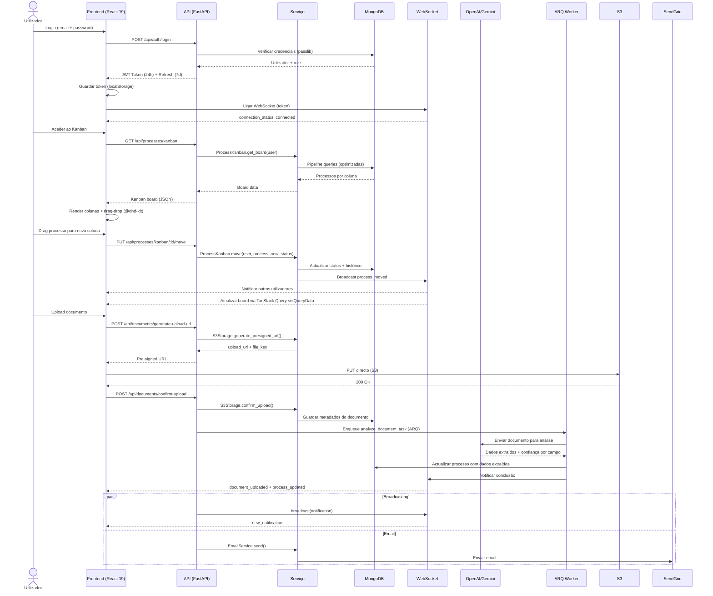

---

## Autenticação e Autorização


---

## Modelos de Dados Principais

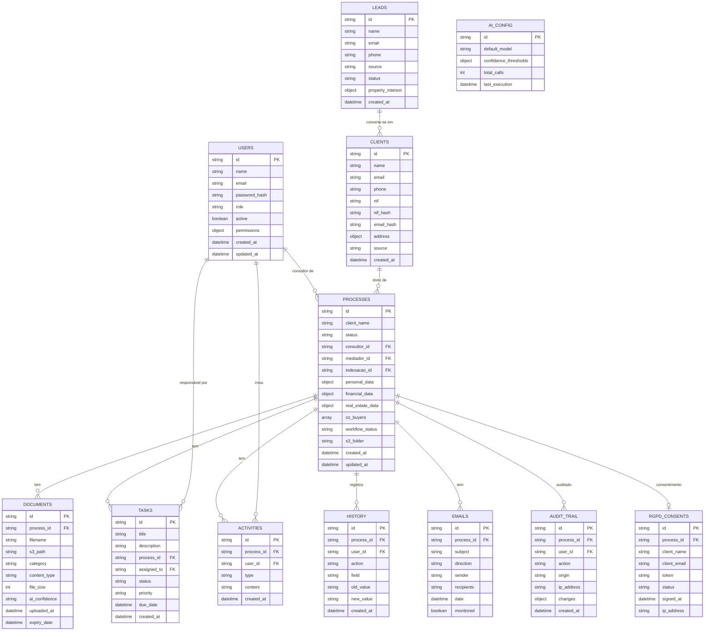

---

## Refatoração Fase 1: Separação Cliente ↔ Processo

### Princípio

A entidade **Cliente** representa a pessoa/fiscal entity — dados que são intrínsecos à pessoa e não mudam entre processos (nome, NIF, email, telefone, estado civil, etc.).

A entidade **Processo** representa o negócio/dossier — dados específicos de cada operação de crédito ou intermediação (valores, banco atribuído, dados financeiros, imobiliários, etc.).

### Diagrama da Nova Arquitetura

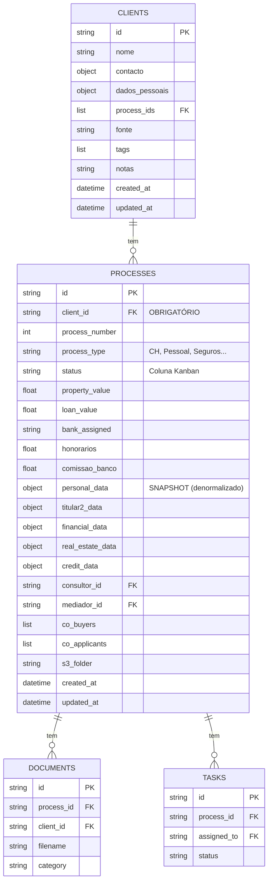

### O que mudou

| Antes (misturado) | Depois (separado) |
|---|---|
| Cliente tinha `dados_financeiros` | ❌ Removido — financeiros pertencem ao Processo |
| Cliente tinha `co_buyers`, `co_applicants` | ❌ Removido — pertencem ao Processo |
| Processo tinha `client_id` opcional | ✅ `client_id` agora é **OBRIGATÓRIO** |
| Processo sem campos de negócio raiz | ✅ Adicionados: `property_value`, `loan_value`, `bank_assigned`, `honorarios`, `comissao_banco` |
| `ClientFinancialData` existia | ❌ Removido — financeiros estão em `Process.financial_data` |
| `personal_data` no Processo era fonte de verdade | ⚠️ Agora é SNAPSHOT (denormalizado) — fonte de verdade é `clients.dados_pessoais` |

### Script de Migração

O script `backend/scripts/migrate_clients_to_processes.py` executa a migração segura:

1. **Backup** automático das coleções originais (`clients_legacy`, `processes_legacy`)
2. **Deduplicação** de clientes por NIF/Email/Nome
3. **Extração** de dados pessoais dos processos → criar/encontrar Clientes
4. **client_id** obrigatório adicionado a todos os processos
5. **Campos de negócio** extraídos para o nível raiz do processo
6. **Validação** de integridade pós-migração
7. **Rollback** disponível com `--rollback`

### Fases Futuras

| Fase | Descrição | Estado |
|------|-----------|--------|
| **Fase 1** | Modelos + Migração | ✅ Concluída |
| **Fase 2** | Adaptar rotas backend + remover campos deprecados | 🔜 Pendente |
| **Fase 3** | Remover `personal_data` do Processo (apenas referência) | 🔜 Pendente |

---

## Componentes e Tecnologias

| Camada | Tecnologia | Finalidade |
|--------|-----------|------------|
| **Frontend** | React 19 + Vite 6 | SPA com code splitting e lazy loading |
| **Estado Cliente** | Zustand | Estado local leve |
| **Estado Servidor** | TanStack Query v5 | Cache, mutations, optimistic updates |
| **UI** | shadcn/ui (New York) + Tailwind CSS 4 | Componentes e estilização |
| **Drag-Drop** | @dnd-kit/core | Kanban board interativo |
| **Backend** | FastAPI (Python 3.11+) | API REST async com Pydantic |
| **Base de Dados** | MongoDB Atlas | Persistência de dados (Motor async) |
| **Cache** | Upstash Redis | Cache de sessões e fila de tarefas |
| **Armazenamento** | AWS S3 | Ficheiros com pre-signed URLs |
| **Filas** | ARQ (Redis-based) | Tarefas em background (análise IA) |
| **WebSocket** | FastAPI WebSocket | Notificações em tempo real |
| **IA** | OpenAI GPT-4o + Gemini Flash | Análise de documentos e extração |
| **Email** | SendGrid / Resend | Email transacional e rascunhos automáticos |
| **Observabilidade** | Sentry | Monitoring de erros e performance |
| **CI/CD** | GitHub Actions | Pipeline de testes e deploy |
| **Hosting FE** | Vercel | CDN + SPA rewrites |
| **Hosting BE** | Render | Docker container + auto-deploy |

---

## Padrões de Design Utilizados

| Padrão | Onde é aplicado |
|--------|----------------|
| **Singleton** | `DatabaseProxy` (MongoDB), `WebSocketManager`, `useWebSocket` (frontend) |
| **Circuit Breaker** | `TasksContext` — polling de tarefas com falhas consecutivas |
| **Reference Counting** | `useWebSocket` — uma ligação partilhada entre componentes |
| **Exponential Backoff** | `useWebSocket` (1s→30s), API interceptor 429 retry (2s→4s→8s), Notifications polling (30s→5min) |
| **Retry with Jitter** | API interceptor — 3 retries com jitter ±500ms para evitar thundering herd |
| **Lazy Loading** | 50+ páginas com `React.lazy()` + `Suspense` |
| **Chunk Error Recovery** | `LazyChunkErrorBoundary` — deteta stale deployments e faz reload automático |
| **Proxy (Lazy)** | `DatabaseProxy`, `ClientProxy` — ligação on-demand |
| **Repository** | `services/*` — abstracção sobre acesso à base de dados |
| **Middleware Chain** | CORS → Rate Limiting → Security Headers → Input Sanitization → Route Handler |
| **Observer (Pub/Sub)** | WebSocket events — `broadcast()` para notificações em tempo real |
| **Change Data Capture** | `AuditCDC` — monitoriza alterações via MongoDB Change Stream |
| **Strategy** | `AI_CONFIG_DEFAULTS` — seleção de modelo IA por tipo de tarefa |
| **Pre-signed URL** | `S3Storage` — upload directo do frontend para S3 sem passar pelo backend |
| **Blind Indexing** | `EncryptionService` — HMAC-SHA256 para pesquisa em campos encriptados |
| **Dedicated Collection** | `history`, `audit_trail` — colecções separadas para evitar 16MB limit |
| **Confidence Scoring** | `AIDocumentService` — score 0.0-1.0 por campo extraído, alertas para < 0.8 |
| **Fail-Safe Swap** | `restore_dev_from_backup.py` — BD de Dev não é modificada se o backup estiver corrompido |
| **Temporary Collection** | `_restore_temp_*` — coleções temporárias para migração atómica de dados |
| **RGPD Sanitization Pipeline** | `sync_prod_to_dev.py`, `restore_dev_from_backup.py` — anonimização determinística de PII (nome, NIF, email, telefone, IBAN) |
| **Factory (Storage)** | `storage_service.py` — `get_storage_adapter()` retorna adapter correto (Local, S3, OneDrive) baseado em `system_settings.storage.provider` |
| **Strategy (Email)** | `send_email(force_system=True)` — tenta contas nomeadas, depois SystemSMTP (Bloco A), depois erro |
| **Fallback Chain (Webmail)** | `sync_shared_role_emails()` — tenta `shared_role_email_configs`, depois `system_webmail` (Bloco C), depois erro |
| **Provider-Agnostic** | Storage, Email, Webmail configuráveis via Admin Settings sem alteração de código |

---

## Estratégia de Resiliência

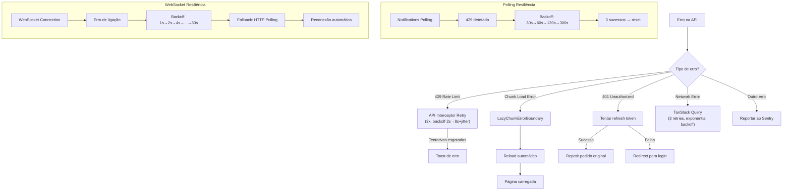

---

## Fluxo de Restauro Seguro (Dev ← S3 Backup)

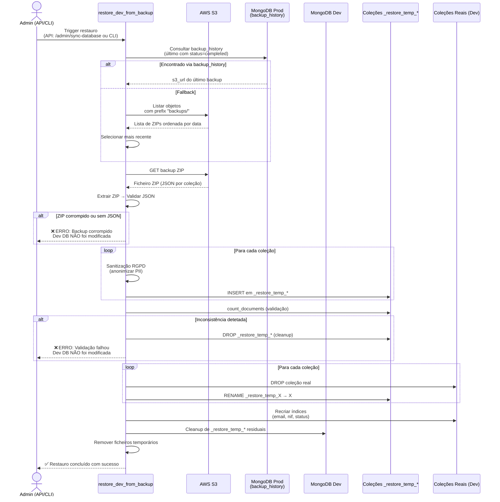

**Propriedades de segurança do pipeline:**

| Propriedade | Descrição |
|-------------|-----------|
| **Fail-Safe** | A BD de Dev **nunca** é modificada se qualquer passo falhar |
| **Não toca em Prod** | Não acede ao MongoDB de Produção diretamente (apenas S3) |
| **Atomicidade** | Swap por rename garante consistência |
| **Rastreabilidade** | Cada documento recebe `_sanitized_at` e `_sanitized_source` |
| **Cleanup automático** | Coleções temporárias são removidas em caso de sucesso ou erro |

---

## Navegação e Controlo de Acessos (RBAC)

### Painel de Administração Centralizado (/admin)

O Painel de Administração é o hub centralizado para gestão do sistema, acessível via rota `/admin` para os roles `admin` e `CEO`. Substitui a dispersão de links de configuração pela Sidebar.

**Tabs do Painel de Administração:**

| Tab | Visível para | Descrição |
|-----|-------------|-----------|
| Visão Geral | admin, CEO | Quadro Kanban de processos com filtros |
| Calendário | admin, CEO | Prazos e eventos do pipeline |
| Documentos | admin, CEO | Documentos com validades próximas |
| Análise IA | admin, CEO | Análise inteligente de documentos |
| Pesquisar | admin, CEO | Pesquisa global de clientes |
| Tarefas | admin, CEO | Gestão de tarefas assíncronas |
| Leads | admin, CEO | Pipeline de leads |
| **Utilizadores** | admin, CEO | Gestão completa de utilizadores (UsersManagementPage) |
| **Configurações** | admin, CEO | Configurações gerais do sistema (SystemConfigPage) |
| **Automações** | admin, CEO | Regras de automação "Se X, Então Y" |
| **Segurança & Backups** | **apenas admin** | Backups da BD e verificação de integridade |
| **Logs & Diagnósticos** | **apenas admin** | Logs do sistema, importação IA e diagnósticos |

### Sidebar Principal por Role

| Role | Menu Visível | Observações |
|------|-------------|-------------|
| **indexação** | Listas de Trabalho (Registos, Processos, Doc. Pendentes) | SEM Dashboard, SEM Estatísticas, SEM Configuração |
| **consultor/mediador/intermediário** | Dashboard + O Meu Negócio + Visão Global + Comunicações | Acesso operacional standard |
| **diretor** | Dashboard + O Meu Negócio + Visão Global + Comunicações + Gestão e Operações | Vê Estatísticas e Rascunhos; sem Painel Admin |
| **administrativo** | Dashboard + O Meu Negócio + Visão Global + Comunicações + Gestão (com RGPD) | Vê RGPD; sem Painel Admin |
| **CEO** | Dashboard + O Meu Negócio + Visão Global + Comunicações + Gestão + ⚙️ Painel Admin | Acesso total ao negócio; tabs técnicas escondidas |
| **admin** | Dashboard + O Meu Negócio + Visão Global + Comunicações + Gestão + ⚙️ Painel Admin | Acesso total incluindo tabs técnicas |

### Rotas Obsoletas na Sidebar

As rotas `/rgpd-admin` e `/templates` foram removidas da navegação principal da Sidebar. As páginas continuam acessíveis via URLs diretas e através do Painel de Administração (Tabs de Configurações e Utilizadores).

### Arquitetura de Páginas Embedded

As páginas integradas como Tabs no Painel de Administração suportam um modo `embedded` que omite o wrapper `<DashboardLayout>`, permitindo que o conteúdo seja renderizado dentro das Tabs sem duplicar a sidebar e o header.

Componentes com suporte `embedded`:
- `UsersManagementPage` — Gestão de utilizadores
- `SystemConfigPage` — Configurações do sistema
- `AutomationPage` — Automações de workflow
- `BackupsPage` — Backups da base de dados
- `UnifiedLogsPage` — Logs unificados
- `DiagnosticsPage` — Diagnósticos do sistema

---

## Segurança

- **CORS Fail-Secure**: A aplicação arranca apenas com origens explicitamente configuradas (sem wildcards)
- **JWT com Validação Robusta**: Secret validado para entropia mínima, tokens com 24h de validade
- **Refresh Tokens**: Tokens de refresh de 7 dias, revogáveis via MongoDB
- **Rate Limiting por Role**: Limites diferenciados (admin: 1000, consultor: 200, cliente: 100 req/min)
- **Security Headers**: HSTS, CSP, X-Frame-Options, X-Content-Type-Options, Referrer-Policy em todas as respostas
- **Encriptação de Campos**: Campos sensíveis (NIF, rendimentos) encriptados com Fernet (AES-128-CBC)
- **Blind Indexing**: Hashes HMAC-SHA256 para pesquisa em campos encriptados
- **Input Sanitization**: Todas as rotas da API sanitizam inputs (strings, emails, nomes)
- **MIME Validation**: Validação por magic bytes para uploads de documentos
- **DOMPurify**: Sanitização XSS no frontend para rich text
- **Password Strength**: Validação com passlib bcrypt
- **Impersonate Control**: Admin pode visualizar como outro utilizador, com restauro automático
- **OpenAI PII Opt-out**: Configuração de opt-out de treino de dados na conta OpenAI
- **Prompt Injection Protection**: Mitigação de prompt injection em análise de PDFs
- **SPA Rewrite Security**: Vercel rewrites excluem `/assets/` para evitar MIME type attacks

---

## Arquitetura de Webmail e Email

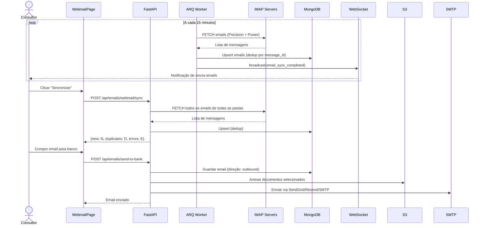

**Contas de email suportadas:**

| Conta | Variáveis de Configuração | Servidor IMAP |
|-------|--------------------------|---------------|
| Precision Crédito | `PRECISION_EMAIL`, `PRECISION_PASSWORD`, `PRECISION_IMAP_SERVER/PORT` | `mail.precisioncredito.pt:993` |
| Power Real Estate | `POWER_EMAIL`, `POWER_PASSWORD`, `POWER_IMAP_SERVER/PORT` | `webmail2.hcpro.pt:993` |

**Email Transacional do Sistema (Bloco A):**

Quando `send_email(force_system=True)` é chamado (ex: envio de documentação para bancos):

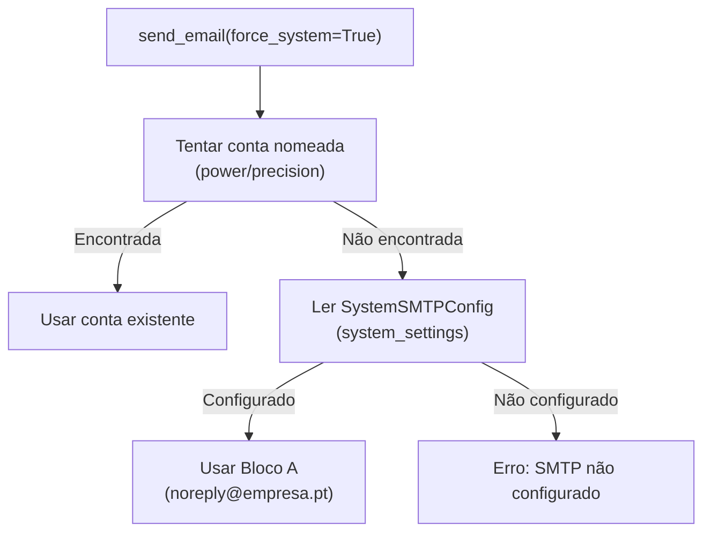

**Webmail Partilhado por Role (Bloco C):**

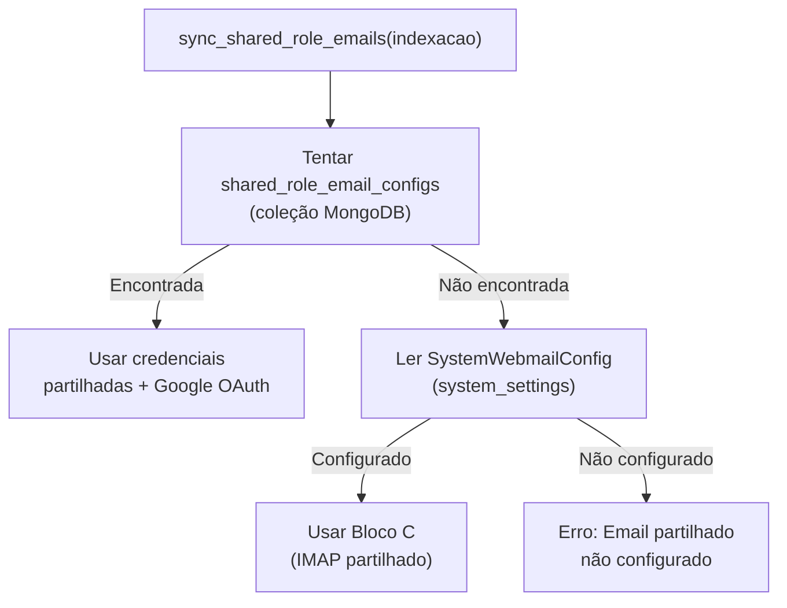

**Storage Factory Pattern:**

```mermaid
flowchart TD
    API["Rota API<br/>(upload/download)"] --> Factory["get_storage_adapter()"]
    Factory --> ReadConfig["Ler system_settings<br/>.storage.provider"]
    ReadConfig -->|aws_s3| S3["S3StorageAdapter"]
    ReadConfig -->|local| Local["LocalStorageAdapter"]
    ReadConfig -->|onedrive| OneDrive["OneDriveAdapter<br/>(placeholder)"]
    ReadConfig|unknown| LocalFallback["LocalAdapter<br/>(fallback)"]
    S3 --> S3Client["AWS S3 Client"]
    Local --> FileSystem["/tmp/powercell_uploads"]
```

---

## Arquitetura de Push Notifications

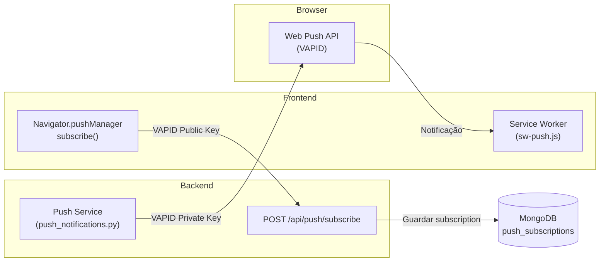

**Configuração VAPID:**
- `VAPID_PRIVATE_KEY` — Chave privada para assinar notificações (backend)
- `VAPID_PUBLIC_KEY` — Chave pública para subscrição (frontend via `REACT_APP_VAPID_PUBLIC_KEY`)
- `VAPID_MAILTO` — Contacto admin para VAPID (`mailto:admin@creditoimo.pt`)

---

## Arquitetura de Rate Limiting

O sistema utiliza rate limiting em duas camadas:

### Backend (slowapi)

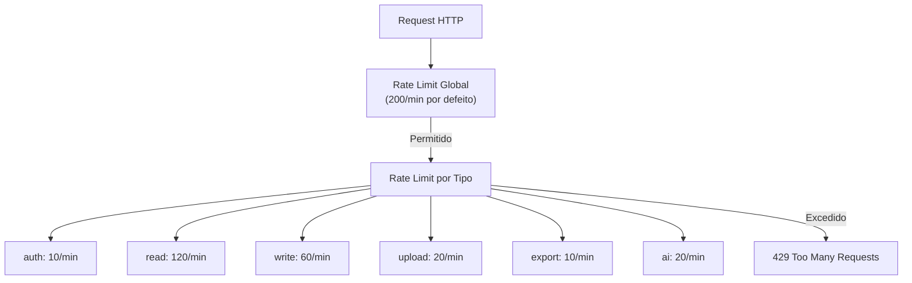

**Variáveis de ambiente:**

| Variável | Predefinição | Descrição |
|----------|-------------|-----------|
| `RATE_LIMIT_AUTH` | `10/minute` | Login e registo |
| `RATE_LIMIT_READ` | `120/minute` | GET requests |
| `RATE_LIMIT_WRITE` | `60/minute` | POST/PUT/PATCH |
| `RATE_LIMIT_UPLOAD` | `20/minute` | Uploads de ficheiros |
| `RATE_LIMIT_EXPORT` | `10/minute` | Exportações (CSV, ZIP) |
| `RATE_LIMIT_AI` | `20/minute` | Chamadas à API de IA |
| `RATE_LIMIT_DEFAULT` | `200/minute` | Qualquer outro endpoint |

### Frontend (429 Retry)

- **API Interceptor**: 3 retries com exponential backoff (2s → 4s → 8s + jitter ±500ms)
- Respeita header `Retry-After` quando presente
- Suprime toast de erro durante retries para evitar spam
- **Notifications Polling**: Backoff em 429 (30s → 60s → 120s → 5min), reset após 3 sucessos

---

## Arquitetura de Scraping (Idealista)

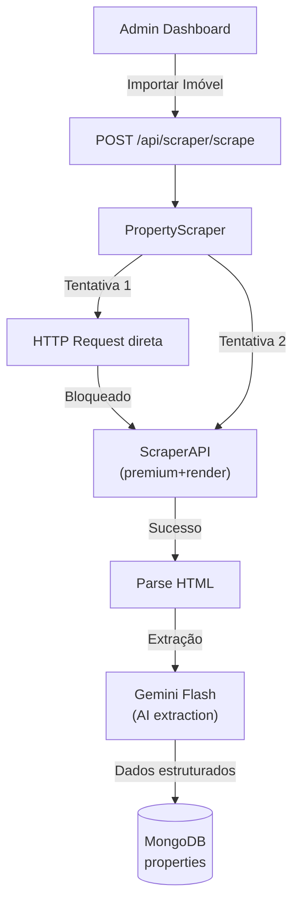

**Configuração:**
- `SCRAPERAPI_API_KEY` — API key do ScraperAPI (para sites protegidos)
- `GEMINI_API_KEY` — Gemini Flash para extração de dados de páginas
- Fallback: HTTP direto → ScraperAPI basic → ScraperAPI premium → ScraperAPI premium+render
