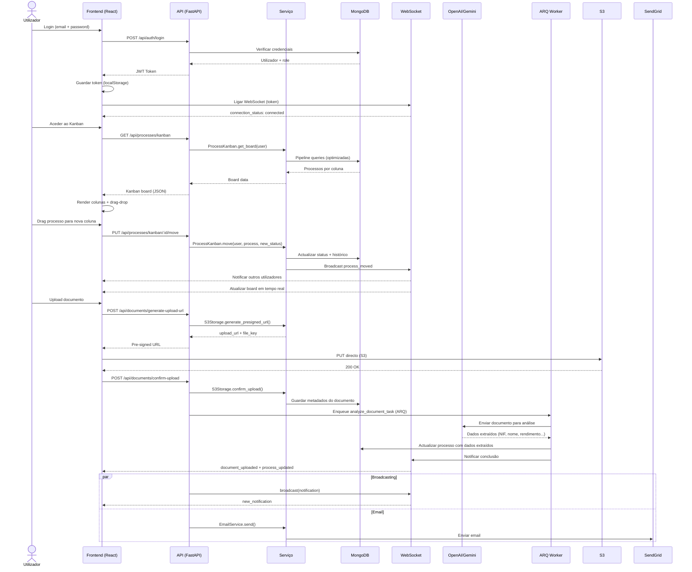
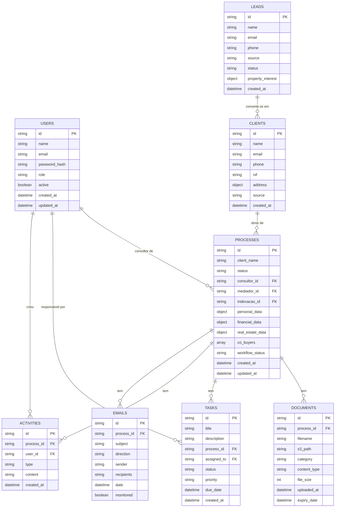

# Arquitetura do Sistema — PowerCell CRM

## Visão Geral

O PowerCell é um sistema de gestão de processos de crédito habitacional, concebido para a intermediação imobiliária e financeira em Portugal. A arquitetura segue o padrão **monolito modular** com separação clara entre frontend, backend API e serviços de infraestrutura.

---

## Diagrama de Arquitetura

```mermaid
graph TB
    subgraph Clientes["🖥️ Clientes (Browser)"]
        User["Utilizador"]
        Portal["Portal do Cliente<br/>(Magic Link)"]
        PublicForm["Formulário Público<br/>/registo"]
    end

    subgraph Frontend["⚛️ Frontend — React 19 + Vite"]
        Router["React Router<br/>(Rotas protegidas por role)"]
        AuthCtx["AuthContext<br/>(JWT + Impersonate)"]
        TasksCtx["TasksContext<br/>(Polling + Circuit Breaker)"]
        UploadCtx["UploadProgressContext"]
        ThemeCtx["ThemeContext<br/>(Light/Dark)"]
        API_SVC["api.js<br/>(Axios + Interceptors)"]
        WSClient["useWebSocket<br/>(Singleton + Backoff)"]
        TanStack["TanStack Query<br/>(Cache + Mutations)"]
        Pages["Páginas<br/>(Lazy Loading)"]
    end

    subgraph API["🐍 Backend API — FastAPI (Python)"]
        CORS["CORS Middleware<br/>(Fail-Secure)"]
        RateLimit["Rate Limiting<br/>(Por role)"]
        SecurityHeaders["Security Headers<br/>(HSTS, CSP, X-Frame)"]
        SentryMW["Sentry Integration"]

        subgraph Rotas["Rotas da API (/api)"]
            AuthR["/auth<br/>(Login, JWT, Refresh)"]
            ProcessesR["/processes<br/>(CRUD, Kanban, Atribuição)"]
            DocumentsR["/documents<br/>(Upload, S3, Expiry)"]
            TasksR["/tasks<br/>(CRUD, Tarefas)"]
            ClientsR["/clients<br/>(CRUD)"]
            LeadsR["/leads<br/>(Scraping, Pipeline)"]
            EmailsR["/emails<br/>(Gmail, Rascunhos AI)"]
            FinanceR["/finance<br/>(Comissões, Resumo)"]
            AIR["/ai<br/>(Análise de Docs)"]
            AIBulkR["/ai-bulk<br/>(Importação em Massa)"]
            RGPD_R["/rgpd<br/>(Consentimento, Anonimização)"]
            WSR["/ws<br/>(WebSocket Endpoint)"]
            AdminR["/admin<br/>(Utilizadores, Impersonate)"]
            AuditR["/audit<br/>(Trilha de Auditoria)"]
            BackupR["/backup<br/>(Backups Automáticos)"]
            OtherR["+30 rotas adicionais"]
        end

        subgraph Servicos["Camada de Serviços"]
            ProcessSvc["ProcessService"]
            AI_DocSvc["AIDocumentService<br/>(GPT-4o, Gemini)"]
            WSManager["WebSocketManager<br/>(ConnectionManager)"]
            RedisCache["RedisCache<br/>(Cache + Queue)"]
            EmailSvc["EmailService<br/>(SendGrid/Resend)"]
            EncryptionSvc["EncryptionService<br/>(Campos sensíveis)"]
            AuditCDC["AuditCDC<br/>(Change Data Capture)"]
            NotificationSvc["NotificationService"]
            TaskQueue["TaskQueue (ARQ)"]
            S3Storage["S3Storage<br/>(Pre-signed URLs)"]
            WorkflowEngine["WorkflowEngine"]
            ScraperSvc["PropertyScraper<br/>(Idealista)"]
        end

        subgraph Middleware_Backend["Middleware"]
            RateLimitMW["User Rate Limiter"]
            UserRL["user_rate_limit<br/>(admin: 1000, staff: 200)"]
        end
    end

    subgraph Infra["📦 Infraestrutura"]
        MongoDB[("MongoDB Atlas<br/>(Base de Dados)"]
        Redis[("Redis<br/>(Cache + Task Queue)"]
        S3[("AWS S3<br/>(Armazenamento)"]
        Sentry["Sentry<br/>(Observabilidade)"]
        SendGrid["SendGrid/Resend<br/>(Email Transacional)"]
        OpenAI["OpenAI / Gemini<br/>(Modelos de IA)"]
        TrelloAPI["Trello API<br/>(Integração)"]
        GmailAPI["Gmail API<br/>(Sincronização Email)"]
    end

    subgraph Worker["⚙️ Background Worker"]
        ARQWorker["ARQ Worker<br/>(async tasks)"]
        JobMonitor["Job Monitor<br/>(Stuck Detection)"]
        BackupSched["Backup Scheduler<br/>(Diário 03:00 UTC)"]
    end

    subgraph Deploy["🚀 Deploy"]
        Vercel["Vercel<br/>(Frontend)"]
        Render["Render<br/>(Backend API)"]
        GHA["GitHub Actions<br/>(CI/CD Pipeline)"]
    end

    %% Clientes → Frontend
    User --> Router
    Portal --> Router
    PublicForm --> Router

    %% Frontend Interno
    Router --> AuthCtx
    Router --> Pages
    Pages --> API_SVC
    Pages --> TanStack
    Pages --> WSClient
    WSClient --> AuthCtx

    %% Frontend → Backend
    API_SVC -->|HTTPS + JWT| CORS
    WSClient -->|WSS + JWT| WSR

    %% Backend Pipeline
    CORS --> RateLimitMW
    RateLimitMW --> SecurityHeaders
    SecurityHeaders --> Rotas
    Rotas --> Servicos

    %% Serviços → Infraestrutura
    ProcessSvc --> MongoDB
    AI_DocSvc --> OpenAI
    AI_DocSvc --> MongoDB
    RedisCache --> Redis
    TaskQueue --> Redis
    EmailSvc --> SendGrid
    S3Storage --> S3
    ScraperSvc -->|Scraping| ExternalSites["Sites Externos<br/>(Idealista)"]
    EmailsR --> GmailAPI
    TrelloAPI -.->|Opcional| OtherR

    %% Background Worker
    TaskQueue -->|Enqueue| ARQWorker
    ARQWorker --> AI_DocSvc
    ARQWorker --> MongoDB
    ARQWorker --> Redis
    JobMonitor --> MongoDB
    BackupSched --> MongoDB
    BackupSched --> S3

    %% Observabilidade
    SentryMW --> Sentry

    %% Deploy
    GHA -->|Deploy| Vercel
    GHA -->|Deploy| Render
    Vercel -->|CDN| User
    Render -->|API| API_SVC

    %% Estilos
    classDef frontend fill:#0ea5e9,stroke:#0369a1,color:#fff,font-weight:bold
    classDef backend fill:#10b981,stroke:#047857,color:#fff,font-weight:bold
    classDef infra fill:#f59e0b,stroke:#b45309,color:#fff,font-weight:bold
    classDef worker fill:#8b5cf6,stroke:#6d28d9,color:#fff,font-weight:bold
    classDef deploy fill:#ef4444,stroke:#b91c1c,color:#fff,font-weight:bold

    class Frontend frontend
    class API,Middleware_Backend backend
    class Infra infra
    class Worker worker
    class Deploy deploy
```

---

## Fluxo de Dados Principal



---

## Autenticação e Autorização

```mermaid
flowchart TD
    Login["POST /api/auth/login"]
    Login --> Validar["Validar credenciais<br/>(bcrypt + MongoDB)"]
    Validar -->|Sucesso| GerarJWT["Gerar JWT<br/>(HS256, 24h)"]
    Validar -->|Falha| Erro401["401 Unauthorized"]
    GerarJWT --> RefreshToken["Gerar Refresh Token<br/>(7 dias, MongoDB)"]
    RefreshToken --> Response["Response: token + user"]

    subgraph Requests["Pedidos Autenticados"]
        Request["Request com Authorization header"]
        Request --> Extract["Middleware extrai user_id + role do JWT"]
        Extract --> RateCheck["Rate Limit<br/>(admin: 1000/min<br/>consultor: 200/min<br/>cliente: 100/min)"]
        RateCheck -->|Permitido| Route["Rota da API"]
        RateCheck -->|Excedido| Err429["429 Too Many Requests"]
        Route --> RoleCheck["Verificar role requerido"]
        RoleCheck -->|Autorizado| Exec["Executar handler"]
        RoleCheck -->|Não autorizado| Err403["403 Forbidden"]
    end

    subgraph Impersonate["Impersonate (Admin)"]
        ImpReq["POST /api/admin/impersonate/:id"]
        ImpReq --> GenToken["Gerar novo JWT<br/>com role do utilizador"]
        GenToken --> StoreOriginal["Guardar originalToken<br/>no localStorage"]
        StoreOriginal --> ImpAccess["Aceder como outro utilizador"]
        ImpAccess --> Stop["POST /api/admin/stop-impersonate"]
        Stop --> Restore["Restaurar token original"]
    end

    subgraph Refresh["Refresh Token Flow"]
        RefreshReq["POST /api/auth/refresh"]
        RefreshReq --> ValidateRT["Validar refresh token no MongoDB"]
        ValidateRT -->|Válido| NewTokens["Gerar novo JWT + refresh token"]
        ValidateRT -->|Inválido| ClearTokens["Limpar tokens"]
    end
```



---

## Modelos de Dados Principais



---

## Componentes e Tecnologias

| Camada | Tecnologia | Finalidade |
|--------|-----------|------------|
| **Frontend** | React 19 + Vite | SPA com code splitting e lazy loading |
| **Estado** | Zustand + TanStack Query | Estado local + cache de servidor |
| **UI** | shadcn/ui + Tailwind CSS 4 | Componentes e estilização |
| **Backend** | FastAPI (Python 3.11+) | API REST async com Pydantic |
| **Base de Dados** | MongoDB Atlas | Persistência de dados (Motor async) |
| **Cache** | Redis | Cache de sessões e fila de tarefas |
| **Armazenamento** | AWS S3 | Ficheiros com pre-signed URLs |
| **Filas** | ARQ (Redis-based) | Tarefas em background (análise IA) |
| **WebSocket** | FastAPI WebSocket | Notificações em tempo real |
| **IA** | OpenAI GPT-4o + Gemini Flash | Análise de documentos e extração de dados |
| **Email** | SendGrid / Resend | Email transacional e rascunhos automáticos |
| **Observabilidade** | Sentry | Monitoring de erros e performance |
| **CI/CD** | GitHub Actions | Pipeline de testes e deploy |
| **Hosting** | Vercel (FE) + Render (BE) | Deploy automatizado |

---

## Estrutura de Pastas (Resumo)

```
powercell/
├── backend/
│   ├── server.py              # Entry point FastAPI + middleware
│   ├── config.py              # Variáveis de ambiente e validação
│   ├── database.py            # Ligação MongoDB (Motor, singleton lazy)
│   ├── models/                # Esquemas Pydantic + modelos de dados
│   ├── routes/                # Rotas da API (~45 ficheiros)
│   ├── services/              # Lógica de negócio (~60 ficheiros)
│   ├── middleware/             # Rate limiting
│   ├── worker/                # ARQ background worker
│   ├── utils/                 # Validação e sanitização
│   └── tests/                 # Unit + Integration + E2E tests
│
├── frontend/
│   └── src/
│       ├── App.js             # Router principal + providers
│       ├── pages/             # ~50 páginas (lazy loaded)
│       ├── components/        # Componentes reutilizáveis
│       ├── contexts/          # React Context providers
│       ├── hooks/             # Custom hooks (WebSocket, queries)
│       ├── services/          # API client (Axios)
│       └── utils/             # Utilitários (sanitize, errors)
│
├── .github/workflows/
│   └── ci.yml                 # CI/CD pipeline
│
└── ARCHITECTURE.md            # Este ficheiro
```

---

## Padrões de Design Utilizados

| Padrão | Onde é aplicado |
|--------|----------------|
| **Singleton** | `DatabaseProxy` (MongoDB), `WebSocketManager`, `useWebSocket` (frontend) |
| **Circuit Breaker** | `TasksContext` — para polling de tarefas com falhas consecutivas |
| **Reference Counting** | `useWebSocket` — uma ligação partilhada entre componentes |
| **Exponential Backoff** | `useWebSocket` — reconexão (1s → 2s → 4s → ... → 30s) |
| **Proxy (Lazy)** | `DatabaseProxy`, `ClientProxy` — ligação on-demand |
| **Repository** | `services/*` — abstracção sobre acesso à base de dados |
| **Middleware Chain** | Security Headers → Rate Limiting → CORS → Route Handler |
| **Observer (Pub/Sub)** | WebSocket events — `broadcast()` para notificações em tempo real |
| **Change Data Capture** | `AuditCDC` — monitoriza alterações via MongoDB Change Stream |
| **Strategy** | `AI_CONFIG_DEFAULTS` — seleção de modelo IA por tipo de tarefa |
| **Pre-signed URL** | `S3Storage` — upload directo do frontend para S3 sem passar pelo backend |

---

## Segurança

- **CORS Fail-Secure**: A aplicação arranca apenas com origens explicitamente configuradas (sem wildcards)
- **JWT com Validação Robusta**: Secret validado para entropia mínima, tokens com 24h de validade
- **Refresh Tokens**: Tokens de refresh de 7 dias, revogáveis via MongoDB
- **Rate Limiting por Role**: Limites diferenciados (admin: 1000, consultor: 200, cliente: 100 req/min)
- **Security Headers**: HSTS, CSP, X-Frame-Options, X-Content-Type-Options em todas as respostas
- **Encriptação de Campos**: Campos sensíveis (NIF, rendimentos) encriptados na base de dados
- **Impersonate Control**: Admin pode visualizar como outro utilizador, com restauro automático de sessão
- **OpenAI PII Opt-out**: Configuração de opt-out de treino de dados na conta OpenAI
