# Arquitetura do Sistema — PowerCell CRM

> Normas de UX/UI e convenções técnicas do frontend (Progressive Disclosure, layout 2/3+1/3, tokens Shadcn, `sonner`, ESLint `no-restricted-syntax`, utilitários centralizados): ver **`FRONTEND_GUIDELINES.md`**.

## Visão Geral

O PowerCell é um sistema de gestão de processos de crédito habitacional, concebido para a intermediação imobiliária e financeira em Portugal. A arquitetura segue o padrão **monolito modular** com separação clara entre frontend, backend API e serviços de infraestrutura.

---

## Diagrama de Arquitetura

```mermaid
graph TB
    subgraph Clientes["🖥️ Clientes (Browser)"]
        User["Utilizador"]
        Portal["Portal do Cliente<br/>(Magic Link)"]
        PublicForm["Formulário Público<br/>/registo"]
        RGPDForm["Página RGPD<br/>/rgpd/:token"]
    end

    subgraph Frontend["⚛️ Frontend — React 19 + Vite"]
        Router["React Router<br/>(Rotas protegidas por role)"]
        AuthCtx["AuthContext<br/>(JWT + Impersonate)"]
        TasksCtx["TasksContext<br/>(Polling + Circuit Breaker)"]
        UploadCtx["UploadProgressContext"]
        ThemeCtx["ThemeContext<br/>(Light/Dark)"]
        API_SVC["api.js<br/>(Axios + 429 Retry)"]
        WSClient["useWebSocket<br/>(Singleton + Backoff)"]
        TanStack["TanStack Query<br/>(Cache + Mutations)"]
        LazyChunk["LazyChunkErrorBoundary<br/>(Stale Deploy Recovery)"]
        Pages["Páginas<br/>(~50, Lazy Loaded)"]
    end

    subgraph API["🐍 Backend API — FastAPI (Python 3.12)"]
        CORS["CORS Middleware<br/>(Fail-Secure)"]
        RateLimit["Rate Limiting<br/>(Por role: slowapi)"]
        SecurityHeaders["Security Headers<br/>(HSTS, CSP, X-Frame)"]
        SentryMW["Sentry Integration"]
        InputSanitize["Input Sanitization"]

        subgraph Rotas["Rotas da API (/api) — thin stubs"]
            AuthR["/auth"]
            ProcessesR["/processes<br/>(→ services/process_*)"]
            DocumentsR["/documents<br/>(→ services/document_*)"]
            TasksR["/tasks<br/>(BG jobs + CRUD)"]
            ClientsR["/clients"]
            PortalR["/portal<br/>(cliente + fulfill)"]
            OtherR["+40 rotas (ver AGENTS.md)"]
        end

        subgraph Servicos["Camada de Serviços"]
            ProcessSvc["ProcessService"]
            AI_DocSvc["AIDocumentService<br/>(GPT-4o, Gemini)"]
            WSManager["WebSocketManager<br/>(ConnectionManager)"]
            RedisCache["RedisCache<br/>(Cache + Queue)"]
            EmailSvc["EmailService<br/>(SendGrid/Resend)"]
            EncryptionSvc["EncryptionService<br/>(Fernet + Blind Indexing)"]
            AuditCDC["AuditCDC<br/>(Change Data Capture)"]
            NotificationSvc["NotificationService"]
            TaskQueue["TaskQueue (ARQ)"]
            S3Storage["S3Storage<br/>(Pre-signed URLs)"]
            WorkflowEngine["WorkflowEngine"]
            ScraperSvc["PropertyScraper<br/>(Idealista)"]
            AIConfidence["Confidence Scorer<br/>(Score por campo)"]
            OrganizerSvc["Document Organizer<br/>(Categorização automática)"]
            EmailB2BSvc["EmailB2BService<br/>(Enviar p/ Balcões)"]
            ChangelogSvc["ChangelogService<br/>(Gerar notas IA)"]
            AnnotationSvc["AnnotationService<br/>(5 tipos de anotação)"]
            StorageFactory["StorageService<br/>(Factory: Local/S3/OneDrive)"]
            SystemSMTPSvc["SystemSMTPConfig<br/>(Bloco A - Email Transacional)"]
            SystemWebmail["SystemWebmailConfig<br/>(Bloco C - Webmail Partilhado)"]
            SharedEmailSync["SharedEmailSync<br/>(Role-based IMAP Sync)"]
        end

        subgraph Middleware_Backend["Middleware"]
            RateLimitMW["User Rate Limiter"]
            UserRL["user_rate_limit<br/>(admin: 1000, staff: 200)"]
        end
    end

    subgraph Infra["📦 Infraestrutura"]
        MongoDB[("MongoDB Atlas - Base de Dados")]
        Redis[("Redis (Upstash) - Cache + Task Queue")]
        S3[("AWS S3 - Armazenamento")]
        Sentry["Sentry<br/>(Observabilidade)"]
        SystemSMTP["System SMTP<br/>(Email Transacional via Bloco A)"]
        OpenAI["OpenAI GPT-4o<br/>(Análise de Documentos)"]
        Gemini["Gemini Flash<br/>(Análise de Documentos)"]
        TrelloAPI["Trello API<br/>(Integração)"]
        GmailAPI["Gmail API<br/>(Sincronização Email)"]
    end

    subgraph Worker["⚙️ Background Worker"]
        ARQWorker["ARQ Worker<br/>(async tasks)"]
        JobMonitor["Job Monitor<br/>(Stuck Detection)"]
        BackupSched["Backup Scheduler<br/>(Diário 03:00 UTC)"]
        RestorePipeline["restore_dev_from_backup<br/>(RGPD Fail-Safe)"]
        SyncPipeline["sync_prod_to_dev<br/>(Sanitização PII)"]
    end

    subgraph Deploy["🚀 Deploy"]
        Vercel["Vercel<br/>(Frontend CDN)"]
        Render["Render<br/>(Backend API)"]
        GHA["GitHub Actions<br/>(CI/CD Pipeline)"]
    end

    %% Clientes → Frontend
    User --> Router
    Portal --> Router
    PublicForm --> Router
    RGPDForm --> Router

    %% Frontend Interno
    Router --> AuthCtx
    Router --> Pages
    Pages --> API_SVC
    Pages --> TanStack
    Pages --> WSClient
    WSClient --> AuthCtx
    LazyChunk --> Pages

    %% Frontend → Backend
    API_SVC -->|HTTPS + JWT| CORS
    WSClient -->|WSS + JWT| OtherR

    %% Backend Pipeline
    CORS --> RateLimitMW
    RateLimitMW --> SecurityHeaders
    SecurityHeaders --> InputSanitize
    InputSanitize --> Rotas
    Rotas --> Servicos

    %% Serviços → Infraestrutura
    ProcessSvc --> MongoDB
    AI_DocSvc --> OpenAI
    AI_DocSvc --> Gemini
    AI_DocSvc --> MongoDB
    AIConfidence --> AI_DocSvc
    RedisCache --> Redis
    TaskQueue --> Redis
    EmailSvc --> SystemSMTP
    S3Storage --> S3
    OrganizerSvc --> S3Storage
    ScraperSvc -->|Scraping| ExternalSites["Sites Externos<br/>(Idealista)"]
    OtherR --> GmailAPI
    TrelloAPI -.->|Opcional| OtherR
    DocumentsR --> S3Storage
    PortalR --> DocumentsR
    TasksCtx --> TasksR
    Pages --> TasksCtx

    %% Background Worker
    TaskQueue -->|Enqueue| ARQWorker
    ARQWorker --> AI_DocSvc
    ARQWorker --> MongoDB
    ARQWorker --> Redis
    JobMonitor --> MongoDB
    BackupSched --> MongoDB
    BackupSched -->|Upload ZIP| S3
    RestorePipeline -->|Localizar backup| S3
    RestorePipeline -->|Download ZIP| S3
    RestorePipeline -->|Import temp + Swap| MongoDB
    SyncPipeline -->|Leitura| MongoDB
    SyncPipeline -->|Escrita sanitized| MongoDB

    %% Observabilidade
    SentryMW --> Sentry

    %% Deploy
    GHA -->|Deploy| Vercel
    GHA -->|Deploy| Render
    Vercel -->|CDN + SPA Rewrite| User
    Render -->|API| API_SVC

    %% Estilos
    classDef frontend fill:#0ea5e9,stroke:#0369a1,color:#fff,font-weight:bold
    classDef backend fill:#10b981,stroke:#047857,color:#fff,font-weight:bold
    classDef infra fill:#f59e0b,stroke:#b45309,color:#fff,font-weight:bold
    classDef worker fill:#8b5cf6,stroke:#6d28d9,color:#fff,font-weight:bold
    classDef deploy fill:#ef4444,stroke:#b91c1c,color:#fff,font-weight:bold

    class Frontend frontend
    class API,Middleware_Backend backend
    class Infra infra
    class Worker worker
    class Deploy deploy
```

---

## Fluxo de Dados Principal

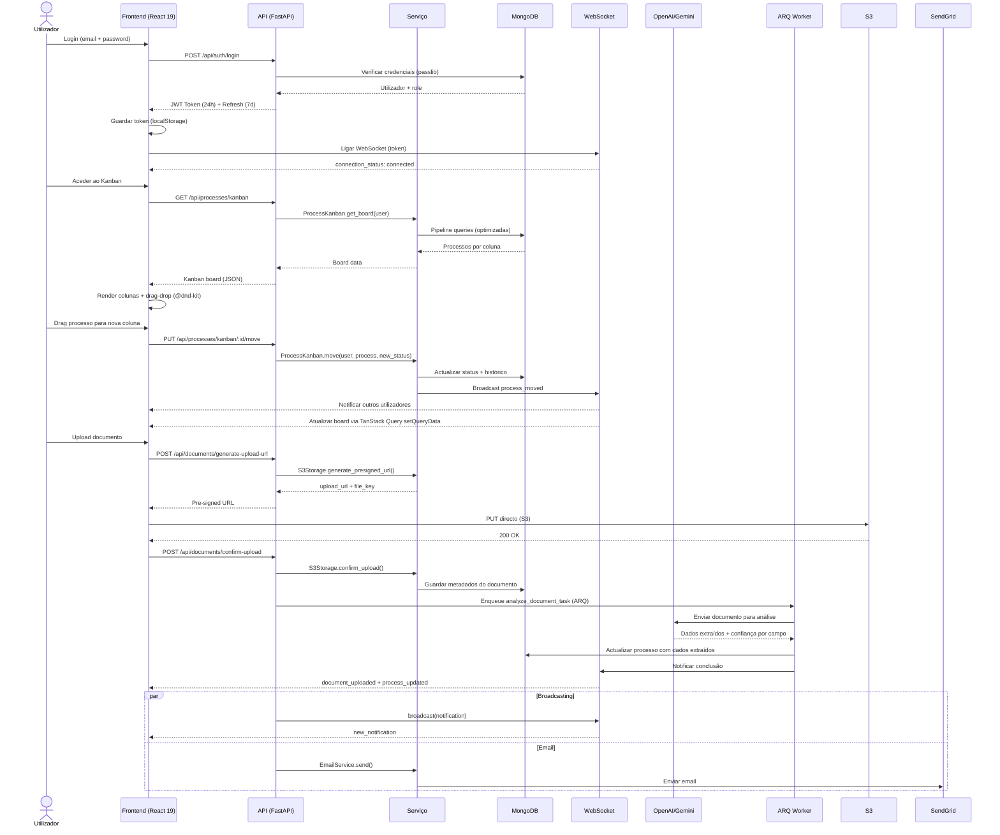

---

## Autenticação e Autorização

```mermaid
flowchart TD
    Login["POST /api/auth/login"]
    Login --> Validar["Validar credenciais<br/>(passlib bcrypt + MongoDB)"]
    Validar -->|Sucesso| GerarJWT["Gerar JWT<br/>(HS256, 24h)"]
    Validar -->|Falha| Erro401["401 Unauthorized"]
    GerarJWT --> RefreshToken["Gerar Refresh Token<br/>(7 dias, MongoDB)"]
    RefreshToken --> Response["Response: token + user"]

    subgraph Requests["Pedidos Autenticados"]
        Request["Request com Authorization header"]
        Request --> Extract["Middleware extrai user_id + role do JWT"]
        Extract --> RateCheck["Rate Limit<br/>(admin: 1000/min<br/>consultor: 200/min<br/>cliente: 100/min)"]
        RateCheck -->|Permitido| Route["Rota da API"]
        RateCheck -->|Excedido| RetryBackoff["429 → Retry com backoff<br/>(frontend: 3x, 2s→4s→8s)"]
        Route --> Sanitize["Input Sanitization"]
        Sanitize --> RoleCheck["Verificar role requerido"]
        RoleCheck -->|Autorizado| Exec["Executar handler"]
        RoleCheck -->|Não autorizado| Err403["403 Forbidden"]
    end

    subgraph Impersonate["Impersonate (Admin)"]
        ImpReq["POST /api/admin/impersonate/:id"]
        ImpReq --> GenToken["Gerar novo JWT<br/>com role do utilizador"]
        GenToken --> StoreOriginal["Guardar originalToken<br/>no localStorage"]
        StoreOriginal --> ImpAccess["Aceder como outro utilizador"]
        ImpAccess --> Stop["POST /api/admin/stop-impersonate"]
        Stop --> Restore["Restaurar token original"]
    end

    subgraph Refresh["Refresh Token Flow"]
        RefreshReq["POST /api/auth/refresh"]
        RefreshReq --> ValidateRT["Validar refresh token no MongoDB"]
        ValidateRT -->|Válido| NewTokens["Rotação single-use:<br/>novo JWT + refresh token<br/>(antigo revogado)"]
        ValidateRT -->|Inválido| ClearTokens["401 → Limpar tokens"]
    end
```

**Single-flight do refresh no frontend (fix Set 2026)**: o refresh token é
**single-use** (`rotate_refresh_token` revoga o token antigo). O frontend
tem três mecanismos que podem disparar um refresh — o timer preventivo do
`AuthContext` (2 min antes de expirar), o interceptor Axios (reativo a 401)
e o fetch-guard (`sessionExpiry.js`). Todos convergem **numa única promessa
partilhada** — `getRefreshedToken()` exportada por `services/api.js` —
garantindo um único pedido de refresh por token. Antes do fix, o timer do
`AuthContext` fazia um fetch próprio: dois refreshes concorrentes (timer +
interceptor reativo a um 401 de polling em background) rodavam o mesmo
token, o segundo recebia 401 e disparava `forceSessionExpired()` — logout
inesperado ("Sessão Expirada") com a sessão ainda válida, e 401 visíveis na
consola durante a navegação.

---

## Modelos de Dados Principais

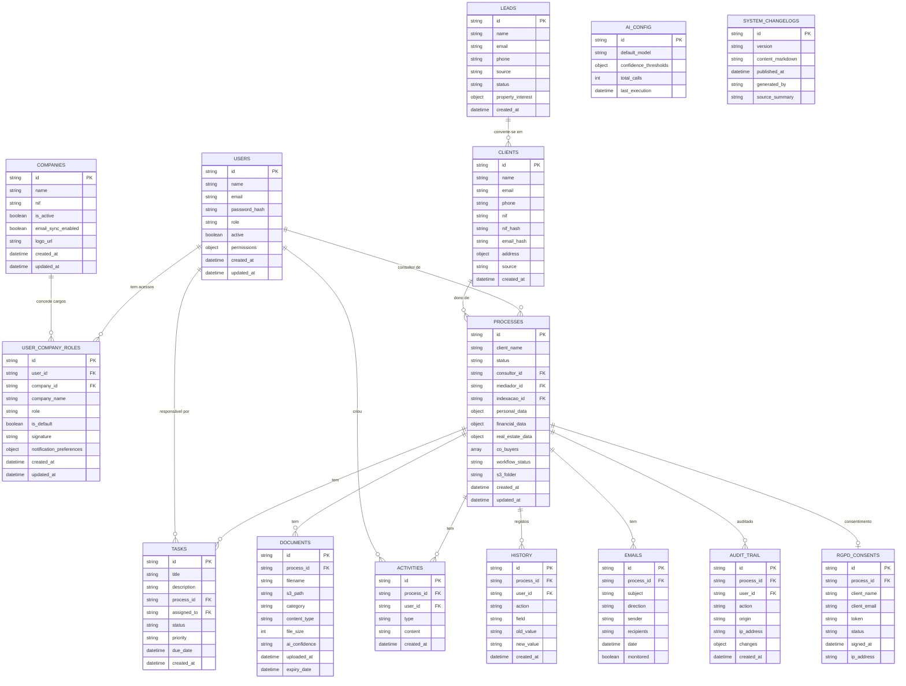

---

## Refatoração Fase 1: Separação Cliente ↔ Processo

### Princípio

A entidade **Cliente** representa a pessoa/fiscal entity — dados que são intrínsecos à pessoa e não mudam entre processos (nome, NIF, email, telefone, estado civil, etc.).

A entidade **Processo** representa o negócio/dossier — dados específicos de cada operação de crédito ou intermediação (valores, banco atribuído, dados financeiros, imobiliários, etc.).

### Diagrama da Nova Arquitetura

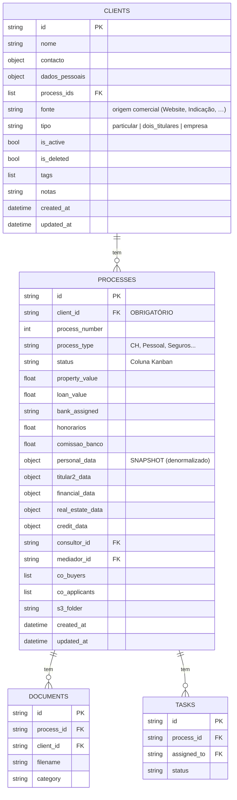

### O que mudou

| Antes (misturado) | Depois (separado) |
|---|---|
| Cliente tinha `dados_financeiros` | ❌ Removido — financeiros pertencem ao Processo |
| Cliente tinha `co_buyers`, `co_applicants` | ❌ Removido — pertencem ao Processo |
| Processo tinha `client_id` opcional | ✅ `client_id` agora é **OBRIGATÓRIO** |
| Processo sem campos de negócio raiz | ✅ Adicionados: `property_value`, `loan_value`, `bank_assigned`, `honorarios`, `comissao_banco` |
| `ClientFinancialData` existia | ❌ Removido — financeiros estão em `Process.financial_data` |
| `personal_data` no Processo era fonte de verdade | ⚠️ Agora é SNAPSHOT (denormalizado) — fonte de verdade é `clients.dados_pessoais` |

### Sincronização Bidirecional (Pacote P)

Para garantir a integridade do SNAPSHOT denormalizado, o sistema implementa sincronização bidirecional:

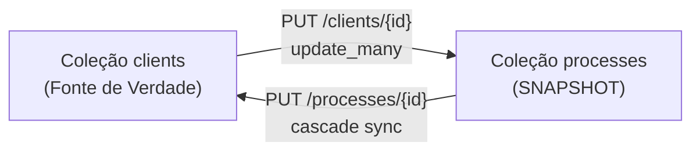

**Cliente → Processos (PUT /clients/{id})**: Quando o cliente é editado, o endpoint propaga automaticamente:
- `nome` → `client_name`, `personal_data.nome`, `personal_data.name` (update_many em todos os process_ids)
- `contacto.email/telefone` → `client_email/client_phone` + `personal_data.*`
- `dados_pessoais.*` → `personal_data.*` correspondente (NIF, morada, estado civil, etc.)
- Blind indexes (`nif_hash`, `email_hash`) são regenerados quando necessário

**Processo → Cliente → Restantes Processos (PUT /processes/{id})**: Quando o nome é editado dentro do processo:
1. `extract_client_updates_from_body()` extrai campos pessoais do body
2. Atualiza o documento do cliente na coleção `clients`
3. **Cascade sync**: Propaga o novo nome para todos os restantes processos do mesmo cliente

### Script de Migração

O script `backend/scripts/migrate_clients_to_processes.py` executa a migração segura:

1. **Backup** automático das coleções originais (`clients_legacy`, `processes_legacy`)
2. **Deduplicação** de clientes por NIF/Email/Nome
3. **Extração** de dados pessoais dos processos → criar/encontrar Clientes
4. **client_id** obrigatório adicionado a todos os processos
5. **Campos de negócio** extraídos para o nível raiz do processo
6. **Validação** de integridade pós-migração
7. **Rollback** disponível com `--rollback`

### Fases Futuras

| Fase | Descrição | Estado |
|------|-----------|--------|
| **Fase 1** | Modelos + Migração | ✅ Concluída |
| **Fase 2a — Listagens** | Filtros de listagem separados (Cliente vs Processo) + `assigned_user_ids` AND/OR | ✅ Pacotes FK/FL |
| **Fase 2** | Remover campos deprecados nas rotas de escrita / snapshots | 🔜 Pendente |
| **Fase 3** | Remover `personal_data` do Processo (apenas referência) | 🔜 Pendente |

---

## Componentes e Tecnologias

| Camada | Tecnologia | Finalidade |
|--------|-----------|------------|
| **Frontend** | React 19 + Vite 6 | SPA com code splitting e lazy loading |
| **Estado Cliente** | Zustand | Estado local leve |
| **Estado Servidor** | TanStack Query v5 | Cache, mutations, optimistic updates. Factory `queryKeys` em `frontend/src/lib/queryClient.js` |
| **UI** | shadcn/ui (New York) + Tailwind CSS 4 | Componentes e estilização |
| **Drag-Drop** | @dnd-kit/core | Kanban board interativo |
| **Backend** | FastAPI (Python 3.12) | API REST async com Pydantic |
| **Base de Dados** | MongoDB Atlas | Persistência de dados (Motor async) |
| **Cache** | Upstash Redis | Cache de sessões e fila de tarefas |
| **Armazenamento** | AWS S3 | Ficheiros com pre-signed URLs |
| **Filas** | ARQ (Redis-based) | Tarefas em background (análise IA) |
| **WebSocket** | FastAPI WebSocket | Notificações em tempo real |
| **IA** | OpenAI GPT-4o + Gemini Flash | Análise de documentos e extração |
| **Email** | SendGrid / Resend | Email transacional e rascunhos automáticos |
| **Observabilidade** | Sentry | Monitoring de erros e performance |
| **CI/CD** | GitHub Actions | Pipeline de testes e deploy |
| **Hosting FE** | Vercel | CDN + SPA rewrites |
| **Hosting BE** | Render | Docker container + auto-deploy |

---

## Padrões de Design Utilizados

| Padrão | Onde é aplicado |
|--------|----------------|
| **Singleton** | `DatabaseProxy` (MongoDB), `WebSocketManager`, `useWebSocket` (frontend) |
| **Circuit Breaker** | `TasksContext` — polling de tarefas com falhas consecutivas |
| **Reference Counting** | `useWebSocket` — uma ligação partilhada entre componentes |
| **Exponential Backoff** | `useWebSocket` (1s→30s), API interceptor 429 retry (2s→4s→8s), Notifications polling (30s→5min) |
| **Retry with Jitter** | API interceptor — 3 retries com jitter ±500ms para evitar thundering herd |
| **Lazy Loading** | 50+ páginas com `React.lazy()` + `Suspense` |
| **Chunk Error Recovery** | `LazyChunkErrorBoundary` — deteta stale deployments e faz reload automático |
| **Proxy (Lazy)** | `DatabaseProxy`, `ClientProxy` — ligação on-demand |
| **Repository** | `services/*` — abstracção sobre acesso à base de dados |
| **Middleware Chain** | CORS → Rate Limiting → Security Headers → Input Sanitization → Route Handler |
| **Observer (Pub/Sub)** | WebSocket events — `broadcast()` para notificações em tempo real |
| **Change Data Capture** | `AuditCDC` — monitoriza alterações via MongoDB Change Stream |
| **Strategy** | `AI_CONFIG_DEFAULTS` — seleção de modelo IA por tipo de tarefa |
| **Pre-signed URL** | `S3Storage` — upload directo do frontend para S3 sem passar pelo backend |
| **Blind Indexing** | `EncryptionService` — HMAC-SHA256 para pesquisa em campos encriptados |
| **Dedicated Collection** | `history`, `audit_trail` — colecções separadas para evitar 16MB limit |
| **Confidence Scoring** | `AIDocumentService` — score 0.0-1.0 por campo extraído, alertas para < 0.8 |
| **Fail-Safe Swap** | `restore_dev_from_backup.py` — BD de Dev não é modificada se o backup estiver corrompido |
| **Temporary Collection** | `_restore_temp_*` — coleções temporárias para migração atómica de dados |
| **RGPD Sanitization Pipeline** | `sync_prod_to_dev.py`, `restore_dev_from_backup.py` — anonimização determinística de PII (nome, NIF, email, telefone, IBAN) |
| **Factory (Storage)** | `storage_service.py` — `get_storage_adapter()` retorna adapter correto (Local, S3, OneDrive) baseado em `system_settings.storage.provider` |
| **Strategy (Email)** | `send_email(force_system=True)` — tenta contas nomeadas, depois SystemSMTP (Bloco A), depois erro |
| **Fallback Chain (Webmail)** | `sync_shared_role_emails()` — tenta `shared_role_email_configs`, depois `system_webmail` (Bloco C), depois erro |
| **Provider-Agnostic** | Storage, Email, Webmail configuráveis via Admin Settings sem alteração de código |
| **Thin Route + Service** | `routes/documents.py` / `routes/processes.py` — stubs FastAPI; lógica em `services/document_*.py` e `services/process_*.py` (ver `AGENTS.md`) |
| **Safe Partial Update** | `sanitizeProcessUpdatePayload` (frontend) — omite arrays vazios / `documents` / `onedrive_links` no PUT processo |
| **Sticky Toast** | `TasksContext` — `toast.loading` com `duration: Infinity` e id estável; sem auto-dismiss na navegação |
| **Passive Cache Invalidation** | Webmail — WS `new_email` → `invalidateQueries(['emails'])` com `staleTime: 60s`; refetch silencioso sem skeleton |
| **Last-Access Guard** | UCR — `run_delete_user_company_role` recusa HTTP 400 se for o único acesso do utilizador |
| **Portal Checklist Fulfill** | `document_portal_fulfill` — upload staff CRM satisfaz REQUESTED do portal |
| **MongoDB `$set` Partial Write** | Todas as escritas em `services/*.py` usam `update_one({...}, {"$set": {...}})` — nunca substituem o documento inteiro. Preserva campos não incluídos no payload (ex: `document_metadata.ai_analyzed`, mapeamentos S3, timestamps de outros subsistemas) |

### Regra: escrita em MongoDB com `$set`

Todo o código em `backend/services/*.py` que atualiza um documento existente **deve** usar `update_one`/`update_many` com o operador `$set` sobre os campos alterados, nunca `replace_one` ou um `update_one` sem `$set` (que substitui o documento inteiro e apaga silenciosamente metadados não incluídos no payload).

```python
# ✅ Correto — só os campos passados são escritos, o resto do documento sobrevive
await db.documents.update_one({"id": document_id}, {"$set": {"category": nova_categoria}})

# ❌ Errado — substitui o documento inteiro, perde document_metadata.ai_analyzed,
#    mapeamentos S3, e qualquer campo não incluído no payload
await db.documents.update_one({"id": document_id}, {"category": nova_categoria})
```

Isto é particularmente crítico em coleções com metadados gerados por subsistemas diferentes ao longo do tempo (`documents.document_metadata`, `processes.s3_folder` / mapeamentos S3, `clients.dados_pessoais`) — uma escrita parcial mal feita apaga silenciosamente trabalho de outro fluxo (ex: uma categorização manual apagar o flag `ai_analyzed`, ou um `PUT /processes/{id}` apagar o `s3_folder` calculado pelo `admin_s3_process_mappings`).

### Proteção de mapeamentos S3

Os mapeamentos S3 (`admin_s3_client_mappings.py`, `admin_s3_process_mappings.py`, `admin_s3_user_mappings.py`) são tratados como dados sensíveis a preservar:

- Nunca reescrever `services/admin_storage.py` — o nome colide com a rota `routes/admin_storage.py` (ver `AGENTS.md`); os serviços vivem em `services/admin_s3_*.py`.
- Endpoints de atualização de mapeamentos usam `$set` sobre os campos específicos (`s3_folder`, `client_folder_id`, etc.), nunca substituem o documento do processo/cliente.
- Aliases legados (`client-s3-mappings`) mantêm-se como stubs de compatibilidade — não remover sem migração explícita.

Ver `AGENTS.md` (secção "Route thinning") para o mapa completo `routes/* ↔ services/*` e as colisões de nomes a evitar.

---

## Estratégia de Resiliência

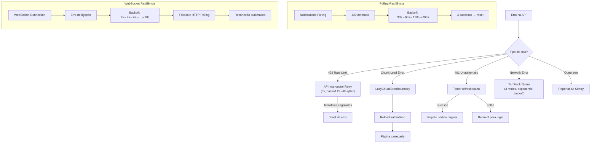

---

## Fluxo de Restauro Seguro (Dev ← S3 Backup)

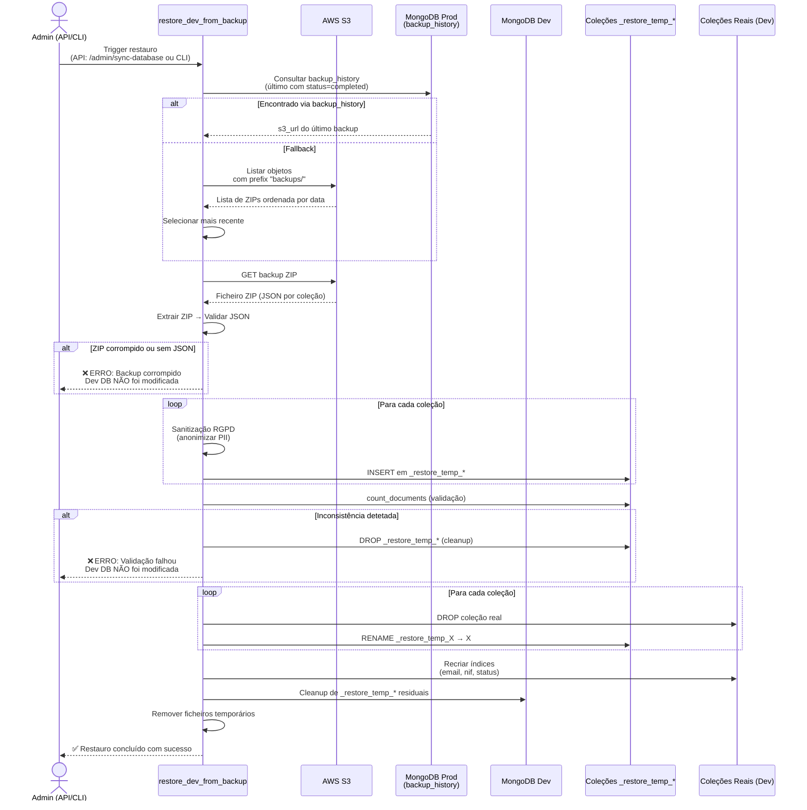

**Propriedades de segurança do pipeline:**

| Propriedade | Descrição |
|-------------|-----------|
| **Fail-Safe** | A BD de Dev **nunca** é modificada se qualquer passo falhar |
| **Não toca em Prod** | Não acede ao MongoDB de Produção diretamente (apenas S3) |
| **Atomicidade** | Swap por rename garante consistência |
| **Rastreabilidade** | Cada documento recebe `_sanitized_at` e `_sanitized_source` |
| **Cleanup automático** | Coleções temporárias são removidas em caso de sucesso ou erro |

---

## Navegação e Controlo de Acessos (RBAC)

### Separação das áreas de Administração (v2.0)

A Administração deixou de ser um único hub. Existem **duas superfícies distintas**, ambas restritas aos perfis activos `admin` e `ceo` (`canAccessOrgAdmin` / `ADMIN_PANEL_ROLES`):

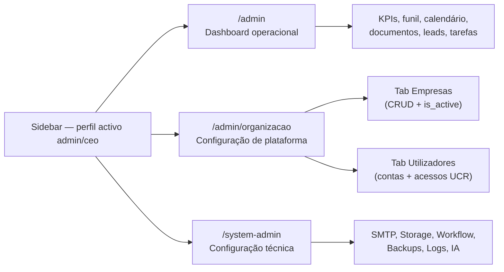

| Rota | Superfície | Quem acede | Conteúdo |
|------|------------|------------|----------|
| **`/admin`** | Dashboard **operacional** | admin, ceo | KPIs, funil de conversão, calendário, documentos a expirar, pesquisa, tarefas, leads — o dia-a-dia da operação |
| **`/admin/organizacao`** | Área de **configuração de plataforma** | **apenas** perfil activo `admin` ou `ceo` | Tab **Empresas** + tab **Utilizadores** (contas, cargos UCR, Parceiro/Indexação). Substitui `/utilizadores` (redirect) |
| **`/system-admin`** | Painel técnico / sistema | admin, ceo (tabs técnicas só admin) | Configurações, automações, permissões, backups, logs, IA, RGPD |

O gate usa o **perfil activo** (`effectiveRole` / `X-Active-Role`), não só o `user.role` do JWT: um CEO que muda o ContextSwitcher para Consultor deixa de ver Administração.

**Dashboard operacional (`/admin`) — tabs de negócio:**

| Tab | Visível para | Descrição |
|-----|-------------|-----------|
| Visão Geral | admin, CEO | Quadro Kanban de processos com filtros |
| Calendário | admin, CEO | Prazos e eventos do pipeline |
| Documentos | admin, CEO | Documentos com validades próximas |
| Análise IA | admin, CEO | Análise inteligente de documentos |
| Pesquisar | admin, CEO | Pesquisa global de clientes |
| Tarefas | admin, CEO | Gestão de tarefas assíncronas |
| Leads | admin, CEO | Pipeline de leads |

**Área de configuração de plataforma (`/admin/organizacao`):**

| Tab | Visível para | Descrição |
|-----|-------------|-----------|
| **Empresas** | admin, ceo | CRUD de empresas do grupo; `is_active` (soft-delete) em vez de eliminar o documento |
| **Utilizadores** | admin, ceo | Contas + acessos UCR (vários cargos por empresa, proteção do último acesso, cargos oficiais Parceiro e Indexação) |

**Painel técnico (`/system-admin`) — tabs de sistema:**

| Tab | Visível para | Descrição |
|-----|-------------|-----------|
| **Configurações** | admin, CEO | Configurações gerais do sistema (SystemConfigPage) |
| **Automações** | admin, CEO | Regras de automação "Se X, Então Y" |
| **Permissões** | admin, CEO | Capabilities por utilizador / role |
| **Segurança & Backups** | **apenas admin** | Backups da BD e verificação de integridade |
| **Logs & Diagnósticos** | **apenas admin** | Logs do sistema, importação IA e diagnósticos |

### Sidebar Principal por Role

| Role | Menu Visível | Observações |
|------|-------------|-------------|
| **indexação** | Listas de Trabalho (Registos, Processos, Doc. Pendentes) | SEM Dashboard, SEM Estatísticas, SEM Configuração |
| **consultor/mediador/intermediário** | Dashboard + O Meu Negócio + Visão Global + Comunicações | Acesso operacional standard |
| **diretor** | Dashboard + O Meu Negócio + Visão Global + Comunicações + Gestão e Operações | Vê Estatísticas e Rascunhos; sem Painel Admin |
| **administrativo** | Dashboard + O Meu Negócio + Visão Global + Comunicações + Gestão (com RGPD) | Vê RGPD; sem Painel Admin |
| **CEO** | Dashboard + O Meu Negócio + Visão Global + Comunicações + Gestão + ⚙️ Administração (`/admin/organizacao`) + Painel operacional (`/admin`) | Acesso total ao negócio; tabs técnicas de `/system-admin` escondidas |
| **admin** | Dashboard + O Meu Negócio + Visão Global + Comunicações + Gestão + ⚙️ Administração (`/admin/organizacao`) + Painel operacional (`/admin`) | Acesso total incluindo tabs técnicas |

### Rotas Obsoletas na Sidebar

As rotas `/rgpd-admin` e `/templates` foram removidas da navegação principal da Sidebar. As páginas continuam acessíveis via URLs diretas e através do Painel de Administração (Tabs de Configurações e Utilizadores).

`/utilizadores` redirecciona para `/admin/organizacao?tab=utilizadores` (Pacote DY).

### Arquitetura de Páginas Embedded

As páginas integradas como Tabs no Painel de Administração suportam um modo `embedded` que omite o wrapper `<DashboardLayout>`, permitindo que o conteúdo seja renderizado dentro das Tabs sem duplicar a sidebar e o header.

Componentes com suporte `embedded`:
- `UsersAccessAdminTab` — Gestão de utilizadores e acessos UCR (`/admin/organizacao`); cache `queryKeys.orgAdmin`
- `CompaniesAdminTab` — Empresas (substitui a página removida `CompaniesManagementPage.jsx`)
- `UsersManagementPage` — Gestão de utilizadores (legado / atalho técnico)
- `SystemConfigPage` — Configurações do sistema
- `AutomationPage` — Automações de workflow
- `BackupsPage` — Backups da base de dados; toggle `auto_backup_enabled` (Pacote FL)
- `UnifiedLogsPage` — Logs unificados
- `DiagnosticsPage` — Diagnósticos do sistema
- `ProcessMigrationTab` — Migração Fase 1 (Separação Cliente ↔ Processo)

### Dashboard de Performance de Balcões e Bancos (Pacote S)

**Endpoint**: `GET /api/stats/branches`
**Rota Frontend**: `/performance-balcoes` (sidebar: Gestão e Operações)
**Acesso**: Staff com capability `STATS_VIEW`

Utiliza MongoDB Aggregation Pipeline na coleção `processes` para calcular métricas por balcão bancário:

| Métrica | Cálculo |
|---------|---------|
| `total_processes` | Total de processos associados ao balcão |
| `active_processes` | Processos em fases ativas do workflow |
| `approval_rate` (%) | Processos que atingiram `credito_aprovado` ou fase posterior / total |
| `avg_closing_time_days` | Tempo médio (created_at → updated_at) para processos concluídos/arquivados |
| `total_volume` (€) | Soma de `credit_data.requested_amount` |

**Top Cards**: Banco Mais Rápido, Balcão com Maior Volume, Taxa de Aprovação Global.
**Cache**: Redis com TTL de 1 hora. Pipeline com `allowDiskUse=True`.

### Fix "Ver como Cliente" sem E-mail + Apelido Interno (Pacote T)

#### Tarefa 1 — Impersonate com validação de e-mail

**Endpoint**: `GET /api/portal/impersonate/{process_id}`
**Alteração**: Quando o processo não tem e-mail associado (nem no processo nem no cliente ligado), o endpoint devolve agora **HTTP 400** com a mensagem amigável:

> "Para usar esta função, o cliente precisa de ter um e-mail configurado."

Anteriormente gerava o link na mesma, mas o Portal do Cliente poderia ter funcionalidades limitadas sem e-mail. O frontend (`ProcessDetails.js`) já exibe o `detail` do erro via `toast.error()`, pelo que a mensagem chega ao utilizador sem alterações no frontend.

#### Tarefa 2 — Campo "Apelido Interno / Título"

**Modelo**: `ProcessUpdate.apelido` (string, max 120 chars) e `ProcessResponse.apelido` — já existiam no `backend/models/process.py`.
**Frontend**: Componente `InlineApelido` em `ProcessDetails.js` — edição rápida no cabeçalho do processo com ícone de lápis, visível apenas para staff (não para clientes). Guarda via `PUT /api/processes/{id}` com `{ apelido: "valor" }`.

### Gestão de Empresas — Multi-Tenant (Pacote V)

**Novo backend CRUD** para a entidade "Empresa" (não existia anteriormente — as empresas eram derivadas implicitamente da coleção `system_config`).

**Coleção MongoDB**: `companies` | **Modelo**: `backend/models/company.py`

| Endpoint | Método | Descrição |
|----------|--------|-----------|
| `/admin/companies` | GET | Lista empresas (com `?search=` por nome/NIF) |
| `/admin/companies/available` | GET | Lista id+name para dropdowns |
| `/admin/companies/{id}` | GET | Detalhe de uma empresa |
| `/admin/companies` | POST | Criar empresa |
| `/admin/companies/{id}` | PUT | Atualizar empresa (cascade: renomeia `user.company` se o nome mudar) |
| `/admin/companies/{id}` | DELETE | Eliminar empresa (bloqueia se tem utilizadores associados) |
| `/admin/companies/{id}/logo` | POST | Upload de logótipo para S3 (max 2MB, PNG/JPEG/GIF/WebP/SVG) |

**Campos**: name, nif, address, phone, email, website, logo_url, email_sync_enabled, **`is_active`** (default `true`), total_users (computado).

**Soft-delete (`is_active`)**: o modelo `Company` passou a suportar `is_active`. A UI de Administração (`CompaniesAdminTab`) **não apaga** a empresa — o Switch Activa/Inactiva faz `PUT` com `is_active: false`. Empresas inactivas deixam de aparecer no Select de "Novo acesso" UCR (`companiesForNewAccess` filtra `is_active !== false`). O endpoint `DELETE /admin/companies/{id}` continua a existir para limpeza administrativa (bloqueia se há utilizadores cuja única empresa é esta).

**Frontend**: rota canónica **`/admin/organizacao`** (tab Empresas). Página `OrganizationAdminPage.jsx` + `CompaniesAdminTab.jsx`. A tab "Empresas" no SystemAdminPanel permanece como atalho técnico.

**Acesso**: perfil activo admin ou ceo (`canAccessOrgAdmin`).

---

## Gestão UCR (User-Company-Role) — v2.0

A plataforma deixa de ter **um único cargo por empresa**. A coleção `user_company_roles` é a fonte de verdade dos acessos: um utilizador pode ter **vários cargos na mesma empresa em simultâneo** (ex.: Diretor **e** Consultor na "Empresa A") e cargos diferentes em empresas diferentes.

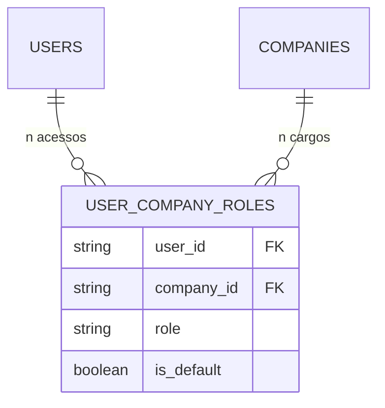

### Índice único composto

| Antes (v1) | Depois (v2.0) |
|---|---|
| Unique `{ user_id, company_id }` — um cargo por empresa | Unique `{ user_id, company_id, role }` — vários cargos por empresa |
| Select de "Novo acesso" excluía empresas já atribuídas | Select lista **todas** as empresas activas; só bloqueia a combinação exacta Empresa+Cargo (`isUcrComboTaken`) |

Modelo: `backend/models/user_company_role.py` (`CompanyRoleEnum`). Serviço: `services/user_company_roles_api_crud.py`. Helper de UI: `frontend/src/utils/organizationAdmin.js`.

### Cargos oficiais

`CompanyRoleEnum` / `UCR_ASSIGNABLE_ROLES` incluem os cargos oficiais de sistema:

| Cargo | Notas |
|-------|-------|
| `admin` | Administrador do sistema |
| `ceo` | CEO |
| `diretor` | Diretor(a) |
| `administrativo` | Apoio Administrativo |
| `consultor` | Consultor(a) |
| `intermediario` | Intermediário(a) de Crédito |
| **`indexacao`** | Indexação de Dados — cargo oficial (não é um "extra") |
| **`parceiro`** | Parceiro — utilizador fantasma (sem login operacional típico; visível na gestão de acessos) |

O perfil legado `mediador` continua mapeado para `intermediario` (`normalizeRole`).

### Proteção contra a eliminação do último acesso

Remover um UCR **não** pode deixar o utilizador sem nenhum acesso:

```python
# services/user_company_roles_api_crud.py — run_delete_user_company_role
LAST_UCR_DELETE_DETAIL = (
    "Não é possível remover o único acesso deste utilizador. "
    "Um utilizador tem de ter pelo menos um acesso UCR."
)
# HTTP 400 se count_documents({user_id}) <= 1
```

A UI (`UsersAccessAdminTab` / `LAST_UCR_DELETE_MESSAGE`) mostra a mesma mensagem. Para revogar o acesso total, desactivar a conta (`users.is_active = false`) em vez de apagar o último UCR.

### Empresa activa vs. inactiva

Novos acessos UCR só podem ser criados contra empresas com `is_active !== false`. Uma empresa inactivada deixa de ser oferecida no formulário de novo acesso, mas os UCRs já existentes **não** são apagados automaticamente (soft-delete da empresa, não cascade).

### Filtro estrito de UCRs válidos (Pacote 8 — perfis fantasma)

Todas as queries que alimentam perfis de utilizador filtram estritamente UCRs marcados como apagados ou inactivos: `{"is_deleted": {"$ne": True}, "is_active": {"$ne": False}}` (docs legados sem as flags continuam válidos — `$ne` aceita campo ausente). Aplicado em:

| Onde | Efeito |
|---|---|
| `services/auth.py::get_user_companies` | `/auth/login` e `/auth/me` (`user.companies`) — a fonte do `ContextSwitcher` e das tabs da Área Pessoal. **O frontend só recebe perfis válidos.** |
| `services/user_company_roles_api_crud.py::run_list_user_company_roles` | Lista admin (`/admin/user-company-roles`) — a gestão de acessos só vê perfis válidos. |
| `services/user_company_roles_api_active.py::run_set_active_company` | Recusa (403) activar um UCR apagado/inactivo. |
| `services/user_company_roles_api_crud.py::run_delete_user_company_role` | A protecção do último acesso conta apenas UCRs válidos. |

No frontend, `utils/userProfiles.js::buildUserProfileItems` devolve **exclusivamente** os UCRs reais quando existem — nunca mescla `additional_roles`/role primário (perfis sintéticos = fantasmas no menu). O fallback legado (role primário + `additional_roles`) só se aplica a utilizadores sem qualquer UCR. Testes: `tests/unit/test_pacote8_ux_business_fixes.py`, `frontend/src/utils/userProfiles.test.js`.

### Resolução de cargo e empresa activos (Pacote FN)

Alguns UCRs legados guardam o **nome** da empresa (`Precision Crédito`) em `company_id` / `company` em vez do id canónico. Um match estrito por id falhava: o backend fazia fallback silencioso para o cargo JWT e `GET /processes/me` devolvia lista vazia (o utilizador via o ContextSwitcher certo, mas a API filtrava outro contexto).

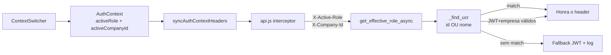

Regras:

1. **Frontend envia id canónico.** `resolveCompanyIdFromUser` aceita um hint que seja id **ou** nome e devolve o `company_id` do UCR. `AuthContext` persiste esse id em `sessionStorage.activeCompanyId` — **nunca** `user.company` (display name).
2. **Backend aceita id ou nome.** `_find_ucr` / `_company_match_or` comparam `company_id`, `company_name` e `company` (exacto + regex case-insensitive).
3. **Header honrado se o JWT já tem o cargo** e o utilizador pertence à empresa (por id ou nome), mesmo sem linha UCR `{user_id, role, company_id}` exacta. Evita esvaziar `/processes/me` após fallback.
4. **Sentinel `all`**: só o ContextSwitcher (vista multi-cargo) pode pôr `X-Active-Role: all` → `__all_roles__` para filtragem. `ProcessesPage` **não** escreve `"all"` no `sessionStorage` — esse valor não é um UCR e desincronizava todos os pedidos seguintes.
5. **Sentinel `default`**: aceite sem validação UCR quando o utilizador não tem empresas (gravação de assinatura, etc.).

Código: `services/auth.py` (`_find_ucr`, `get_effective_role_async`, `get_active_company_id_async`); `frontend/src/utils/userProfiles.js`; `AuthContext.js`; `services/api.js`.

---

## Segurança

- **CORS Fail-Secure**: A aplicação arranca apenas com origens explicitamente configuradas (sem wildcards)
- **JWT com Validação Robusta**: Secret validado para entropia mínima, tokens com 24h de validade
- **Refresh Tokens**: Tokens de refresh de 7 dias, revogáveis via MongoDB
- **Rate Limiting por Role**: Limites diferenciados (admin: 1000, consultor: 200, cliente: 100 req/min)
- **Security Headers**: HSTS, CSP, X-Frame-Options, X-Content-Type-Options, Referrer-Policy em todas as respostas
- **Encriptação de Campos**: Campos sensíveis (NIF, rendimentos) encriptados com Fernet (AES-128-CBC)
- **Blind Indexing**: Hashes HMAC-SHA256 para pesquisa em campos encriptados
- **Input Sanitization**: Todas as rotas da API sanitizam inputs (strings, emails, nomes)
- **MIME Validation**: Validação por magic bytes para uploads de documentos
- **DOMPurify**: Sanitização XSS no frontend para rich text
- **Password Strength**: Validação com passlib bcrypt
- **Impersonate Control**: Admin pode visualizar como outro utilizador, com restauro automático
- **OpenAI PII Opt-out**: Configuração de opt-out de treino de dados na conta OpenAI
- **Prompt Injection Protection**: Mitigação de prompt injection em análise de PDFs
- **SPA Rewrite Security**: Vercel rewrites excluem `/assets/` para evitar MIME type attacks

---

## Arquitetura de Webmail e Email

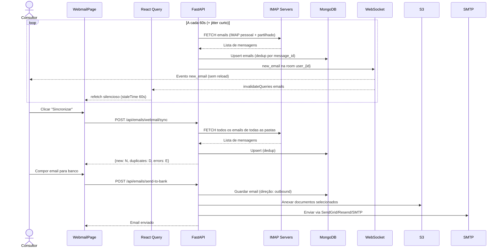

### Cadeia de Resolução de Credenciais de Envio (fix Set 2026)

**Regra canónica**: os serviços de envio de email do sistema leem as
credenciais **exactamente do mesmo local onde a UI de administração grava**.
A UI canónica de envio é `/contas-email` — cartão "Email do Sistema
(Transacional)" (Bloco A), que persiste em **`SystemConfig.system_smtp`**
(`PATCH /api/system-config/system_smtp`; Resend API recomendado ou SMTP
legado).

Ordem de resolução de `send_email(force_system=True)` (emails
transacionais: magic links, boas-vindas, notificações, RGPD):

```text
1. SystemConfig.system_smtp (Bloco A — /contas-email)   ← prioridade
   ├─ resend_api_key  → envio via Resend HTTP API (porta 443)
   └─ smtp_host+username → SMTP directo legado
2. system_email_configs por purpose (get_system_transporter)  — fallback
   (UI separada "System Emails" — mantida para purposes dedicados)
3. Contas globais de ambiente (POWER_EMAIL / PRECISION_EMAIL)  — legado
```

Antes do fix, a ordem era 2 → 3 → 1: o admin configurava as credenciais
no `/contas-email` e o fluxo tentava enviar com a config de outra UI ou
com env vars legadas; quando nada existia, o `POST /processes/{id}/generate-magic-link/send`
rebentava com **500** ("Conta de sistema 'power' não configurada. System
SMTP (Bloco A) também não configurado.").

**Gestão de erros**: quando nada está configurado, `send_email` devolve
`{"success": False, "error_code": "SMTP_NOT_CONFIGURED", ...}` (não
levanta excepção). `portal_magic_link.send_magic_link_to_client` mapeia
esse código para **HTTP 400** com detalhe "SMTP não está configurado.
Configure o Email do Sistema (Bloco A) em Contas de Email..." — erro
tratado no frontend, em vez de 500. Falhas de envio reais
(credenciais/rede) continuam a ser 500 com a razão real. `ValueError`
(ex: purpose inválido no transporter) também é 400.

Helper de leitura canónica do Bloco A:
`services/email_service.py::_resolve_system_smtp_account()` — devolve
`EmailAccount(name="system_smtp", ...)` ou `None` (para o caller continuar
nos fallbacks). Testes: `tests/unit/test_email_config_lookup_mismatch.py`.

### Webmail Unificado e Desacoplamento Login↔IMAP (Pacote 8)

O Webmail deixou de estar preso ao perfil/empresa activa no cabeçalho do CRM e o motor passou a consultar a caixa pela conta **configurada**, não pelo email de login.

**Vista consolidada de caixas** — `GET /api/users/me/email-accounts?scope=all`
(`services/users_api_email_config.py::run_list_my_email_accounts`):

- todas as configs `user_email_configs` do utilizador (todas as empresas), cada uma com `company_id`/`company_name`;
- a **Caixa Geral de CADA empresa** em que o utilizador tem um UCR válido com cargo de gestão (`CAIXA_GERAL_INJECT_ROLES`: admin/ceo/diretor) — não apenas a da empresa activa;
- `has_shared_indexacao`: True quando algum UCR válido tem o cargo `indexacao` — a Caixa de Indexação fica visível no seletor sem trocar de perfil.

Sem `scope` (ou `scope=active`) o comportamento anterior mantém-se (contas da empresa activa) — retrocompatível. O `WebmailPage` carrega sempre com `scope=all`; o seletor (`utils/webmailMailbox.js::buildMailboxOptions`) lista as caixas com o sufixo da empresa (`Caixa Pessoal (geral@x.pt · Empresa B)`) e o valor `personal:<email>` flui para o param `mailbox` dos endpoints.

**Permissões de caixa por UCR (não só pelo perfil activo)** — `services/email_webmail.py`: `run_webmail_list`/`run_webmail_stats` permitem `box=general` quando o cargo activo permite (regra legada) **OU** qualquer UCR válido tem cargo admin/ceo/diretor; `box=shared_indexacao` idem com indexacao/admin (`_user_ucr_roles`). A comparação "mailbox == Caixa Geral" (`rewrite_box_for_caixa_geral` / `resolve_ucr_mailbox_filter`) considera TODAS as caixas gerais do utilizador (`_user_caixa_geral_emails`). O sync (`run_webmail_sync_user`) resolve a config da mailbox em TODAS as empresas (não só a activa) e permite sincronizar a Caixa Geral com cargo de gestão em qualquer UCR.

**Desacoplamento email de login ↔ email configurado** — o utilizador faz login com `user@x.pt` mas gere `geral@x.pt` (UserEmailConfig da área pessoal). Os filtros de conversa (from/to) do Webmail, a leitura do detalhe (`run_get_email`) e o download de anexos (`_assert_email_readable`) avaliam a conversa contra as contas configuradas (`services/user_email_config_service.py::get_user_mailbox_addresses` — todas as empresas, `is_configured=True`); o email de login (``users.email``) é apenas **fallback legado** quando não existem configs. A propriedade continua garantida por `synced_for_user`/`created_by` (carimbo do sync — ver "Motor Real-Time").

**UX de separadores** — os anexos abrem **sempre num novo separador** (`window.open` síncrono no gesto de clique + navegação para o blob URL após o fetch — imune a popup blockers, com fallback para download); o painel de leitura tem o botão "Novo Separador" que abre `/webmail?folder=<pasta>&mailbox=<caixa>&id=<email>` — a página honra `?mailbox=` para seleccionar a caixa certa e `?id=` para abrir o email no painel de leitura (`?folder=drafts` continua a abrir o compositor, Pacote DM).

Testes: `tests/unit/test_pacote8_ux_business_fixes.py` (22 testes — filtros UCR, scope=all, permissões por UCR, desacoplamento) e `frontend/src/utils/webmailMailbox.test.js` + `userProfiles.test.js`.

### Motor Real-Time do Webmail (v2.0 — Pacote EC)

O sync IMAP **já não corre no ARQ Worker a cada 15 minutos**. O `ConnectionManager` WebSocket vive **em memória no processo da API** (`uvicorn`); um worker separado não consegue emitir eventos para os clientes ligados. Por isso o loop de auto-sync passou a correr **no próprio processo da API**.

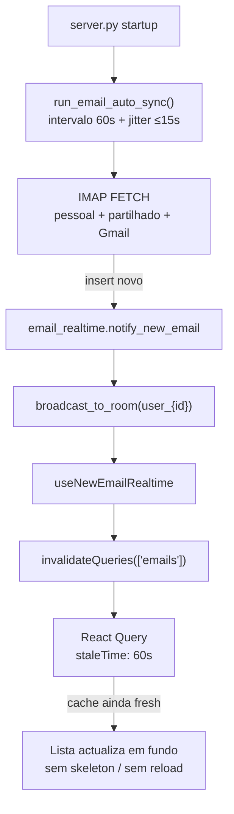

| Peça | Onde | Comportamento |
|------|------|----------------|
| Loop IMAP | `scheduled_tasks.run_email_auto_sync` no processo FastAPI | Default **60s** (`EMAIL_AUTO_SYNC_INTERVAL_SECONDS`, clamp 30–300). Sleep **depois** do sync + jitter curto |
| Evento | `services/email_realtime.py` | `new_email` (`WSEventType.NEW_EMAIL`) para a room `user_{id}` (e rooms de mailbox global / role partilhado) |
| Join da room | WebSocket connect | `join_user_email_room(user_id)` para o broadcast chegar ao cliente |
| Frontend | `useNewEmailRealtime` + `useWebmailEmails` | Listener WS → `invalidateQueries({ queryKey: queryKeys.emails.all })`. `staleTime: 60s` + `keepPreviousData` — a lista **não** mostra skeleton no refetch |
| Kill switch | `ENVIRONMENT=production` **ou** `EMAIL_SYNC_ENABLED=true` | Em DEV o loop não arranca (evita OOM no Render free) |
| Sync manual | Botão "Sincronizar" | Continua a existir (`POST /api/emails/webmail/sync`) para FETCH imediato de todas as pastas |

O resultado: a caixa de correio **sincroniza em tempo real** sem interrupções de UI — o utilizador continua a ler/compor enquanto a cache é invalidada em background.

**Contas de email suportadas:**

| Conta | Variáveis de Configuração | Servidor IMAP |
|-------|--------------------------|---------------|
| Precision Crédito | `PRECISION_EMAIL`, `PRECISION_PASSWORD`, `PRECISION_IMAP_SERVER/PORT` | `mail.precisioncredito.pt:993` |
| Power Real Estate | `POWER_EMAIL`, `POWER_PASSWORD`, `POWER_IMAP_SERVER/PORT` | `webmail2.hcpro.pt:993` |

**Email Transacional do Sistema (Bloco A):**

Quando `send_email(force_system=True)` é chamado (ex: alertas de sistema):

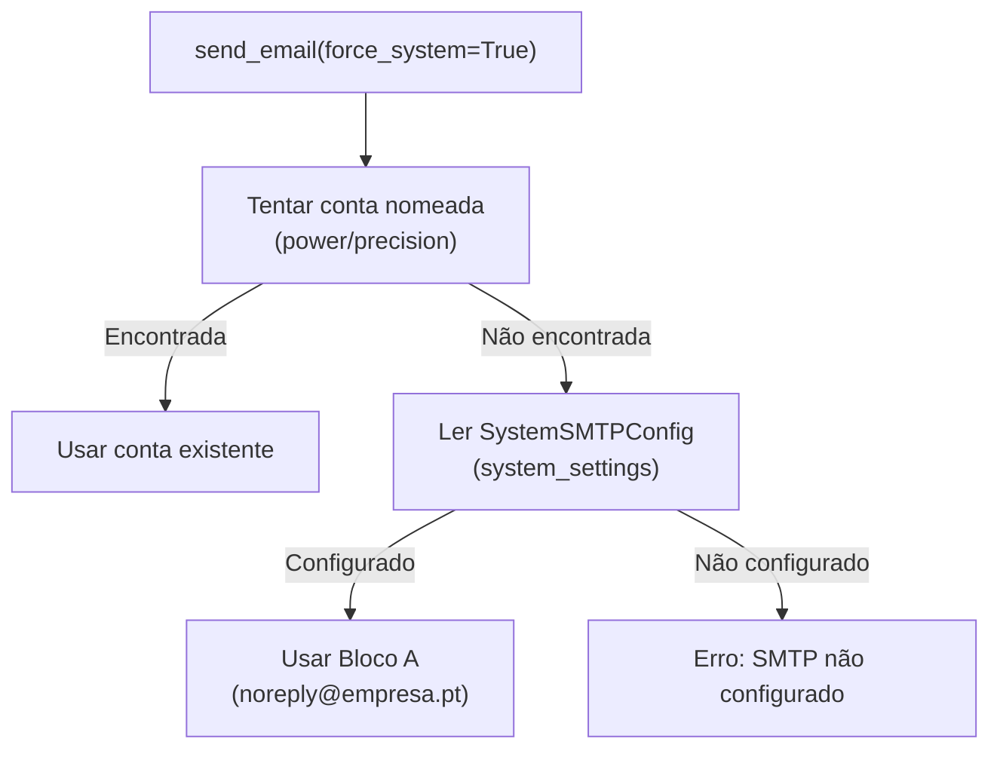

O envio de documentação para balcões **não** usa `force_system` + `DOCUMENTS`: resolve primeiro o SMTP do perfil UCR activo (password desencriptada) e cai na Caixa Geral.

**Webmail Partilhado por Role (Bloco C):**

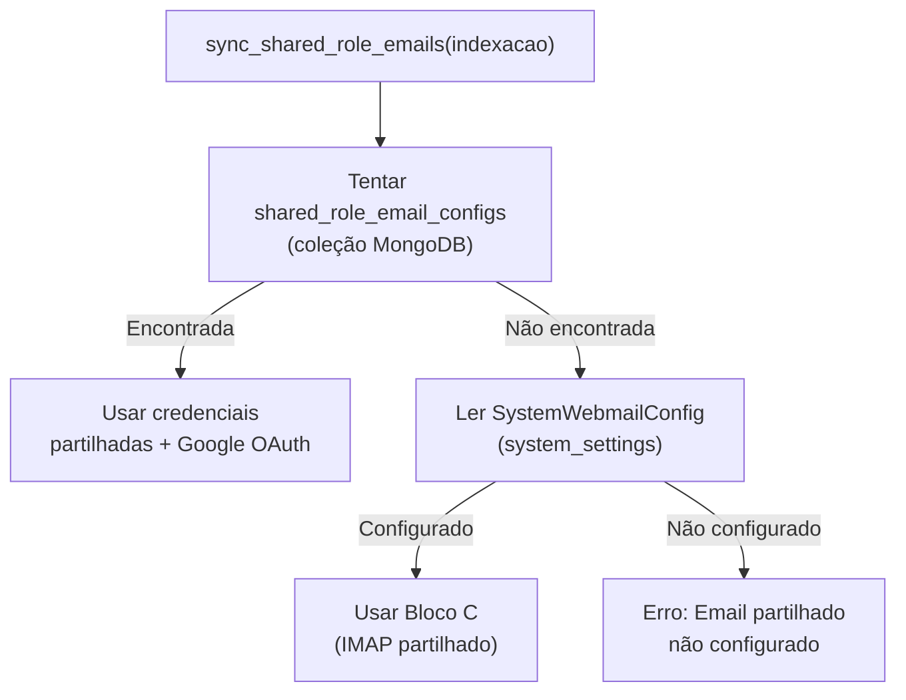

**Isolamento por perfil activo (Pacote DN.1+2):**

O Webmail respeita o UCR escolhido no Header (`ContextSwitcher`):

1. O frontend envia `X-Company-Id` e `X-Active-Role` em **todos** os `fetch` do Webmail (não só via interceptor Axios).
2. Listagem (`GET /api/emails/webmail`) e stats filtram pela mailbox da UCR activa: `company_id` **ou** `account` = endereço IMAP dessa config. Emails globais / de outros perfis do mesmo user **não** entram.
3. Sync pessoal (`POST /api/emails/webmail/sync-user`) resolve `user_email_configs` com a empresa activa (e `account_id` / `mailbox` se o utilizador escolheu uma conta) e grava `company_id` em cada email sincronizado.
4. Anexos: `GET /api/webmail/attachments/{id}` (auth JWT) devolve `StreamingResponse` com `Content-Disposition: attachment`. Fonte: S3 (`s3_key`) → conteúdo na BD → IMAP on-demand. 404 se o anexo não existir.
5. **Pacote DN.4:** um perfil pode ter várias contas (`user_email_configs` único em `{user_id, company_id, email_address}`). A Área Pessoal lista-as e o Webmail troca com um Select (`mailbox=`). `is_primary` é a conta por omissão (dual-write no `user.email_config` embebido).
6. **Pacote DO.3:** se o cargo activo do UCR for `diretor`, `GET /users/me/email-accounts` injeta a **Caixa Geral** da empresa (`system_config.email` / contas globais) na lista, com `is_caixa_geral=true`, sem exigir password pessoal. A conta virtual `id=caixa-geral` é só de leitura.

**Emails do processo (Pacote DN.3):** `GET /api/emails/process/{id}` devolve mensagens com `process_id` **ou** sem processo ligado cujo `from_email` / `to_emails` / `cc_emails` corresponde ao email do cliente (processo, 2º titular, emails monitorizados, `clients.contacto.email`). Clicar na linha abre o `EmailViewerModal`.

**Envio para balcões (Pacote DO.4):** `POST /api/emails/send-documentation/{id}` autentica SMTP com a password desencriptada do **perfil de email activo**; se não houver, usa a Caixa Geral. Já não usa o transporter `system_purpose=DOCUMENTS` por omissão. Falhas de autenticação são logadas (host/user, sem password) e o cliente recebe uma mensagem genérica — sem stack trace.

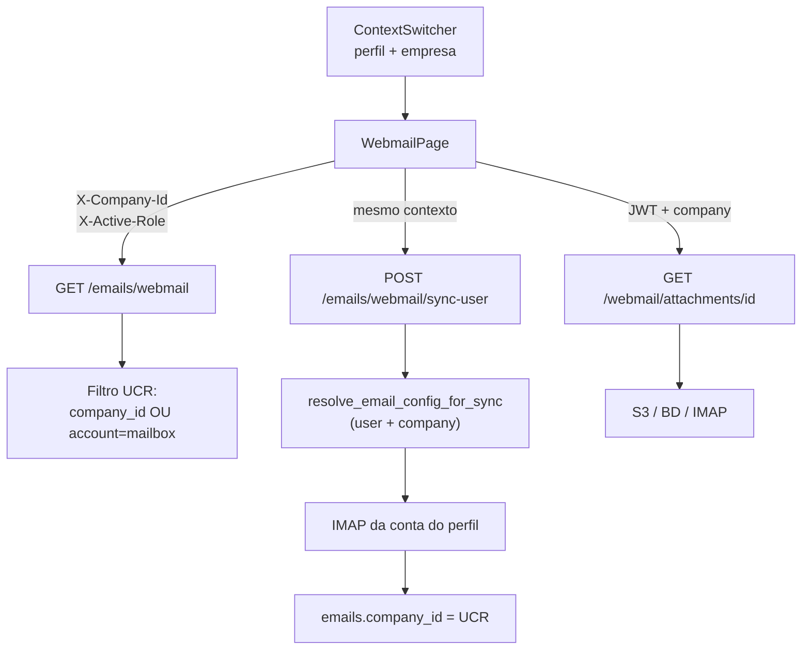

**Storage Factory Pattern:**

```mermaid
flowchart TD
    API["Rota API<br/>(upload/download)"] --> Factory["get_storage_adapter()"]
    Factory --> ReadConfig["Ler system_settings<br/>.storage.provider"]
    ReadConfig -->|aws_s3| S3["S3StorageAdapter"]
    ReadConfig -->|local| Local["LocalStorageAdapter"]
    ReadConfig -->|onedrive| OneDrive["OneDriveAdapter<br/>(placeholder)"]
    ReadConfig|unknown| LocalFallback["LocalAdapter<br/>(fallback)"]
    S3 --> S3Client["AWS S3 Client"]
    Local --> FileSystem["/tmp/powercell_uploads"]
```

---

## Arquitetura de Push Notifications

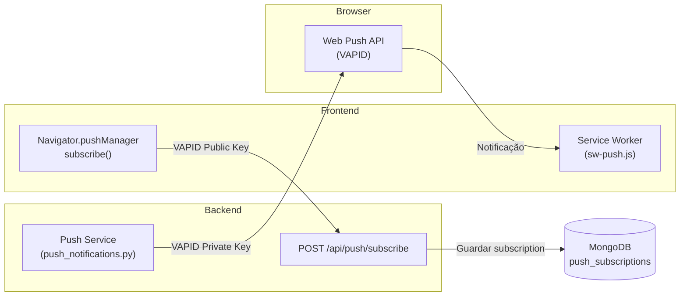

**Configuração VAPID:**
- `VAPID_PRIVATE_KEY` — Chave privada para assinar notificações (backend)
- `VAPID_PUBLIC_KEY` — Chave pública para subscrição (frontend via `REACT_APP_VAPID_PUBLIC_KEY`)
- `VAPID_MAILTO` — Contacto admin para VAPID (`mailto:admin@creditoimo.pt`)

---

## Arquitetura de Rate Limiting

O sistema utiliza rate limiting em duas camadas:

### Backend (slowapi)

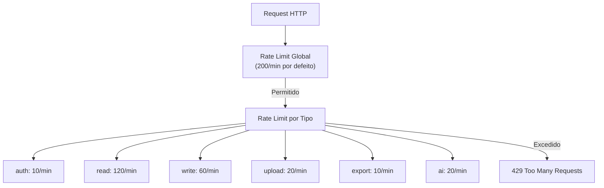

**Variáveis de ambiente:**

| Variável | Predefinição | Descrição |
|----------|-------------|-----------|
| `RATE_LIMIT_AUTH` | `10/minute` | Login e registo |
| `RATE_LIMIT_READ` | `120/minute` | GET requests |
| `RATE_LIMIT_WRITE` | `60/minute` | POST/PUT/PATCH |
| `RATE_LIMIT_UPLOAD` | `20/minute` | Uploads de ficheiros |
| `RATE_LIMIT_EXPORT` | `10/minute` | Exportações (CSV, ZIP) |
| `RATE_LIMIT_AI` | `20/minute` | Chamadas à API de IA |
| `RATE_LIMIT_DEFAULT` | `200/minute` | Qualquer outro endpoint |

### Frontend (429 Retry)

- **API Interceptor**: 3 retries com exponential backoff (2s → 4s → 8s + jitter ±500ms)
- Respeita header `Retry-After` quando presente
- Suprime toast de erro durante retries para evitar spam
- **Notifications Polling**: Backoff em 429 (30s → 60s → 120s → 5min), reset após 3 sucessos

---

## ProcessDetails + Documentos + Portal (estado actual)

```mermaid
flowchart LR
  subgraph FE["Frontend"]
    PD["ProcessDetails"]
    Q["useProcessFullData<br/>TanStack Query"]
    M["useProcessMutations"]
    Safe["sanitizeProcessUpdatePayload"]
    Toast["TasksContext<br/>sticky toasts"]
  end

  subgraph BE["Backend services"]
    PU["process_update"]
    DAI["document_ai_analyze<br/>+ titular_match"]
    DPF["document_portal_fulfill"]
    DU["document_upload / confirm"]
  end

  PD --> Q
  PD --> M
  M --> Safe --> PU
  PD -->|Analisar IA"| DAI
  DU -->|staff ou cliente| DPF
  Toast -->|GET /tasks/active| BE
```

| Fluxo | Comportamento |
|-------|----------------|
| Load ficha | Query → hydration (`processDetailsHydration.js`) → state local editável |
| Save ficha | Mutation + sanitize (sem `documents` / arrays vazios) → invalidação TanStack |
| IA ambígua | Dialog titular 1/2; apply com `target_titular` → `titular2_data` |
| Upload portal cliente | `confirm-upload` → REQUESTED→RECEIVED |
| Upload staff CRM | `document_portal_fulfill` após upload / auto-cat → mesmo efeito no portal |
| Onboarding | Registo = cliente + checklist SystemConfig; processo só após docs obrigatórios |

Detalhe operacional e mapa `document_*` / `process_*`: **`AGENTS.md`**.

---

## Arquitetura de Scraping (Idealista)

```mermaid
flowchart TD
    Admin["Admin Dashboard"] -->|"Importar Imóvel"| API["POST /api/scraper/scrape"]
    API --> ScraperSvc["PropertyScraper"]
    ScraperSvc -->|"Tentativa 1"| Direct["HTTP Request direta"]
    Direct -->|Bloqueado| ScraperAPI["ScraperAPI<br/>(premium+render)"]
    ScraperSvc -->|"Tentativa 2"| ScraperAPI
    ScraperAPI -->|Sucesso| Parse["Parse HTML"]
    Parse -->|"Extração"| Gemini["Gemini Flash<br/>(AI extraction)"]
    Gemini -->|"Dados estruturados"| DB[(MongoDB<br/>properties)]
```

**Configuração:**
- `SCRAPERAPI_API_KEY` — API key do ScraperAPI (para sites protegidos)
- `GEMINI_API_KEY` — Gemini Flash para extração de dados de páginas
- Fallback: HTTP direto → ScraperAPI basic → ScraperAPI premium → ScraperAPI premium+render

---

## Pipeline de IA — Extração de Dados e Validade de Documentos (Pacote DD)

A IA extrai dados estruturados de documentos PDF em dois passos complementares. Ambos persistem em `document_metadata`:

```mermaid
flowchart TD
    Upload["Upload de documento<br/>(staff ou portal)"] --> AutoCat["auto_categorize_document_background"]
    AutoCat -->|"1. Extrair texto PDF"| CatAI["categorize_document_with_ai<br/>(GPT-4o-mini)"]
    CatAI -->|"category, subcategory,<br/>tags, summary, expiry_date"| Meta1["document_metadata"]
    AutoCat -->|"2. Se categoria = Identificação"| OCR["analyze_document_from_base64<br/>(OCR GPT-4o vision)"]
    OCR -->|"validade → cc_validity<br/>nome, nif, morada, …"| Extracted["extracted_data"]
    Extracted --> Meta2["document_metadata.extracted_data"]
    Extracted -->|"se is_data_confirmed = false"| Conflict["data_conflict<br/>(sugestões de preenchimento)"]
    Meta1 --> Dashboard["Dashboard Documentos a Expirar<br/>(lê document_metadata.expiry_date)"]
    Meta2 -.->|"PACOTE DD — fallback"| Meta1
```

### Extração da data de validade (`expiry_date`)

O dashboard **"Documentos a Expirar (Próximos 60 dias)"** lê `document_metadata.expiry_date`. A data é preenchida por:

1. **Categorização IA** (`categorize_document_with_ai`): o prompt pede à IA para extrair `expiry_date` no formato `YYYY-MM-DD` do texto do PDF. Funciona para documentos com texto extraível (declarações IRS, extratos, certidões com texto).
2. **OCR de visão** (`analyze_document_from_base64`): para CC/Passaporte (PDFs de imagem sem texto extraível), o OCR extrai `validade` → mapeado para `cc_validity` no `extracted_data`.

**PACOTE DD — Fallback de validade**: `build_auto_cat_metadata` em `document_auto_categorize.py` agora usa fallback encadeado quando `categorize_document_with_ai` não devolve `expiry_date`:

```
expiry_date = result.expiry_date
           || _extract_validade_from_ocr(extracted_data)   # cc_validity / validade / data_validade / expiry_date / validity_date
```

O helper `_extract_validade_from_ocr()` valida o formato `YYYY-MM-DD` via `datetime.strptime` e devolve a primeira data válida encontrada. Isto garante que CCs analisados por OCR (sem texto extraível) também alimentam o dashboard de documentos a expirar.

### Persistência e encriptação de dados IA

Quando o utilizador aplica sugestões de IA (`run_apply_ai_suggestions` em `document_ai_analyze.py`), os campos sensíveis (`personal_data.nif`, `personal_data.documento_id`) são encriptados antes de `$set` no MongoDB via `_encrypt_mongo_update_paths()` (Pacote DD). Isto garante que dados PII extraídos pela IA ficam protegidos em repouso, consistentes com o resto da camada de encriptação (`encrypt_sensitive_data`).

### Campos encriptados (Pacote DD)

`financial_data.iban` e `financial_data.conta_bancaria` foram adicionados à lista de campos sensíveis em `encrypt_sensitive_data` / `decrypt_sensitive_data` (`process_service.py`) e em `SENSITIVE_FIELDS` (`encryption.py`). IBANs existentes em plain text passam through `decrypt_sensitive_data` sem alteração (não há migração); novos writes são encriptados.


---

## Portal do Cliente — Upload Múltiplo com Append (Pacote DE)

O Portal do Cliente permite uploads faseados por categoria. Cada categoria (Recibos de Vencimento, Extratos Bancários, IRS, Identificação, etc.) mantém um array `attached_files` que cresce com cada upload — **nunca** se substitui ficheiros anteriores.

```mermaid
flowchart TD
    Client["Cliente no Portal"] -->|"1. POST /portal/upload-url"| Backend1["run_generate_portal_upload_url<br/>(presigned S3 PUT URL)"]
    Backend1 -->|"upload_url + file_key"| Client
    Client -->|"2. PUT direto para S3"| S3["AWS S3<br/>(pasta Index)"]
    Client -->|"3. POST /portal/confirm-upload<br/>{file_key, category, document_id}"| Backend2["run_confirm_portal_upload"]
    Backend2 -->|"verifica S3 file_exists"| S3
    Backend2 -->|"$push: attached_files[+file_entry]"| Counts["apply_portal_request_upload<br/>(document_portal_counts)"]
    Counts -->|"len(attached_files) >= expected_count<br/>→ $set status=RECEIVED"| DB[(MongoDB<br/>documents)]
    Counts -->|"incompleto → mantém REQUESTED<br/>+ uploaded_count"| DB
    DB -->|"attached_files[] + uploaded_count/expected_count"| PortalStatus["GET /portal/status<br/>→ frontend mostra lista"]
```

### Lógica de Append (`attached_files`)

Cada documento pedido (REQUESTED) tem um array `attached_files` que acumula todos os ficheiros carregados pelo cliente para essa categoria:

```python
# services/document_portal_counts.py — apply_portal_request_upload
# (chamado por portal_upload_ops e document_portal_fulfill)
file_entry = {
    "file_id": str(uuid.uuid4()),
    "filename": original_filename,
    "s3_path": file_key,
    "file_size": file_size,
    "content_type": content_type,
    "uploaded_at": now,
    "uploaded_by": "portal_client",
}
# 1) $push do ficheiro + $set dos campos neutros (SEM status)
await db.documents.update_one(match_q, {
    "$set": {**neutral_fields, "updated_at": now},
    "$push": {"attached_files": file_entry},  # APPEND — nunca replace
})
# 2) Reconta e decide o status pela QUANTIDADE pedida
#    uploaded_count >= expected_count → $set status=RECEIVED
#    senão → mantém REQUESTED/PENDING (+ $set uploaded_count)
```

Os campos top-level (`filename`, `s3_path`, `file_size`) são atualizados para refletir o upload mais recente (backward compat com serializers que leem estes campos), mas o array `attached_files` preserva o histórico completo de todos os uploads. O mesmo padrão aplica-se a `fulfill_portal_requests_on_staff_upload` (`document_portal_fulfill.py`) para uploads do staff.

### Presigned URLs (não List[UploadFile])

O upload usa o padrão presigned S3: o backend gera uma URL de upload assinada (5 min de validade), o cliente faz PUT direto para S3, depois confirma com o backend. O backend **nunca** recebe bytes de ficheiros — isto evita gargalos de bandwidth e limites de body do FastAPI. **Não** usar `List[UploadFile]` (regressão arquitetural).

---

## Documentos Legais Gerados — RGPD PDF Pré-preenchido (Pacote DE)

Documentos legais gerados pelo sistema (RGPD, Minuta, CPCV) são sempre pré-preenchidos no backend com os dados reais do cliente/processo. O frontend não pré-preenche — apenas descarrega o PDF pronto.

### Endpoint `GET /api/rgpd/pdf/{process_id}`

Gera um PDF do RGPD com o template ativo, substituindo placeholders (`{{NOME}}`, `{{CONTRIBUINTE}}`, `{{MORADA}}`, etc.) pelos dados desencriptados do cliente:

```mermaid
flowchart LR
    Endpoint["GET /rgpd/pdf/{process_id}"] --> Service["services/rgpd_pdf.py<br/>run_generate_prefilled_rgpd_pdf"]
    Service -->|"fetch + decrypt_sensitive_data"| Process["process.personal_data<br/>{nif, morada_fiscal, documento_id}"]
    Service -->|"build consent_data"| Consent["{nome, contribuinte,<br/>morada, ...}"]
    Consent --> Render["_get_rendered_rgpd_text<br/>(template + placeholders)"]
    Render --> PDF["_build_prefilled_rgpd_pdf<br/>(reportlab platypus A4<br/>3 páginas + rodapé)"]
    PDF --> Response["StreamingResponse<br/>application/pdf"]
    Service -.->|"audit"| Activity["activities<br/>'RGPD descarregado'"]
```

- **Reutilização**: usa `_get_rendered_rgpd_text` e `_get_rendered_minuta_text` de `services/rgpd_service.py` (mesma pipeline de placeholders dos PDFs assinados digitalmente); o builder é o `_build_prefilled_rgpd_pdf` de `services/rgpd_pdf.py` (reportlab platypus).
- **Dados**: `consent_data` é construído a partir de `process.personal_data` (desencriptado via `decrypt_sensitive_data`), com fallback para strings vazias quando campos não existem.
- **Auth**: `require_staff()` — o PDF expõe PII do cliente.
- **Filename**: `RGPD_{safe_client_name}.pdf` (normalizado, sem acentos/caracteres especiais).

### Dados Legais da Empresa — SystemConfig (Pacote DG-2)

O RGPD e a Minuta de Exclusividade são documentos legais de intermediação de crédito: a empresa emissora (`{{NOME_EMPRESA}}`, `{{NIF_EMPRESA}}`, `{{MORADA_EMPRESA}}`, `{{CONTACTO_EMPRESA}}`, `{{EMAIL_EMPRESA}}`) é lida **estritamente** do SystemConfig global (`db.system_config`, `_id: "main"`, secção `settings`) pelo helper `_get_company_legal_data()` (`services/rgpd_service.py`) — a fonte oficial onde residem os dados da empresa.

```mermaid
flowchart LR
    subgraph FonteOficial["SystemConfig (_id: main) — settings"]
        CN["company_name"]
        CNIF["company_nif"]
        CA["company_address"]
        CE["company_email"]
        CP["company_phone"]
    end
    Helper["_get_company_legal_data()<br/>services/rgpd_service.py"]
    Renders["_get_rendered_rgpd_text<br/>_get_rendered_minuta_text<br/>run_get_rgpd_form_data (fluxo público)"]
    Fallback["Fallback legal: RGPD_ISSUER<br/>Precision Crédito, Lda. / NIF 515657514"]
    CN --> Helper
    CNIF --> Helper
    CA --> Helper
    CE --> Helper
    CP --> Helper
    Helper -->|"campos definidos"| Renders
    Helper -->|"campo ausente / BD indisponível"| Fallback
```

- **Nunca `db.companies` nos documentos legais**: a resolução por empresa (Pacote FR-4) foi removida da compilação do RGPD/Minuta — injetava a empresa de mediação imobiliária associada ao processo/utilizador (ex.: "Power Real Estate", dados de teste) no documento legal de intermediação de crédito. `_resolve_rgpd_company()` mantém-se **apenas** para escolher as credenciais SMTP do envio dos emails de assinatura (multi-tenant de envio, não afecta o conteúdo do documento).
- **Fallback legal**: `RGPD_ISSUER_NAME`/`RGPD_ISSUER_NIF` (Precision Crédito, Lda. / 515657514) quando o SystemConfig não define o campo — o documento é sempre emitido com um emissor válido, nunca com dados de teste.
- **Contacto**: `company_phone` com prioridade; `company_email` como fallback (o documento apresenta um canal de contacto oficial).
- **UI de administração**: os campos oficiais (`company_name`, `company_nif`, `company_address`, `company_email`, `company_phone`) são editáveis no formulário "Definições Gerais" do SystemConfigPage (`CONFIG_FIELDS["settings"]` em `services/system_config_api.py`).

---

## Separação Estrita: User (Global) vs Role/Perfil (Local) — Pacote DF

A Área Pessoal (`ProfilePage`) segue uma separação estrita entre o que pertence à **pessoa** (global) e o que pertence a cada **perfil/role** (local por `user_company_role`). Isto evita perfis fantasma, mistura de contextos e a falsa noção de "conta principal".

```mermaid
flowchart LR
    subgraph Global["User (Global — pessoa)"]
        Auth["Informação de Login<br/>(email, password)"]
        Sessions["Sessões Ativas<br/>(JWT tokens)"]
    end
    subgraph UCR1a["UCR: Diretor @ Power RE"]
        Sig1a["Assinatura / Telefone / Cargo"]
    end
    subgraph UCR1b["UCR: Consultor @ Power RE"]
        Sig1b["Assinatura / Telefone / Cargo"]
        Mail1["Config Webmail (IMAP/SMTP)"]
    end
    subgraph UCR2["UCR: Intermediário @ Precision"]
        Sig2["Assinatura de Email"]
        Phone2["Telefone Profissional"]
        Job2["Cargo"]
        Mail2["Config Webmail"]
        Google2["Google OAuth"]
        Notif2["Preferências de<br/>Notificação"]
    end
    User["Utilador"] --> Global
    User -->|"UCR Diretor + Consultor<br/>na mesma empresa"| UCR1a
    User --> UCR1b
    User -->|"user.companies[]"| UCR2
```

### User (Global) — pertence à pessoa

| Campo | Coleção | Notas |
|---|---|---|
| `email` | `users` | Identidade de login |
| `password_hash` | `users` | Autenticação |
| `role` | `users` | Role primária (JWT) — apenas para fallback |
| `created_at` | `users` | "Membro desde" |
| `additional_roles` | `users` | Array de roles (legacy) — não usado para renderizar perfis |
| Sessões | `refresh_tokens` | JWT refresh tokens ativos |

A aba "Conta Global" da Área Pessoal contém APENAS estes cartões: Informação de Login + Sessões Ativas.

### Role/Perfil (Local) — pertence ao `user_company_role`

Cada UCR (`user_company_roles` collection, chave única `{user_id, company_id, role}` — v2.0 permite **vários cargos na mesma empresa**) tem os seus próprios:

| Campo | Coleção | Scoping |
|---|---|---|
| `signature` | `user_company_roles` | Assinatura de email para esta empresa |
| `professional_phone` | `user_company_roles` | Telefone profissional para esta empresa |
| `job_title` | `user_company_roles` | Cargo para esta empresa |
| `display_name` | `user_company_roles` | Nome de exibição para esta empresa |
| `notification_preferences` | `user_company_roles` | Preferências de notificação (14 bools) — **PACOTE DF** |
| Webmail IMAP/SMTP | `user_email_configs` | Keyed by `{user_id, company_id, email_address}` — várias contas por perfil (`is_primary`) |
| Google OAuth tokens | `user_email_configs` + `users.email_config["company:<id>"]` | Dual-write per-UCR |

A Área Pessoal gera **uma aba dinâmica por UCR real** (iterando `user.companies` / `user_company_roles`), cada uma com os cartões: Dados Profissionais + Assinatura + Webmail. **Sem hardcode de roles** — só perfis que o utilizador realmente tem aparecem. Na v2.0, o mesmo utilizador pode ter **duas abas para a mesma empresa** (ex.: Diretor e Consultor).

### `X-Company-Id` header — o mecanismo de scoping

O backend recebe o contexto de UCR ativo via header `X-Company-Id` (e `X-Active-Role`), injetado automaticamente pelo interceptor do `api.js` no frontend.

**Pacote DM:** o interceptor **não sobrescreve** estes headers se o pedido já os definiu (tabs da Área Pessoal). `POST /users/me/email-config` resolve `company_id` por ordem: body → query → header.

**Pacote FN:** a fonte de verdade dos headers é o snapshot do AuthContext (`syncAuthContextHeaders`), não o `sessionStorage` (páginas já chegaram a escrever o sentinel `"all"` em `activeRole`). O valor de `X-Company-Id` é o **id canónico** do UCR; o backend ainda aceita um nome de exibição e devolve o `company_id` da associação encontrada.

```python
# services/auth.py
async def get_active_company_id_async(request, user):
    hint = request.headers.get("X-Company-Id")
    assoc = await _find_ucr(user["id"], company_hint=hint)  # id OU nome
    return (assoc.get("company_id") if assoc else None) or fallback
```

### Assinatura de email (Pacote DM)

A assinatura por UCR (`user_company_roles.signature`) é HTML. A Área Pessoal pré-visualiza com `RichTextViewer`; o compositor do Webmail usa `sanitizeEmailHtml` (DOMPurify, tags `<p>`, `<br>`, `` com `data:`/`https`/`cid`). HTML gravado como entidades é desescapado uma vez antes de sanitizar.

### Impersonate e navegação (Pacote DM)

Ao iniciar impersonate, `AuthContext.applyUserContext` redefine `activeRole` / `activeCompanyId` para o utilizador alvo. O `DashboardLayout` constrói o menu a partir de `user.role` (não do `effectiveRole` residual do admin). Menus de Administração só aparecem se o impersonado for `admin` ou `ceo`.

### Os Meus Processos — `GET /processes/me` (Pacote FN)

`/processos` (`ProcessesPage`) lista **só** os processos atribuídos ao utilizador autenticado. `/lista-processos` (visão global) usa `GET /processes?show_all=true`.

`GET /processes/me` (`mine_only`) em `services/process_list_filters.py`:

- Filtra **sempre** por atribuição (`consultant_id` / `manager_id` / utilizadores assigned), independentemente do cargo efectivo.
- Isola pela empresa activa: `build_company_scope_condition` casa `company_id`, `company` **ou** `company_name` com o hint do header (id ou nome). Processos sem empresa só entram no sentinel `default`.
- Não depende de `X-Active-Role: all`. A página **não** deve escrever `"all"` no `sessionStorage` — o AuthContext é dono do cargo activo.

O fetch da lista usa dependências estáveis (`useMemo` no filtro `assigned_user_ids`). Reconstruir o array em cada render relançava o `useCallback`/`useEffect` em loop, sobretudo quando a resposta vinha vazia (o sintoma de produção).

### Perfil Mediador removido

O role `mediador` não é um perfil de sistema. `normalizeRole` mapeia legado → `intermediario`. Campos de processo `assigned_mediador_id(s)` mantêm-se (atribuição de intermediários). A dropbox extra de empresa no Header para Diretor foi removida — a empresa está no selector de perfil.

### Preferências de Notificação — per-UCR com fallback (PACOTE DF)

As preferências de notificação (14 campos booleanos: `email_*`, `inapp_*`) são agora persistidas no UCR (`user_company_roles.notification_preferences`) com fallback gracioso ao store global (`db.notification_preferences`):

- **Write** (`PUT /auth/preferences`): escreve no UCR ativo (via `X-Company-Id`); dual-write no global para backward compat.
- **Read** (`GET /auth/preferences`): lê do UCR ativo primeiro; se vazio/None, fall back ao global.
- **Consumers** (`notification_service.py`, `email_v2.py`): aceitam `company_id=None` opcional; quando fornecido, procuram o UCR primeiro com fallback global.

Isto permite que um consultor tenha notificações de email ativas para a Power Real Estate mas desativadas para a Precision, por exemplo.

### O que NÃO é per-UCR (tech debt)

- **OneDrive**: system-level apenas (env var `ONEDRIVE_SHARED_LINK`), sem store per-user. Defer para futuro.

---

## PDFs Gerados para Assinatura Manual (Pacote DG)

Documentos legais gerados para assinatura manual (RGPD, Minuta, CPCV) seguem regras estritas para serem imprimíveis e preenchíveis à caneta:

### Template dinâmico + paginação automática

O template do RGPD é **dinâmico** (editado pelo admin via `SmartRichEditor` em `RGPDAdminPage`, armazenado em `rgpd_template_versions` ou cache em `system_config`). Pode ser plain text ou HTML/Rich Text. O gerador de PDF lê o template ativo via `_get_active_rgpd_template()` e substitui os placeholders (`{{NOME}}`, `{{CONTRIBUINTE}}`, `{{MORADA}}`, etc.) pelos dados do cliente.

O PDF é gerado com `reportlab.platypus` (`SimpleDocTemplate` + `Paragraph` + `Spacer` + `HRFlowable`), que suporta **quebras de página automáticas** — quando um Flowable não cabe na página atual, uma nova página é criada. Isto é essencial porque o RGPD tem 11 secções e pode ocupar várias páginas.

**Pacote DP — estrutura multi-página e design profissional**: o documento divide-se em **3 partes fundamentais, cada uma a começar sempre em página própria** (`PageBreak` — equivalente reportlab do CSS `page-break-after: always` declarado em `_RGPD_PDF_HTML_STYLE`):

1. **Cabeçalho corporativo + Dados do Cliente** — título + subtítulo legal com régua dupla ("double rule"), seguido do texto legal RGPD (incluindo "2. TITULAR DOS DADOS" com os dados pré-preenchidos). Se o template legal for longo, esta parte flui naturalmente para páginas adicionais;
2. **Consentimentos** — opções A/B/C/D com checkboxes `☐ Autorizo / ☐ Não Autorizo` + bloco de assinatura estruturado. Começa SEMPRE em página própria;
3. **Minuta de Exclusividade** + bloco de assinatura. Começa SEMPRE em página própria.

O cabeçalho CSS `_RGPD_PDF_HTML_STYLE` é a **fonte única de verdade** do layout — `font-family: Helvetica, Arial, sans-serif`, margens generosas de 2,5cm, `line-height: 1,5` e `margin-top: 40px` do bloco de assinatura — lido por `_parse_css_margin_cm` / `_parse_css_line_height` / `_parse_css_signature_margin_top_cm` e aplicado aos estilos reportlab (CSS e layout nunca dessincronizam). Todas as páginas têm rodapé corporativo com régua fina, identificação do documento e numeração "Página X de Y" (padrão NumberedCanvas em `_make_numbered_canvas_class`).

```python
# services/rgpd_pdf.py — _build_prefilled_rgpd_pdf (estrutura da story)
story = [  # PARTE 1 — cabeçalho corporativo + texto legal (auto-paginado)
    Paragraph("AUTORIZAÇÃO PARA TRATAMENTO DE DADOS PESSOAIS", title_style),
    Paragraph("RGPD — Regulamento (UE) 2016/679", subtitle_style),
    HRFlowable(...), HRFlowable(...),   # régua dupla
]
story.extend(_html_to_flowables(rgpd_text, ...))
story.append(PageBreak())                       # PARTE 2 — Consentimentos
story.extend(_build_signature_block(...))       # bloco estruturado
story.append(PageBreak())                       # PARTE 3 — Minuta
story.extend(_html_to_flowables(minuta_text, ...))
story.extend(_build_signature_block(...))
doc.build(story, canvasmaker=_make_numbered_canvas_class(...))  # rodapé
```

A fonte **DejaVuSans** (TTF) é registada para suportar acentos portugueses (ã, ç, é) e o caractere Unicode `☐` (U+2610, checkbox vazia). Fallback para Helvetica se a fonte não estiver disponível.

### Fallbacks para campos nulos — linhas em branco

Quando um dado do cliente falta (ex: morada, NIF, código postal), o PDF **não** imprime "N/A". Em vez disso, imprime uma linha em branco contínua (`___________________`) para o cliente preencher à caneta:

```python
# services/rgpd_pdf.py
def _blank_line(width: int = 30) -> str:
    return "_" * width

consent_data = {
    "nome": process.get("client_name") or _blank_line(50),
    "contribuinte": personal.get("nif") or _blank_line(15),
    "morada": personal.get("morada_fiscal") or _blank_line(60),
    ...
}
```

### Data e Local em branco

A data e o local de assinatura **não** são pré-preenchidos. O placeholder `{{DATA_ASSINATURA}}` é substituído por `___/___/______` e o local por `___________________` — o cliente preenche à caneta no momento da assinatura.

### Bloco de assinatura estruturado (Pacote DP)

`_build_signature_block` (helper partilhado pelas páginas de Consentimentos e Minuta) garante que a data e a assinatura **nunca ficam coladas na mesma linha**:

1. **"Local" e "Data" numa linha isolada** — tabela de 2 colunas sem bordos (Local à esquerda, Data à direita);
2. **"Assinatura do Cliente" num bloco abaixo** — etiqueta a negrito, margem superior de 40px (≈1,06cm, lida do CSS — espaço físico para assinar à caneta) e linha visível de underscores com a legenda "(Assinar à caneta)".

O texto legal do template ("Data: ___" / "Assinatura: ___" no fim da DECLARAÇÃO FINAL) é preservado tal como está — o bloco estruturado é adicional, para a assinatura física.

### Checkboxes vazias

Os 4 pontos de consentimento (A/B/C/D) usam checkboxes **vazias** (`☐`) para o cliente picar fisicamente:

```
A) Autorizo o tratamento dos meus dados pessoais...
   ☐ Autorizo     ☐ Não Autorizo
```

O caractere `☐` (U+2610) é suportado pela fonte DejaVuSans. No fluxo de assinatura digital (`sign_rgpd`), a checkbox escolhida torna-se `☑` (U+2611) — mas no PDF pré-preenchido para assinatura manual, ambas ficam vazias.

**Pacote DP — negrito real com a TTF**: a variante `DejaVuSans-Bold` é registada juntamente com o mapeamento de família (`registerFontFamily`). Antes, o markup `<b>`/`<strong>` era silenciosamente ignorado com a TTF (`tt2ps` não resolvia "DejaVuSans-Bold") — os títulos de secção saíam sem negrito. Sem o ficheiro Bold disponível, o mapeamento degrada graciosamente para a regular (sem quebrar a geração).

---

## Entidade "Cliente" — sem lifecycle (Pacote DG)

A entidade **Cliente** **não possui estado de ciclo de vida** (Ativo/Concluído/Inativo). O conceito de fases/status pertence apenas aos **Processos**. Um cliente é sempre um "Cliente Registado" — o que muda é o número e estado dos seus processos.

| Entidade | Tem `status`? | Tem `fase`? | Lifecycle |
|---|---|---|---|
| **Cliente** | ❌ Não (a ficha tem `is_active` / `is_deleted`, não fase de workflow) | ❌ Não | Soft-delete + activo/inactivo da ficha |
| **Processo** | ✅ Sim (16 fases) | ✅ Sim (`workflow_statuses`) | `pre_registo` → `clientes_espera` → ... → `concluido` |

### Listagem de Clientes

O ecrã de Clientes (`ClientsPage.js`, rota `/clientes`) é uma **lista unificada de "Clientes Registados"** — sem tabs de Ativos/Concluídos no sentido de workflow. A métrica útil exibida por cliente é o **número de processos associados** (`client.process_ids.length`), não uma fase.

```jsx
// ClientsPage.js — coluna "Processos" (Pacote DG)
<Badge variant="secondary" className="gap-1">
  <FileText className="h-3 w-3" />
  {client.process_ids?.length || 0} Processos
</Badge>
```

**Pacote FK** — os filtros desta página são **exclusivos da entidade Cliente**. Não há dropdown de fase, atribuição ou indexação (isso vive em Processos). UI: `components/filters/ClientFilters.jsx`. Query string da página:

| Param URL | API `GET /clients` | Valores | Semântica |
|-----------|--------------------|---------|-----------|
| `search` | `search` | texto | Nome, email ou NIF (accent-insensitive) |
| `fonte` | `fonte` | `staff_created`, `Website`, `Manual`, `Indicação`, `Telefone`, `Email`, `Feira`, `trello`, `auto_created` | Origem comercial (`clients.fonte`, match exacto case-insensitive) |
| `tipo` | `tipo` | `particular`, `dois_titulares`, `empresa` | Tipo de ficha — **não** é `process_type`. Particular = sem 2.º titular; dois titulares = `titular2_data` / `titular2_name` preenchido; empresa = `tipo` / `tipo_cliente` |
| `status` | `status` | `active`, `inactive`, `deleted` | Estado da **ficha**: activo (`is_deleted ≠ true` e `is_active ≠ false`); inactivo (`is_active = false`); eliminado (`is_deleted = true`) |

Builders: `services/client_list_filters.py` (`build_client_entity_query`). A listagem (`client_list_search.run_list_clients`) aplica primeiro o filtro na colecção `clients`; se não houver IDs, devolve vazio. Clientes sem processo que casem o filtro são fundidos na resposta (`_merge_entity_client_docs`). Params legados (`status_filter`, `assignment_filter`, `indexacao_filter`) continuam no endpoint por compatibilidade mas **não** são expostos na UI de Clientes.

### Listagem de Processos (contexto separado)

`ProcessesPage.js` serve duas rotas com o **mesmo** componente e **filtros de processo**:

| Rota | Título | Endpoint | Âmbito |
|------|--------|----------|--------|
| `/processos` | Os Meus Processos | `GET /processes/me` | Sempre `mine_only`: atribuído ao utilizador actual **e** `company_id` da empresa activa (incl. director/admin/ceo). `show_all` não se aplica. |
| `/lista-processos` | Todos os Processos | `GET /processes?show_all=true` | Visão global (RBAC de role). |

UI: `components/filters/ProcessFilters.jsx`. Query string:

| Param URL | API | Valores | Semântica |
|-----------|-----|---------|-----------|
| `search` | `search` | texto | Nome / email / NIF / nº processo |
| `status` | `status` | slug do workflow | Fase do **processo** (não o estado da ficha de cliente) |
| `process_type` | `process_type` | chaves de `PROCESS_TYPE_LABELS` | Tipo de operação (`process_type` ou alias legado `type`) |
| `assigned_user_ids` | `assigned_user_ids` | CSV de user ids | Multi-select de staff atribuído |
| `assigned_logic` | `assigned_logic` | `OR` (default) / `AND` | OR = pelo menos um dos IDs; AND = todos os IDs têm de aparecer nos campos de atribuição |
| `assigned_user_id` | `assigned_user_id` | um id | Alias legado (Pacote FK); o frontend migra para `assigned_user_ids` |
| `view_mode` | `view_mode` | `active_only` / `all` / `historical` / `deleted` | Activos vs arquivo vs eliminados |
| `is_indexed` | `is_indexed` | `true` / `false` | Estado de indexação |

Builders: `services/process_list_filters.py`. O filtro de atribuição percorre um conjunto canónico **e** aliases legados (`assigned_to`, `assigned_consultor_id(s)`, `assigned_mediador_id(s)`, `assigned_indexacao_id`, `consultant_id`, `manager_id`, `assigned_users`, …) para dados antigos não desaparecerem da lista.

**AND com `GET /processes/me`:** `mine_only` **não** é substituído por `assigned_user_ids`. O resultado é sempre «processos meus nesta empresa» ∩ «atribuídos aos IDs escolhidos».

Staff do dropdown: `GET /users?for_assignment=true` (exclui `admin`; inclui indexação). Hook: `useAssignmentUsersQuery` com `queryKeys.users.forAssignment()`.

Os mesmos query params existem em `GET /processes/paginated` (cursor).

```mermaid
flowchart LR
    subgraph UI_C["/clientes"]
        CF["ClientFilters<br/>fonte / tipo / status ficha"]
    end
    subgraph UI_P["/processos e /lista-processos"]
        PF["ProcessFilters<br/>fase / tipo processo / atribuído a"]
    end
    CF --> API_C["GET /clients"]
    PF --> API_P["GET /processes ou /processes/me"]
    API_C --> SvcC["client_list_filters<br/>só colecção clients"]
    API_P --> SvcP["process_list_filters<br/>só colecção processes"]
```

### Soft-delete de Clientes

Todas as queries de listagem/pesquisa de clientes filtram ativamente `is_deleted: {"$ne": True}` (defense-in-depth com `status: {"$ne": "eliminado"}`), excepto quando o filtro de ficha é `status=deleted`. O soft-delete (`client_delete.py`) define `is_deleted: True`, `deleted_at: <timestamp>`, `is_active: False`, `status: "eliminado"` — todos os 4 campos para compatibilidade.

---

## TanStack Query — factory `queryKeys` (`queryClient.js`)

Fonte única: `frontend/src/lib/queryClient.js`. **Não** declarar arrays literais (`['org-admin-companies']`) nem constantes locais (`USERS_QUERY_KEY`) nos ecrãs admin — invalidações parciais partem-se.

Hierarquia relevante para listagens e org-admin:

```
queryKeys.processes.list(filters)     // GET /processes — filters inclui assigned_user_ids / assigned_logic
queryKeys.processes.kanban(filters)   // prefixo kanbanAll: invalidar só o board, nunca ['processes'] inteiro
queryKeys.clients.list(filters)       // GET /clients — filters de entidade (fonte/tipo/status)
queryKeys.users.forAssignment()       // ['users','list',{ for_assignment: true }]
queryKeys.orgAdmin.all                // ['org-admin']
queryKeys.orgAdmin.companies(search)
queryKeys.orgAdmin.users()
queryKeys.orgAdmin.ucrs()
queryKeys.orgAdmin.ucrByUser(userId)
```

`CompaniesAdminTab` e `UsersAccessAdminTab` usam `queryKeys.orgAdmin.*`. A página obsoleta `CompaniesManagementPage.jsx` foi removida (Pacote FJ); o painel `SystemAdminPanel` embute `CompaniesAdminTab`.

---

## Índices MongoDB e TTL nativo

Índices de query e de ciclo de vida vivem em `services/db_indexes.py`, criados no arranque (`create_indexes` → `cleanup_deprecated_indexes` + `create_ttl_indexes`). `get_index_stats` reporta nomes/contagens (incl. `emails`, `user_company_roles`).

**Query (amostra, colecção `processes` / `clients`):** `idx_status`, `idx_consultor` / `idx_mediador`, compostos `status+assigned_*`, `idx_process_type`, `idx_client_assigned_to`, blind indexes `*_hash` (nunca no NIF/email em claro).

**TTL nativo (`expireAfterSeconds`)** — o mongod apaga documentos automaticamente. O campo **tem** de ser BSON Date (`datetime` Python), não ISO string. Serviços que escrevem dados efémeros carimbam `*_dt` (ex.: `stamp_draft_ttl_fields` em `email_draft_service.py`).

| Colecção | Campo | TTL | Nome | Notas |
|----------|-------|-----|------|--------|
| `refresh_tokens` | `created_at_dt` | 24 h | `ttl_refresh_tokens` | Extra à expiração lógica `expires_at` |
| `system_error_logs` | `timestamp_dt` | 30 dias | `ttl_system_error_logs` | Substitui o `idx_ttl` antigo em ISO string |
| `emails` | `updated_at_dt` | 7 dias | `ttl_email_drafts` | Partial index `status: draft` |
| `oauth_states` | `created_at` | 10 min | `idx_oauth_state_ttl` | CSRF state OAuth |

Diagnóstico: `GET /diagnostics/ttl-status` e migração `POST /diagnostics/migrate-ttl-fields` (documentos antigos só com ISO string).

---

## Agenda — Dualidade Prazo/Evento (Pacote DH)

O modelo de **Agenda** (coleção `deadlines`) evoluiu para suportar dois tipos de entradas com comportamentos distintos: **prazos limite** (deadlines) e **marcações** (events). Esta dualidade reflete a realidade do negócio — nem tudo no calendário é um prazo; muitas vezes é uma marcação (ex: Escritura, reunião com banco).

### Modelo de dados

```python
# models/deadline.py
class DeadlineCreate(BaseModel):
    title: str
    description: Optional[str]
    due_date: str  # ISO "yyyy-MM-dd"
    priority: str = "medium"
    type: Literal["deadline", "event"] = "deadline"       # PACOTE DH
    visible_to_client: bool = False                        # PACOTE DH
    reminder_time: Optional[List[str]] = None              # PACOTE DH — ["1h","3h","1d","3d","7d"]
```

| Campo | Tipo | Descrição |
|---|---|---|
| `type` | `"deadline"` \| `"event"` | Distingue prazos limite de marcações |
| `visible_to_client` | `bool` | Se `True`, o evento aparece na agenda do Portal do Cliente |
| `reminder_time` | `List[str]` | Configurações de lembrete: `"1h"`, `"3h"`, `"1d"`, `"3d"`, `"7d"` (multi-select) |

### Lógica de alertas baseada no tipo

O cron `check_upcoming_deadlines` (`services/scheduled_tasks.py`, corre a cada 1h em PROD) comporta-se de forma diferente conforme o `type`:

| Type | Comportamento | Defaults `reminder_time` |
|---|---|---|
| **`deadline`** | Dispara `DEADLINE_APPROACHING` (urgência) nos dias configurados + `DEADLINE_MISSED` se atrasado | `["1d", "3d"]` |
| **`event`** | Dispara `EVENT_REMINDER` (lembrete) respeitando `reminder_time` | `["1h", "1d"]` |

Ambos usam `notification_service.send_notification_with_preference_check` para email + `realtime_notifications.notify_deadline_reminder` para in-app/WebSocket. A idempotência é garantida por um array `sent_reminders` no documento da deadline — cada lembrete só é enviado uma vez por janela.

### Portal do Cliente — eventos visíveis

O endpoint `GET /api/portal/events` retorna apenas eventos onde `visible_to_client == True`, `completed != True`, e `due_date >= today`. O frontend (`ClientPortal.jsx`) mostra uma secção "Próximos Eventos" na TOP SECTION — oculta quando vazia, com `EmptyState` quando não há eventos.

```mermaid
flowchart LR
    Staff["Staff cria entrada na Agenda"] -->|"type: deadline/event"| DB[(deadlines)]
    DB -->|"cron 1h"| Cron["check_upcoming_deadlines"]
    Cron -->|"type=deadline"| Alert["DEADLINE_APPROACHING/MISS<br/>(urgência)"]
    Cron -->|"type=event"| Reminder["EVENT_REMINDER<br/>(lembrete)"]
    Alert --> Notif["notification_service"]
    Reminder --> Notif
    Notif --> Consultor["Consultor (email + in-app)"]
    DB -->|"visible_to_client=true"| Portal["GET /portal/events"]
    Portal --> ClientUI["ClientPortal — Próximos Eventos + Calendário (DO.2)"]
```

---

## Resumo do Processo e Calendário Visual (Pacote DO.1 + DO.2)

### DO.1 — Observações + Timeline no Resumo

O modelo de Processo tem o campo `observations` (string). Na persistência (`apply_cpcv_and_metadata_fields`) o valor sincroniza com `notes` quando só um dos dois é enviado — `notes` continua a alimentar o Kanban / "Notas do Consultor".

O histórico de estados **já existia** (`GET /api/history`, coleção `history` via `log_history`). O Pacote DO.1 acrescenta um endpoint compacto para o Resumo:

- `GET /api/processes/{id}/timeline` → `{ events, total }` com criação, mudanças de fase e restantes eventos, ordenados do mais recente para o mais antigo.
- UI: `ProcessObservationsCard` (Textarea Shadcn, guardar no botão e no `onBlur`) + `ProcessSummaryTimeline` (linha vertical + nós) no separador Resumo. O histórico completo permanece no tab Histórico.

### DO.2 — Calendário visual (Dashboard + Portal)

`AgendaCalendar` (Shadcn `Calendar` + vista semanal) consome os prazos/eventos da Agenda (Pacote DH, `GET /deadlines/calendar`).

| Superfície | Fonte | Filtro |
|---|---|---|
| Dashboard do Consultor | `getCalendarDeadlines()` | Processos/prazos do utilizador (já scoped no backend) |
| Portal do Cliente | `GET /portal/events?include_past=true` | Apenas `visible_to_client=true` e não concluídos |

Dias com agendamentos mostram um ponto; o dia seleccionado lista os títulos. O calendário vive numa tab (Progressive Disclosure), não no fluxo principal.

### Calendário de precisão (v2.0 — Pacote FA)

A página `/calendario` (`CalendarPage.jsx`) passou a ser um calendário de **hora exacta**, não só de dia civil:

| Capacidade | Implementação |
|------------|----------------|
| **Hora de início/fim** | Inputs `type="time"` em `CreateEventDialog` (`start_time` / `end_time`). Persistidos em `due_date` / `end_date` como ISO local `YYYY-MM-DDTHH:mm:00` via `combineDateAndTime` (`utils/agendaCalendar.js`). Default 09:00–10:00 |
| **Dia inteiro** | Switch `all_day` — omite a hora (ausências/férias forçam dia inteiro) |
| **Edição** | Clique no evento abre o mesmo dialog em modo edição (`editingEvent`); `PUT /deadlines/{id}` |
| **Eliminação** | Botão eliminar no dialog de edição (`Trash2`) → `DELETE /deadlines/{id}` |
| **Vista** | Chip no calendário mostra o intervalo (`formatEventClockRange`, ex.: `09:00–10:30`) |

`due_date` continua a aceitar `YYYY-MM-DD` (legado, dia inteiro). Eventos novos com hora usam datetime ISO sem `Z` (hora local, evita o salto UTC).

```mermaid
flowchart LR
    DH["Agenda DH<br/>deadlines"] --> CalAPI["GET /deadlines/calendar"]
    DH -->|"visible_to_client"| PortalAPI["GET /portal/events"]
    CalAPI --> Dash["ConsultorDashboard<br/>tab Calendário"]
    PortalAPI --> PortalCal["ClientPortal<br/>tab Agenda"]
```

---

## IA Híbrida — Sistema de Confiança para Documentos (Pacote DJ)

A IA analisa documentos e aplica um **Sistema Híbrido baseado em Confiança**: confiança alta (≥85%) resulta em auto-aprovação (Zero-Touch); confiança baixa (<85%) entra em Human-in-the-Loop (revisão manual).

```mermaid
flowchart TD
    Trigger["Consultor clica BrainCircuit<br/>num documento"] -->|"POST /documents/{doc_id}/ai-analyze-review"| Backend["document_review.py<br/>run_analyze_document_for_review"]
    Backend -->|"categorize_document_with_ai<br/>+ OCR"| LLM["GPT-4o-mini"]
    LLM -->|"JSON: categoria, validade,<br/>nome, confidence"| Backend
    Backend -->|"confidence_score = int(confidence * 100)"| Check{"confidence_score >= 85?"}
    Check -->|"Sim — Alta confiança"| Auto["AUTO_APPROVED (Zero-Touch)<br/>escreve em suggested_* E ai_*<br/>ai_review_status=auto_approved"]
    Check -->|"Não — Baixa confiança"| Pending["PENDING_REVIEW (HITL)<br/>escreve apenas em suggested_*<br/>ai_review_status=pending_review"]
    Auto --> DB[(document_metadata)]
    Pending --> DB
    DB -->|"GET /client/{id}/files"| Frontend["S3FileManager badges"]
    Frontend -->|"auto_approved: ✨ Auto-Aprovado (verde)"| AutoBadge["Badge verde informativo"]
    Frontend -->|"pending_review: ⚠️ Revisão Necessária (âmbar)"| ReviewBadge["Badge âmbar clickable"]
    ReviewBadge -->|"click"| Modal["DocumentReviewModal<br/>Atual vs Sugerido<br/>+ Aprovar/Rejeitar"]
    Modal -->|"POST /apply-ai-review"| Apply["copia suggested_* → ai_*<br/>status=approved/edited"]
    Modal -->|"POST /reject-ai-review"| Reject["status=rejected"]
```

### Lógica de Threshold (Limiar de Confiança)

```python
# services/document_review.py
AI_CONFIDENCE_THRESHOLD = 85

# Na análise:
confidence_score = int(round(raw_confidence * 100))  # 0.0-1.0 → 0-100

if confidence_score >= AI_CONFIDENCE_THRESHOLD:
    # AUTO_APPROVED: IA aplica directamente em ai_* (Zero-Touch)
    ai_review_status = "auto_approved"
else:
    # PENDING_REVIEW: IA sugere em suggested_* (HITL)
    ai_review_status = "pending_review"
```

### Modelo de dados — `suggested_*` vs `ai_*`

A coleção `document_metadata` tem dois conjuntos de campos:

| Campo `suggested_*` (IA sugere) | Campo `ai_*` (aplicado) | Quando é escrito |
|---|---|---|
| `suggested_category` | `ai_category` | `suggested_*` sempre; `ai_*` se auto_approved ou consultor aprova |
| `suggested_subcategory` | `ai_subcategory` | mesmo padrão |
| `suggested_confidence` | `ai_confidence` | mesmo padrão |
| `suggested_expiry_date` | `expiry_date` | mesmo padrão |
| `suggested_filename` | `filename` | mesmo padrão |
| `suggested_nome` | `extracted_data.nome` | mesmo padrão |

O campo `ai_review_status` controla o estado: `auto_approved` | `pending_review` → `approved` | `rejected` | `edited`.

### Endpoints do fluxo HITL

| Endpoint | Método | Descrição |
|---|---|---|
| `/documents/{doc_id}/ai-analyze-review` | POST | Triggera IA, aplica threshold (auto_approved ou pending_review) |
| `/documents/{doc_id}/apply-ai-review` | POST | Aplica sugestões selecionadas (`suggested_*` → `ai_*`) |
| `/documents/{doc_id}/reject-ai-review` | POST | Rejeita sugestões |
| `/documents/process/{process_id}/pending-review` | GET | Lista documentos pendentes de revisão (`pending_review`) |

### Estados visuais no frontend (S3FileManager)

| `ai_review_status` | Badge | Cor | Clickable? |
|---|---|---|---|
| `auto_approved` | ✨ Auto-Aprovado | verde (`bg-primary/10`) | Não (informativo) |
| `pending_review` | ⚠️ Revisão Necessária | âmbar (`bg-accent/15`) | Sim (abre modal) |
| `approved` | Aprovado | verde (`variant=secondary`) | Não |
| `rejected` | Rejeitado | muted (`variant=outline`) | Não |
| `edited` | Editado | azul | Não |
| (analisando) | A analisar... | roxo com spinner | Não |

### Fluxo paralelo — auto-categorização em background

A auto-categorização em background (`document_auto_categorize.py`) continua a escrever **diretamente** em `ai_*` (sem HITL) para uploads novos. O fluxo HITL é **paralelo** — accionado on-demand pelo consultor quando quer rever/refinar os metadados de um documento específico.


## Fluxo de Onboarding: Registo → Pré-Registo → Índice → Atribuição (Auditoria 2026-08-31)

> **Nota**: Esta secção documenta o resultado de uma auditoria ao fluxo real de
> negócio (registo do cliente até atribuição a consultor/intermediário),
> comparando o **código existente** com o **fluxo desejado** validado com o
> Product Owner. As correções descritas em "Decisões Confirmadas" foram
> **implementadas em 2026-09-01** (commit `245cc4a5`, ver detalhe no fim da
> secção "Próximos passos").

### Fluxo desejado (confirmado com o Product Owner)

1. Cliente registado (formulário público OU criado por um user).
2. Cliente recebe email com acessos ao Portal.
3. Cliente fica em **pré-registo**: sem fase, não conta para quadros/gráficos/contas. Aparece em "Registos de Clientes".
4. Cliente carrega documentos e preenche "Meu Perfil":
   - **Obrigatórios**: Cartão de Cidadão, Extratos (3 últimos), Mapa de Responsabilidades.
   - **Opcionais**: Recibos (3 últimos), IRS, Declaração Patronal.
5. Ao completar os obrigatórios → processo é criado e atribuído automaticamente ao **Índice** (regras de carga/fila).
6. Documentação do cliente cai sempre na pasta/categoria **Índice** do CRM — só acessível a Índice e perfis de alto nível.
7. Índice trata a documentação, categoriza-a (deixa de estar em "Índice", fica acessível a todos). **As ações do Índice não devem ficar no histórico do processo.**
8. Após indexado → atribuição automática a consultor **e** intermediário (least-busy); campos de "Meu Perfil" no Portal ficam bloqueados à edição.
9. Notificação (email + in-app) ao intermediário a avisar que o cliente está pronto para avançar.
10. Tarefas automáticas para consultor/intermediário (**ainda por definir** quais — backlog futuro, fora desta auditoria).
11. Processo segue o pipeline normal.

### Estado actual do código — mapeamento ficheiro a ficheiro

| Passo | Implementação actual | Ficheiro/função |
|---|---|---|
| Registo público | Cria `client` + pedidos `REQUESTED` (source=`mandatory_checklist`) | `services/public_registration.py` |
| Pré-registo (sem fase) | Processo só é criado quando checklist completa (não existe "processo pré-registo" antes disso — o cliente fica em `lead_status=new` sem processo) | `services/onboarding_mandatory_config.py` |
| Exclusão de quadros/contas | `apply_pre_registo_exclusion`, `INDEXER_INACTIVE_STATUSES` inclui `pre_registo` | `services/my_clients_api_helpers.py`, `services/process_assignment.py` |
| Menu "Registos de Clientes" / Sala de Triagem | Lista leads + processos em `pre_registo`/sem indexador | `services/client_registered.py::run_list_registered_clients` |
| Checklist de documentos obrigatórios | **Lista única, hardcoded como default, editável em SystemConfig, mas SEM conceito de "opcional"** | `models/system_config.py::MandatoryDocumentsConfig` (default: CC, IRS, Recibos, Comprovativo Morada, Extratos) |
| Criação automática do processo | Quando `is_mandatory_checklist_complete()` → `create_process_from_client_onboarding()` | `services/onboarding_mandatory_config.py` |
| Auto-avanço pré-registo → 1ª fase Kanban (silencioso) | `_auto_advance_from_pre_registo` usa `stealth_system_user` (track_history=False) — **já está silencioso**, serve de referência para o Índice (ver gap #3) | `services/portal_onboarding_advance.py` |
| Atribuição automática ao Índice | `assign_to_indexer()` — menor carga, limite `MAX_ACTIVE_PROCESSES_PER_INDEXER=15`, fila de espera | `services/process_assignment.py` |
| Pasta/categoria Índice (acesso restrito) | Categoria `Index` nos documentos; ver regras de acesso em ProcessDetails/S3FileManager | `routes/documents.py`, ACLs de categoria |
| Índice marca como concluído | `run_mark_process_indexed` → grava `is_indexed`, `is_data_confirmed`, salto de estado | `services/process_indexing.py::run_mark_process_indexed` |
| Histórico das ações do Índice | **Regista no histórico** (`INDEXACAO_CONCLUIDA`, `DADOS_CONFIRMADOS_INDEXACAO`, salto de estado, limpeza do indexador) — ver gap #3 | `services/process_indexing.py::log_mark_indexed_history` |
| Atribuição automática a consultor + intermediário | `dual_auto_assign_on_pre_registo_transition()` — least-busy para ambos, só se campo vazio | `services/process_assignment.py` |
| Bloqueio de "Meu Perfil" após indexado | `is_data_confirmed=True` lido pelo Portal | `services/portal_profile.py`, `frontend/src/pages/ClientPortal.jsx` |
| Notificação ao intermediário recém-atribuído | **Não existe** — ver gap #4 | — |
| Tarefas automáticas | **Não existe** (backlog, ainda por definir pelo PO) | — |

### Gaps identificados vs. fluxo desejado

1. **Checklist obrigatória não corresponde à lista confirmada e não distingue obrigatório/opcional.**
   `MandatoryDocumentsConfig` tem apenas uma lista (`documents`), toda ela bloqueante, com o default `[CC, IRS, Recibos, Comprovativo_Morada, Extratos]`. Falta "Mapa de Responsabilidades" e o sistema não tem forma de marcar Recibos/IRS/Declaração Patronal como **opcionais** (visíveis no Portal mas não bloqueantes para a criação do processo).
   **Decisão confirmada**: Obrigatórios = CC + Extratos + Mapa de Responsabilidades. Opcionais = Recibos + IRS + Declaração Patronal.
   **Requisito explícito do PO**: nada hardcoded — o admin deve poder configurar livremente quais documentos são obrigatórios vs. opcionais (extensão a `MandatoryDocumentsConfig`, não uma lista fixa no código).

2. **Motor de onboarding legado morto.** `services/onboarding_service.py::check_onboarding_completion` (com `REQUIREMENTS_BY_CONTRACT_TYPE` hardcoded por tipo de contrato) não é chamado por nenhuma rota — foi substituído por `onboarding_mandatory_config.py`. Candidato a remoção segura (a confirmar antes de apagar, por precaução).

3. **Ações do Índice ficam no histórico do processo** (contradiz o requisito "as ações do Índice não ficam guardadas no histórico"). O padrão correto já existe no próprio código — `_auto_advance_from_pre_registo` usa um `stealth_system_user` com `track_history=False` para o avanço pré-registo → 1ª fase. O mesmo padrão deve ser aplicado a `log_mark_indexed_history` (INDEXACAO_CONCLUIDA, DADOS_CONFIRMADOS_INDEXACAO, salto de estado, limpeza do indexador).
   **Decisão confirmada**: silenciar completamente (mesmo padrão stealth).

4. **Sem notificação ao intermediário recém-atribuído.** `notify_assigned_users_indexing_complete` notifica os utilizadores já atribuídos ao processo **antes** da dupla auto-atribuição correr — o intermediário/consultor recém-atribuídos não recebem aviso.
   **Decisão confirmada**: notificar via email **e** in-app (infra já existe: `notification_service.send_notification_with_preference_check` + `realtime_notifications.send_realtime_notification`), disparado a partir de `dual_auto_assign_on_pre_registo_transition` para os IDs recém-atribuídos.

5. **Tarefas automáticas para consultor/intermediário**: não implementado. Backlog — regras ainda por definir pelo PO (fora do âmbito desta auditoria).

### Próximos passos (backlog, aguarda ordem de implementação)

- Estender `MandatoryDocumentsConfig` com dois campos configuráveis (`mandatory_documents` / `optional_documents`) em vez de uma lista única — gerido no `SystemConfigPage`, sem defaults hardcoded no motor de decisão.
- Ajustar `onboarding_mandatory_config.py` para só bloquear criação do processo pelos documentos marcados como obrigatórios na config activa.
- Aplicar `stealth_system_user` (track_history=False) em `log_mark_indexed_history`.
- Adicionar notificação (email + in-app) ao consultor/intermediário recém-atribuído dentro de `dual_auto_assign_on_pre_registo_transition`.
- Confirmar e remover `services/onboarding_service.py` (motor morto) se não houver dependências ocultas.

### Implementação (2026-09-01, commit `245cc4a5`) — Fase 1 + Fase 2 (backend)

Todos os 5 gaps foram corrigidos nesta ronda (sem construir UI de administração, conforme âmbito acordado):

1. **Checklist obrigatório/opcional**: `MandatoryDocumentsConfig` ganhou o campo `optional_documents` (além de `documents`). Novo default: Obrigatórios = `identificacao` (CC), `extrato_bancario`, `mapa_responsabilidades`. Opcionais = `recibo_vencimento`, `irs`, `declaracao_patronal`. `generate_mandatory_document_requests` (em `services/portal_documents_notify.py`) gera as duas listas com `source` distinto (`mandatory_checklist` vs `mandatory_checklist_optional`) e `is_optional` explícito na API — os opcionais nunca bloqueiam `is_mandatory_checklist_complete` nem `check_and_notify_documents_complete`. Continua **totalmente configurável** via `SystemConfig` (sem hardcode no motor de decisão), apenas sem UI dedicada ainda.
2. **Motor morto removido**: `services/onboarding_service.py` apagado (confirmado sem imports).
3. **Auditoria Stealth**: `log_mark_indexed_history` e `dual_auto_assign_on_pre_registo_transition` propagam agora `track_history=False` para os registos sintéticos de "Sistema" quando o actor real tem role `indexacao` — nenhuma acção do Índice (incl. salto de estado, limpeza do indexador, dupla auto-atribuição) fica no histórico. Actores admin/ceo continuam a gerar histórico normal (sem regressão).
4. **Notificação de atribuição**: `dual_auto_assign_on_pre_registo_transition` chama `_notify_newly_assigned_users` (novo, em `process_assignment.py`) — email via `send_notification_with_preference_check` + in-app via `send_realtime_notification`, disparado só para quem foi atribuído NAQUELA chamada (não repete para quem já estava atribuído).
5. **Bug bónus corrigido (reportado pelo utilizador)**: `GET /api/processes/{id}` devolvia 500 (`ResponseValidationError`) quando `updated_at`/`created_at` estava gravado como BSON Date nativo (raiz: `soft_delete_process` grava `datetime.now(timezone.utc)` sem `.isoformat()`). Fix: `ProcessResponse` agora usa `Optional[datetime]` + `@field_serializer` (aceita datetime OU string, serializa sempre ISO). Também corrigido `GET /portal-messages/unread` 404 — causa raiz era `CORS_ORIGINS` desatualizado em `backend/.env` (preview URL antigo) enquanto `frontend/.env` já usava o domínio estável `powercell-crm.preview.emergentagent.com`.

Testado via `testing_agent_v3_fork` (iteration_2.json): 1176 passed, 0 falhas. Ficheiros novos: `tests/unit/test_process_response_datetime_fix.py`, `tests/integration/test_onboarding_checklist_split.py`, `tests/integration/test_index_stealth_and_notification.py`.

**Ainda por fazer** (fora do âmbito desta ronda, backlog): UI de administração da checklist obrigatória/opcional no SystemConfigPage; tarefas automáticas para consultor/intermediário (regras ainda por definir pelo PO).

## Refactor UX — EmailAccountsPage split + Testar Ligação (Fev 2026)

1. **`EmailAccountsPage.js` dividida em componentes**: os 3 cartões ativos (`SystemSmtpCard`, `IndexationImapCard`, `SharedEmailCard`) foram extraídos para `frontend/src/components/emailAccounts/` (um ficheiro `.jsx` por cartão + `emailAccountsApi.js` com o helper `fetchSystemConfig` partilhado). A página passou a ser um wrapper de ~75 linhas (guarda de role + grid), sem qualquer alteração de lógica, hooks ou comportamento (ver `FRONTEND_GUIDELINES.md §12`).
2. **Badges de prioridade de tarefas**: `TasksPanel.js::getPriorityBadge` passou a ler primeiro o campo explícito `task.priority` (Alta/High→vermelho `destructive`, Média/Medium→amarelo, Baixa/Low→cinzento), caindo de volta para a heurística de prazo anterior quando o campo não existe (ver `FRONTEND_GUIDELINES.md §13`). `TasksDropdown.js` já tinha um badge de prioridade equivalente (sistema de background jobs, independente) e não foi alterado.
3. **Botão "Testar Ligação" (SMTP/IMAP) em Empresas/Admin**: `CompaniesAdminTab.jsx` ganhou um botão `type="button"` no `DialogFooter` (entre Cancelar e Guardar/Criar Empresa) que chama `POST /admin/companies/test-email-connection` com os valores atuais do formulário (sem gravar). Backend novo: `models.company.CompanyEmailConnectionTest` + `services/companies_crud_api_test_connection.py::run_test_email_connection` — testa SMTP e IMAP de forma **independente** (a Empresa pode ter contas diferentes para cada), usando `smtplib`/`imaplib` reais com timeout de 15s por protocolo, e traduz erros comuns (auth, DNS, timeout, TLS, ligação recusada) para mensagens em português. Devolve 200 com o resultado por protocolo em sucesso, ou 400 com a razão concatenada em falha. Se nenhum bloco (SMTP nem IMAP) estiver preenchido, devolve 400 pedindo para preencher os campos, sem tentar ligação.

Validação: 11 novos testes unitários (`tests/unit/test_companies_crud_api_test_connection.py`, mocking das funções síncronas de rede + testes reais de DNS/erro amigável) + regressão completa (1194 passed, 6 skipped; 1 falha pré-existente e não relacionada em `test_admin.py::test_get_workflow_statuses`, dependente de seed de dados). `testing_agent_v3_fork` confirmou os 3 pontos end-to-end sem regressão (iteration_6.json).

## Fix: Regressões críticas de Onboarding (Fev 2026)

1. **Criação de cliente manual não pode criar Processo**: `CreateClientModal.jsx` (partilhado entre "Novo Cliente" e "Novo Processo") ganhou o prop `clientOnly`. Quando `true` (botões "Novo Cliente" em `ClientsPage.js`/`MyClientsPage.js`), cria só o Cliente via `createClient` — nunca chama `createClientProcess`. Sem isto, o modal enviava sempre `POST /processes/create-client` sem `is_lead`, que por defeito (`is_lead=False`) atribui a 1ª fase ativa do workflow, enviando o processo direto para o Índice. O botão "Novo Processo" do Kanban não foi alterado (continua a criar cliente+processo).
2. **Checklist de documentos do Portal sempre dinâmica (SystemConfig)**: eliminada a constante `DEFAULT_PENDING_CATEGORIES` (4 categorias fixas) de `portal_doc_categories.py`. `process_create.py::create_default_portal_documents` e `client_crud.py::run_create_client` passaram a chamar `generate_mandatory_document_requests` (o mesmo gerador dinâmico já usado no registo público) — respetivamente ao criar um processo por staff e ao criar um cliente por staff. `portal_status.py`: o fallback de docs pendentes (quando não há nenhum REQUESTED) passou a ler `SystemConfig.mandatory_documents` em vez da lista estática; e o `display_label` de qualquer documento passou a preferir sempre `custom_label` (nome definido no pedido) sobre o label genérico da categoria — antes só se aplicava a "Outros", pelo que categorias dinâmicas do SystemConfig (ex: `identificacao`) apareciam com o slug cru em vez do nome em português.
3. **Falhas de email deixam de ser silenciosas**: `send_email()` (`email_service.py`) nunca levanta excepção em falha — devolve `{"success": False, "error": ...}`. `portal_magic_link.py::send_magic_link_to_client` (usado pelo "reenvio manual") passou a verificar esse dict e a levantar `HTTPException(500)` com a razão real. `email.py::send_registration_confirmation` (email de boas-vindas) estava a usar `email_v2.py` — um subsistema paralelo baseado em variáveis de ambiente OS, nunca configurado neste projeto (que usa SystemConfig/DB) — e caía sempre em modo simulado sem tentar o canal real configurado em `/contas-email`. Passou a usar `email_service.py::send_email(force_system=True)`, ligado ao SystemConfig, e a devolver o boolean real de sucesso.
4. **Botão "Testar Ligação" nos componentes extraídos**: adicionado a `IndexationImapCard.jsx` (testa IMAP) e `SharedEmailCard.jsx` (testa SMTP+IMAP do formulário manual), reutilizando o endpoint genérico `POST /api/admin/companies/test-email-connection`.

Validação: 5 novos testes de integração (`tests/test_onboarding_bugs_fev2026.py`, contra o preview real) + regressão completa (1194 passed, 6 skipped, 1 falha pré-existente não relacionada) + `testing_agent_v3_fork` sem regressões (iteration_7.json). Confirmado manualmente via curl/scripts Python: cliente criado sem processo, 6 documentos dinâmicos com labels PT corretos, `resend-portal-access` a devolver HTTP 500 com razão real quando o SMTP não está configurado.

## Ajuste Arquitetural: reversão do fluxo de Pré-Registo (Fev 2026, iteração 8)

Testes E2E em produção revelaram que o fix anterior ("Criação de cliente manual não pode criar Processo") quebrou o acesso ao Portal: `run_resend_portal_access` exige sempre `process_ids` não vazio, e várias rotinas já documentadas nesta secção (`_auto_advance_from_pre_registo`, `dual_auto_assign_on_pre_registo_transition`, exclusão do Kanban via `LEAD_STATUS_VALUES`) já estavam desenhadas em torno de um Processo em estado `pre_registo` — não da ausência total de Processo. A correção da iteração anterior nunca chegou a atribuir esse estado (ver ponto 3).

1. **`CreateClientModal.jsx` (modo `clientOnly`)**: mantém o formulário simplificado (sem escolha "Cliente Existente"/"Tipo de Processo"), mas volta a criar Cliente **e** Processo em simultâneo — agora encadeando `POST /clients` (com `skip_welcome_email=true`) seguido de `POST /processes/create-client` (`is_lead=true`, `process_type="outro"`). O botão "Novo Processo" do Kanban não foi alterado.
2. **`skip_welcome_email` (novo campo em `ClientCreate`)**: evita duplicar o email de boas-vindas quando o caller (o modal) vai criar o Processo imediatamente a seguir — o único disparo passa a ser `process_create.py::send_portal_welcome_email_from_process` (fire-and-forget, já corrigido para nunca devolver sucesso falso).
3. **`resolve_initial_workflow_status(is_lead=True)`**: passou a devolver `ProcessStatus.PRE_REGISTO.value` (`"pre_registo"`) em vez de `None` — este era o gap real: o enum, o `LEAD_STATUS_VALUES` e toda a lógica de exclusão/auto-avanço já esperavam este valor, mas nada o atribuía. Com o valor correto, o processo passa a ser excluído do Kanban (`build_kanban_query`) e a aparecer corretamente em "Registos de Clientes" (Sala de Triagem).
4. **`registration_completed` (campo em falta no modelo `Client`)**: existia apenas em `ClientResponse`, nunca em `Client` — era descartado em silêncio no `model_dump()` e por isso nunca persistido para clientes criados por staff. Sem ele, `run_list_registered_clients` (que filtra sempre por `registration_completed=True`) nunca listava estes clientes. Adicionado ao `Client` e definido `True` em `run_create_client`.
5. **"Testar Ligação" com password mascarada/vazia**: ao editar uma Empresa existente, o formulário deixa a password em branco de propósito ("Deixe em branco para manter"). `CompanyEmailConnectionTest` ganhou `company_id` opcional; `run_test_email_connection` resolve a password vazia lendo o valor já guardado em `db.companies` (armazenamento em texto simples, sem `CompanyEmailConfig` separado) antes de testar. `CompaniesAdminTab.jsx` passou a enviar `company_id` e a permitir o teste mesmo com a password em branco quando `editing?.id` existe.
6. **UI `/contas-email` mais compacta**: `IndexationImapCard.jsx` passou a usar grid `sm:grid-cols-2` sempre (em vez de só a partir de `md`) com espaçamento reduzido. `SharedEmailCard.jsx` (contas partilhadas, pouco usadas) foi envolvido num `Accordion` do Shadcn, fechado por defeito.

Validação: `testing_agent_v3_fork` (iteration_8.json) — 0 problemas críticos, cadeia de 2 chamadas confirmada em BD (processo `pre_registo`, cliente ligado, email tentado exatamente 1x). Testes obsoletos da iteração 7 (`TestBug1ClientOnly`, `TestBug2DynamicDocs`) atualizados para refletir o novo contrato — o segundo passou a validar a geração dinâmica de documentos na criação do Processo (não mais em `POST /clients` isolado). Novo ficheiro `tests/test_novo_cliente_reverted_flow.py`. Corrigido também um teste pré-existente e instável (`test_admin.py::test_get_workflow_statuses`) — `ensure_workflow_statuses_exist()` usava `count() > 0` para decidir se semeava os 14 status por omissão, o que falhava sempre que outro teste deixava a coleção com menos do que o esperado; passou a fazer `upsert` por `name`. Suite completa: **1203 passed, 6 skipped, 0 falhas**.


## Regras de Negócio do Onboarding — Pacote BH (Set 2026, E2E fixes)

Testes E2E revelaram 5 bugs críticos de regras de negócio e segurança. As regras canónicas (todas com testes em `tests/unit/test_e2e_business_logic_fixes.py`):

### 1. Entrega do email de boas-vindas — envio DIRECTO prioritário

`services/client_portal_email.py::deliver_registration_email` é a única porta de saída do email de boas-vindas/acesso ao Portal. Ordem canónica: (1) envio directo (`send_registration_confirmation`); (2) em falha real, enfileira na task queue ARQ para retry. **Nunca** confiar primeiro na fila ARQ: o worker de produção é `python worker.py` (loop próprio da fila Mongo por `task_type`) — o worker ARQ (`arq worker.config.WorkerSettings`) não é lançado pelo render.yaml e as funções `send_registration_email_task`/`send_email_task` (agora registadas em `worker/config.py` por segurança futura) eram enfileiradas sem consumidor — o `job_id` devolvido silenciava o fallback e o email perdia-se. Fluxos corrigidos: criação staff (`process_create.py`), `POST /clients` (`client_crud.py`) e registo público (`public_registration.py`).

Background tasks fire-and-forget usam `services/background_tasks.py::spawn_background_task` (referência forte — `asyncio.create_task` puro pode ser recolhido pelo GC a meio da execução).

### 2. Notificações de processo — estritamente para os atribuídos

`realtime_notifications.py::_collect_process_assignee_ids` centraliza os destinatários: campos de atribuição de consultor/intermediário/indexador (singulares e plurais). `notify_process_status_change` e `notify_process_update(action="assigned")` enviam o payload apenas a esses user_ids (menos o autor) — **nunca** expandem para admin/CEO/diretor (era o broadcast indevido: todos os admins viam cada atribuição/mudança de fase). A visão global da gestão continua nos dashboards/Kanban; os emails de atribuição (`process_assignment.py`, `process_staff_assignment.py`) já eram dirigidos e mantêm-se.

### 3. Quantidade por pedido do Portal — `expected_count` vs `uploaded_count`

`services/document_portal_counts.py::apply_portal_request_upload` (usado pelo upload do cliente E pelo fulfil de uploads da equipa): um pedido só passa a `RECEIVED` quando `len(attached_files) >= expected_count`. A quantidade vem do campo opcional `quantity` do item da checklist SystemConfig (`mandatory_documents`/`optional_documents`), gravada como `expected_count` no pedido; pedidos legados sem o campo degradam para 1 (comportamento anterior preservado). Uploads parciais mantêm o pedido `REQUESTED/PENDING` (+ `uploaded_count`) — a checklist de onboarding (`is_mandatory_checklist_complete`) e o email de "documentação completa" (`check_and_notify_documents_complete`) só disparam quando TODOS os pedidos fecham a contagem. `serialize_portal_document` expõe `uploaded_count`/`expected_count` para progresso na UI.

### 4. Transição dinâmica de fases — lida do workflow configurado

`process_assignment.py::_resolve_dynamic_indexer_status`: `assign_to_indexer(update_status=True)` calcula a fase alvo consultando `workflow_statuses` (ordenado por `order`) — pre_registo/lead → 1ª fase real do Kanban; caso contrário → próxima fase sequencial (`compute_next_workflow_status` do `process_indexing`); última fase mantém-se. **Nunca** gravar strings de nomes de fases hardcoded (o antigo `status="fase_documental"` regredia processos avançados e quebrava ao renomear fases na configuração). O auto-avanço do Portal (`portal_onboarding_advance.py`) já era dinâmico e mantém-se. `fila_espera` (sem indexador disponível) é um estado de sistema da waitlist, não uma fase do workflow — mantém-se.

### 5. Visibilidade de documentos pré-indexação — admins (bypass absoluto, Pacote 5) + INDEX/atribuídos

`services/document_visibility.py::user_can_view_process_documents` / `assert_can_view_process_documents` (guarda aplicada em `routes/documents.py`), por ordem de avaliação:

1. **Perfis de administração — bypass ABSOLUTO (Pacote 5)**: `admin` e `ceo` (SUPER_ADMIN_ROLES), `diretor` (gestão) e `administrativo` (DOCUMENT_VIEW_ALL=True), mais as variantes legadas defensivas `system_admin`/`super_admin` (BDs com roles históricas não migradas). A verificação admin é a PRIMEIRA de todas — antes mesmo de avaliar `is_indexed` — e nunca é bloqueada: um perfil de administração não fica cego à documentação em tratamento por estado/config do processo.
2. Processo já indexado (`is_indexed=True`) → visibilidade normal da aplicação.
3. Perfis INDEX (`indexacao`/`index`) — a equipa que trata e classifica os documentos em pré-indexação.
4. Utilizadores atribuídos ao processo (consultor/intermediário/indexador — qualquer campo de atribuição, via `collect_assigned_user_ids`).

Os restantes perfis (ex.: consultor/intermediário/parceiro sem atribuição) recebem **403 Forbidden** enquanto o processo não estiver indexado. Endpoints protegidos: `GET /client/{id}/files`, `GET /client/{id}/download`, `GET /process/{id}`, `GET /metadata/{id}`, `GET /portal-requests/{id}`, `POST /search` (com `process_id`). Após `mark-indexed` (`process_indexing.py` define `is_indexed=True`), a visibilidade volta ao normal. Os downloads genéricos por path (`/download-url/{path}`, `/proxy/{path}`) mantêm `require_staff` + âmbito da raiz de documentos (controle IDOR/path-scope pré-existente).


## Pacote 9 — S3 na criação, guards de atribuição, Undo Send e manutenção (Set 2026)

### 1. Mapeamento S3 no momento exacto da criação (clientes E processos)

`services/s3_mapping_on_create.py` centraliza a garantia. Raiz do bug reportado ("clientes não ficam mapeados com o S3"): o hook FQ-3 cobria apenas `POST /clients`; o `POST /processes/create-client` (fluxo principal do "Novo Cliente") inseria o processo **sem** `s3_folder` (a pasta só era criada lazy no primeiro upload do Portal), e o `POST /clients/{id}/assign` gravava apenas uma **string de path** calculada (`_get_client_base_path_for_upload`) — sem marcadores `.keep` no bucket, sem reutilização de pastas existentes e sem backfill do documento do cliente.

Pontos de criação cobertos (todos com `ensure_s3_mapping_on_process_create`):

| Fluxo | Ficheiro | Garantia |
|---|---|---|
| `POST /processes/create-client` (staff) | `process_create.py::persist_and_finalize_staff_create` | pasta no S3 + `$set s3_folder` no processo + backfill do cliente |
| `POST /clients/{id}/assign` | `client_assign.py::run_assign_client_to_user` | idem (substitui o path-only anterior) |
| `POST /clients` | `client_crud.py::run_create_client` | hook FQ-3 pré-existente (cliente) |

Regras: reutiliza sempre `s3_service.ensure_client_folder_mapping` (match fuzzy por nome / criação idempotente com `.keep`); persistência via `$set` estrito em `s3_folder`; nomes lidos em plain-text **antes** da encriptação (`client_name`/`second_client_name` não são encriptados em repouso — ver `encrypt_sensitive_data`); degradação graciosa (falha S3 = `logger.warning`, o cliente/processo é sempre criado). Nota de implementação: o `id` TEM de estar na projecção do `find_one` de backfill — sem campos projectados o Motor devolve `{}` (falsy) e o backfill nunca executava.

### 2. Guards de atribuição + auto-atribuição ao criador

**Nunca auto-atribuir por cima de alguém já atribuído.** Os guards passaram a cobrir os campos multi-assignee (não apenas os singulars):

- `process_assignment.py::assign_to_least_busy_consultant` — guard estendido a `assigned_consultor_ids` (a lista). Antes, um processo atribuído manualmente via `build_staff_assign_update` (que grava as listas) podia receber um SEGUNDO consultor do motor "menos ocupado".
- `process_assignment.py::dual_auto_assign_on_pre_registo_transition` — consultor: `consultant_id` **ou** `assigned_consultor_id` **ou** `assigned_consultor_ids`; mediador idem (`mediador_id`/`assigned_mediador_id`/`assigned_mediador_ids`). A dupla auto-atribuição nunca injecta um segundo consultor/intermediário.
- `assign_to_indexer` mantém o guard pré-existente por `assigned_indexacao_id` (indexador é single-assignee).
- `client_assign.py::run_assign_client_to_user` — guard de cliente: `assigned_to` já preenchido e diferente do destino → **409** para perfis não-gestão (admin/ceo/diretor podem re-atribuir deliberadamente).

**Auto-atribuição ao criador (Consultor/Intermediário)** — o criador fica atribuído a si próprio no momento da criação, para o cliente aparecer de imediato em "Os Meus Clientes" (mesmo em Pré-Registo):

- `client_crud.py::run_create_client` — se o cargo EFECTIVO (`user["effective_role"]`, resolvido em `get_current_user` contra X-Active-Role/UCR) é consultor/intermediário → grava `assigned_to`/`assigned_at` no documento do cliente.
- `process_create.py::apply_creator_role_assignment` — cargo efectivo (antes: role primária do JWT — multi-perfis eram ignorados) E campos plurais (`assigned_consultor_ids`/`consultor_names`, `assigned_mediador_ids`/`mediador_names`) em sincronia com os singulars.
- `client_assign.py` — campos plurais idem para o utilizador de destino.
- `my_clients_api_helpers.py::build_orphan_leads_query` (extraída de `my_clients_api_list.py`) — fix do mismatch de autor: `created_by == user_id` **OU** `user_email` (o `run_create_client` grava email; a query antiga filtrava só por id → leads órfãos invisíveis).

### 3. Undo Send — envio de email com janela de "Desfazer" (10s)

`services/email_send_queue.py` + colecção dedicada `pending_email_sends` (separada de `emails` — o doc "sent" continua a ser criado apenas pelo `send_email`; emails cancelados não deixam rasto).

Fluxo canónico de `POST /api/emails/send` (`run_send_email`): todas as validações/permissões continuam **síncronas** (403 de config SMTP imediatos) → grava registo `pending` (payload sanitizado + remetente/config resolvidos) → agenda a execução → responde `{"success": true, "queued": true, "send_id", "undo_window_seconds"}`.

- **Execução após a janela** por DUAS vias concorrentes, ambas idempotentes: job ARQ `send_pending_webmail_email_task` (registada em `worker/tasks.py::TASK_FUNCTIONS` e `worker/config.py::WorkerSettings.functions`) enfileirada com `defer_by` (sobrevive a restarts do processo API) + timer in-process (`spawn_background_task` + `asyncio.sleep` — rede de segurança para dev sem Redis/worker ARQ em baixo). As duas disputam um **claim atómico** em Mongo (`update_one({"id", "status": "pending"}) → "claimed"`): só a primeira executa — nunca há envio duplicado.
- **Cancelamento**: `POST /emails/{send_id}/cancel-send` (`run_cancel_pending_email_send`) — só o autor (ou admin), só enquanto `pending`; apaga o registo (nada sai para a rede SMTP) e devolve o `draft` para o frontend repor o modo de edição.
- **Anexos**: o download do S3 temp passa a acontecer no MOMENTO do envio (`_prepare_temp_attachments`), com move temp→permanente e limpeza no pós-envio (`_finalize_attachments`).
- Ciclo de vida: `pending → claimed → [apagado]` (sucesso) / `pending → [apagado]` (cancel) / `claimed → failed` (erro SMTP, mantido para auditoria). `recover_stale_pending_sends()` é a rede de segurança para registos órfãos (API reiniciada a meio da janela).
- `EMAIL_UNDO_SEND_WINDOW=0` desliga a funcionalidade (envio imediato legacy, útil em E2E) — o caminho imediato reutiliza o MESMO executor (claim → anexos → envio → limpeza).

### 4. Toggle "Indexado" (Detalhes do Processo)

`POST/PATCH /processes/{id}/set-indexed` com body `{"is_indexed": bool}` (`process_indexing.py::run_set_process_indexed_flag`): **ON** delega no fluxo canónico `run_mark_process_indexed` (notificações, salto dinâmico de workflow, limpeza do indexador, histórico); **OFF** reverte o flag (`build_unindex_update_set`: `is_indexed: False` + `unindexed_at/_by/_by_name`) **sem mexer na fase do workflow** (a reversão de fase é manual, por design), com histórico `INDEXACAO_REVERTIDA` e broadcast WS `PROCESS_UPDATED`. Permissão: mesma do mark-indexed (`assert_mark_indexed_permission` — indexacao/admin/ceo). Idempotente em ambos os sentidos (já ON/OFF → resposta de no-op).

### 5. Scripts de manutenção

- **`scripts/cleanup_prod_test_data.py`** (limpeza de dados de teste): passou a transversal — match próprio (não só cascata) em Clientes (nome/email/notas), Processos (process_type/notes/observations), Leads imobiliários (`property_leads`: title/notes/client_name/url), Activities (comment) e Tasks (title/description), além da cascata por `client_id`/`process_id`/`task_id` para documents/task_logs/history. Padrão regex `(?<![a-zA-Z])test(e|es|ing)?(?![a-zA-Z])` (case-insensitive): apanha "test"/"teste"/"testes"/"testing"/"user_test"/"test123"/"test@x.pt" e **rejeita** falsos positivos portugueses ("atestado", "testamento", "testemunho", "protesto", "Contestação") e ingleses ("latest", "contest"). Flag `--mode soft|hard`: soft (predefinição) marca os PAIS com `is_deleted`/`deleted_at`/`deleted_by` (reversível) e apaga os filhos logarítmicos; hard = apagamento físico total (comportamento original). Mantém dry-run por defeito + password de execução + log descritivo por colecção no terminal.
- **`scripts/backfill_s3_mappings.py`**: passou a cobrir `clients` **E** `processes` (a principal causa de "sem mapeamento"); filtros corrigidos — exclui soft-deleted (`is_deleted`/status "eliminado"; o filtro antigo usava `is_active`, campo de Process, em clients) e apanha valores "lixo" (`"undefined"`/`"null"`/`"None"` — antes só missing/None/vazio); 2º titular lido do sítio certo por colecção (`second_client_name` nos processos, `titular2_data` legacy nos clients); cria os prefixos/pastas reais via boto3 (`ensure_client_folder_mapping`) e grava o mapeamento com auditoria (`s3_mapping_backfilled_at/_by`).

Validação: 37 novos testes unitários (`tests/unit/test_pacote9_infra_ux_fixes.py`) + regressão completa **1222 passed, 0 falhas** + flake8 gate (E9,F63,F7,F82) limpo; frontend: 5 novos testes `node --test` (`webmailSendQueue.test.js`), 35 existentes a passar, eslint e `vite build` verdes. `conftest.py` estendido de forma aditiva (`find_one` com `sort`, `async for` no cursor) mantendo o contrato histórico de projecção ignorada (docs completos — vários serviços dependem disso com dot-notation).

## Pacote 10 — Prevenção de duplicados, feedback de email falhado e monitor global de tarefas (Set 2026)

Foco: **prevenção de erros humanos e visibilidade do sistema** (UX/Observabilidade). Três frentes.

### 1. Prevenção de clientes duplicados (409 Conflict)

`services/client_crud.py::run_create_client` — o check de NIF/Email duplicado existia mas devolvia **400** (indistinguível de "dados inválidos" para o frontend). Agora:

- **409 Conflict** com `detail` **estruturado**: `{"message", "existing_client_id", "existing_client_name", "matched_fields": ["nif"|"email", ...]}` — os formulários usam estes dados para o alerta bloqueante e a acção "Usar cliente existente" (não precisam de re-pesquisar o cliente).
- Pesquisa por blind indexes (`dados_pessoais.nif_hash`, `contacto.email_hash`) com fallback para os campos plain (dados antigos não migrados) — inalterado.
- **Soft-deleted não bloqueia**: a query de duplicado exclui `is_deleted: true` e `status: "eliminado"` — recriar um cliente eliminado por engano deixa de exigir restauração. Clientes ACTIVOS continuam a bloquear (é o comportamento de negócio correcto).
- `find_or_create` herda o 409 (delega em `run_create_client`); o `public_registration` mantém o upsert por email (contrato público `blocked:true` 200 — intocado).
- Decisão consciente: **não** se criou índice único em `nif_hash`/`email_hash` — o upsert público e a recriação pós-soft-delete gerariam duplicados de hash legítimos; a race window do find+insert é aceitável e o 409 cobre o caso prático (clique-clique).

### 2. Estado de entrega do email de acesso ao Portal

**Novo módulo `services/email_delivery_status.py`** — o gap: a falha total do email de boas-vindas/acesso (envio directo SMTP/Resend falhou E o retry não foi sequer agendado) vivia apenas nos logs do servidor. Agora duas camadas:

1. **`clients.portal_email_delivery`** (registo persistente no cliente): `{status: "sent"|"failed"|"retry_scheduled", last_attempt_at, error}`.
2. **`task_logs`** (monitor global — ver frente 3): ciclo `pending → processing → completed/failed` com `TaskType.EMAIL_SEND`, user-scoped (user_id explícito dos fluxos staff OU lookup `clients.created_by` email → `users.id`).

Integração em `deliver_registration_email` (`services/client_portal_email.py`, assinatura estendida com `user_id`/`process_id` opcionais — chamadores `client_crud.py` e `process_create.py` passam-nos):

- sucesso directo → `complete_portal_email_task` (task completed + `status: sent`);
- falha directa + job ARQ agendado → `mark_portal_email_retry_scheduled` (`status: retry_scheduled` — **não** gera alerta; o worker ARQ `send_registration_email_task` fecha o ciclo ao consumir o retry);
- falha total (sem job) → `fail_portal_email_task` (task failed + `status: failed`).

**Alerta crítico** — `services/alerts.py`: novo `ALERT_TYPES["PORTAL_EMAIL_UNDELIVERED"] = "portal_email_undelivered"` e `check_portal_email_delivery_alert(process)` (6º check de `get_process_alerts`): quando o cliente do processo tem `portal_email_delivery.status == "failed"` → alerta **critical** "Email de acesso não entregue" (payload com client_email, erro, última tentativa e recomendações — reenviar acesso/confirmar email/verificar SMTP). Aparece no card vermelho do `ProcessAlerts` nos Detalhes do Processo. Processos finalizados não geram o alerta (regra pré-existente do motor).

### 3. Monitor global "Processos em Segundo Plano"

O widget já existia (`TasksDropdown` + `TasksContext` — polling 5s activo/30s idle com circuit breaker sobre `GET /tasks/active`). O que FALTAVA: o endpoint só leria `background_jobs` (jobs IA/importações) — **os `task_logs` nunca chegavam ao widget**.

- `services/task_api_background.py::run_get_active_background_tasks` — **merge unificado**: além dos `background_jobs` (user_email), agrega `task_log_service.get_active_tasks(user_id)` no MESMO formato (task_id/task_type/title/status/progress/error_message/priority…), com dedup por task_id e ordenação cronológica inversa. `cancelled`/acknowledged ficam de fora; contadores (`active_count`, `completed_unacknowledged`) somam as duas fontes.
- `run_acknowledge_background_task` / `run_cancel_background_task` — roteamento por prefixo: `task_*` → `task_log_service` (acknowledge/cancel user-scoped); restantes → `background_jobs` (comportamento anterior preservado).
- **Novas fontes de task_logs** (alimentam o widget automaticamente):
  - `email_send_queue.py` — `attach_task_log_to_pending_record` cria o task_log do envio (diferido E legacy); `execute_pending_email_send` faz `processing → completed/failed`; `cancel` → `cancelled`; `_mark_failed` propaga o erro. O `task_log_id` fica persistido no registo `pending_email_sends` (transições idempotentes). Best-effort total: falhas de task_log nunca afectam o envio.
  - `document_direct_upload.py::run_confirm_upload` — task_log `DOCUMENT_UPLOAD` nasce **concluded** (o upload já terminou quando o confirm corre; fica no widget até ao OK do utilizador, com s3_path/categoria no metadata).
  - email de acesso ao Portal (frente 2).
- **Índices** (`services/db_indexes.py`): `idx_task_logs_user_status` (user+status — a query de cada poll) e `idx_task_logs_cleanup` (status+acknowledged+completed — suporte ao TTL de limpeza). Sem índices, cada poll (5s por utilizador activo) seria um collection scan.

### Testes e validação

- `tests/unit/test_pacote10_ux_observability.py` — 22 testes: 409 estruturado (NIF/email/soft-delete/payload), `email_delivery_status` (cliente+task_log+lookup de criador), alerta crítico (motor + integração em `get_process_alerts`), lifecycle completo de `deliver_registration_email` (sent/failed/retry_scheduled com mock do task_queue), task_logs da fila (queue/execute success/execute failure/cancel/degradação sem task_log), task_log do confirm-upload e **merge do `/tasks/active`** (unificação, contadores, failed→unack, roteamento acknowledge/cancel).
- conftest estendido (PACOTE 10): `find_one_and_update` (task_log_service), `__getitem__` no FakeAsyncDatabase (`db[TASK_LOG_COLLECTION]`), resolução de **dot-notation** no matcher e no `$set` (`contacto.email_hash`, `dados_pessoais.nif_hash`) e comparadores `$gte/$gt/$lte/$lt` (janela de 1h do `get_active_tasks`). Contratos históricos preservados (projecção continua a devolver o doc completo).
- Suite: **1244 passed / 0 falhas** (baseline 1222 + 22 novos); flake8 gate (E9,F63,F7,F82) limpo; frontend `node --test` 125 pass (117 + 8 novos do `utils/duplicateClient.test.js`), eslint limpo, `vite build` verde.

## Pacote 11 — UX Masterclass: no-hardcoding de fases, emails/RGPD, navegação e soft-delete (Set 2026)

Foco: **abolição rigorosa de hardcoding no motor de processos + UX de navegação/ficha + motor de soft-delete/limpeza**. Quatro eixos.

### Eixo 1 — Desacoplamento e automações (Strict No-Hardcoding)

O Kanban já era dinâmico (colunas da colecção `workflow_statuses` via `/api/processes/kanban` e `/api/admin/workflow-statuses`), mas coexistiam **4 conjuntos hardcoded divergentes** (enum `ProcessStatus` com 16 fases, seed com 14, módulo legado `process_kanban.py` com 15 colunas `KANBAN_COLUMNS`, e o fallback frontend `KNOWN_PROCESS_STATUSES` com ~40). Remoções:

- **Apagado** `services/process_kanban.py` (legado, zero imports no repo — confirmado por grep). O endpoint HTTP actual é coberto por `process_kanban_move.py`.
- **Frontend `utils/workflowStatuses.js`** — `KNOWN_PROCESS_STATUSES` REMOVIDO. `buildStatusOptions` passa a usar apenas a lista dinâmica da API; quando o `currentStatus` não existe na lista (API falhou/fase removida pelo admin), é injectado como opção única `_isFallback` — a dropdown nunca fica em branco mas **nunca inventa fases em código**.
- **NOVO `services/workflow_lookup.py`** — ponto central de resolução dinâmica: `get_first_workflow_status()` (1ª fase activa por `order`), `get_flagged_workflow_status_names(flag)`, `get_inactive_workflow_status_names()` e `ensure_workflow_purpose_flags_backfill()` (migração idempotente no arranque do `server.py` que SEMEIA as flags de propósito nos workflow_statuses pré-P11; a semântica inicial fica registada NA BD — o runtime apenas LÊ).
- **Fallbacks hardcoded eliminados nas transições**: `process_kanban_move.resolve_workflow_purpose_flags` passou a **async** e resolve cada flag ausente da BD (via workflow_lookup); `process_indexing.py` deixou de assumir `status = "clientes_espera"` (resolve a 1ª fase da pipeline dinâmica); `restore_api_process.py` restaura para `previous_status` OU 1ª fase activa dinâmica (nunca "clientes_espera" cravado).
- **Seed actualizado** (`seed.py::seed_workflow_statuses`): as 14 fases nascem agora COM as flags de propósito (`trigger_finance` em concluidos, `trigger_countdown` em fase_bancaria, `trigger_property_check` em ch_aprovado/fase_escritura/escritura_agendada, `trigger_deed_reminder` em escritura_agendada, `is_active: False` em concluidos/desistencias).
- **Motor de automação ligado aos fluxos** (`services/workflow_engine.py::process_trigger` — antes só era disparado em 1 sítio): `process_created` (após insert em `process_create.py`), `document_uploaded` (após confirm em `document_direct_upload.py`), `process_status_changed` (no move Kanban e na transição pós-indexação). Todos fire-and-forget com try/except — regra mal configurada nunca rebenta o fluxo principal.
- Decisão documentada: as taxonomias de **filtros de listagem** (`process_status.py::INACTIVE_STATUSES`/`ARCHIVED_STATUSES`/`STATUS_VALUE_ALIASES` e `restore_api_helpers.TERMINAL_STATUSES`) são categorias semânticas de negócio testadas (não "fases do Kanban") — mantêm-se centralizadas nesses módulos, sem duplicação.

### Eixo 2 — Experiência de emails e RGPD

- **Logo no email base** — **NOVO `services/email_branding.py`**: `resolve_company_logo_url()` (SystemConfig `settings.logo_url` → fallback 1ª empresa activa com `logo_url`; chaves S3 resolvidas para URL pré-assinado de 7 dias via `resolve_logo_url`) + `build_email_header_logo_html()`. Injectado em: `email.py::get_base_template(logo_url=...)` (todos os 5 templates transaccionais base), welcome de criação de utilizador (`admin_users.py`), convite do Portal (`public_registration.py`) e magic link (`portal_magic_link.py`, novo param `logo_html`). Degradação graciosa: sem logo → header só com texto (comportamento anterior).
- **RGPD bold excessivo (bug)**: em `rgpd_pdf.py::_pacote_di_process_node`, o plain_text do parágrafo INTEIRO (título + `<br/>` + linhas de dados) era testado por `_is_section_heading` — como começava por "1. RESPONSÁVEL...", o parágrafo completo (Empresa/NIF/Morada/Contacto) era elevado a `<b>`, deixando o documento quase todo em negrito. Fix duplo: (1) o teste é feito apenas à 1ª linha e exige parágrafo de linha única; (2) `_is_section_heading` rejeita linhas > 100 chars (cláusulas legais completas nunca são títulos). Apenas títulos curtos e tags `<b>/<strong>` explícitas saem a negrito.
- **Tipografia do EmailViewerModal** (frontend — ver FRONTEND_GUIDELINES §17).

### Eixo 4 — Motor de soft-delete e limpeza

- **NOVO `services/restore_api_client.py` + rota `POST /api/clients/{id}/restore`** (`routes/restore.py`, roles admin/ceo/diretor/administrativo — espelho do DELETE): fecha a assimetria do `client_delete.py`, que anunciava o endpoint mas a rota não existia. Restaura o cliente (clients OU processes — modelo unificado) com `previous_status` → fallback 1ª fase dinâmica, cascata simétrica (processos do 1º titular + documentos + tarefas + pedidos RGPD) e registo de auditoria `client_restored`.
- **Script `scripts/cleanup_prod_test_data.py`**: (1) pesquisa de 'teste' na colecção **companies** (name/email/smtp_email/imap_email); (2) **cascade forte** — ao apagar um cliente de teste apaga obrigatoriamente os processos (client_id), as leads (`property_leads` com `client_id` — query estendida) e os **role-mappings** (`user_company_roles` dos utilizadores de teste por email e das empresas de teste por company_id/company_name — ligações sempre HARD-deleted em ambos os modos, como os filhos logarítmicos), sem deixar órfãos; (3) companies soft/hard conforme o modo.

### Testes e validação

- Novos: `test_workflow_lookup.py` (11), `test_restore_api_client.py` (7), `test_cleanup_prod_test_data_p11.py` (8), `test_email_branding_and_rgpd_bold.py` (13) + `test_process_kanban_move.py` reescrito para o contrato async dinâmico (8) e `test_restore_extraction_helpers.py` actualizado (novo módulo/rota).
- conftest (PACOTE 11): `delete_many` no FakeAsyncCollection e `$nin` no matcher (queries do email_branding/cleanup). Contratos históricos intactos.
- Suite: **1280 passed / 0 falhas** (baseline 1244 + 36); flake8 gate (E9,F63,F7,F82) limpo; frontend `node --test` 133 pass (utils+lib+hooks+contexts+App; +11 novos), `vite build` verde. Nota: os 3 ficheiros `src/pages/processDetails/*.test.js` estão quebrados PRÉ-EXISTENTEMENTE (sintaxe Jest sem runner/imports sem extensão — nunca correram no `node --test`; documentado no worklog).

## Pacote 12 — Bug Squash & UX/UI Polish: estabilidade, emails, RBAC e atribuição (Set 2026)

Foco: **correcções cirúrgicas de bugs de UX + templates de email com branding exclusivo + RBAC de leitura para consultores + refinamento da atribuição automática**. Três eixos.

### Eixo 1 — Estabilidade e UX (frontend)

- **Anti-ecrã-branco (unmount/stale)**: `ProcessDetails.js::fetchRgpdStatus` aceita `AbortSignal` (setStates guardados por `!signal?.aborted`; aborto silenciado no catch) e o effect `[id]` cria `AbortController` com cleanup — sem actualizações de estado pós-unmount nem respostas stale a sobrescrever o processo recém-aberto. `VisitasTab.jsx::fetchVisitasProperties` segue o mesmo padrão (cobre desmonte E troca de processId).
- **Cliente soft-deleted bloqueia edição**: `ProcessDetails.js` deriva `isDeletedClient` (do bundle do cliente) e dobra-o em `isViewMode`/`isInactiveProcess` — cliente eliminado com processo activo deixa de ser editável; `kanban/ProcessDetailsModal.jsx` ganha `isDeletedRecord` (Editar disabled + tooltip; `handleSave` early-return com toast antes de qualquer `updateClient`/`updateProcess`).
- **Vista rápida de cliente**: o botão "Adicionar Processo" do detailsDialog de `ClientRegistrationsPage.js` foi REMOVIDO (o wiring do `CreateProcessModal` mantém-se para o botão de linha "Criar Processo").
- **409 granular (NIF vs Email)**: `utils/duplicateClient.js::parseDuplicateClientError` constrói a headline a partir de `matched_fields` + `existing_client_name` ("Já existe um cliente com este NIF: X" / "…este Email: X" / "…este NIF e este Email: X") em vez de propagar a string genérica do backend.
- **Undo Send — toast condicional**: o timer de confirmação pós-janela ("Email enviado com sucesso" + limpeza de anexos + refresh) vive agora em `sendConfirmTimerRef` (WebmailPage) / `sendConfirmTimerRef` (EmailViewerModal) e é cancelado no sucesso do Desfazer — um envio desfeito NUNCA mostra toast de sucesso nem apaga o snapshot de anexos restaurado.

### Eixo 2 — Emails/Webmail

- **Branding EXCLUSIVO da empresa activa** (fim do "Empresa A & Empresa B"): `email_branding.py` ganha `resolve_active_company_branding(company_id)` → `(company_name, logo_url)` com resolução scoped (system_config `company:<id>` → `companies` por id → fallback global) e `resolve_company_logo_url(company_id=None)` passou a scoped. `email.py::get_base_template(company_name=…)` elimina o header dual-brand ("Power Real Estate" + "& Precision Crédito") — um único `<h1>` com o nome efectivo, rodapé e assunto idem; os 5 templates transaccionais base + `send_registration_confirmation` ganham `company_name` opcional (default mantém o legado); `email_v2.COMPANY_NAME` é env-driven (`os.environ["COMPANY_NAME"]`, default dual-brand para retrocompat); `email_draft_service`/`scheduled_tasks` resolvem o nome da empresa em vez de strings cravadas; o envio do webmail (`run_send_email`, contexto `X-Company-Id`) resolve o branding da empresa activa e faz threading best-effort (degrada para defaults).
- **Portal do Cliente clicável**: `send_registration_confirmation(portal_url=…)` renderiza CTA `<a class="btn">Aceder ao Portal do Cliente</a>` no bloco de credenciais (versão texto com o URL por extenso); sem `portal_url` mantém o comportamento anterior.
- **Filtro ESTRITO por `process_id`**: `email_process_crud.py::build_process_emails_base_conditions` devolve SEMPRE `[{"process_id": process_id}]` — o ramo que agregava emails NÃO associados por endereço de participante (leak "De/Para/CC do cliente") foi REMOVIDO; tab Emails e `/emails/stats/{id}` mostram apenas mensagens realmente ligadas ao processo (threading, tag `[Proc-{id}]` ou associação manual).
- **BCC end-to-end**: `EmailSendRequest.bcc_emails` (models/email.py) → sanitização em `run_send_email` → persistência no pending record (`email_send_queue.build_pending_send_record`) → passagem ao transporte `send_email(bcc_emails=…)` (Resend/SMTP/doc já suportavam) → inclusão no draft do cancel-send (restauro do compositor). Frontend: campo BCC collapsible (espelho do CC), `bccList` no payload, `draftToComposerFields` restaura `bcc_emails`.
- **Assinatura HTML real no webmail**: `email_service.py::_synthesize_html_body(body, signature_html)` — quando `body_html=None` e existe assinatura, o corpo é convertido para HTML (escape + parágrafos por `\n\n`) e a assinatura anexada como HTML real (o caminho antigo despia as tags → texto). Emails do sistema (com body_html) mantêm o comportamento.
- **Compositor pré-preenchido da tab Emails**: botão "+ Novo" (EmailsTab) navega para `/webmail?compose=new&to=<cliente>&process_id=<id>`; `WebmailPage` lê os params e abre o compositor com prefill uma única vez (guard contra o effect draft-open). O link de processo usa o pipeline existente (tag mágica/histórico).
- **Anexos (display)**: chips do compositor leem `file.filename || file.file_name` e `file.size ?? file.file_size` — contrato real da resposta do upload backend (antes mostravam "Ficheiro" sem tamanho).

### Eixo 3 — RBAC, atribuição e limpeza

- **RBAC Consultor (fim do 403 de leitura)**: `document_visibility.py` — nova allow-path: consultor com relação directa ao CLIENTE (`client.assigned_to == user.id` OU `client.created_by == user.email`) passa a ver a documentação em tratamento nas rotas client-keyed (`GET /api/documents/client/{id}/files` e simétricas). Helper pura `_user_is_related_to_client_doc`; avaliação nas DUAS guards async após a atribuição ao processo; `_ADMIN_BYPASS_ROLES` mantém prioridade; write-ops (DELETE/unlink) inalteradas por design.
- **Least-busy ESTRITAMENTE Consultor**: `process_assignment.py` — `LEAST_BUSY_EXCLUDED_ROLES` (admin/ceo/diretor/administrativo/system_admin/super_admin) aplicado via composição `$and [build_deep_role_query(role), deep_role_nin_filter(EXCLUDED)]`: o pool do `assign_to_least_busy_consultant` é só consultores (ramo intermediário removido) e `_find_least_busy_user` também exclui perfis de gestão (slot mediador do `dual_auto_assign` mantém-se legítimo). `_count_active_processes_for_consultant` passa a contar também `assigned_consultant_ids` (multi-assignee — carga antes sub-estimada).
- **Welcome email sem duplicação (Pré-Registo → criação)**: idempotência dupla — `client_portal_email.deliver_registration_email` consulta `clients.portal_email_delivery.status` (estado P10) e devolve True sem reenviar quando "sent" (fail-open no lookup); `process_create.send_portal_welcome_email_from_process` salta quando "sent" (projecção estendida); o frontend passa `skip_welcome_email: true` nos fluxos que criam cliente + processo (CreateProcessModal/CreateClientModal — o email dispara na criação do processo). O retry ARQ (sem `client_id`) e o magic-link resend não são afectados.
- **Cleanup `--mode hard` cascade infalível (zero órfãos)**: `scripts/cleanup_prod_test_data.py` apaga agora **12 colecções dependentes** por `process_id` (rgpd_requests, document_metadata, portal_tokens, portal_messages, deadlines, process_finances, notifications, annotations, temp_links, data_suggestions, emails; `visits` por process_id OU client_id) — hard-delete em AMBOS os modos (são filhos, como task_logs), com contagens no dry-run e no `total_records`. `process_activities` (auditoria) e `minutas` (biblioteca) ficam de fora por design.

### Testes e validação

- Novos: `test_pacote12_emails_webmail.py` (23 — filtro estrito, BCC model/queue/transporte, síntese de assinatura, branding scoped, portal URL clicável, template com company_name) e `test_pacote12_backend_rbac.py` (35 — allow/deny 403 com relação ao cliente, least-busy estrito, dedup welcome, cascata de cleanup em hard/soft). Frontend: `duplicateClient.test.js` +2 (headline granular).
- Ajustes de expectativas legítimas: `test_e2e_business_logic_fixes.py`, `test_pacote10_ux_observability.py`, `test_email_extraction_helpers.py`.
- Suite: **1338 passed / 0 falhas** (baseline 1280 + 58); flake8 gate CI (`E9,F63,F7,F82`, `--exclude=.venv`) → 0 problemas; frontend `node --test` 133 pass, eslint 0 erros (warnings pré-existentes), `vite build` verde.

## Isolamento dev/prod — resolução de URLs, CORS do S3 e guarda dos seeds (Set 2026)

A infraestrutura é separada por ambiente (serviço Render e bucket S3 dedicados a dev, outros distintos para prod). Esta secção documenta os três pontos onde essa separação dependia de convenção — e não de código — e passou a ser garantida.

### 1. URL do backend no frontend — ponto único (`utils/apiBaseUrl.js`)

**Problema**: seis módulos repetiam `process.env.REACT_APP_BACKEND_URL || "https://powercell.onrender.com"` e o `define` do `vite.config.js` aplicava o mesmo fallback em tempo de build, **em qualquer modo**. Um build de dev sem a variável definida apontava, em silêncio e sem qualquer aviso, para a **API de produção** — uma sessão de desenvolvimento a escrever sobre dados reais de clientes.

**Regra** (`frontend/src/utils/apiBaseUrl.js`, ponto único; o `vite.config.js` importa daqui):

| Situação | URL resolvido |
| --- | --- |
| `REACT_APP_BACKEND_URL` definido | esse valor, normalizado (sem barra final) |
| Ausente + host local (`localhost`, `127.0.0.1`, `*.local`, `*.localhost`) | `http://localhost:8001` |
| Ausente + build `mode !== "production"` | `http://localhost:8001` |
| Ausente + host/build remoto de produção | fallback histórico (retrocompatibilidade) + aviso no build |

- `resolveApiBaseUrl({ envUrl, hostname })` — runtime (browser); `resolveBuildTimeBackendUrl({ envUrl, mode })` — build (Vite, que não conhece o hostname). Ambas puras e testadas.
- `warnOnCrossEnvironment` grita na consola quando a app corre num host local mas aponta para produção. Não altera o comportamento (pode ser intencional) — apenas deixa de ser silencioso.
- Consumidores importam `BACKEND_URL` / `API_BASE_URL` em vez de repetir o literal. **Nunca** voltar a escrever um URL de produção como fallback em código de página.

### 2. CORS do bucket S3 passa a seguir o ambiente

`services/s3_storage.py::_ensure_cors_configured` importava `from backend.config import CORS_ORIGINS`. O pacote `backend` **não existe em runtime** (a aplicação corre com `backend/` na raiz do `sys.path`, como comprovam todos os outros imports: `from config import …`, `from database import db`). O `ImportError` caía sempre no `except`, pelo que **todos** os buckets — incluindo o de dev — eram configurados com a lista hardcoded de origens de produção e a variável `CORS_ORIGINS` não tinha efeito nenhum.

Corrigido para `from config import CORS_ORIGINS`; o fallback mantém-se para arranques sem config, mas passa a registar `logger.warning` (antes era mudo). `tests/unit/test_s3_cors_origins.py` afirma as origens aplicadas e impede, por AST, o regresso de qualquer import do pacote inexistente `backend`.

### 3. Guarda de ambiente nos scripts de dados simulados

`scripts/env_guard.py::require_non_production_db(nome)` aborta com `SystemExit(2)` quando o ambiente parece produção:

1. `ENVIRONMENT`/`APP_ENV` ∈ {production, prod, live}; ou
2. `DB_NAME` contém "prod" sem marcador seguro (`dev`, `test`, `qa`, `staging`, `local`, `sandbox`) — `prod_test_db` é base de teste, `powercell_prod` não é.

Escape explícito: `ALLOW_SEED_IN_PRODUCTION=true` (prossegue com aviso). Ambiente sem variáveis (CI) **não** é bloqueado — falha aberta só neste caso, por ser o do CI, e fechada em tudo o resto.

Ligado como primeira instrução do `__main__` dos 8 scripts que inserem mock data (`seed_completo`, `seed_fill_mock_data`, `seed_massive_dev_data`, `seed_notes`, `seed_performance_data`, `seed_qa_ultimate`, `seed_realistic_data`, `seed_test_clients`). `tests/unit/test_scripts_env_guard.py` verifica por AST que a chamada existe **e** corre antes de qualquer outra chamada do bloco — depois do `main()` já não serviria de nada.

## Envio de email fora do ciclo pedido/resposta (Set 2026)

### O incidente

O job "Backend CI — Full" falhou em três testes do registo público com
`RuntimeError: No response returned.` ao fim de **exactamente 30000ms**. A re-execução
do mesmo commit, sem alterar uma linha, passou — o sinal de que a causa era externa.

Cadeia real: `POST /public/client-registration` → `run_public_client_registration` →
`await send_email(...)` → `smtplib.SMTP_SSL(host, port, timeout=30)`. O host vinha do
default **hardcoded** de `get_email_accounts` (`webmail2.hcpro.pt`), porque o CI define
`POWER_EMAIL` mas nunca definiu `POWER_SMTP_SERVER`. Quando esse servidor real não
respondia, o pedido ficava pendurado os 30s do timeout do SMTP — e o cliente HTTP dos
testes desiste exactamente aos 30s.

### As duas falhas de desenho, ambas corrigidas

1. **Transporte síncrono dentro do event loop.** `send_email` chamava `smtplib` (e o
   `requests` do Resend) directamente de uma corotina. Não era só o pedido em curso a
   esperar: o event loop do worker **inteiro** ficava parado até 30s, sem servir mais
   ninguém. Ambos os transportes passam por `asyncio.to_thread`.
2. **O pedido esperava pelo email.** O registo público fazia **três** envios awaited em
   série (convite do Portal, email de registo, notificação ao staff) — até 90s de espera
   num formulário público, para emails que o próprio código já tratava como não-fatais
   (dois estavam dentro de `try/except` que só regista aviso; o terceiro nem isso, pelo
   que um servidor de email em baixo dava 500 num registo já gravado). Passam todos por
   `spawn_background_task` (`services/background_tasks.py`, referência forte).

`SMTP_CONNECT_TIMEOUT` passa a ser configurável (default 30, valor inválido cai no
default — nunca desligar o timeout). Em CI vale 5.

### Regra

Um envio de email **nunca** decide se um pedido HTTP responde. Quando o utilizador não
precisa do resultado do envio, o envio vai para background. Quando precisa (ex.: o botão
"Enviar Email de Teste", o `send-documentation`), o envio é awaited de propósito — e
continua fora do event loop, pela thread.

### Ambiente

Em dev/CI o envio é simulado: o host SMTP tem de ser tão falso como as credenciais. O
workflow define `POWER_SMTP_SERVER`/`PRECISION_SMTP_SERVER` como `127.0.0.1`, para que
nenhum teste marque um servidor de email real — a origem da intermitência.

### Cobertura

- `tests/unit/test_email_nao_bloqueia_event_loop.py` (8): outra corotina continua a
  avançar durante um envio lento; dois envios não somam os tempos; timeout configurável.
- `tests/integration/test_public_registration_smtp_pendurado.py` (2): servidor SMTP que
  aceita a ligação e nunca responde; o registo tem de responder em menos de 3s. A margem
  entre o limite (3s) e o tempo pendurado (8s) é deliberada — com um limite frouxo o
  teste passava nas duas versões e não provava nada (verificado por mutação).

## Épico 6 — Fortaleza Frontend: Vitest e a divisão do Webmail (Set 2026)

### Porquê

O frontend tinha 276 testes e nenhum de componente: o `node --test` só exercita funções puras. Um ficheiro como o `WebmailPage.jsx`, com 3288 linhas e 49 `useState`, não tinha rede de segurança nenhuma — qualquer refactor de UI era feito às cegas.

### Motor de testes

Vitest + jsdom + React Testing Library. A configuração vive no bloco `test` do `vite.config.js` (não num ficheiro separado) para herdar o alias `@`, o `define` do `process.env` e o loader JSX para ficheiros `.js`, que os testes precisam tanto como o build.

Os 276 testes existentes correm **sem uma linha reescrita**: importam `describe`/`it` de `node:test`, que sob o Vitest devolveria o corredor do próprio Node — os testes registavam-se noutro motor e o Vitest não veria nada, sem sequer falhar. Um alias de `node:test` para `src/test/nodeTestShim.js` resolve-o, e só no ambiente de teste.

O corredor antigo foi **removido**, não mantido em paralelo: dois motores de teste é o mesmo padrão de "dois caminhos" que produziu três incidentes neste repositório.

### Divisão do WebmailPage

`WebmailPage.jsx` passa a **Contentor** (estado, hooks, efeitos, handlers) e a UI vive em `components/webmail/`: `FolderNavigation`, `EmailList`, `EmailThreadViewer`, `EmailComposer` e `webmailFormatters`. Regras e contratos em `FRONTEND_GUIDELINES.md` § 20.

| | Antes | Depois |
| --- | --- | --- |
| `WebmailPage.jsx` | 3288 linhas | 2237 (−32%) |
| Testes de frontend | 276 (0 de componente) | 346 (70 de componente) |
| Avisos `no-unused-vars` no ficheiro | 9 | 2 |

O Épico 5 (tempo real e conversas) fica intacto por construção: o agrupamento em threads, o `useNewEmailRealtime` e a suspensão do polling continuam no contentor; os componentes só recebem o resultado.

### Dois bugs que a extracção destapou

1. **`<button>` dentro de `<button>`** nas pastas personalizadas: o botão do menu de contexto vivia dentro do botão da pasta. HTML inválido, que cada browser desfaz como entende. Passam a irmãos — o mesmo desenho que a lista de conversas já usava — com teste a trancá-lo.
2. **JSX com componentes por importar**: `react/jsx-no-undef` estava desligada e o `no-undef` não cobre JSX, por isso um `<Loader2 />` sem import passava no CI e só rebentava no clique do utilizador. A regra passa a `error`; apanhou mais 15 casos reais (`AlertTriangle` no CreditTab, `CheckCircle`/`Trash2`/`Clock` no FinancialTab, `Label`/`Input`/`CheckCircle` no RGPDTab e cinco ícones no SystemEmailsSection), todos corrigidos.

## Épico 7 — O Consultor "Hands-Free": nota de voz → resumo e tarefas (Set 2026)

### O problema

O consultor sai de uma reunião com o cliente e traz na cabeça três ou
quatro coisas combinadas. Se não as escrever nos minutos seguintes,
perdem-se — e escrevê-las obriga a parar, abrir o processo e redigir. O
resultado é histórico incompleto e prazos que ninguém agendou.

### O fluxo

    gravação no browser (ou upload de ficheiro)
        → POST /api/processes/{id}/voice-notes   (responde de imediato)
        → arquivo do áudio no S3 (pasta "Notas de Voz" do processo)
        → tarefa de acompanhamento (TaskLog, tipo VOICE_NOTE)
        → [background] transcrição (ASR)
        → [background] extração de resumo + tarefas (LLM)
        → resumo em `db.activities` (origin="voice_note")
        → tarefas em `db.tasks` via `task_api_crud.run_create_task`
        → eventos `task_*` (Redis → WebSocket) → o ecrã actualiza-se sozinho

### A pasta `skills/` NÃO é código do produto

`skills/{ASR,LLM,TTS,…}/` são pacotes de documentação de um fornecedor
(formato `SKILL.md` + exemplos `.ts`) para o `z-ai-web-dev-sdk`. **Não são
importáveis por este backend**: são TypeScript, o SDK não está instalado em
lado nenhum do repositório e nenhum ficheiro do produto os referencia. O
que o Épico 7 reaproveita é o *contrato* que essa documentação descreve —
um serviço de transcrição e um serviço de chat com *system prompt*
rigoroso, isolados do resto da aplicação — implementado em Python sobre o
cliente OpenAI que o PowerCell já tem (`ai_document.get_openai_client`).
Quem procurar em `skills/` o motor que corre em produção não o encontra: é
`services/voice_transcription.py` e `services/voice_extraction.py`.

### Os módulos

| Módulo | Responsabilidade |
|---|---|
| `services/voice_transcription.py` | ASR. Escolhe o *provider*, valida o formato, normaliza o nome do ficheiro. Não conhece processos. |
| `services/voice_extraction.py` | LLM. *System prompt*, parsing defensivo do JSON, resolução de datas relativas, normalização das tarefas. Metade é pura. |
| `services/voice_note_engine.py` | Orquestração: transcrever → extrair → timeline → tarefas → estado da tarefa. É o único que toca na base de dados. |
| `services/voice_note_api.py` | Endpoint: valida, arquiva o áudio, cria o TaskLog, lança o background e **devolve**. |
| `routes/voice_notes.py` | Stubs finos. |

### Dev nunca chama uma API paga

O *provider* vem de `VOICE_ASR_PROVIDER` / `VOICE_LLM_PROVIDER`. **Sem
variável, só produção COM chave usa o motor real** — qualquer outro caso
simula (`resolver_provider`, falha fechada). Ter uma chave no `.env` local
não é autorização para a usar: a nota de voz de um consultor contém dados
de um cliente real e não sai do ambiente. Um valor desconhecido na variável
cai no simulado em vez de abrir a porta ao motor real. O modo simulado usa
uma transcrição realista e uma heurística de palavras-chave, para que o
fluxo de dev exercite mesmo a criação de tarefas — mas **os testes usam
duplos explícitos** (`FakeASRService`/`FakeLLMService`), nunca a heurística:
um teste não pode passar por causa do simulador em vez do código.

O modelo do LLM vem do painel de administração (chave
`voice_note_extraction` em `AI_CONFIG_DEFAULTS`), não do código.

### Tempo real sem contrato novo

A nota usa um `TaskLog` do tipo `VOICE_NOTE`, pelo que herda os eventos
`task_started`/`task_progress`/`task_completed`/`task_failed` do Épico 4,
entregues **apenas ao dono da tarefa**. Inventar um `voice_note_ready`
obrigaria os dois lados a conhecer dois contratos — o mesmo erro que o
Épico 5 evitou ao manter o nome `new_email`. O que o cliente precisa para
se actualizar (`voice_note_id`, `activity_id`, `task_ids`, `aviso`) viaja
no `result_data` do evento terminal.

**Detalhe que custou um teste vermelho:** `update_progress` sozinho não
muda o estado da tarefa. Com a tarefa em `pending`, `resolve_event_type`
traduzia cada actualização num `task_started` — o cliente recebia meia
dúzia de "começou" e nenhuma barra a andar. O `_progresso` da nota de voz
escreve `status=PROCESSING` explicitamente.

### Degradação graciosa

A transcrição tem valor por si. Se o LLM falhar depois de o áudio estar
transcrito, **o texto transcrito entra na timeline** e a tarefa termina com
aviso (`status: "partial"`), em vez de o consultor perder o que gravou. Só
uma falha de transcrição termina em `FAILED` — aí não há nada a dizer. O
arquivo no S3 é acessório: serve para reouvir, e um S3 em baixo não impede
o processamento.

### As tarefas nascem pelo caminho canónico

`run_create_task` prefixa o título com a referência do processo
(`[PROC-012]`), regista no histórico e notifica os atribuídos. Escrever
`db.tasks` directamente daqui criaria tarefas com forma diferente das
criadas à mão e perderia a notificação sem ninguém reparar. Cada tarefa
ditada leva `[Nota de voz <id>]` na descrição — é por aí que se identifica
(e se desfaz em bloco) o que a IA criou.

### Nunca se inventa uma data

`resolver_data_relativa` traduz ISO, `DD/MM/AAAA`, "amanhã", "depois de
amanhã", "daqui a N dias/semanas", dias da semana, "próxima semana" e
"final do mês" — e devolve `None` para tudo o resto. Uma tarefa com prazo
errado é pior do que uma tarefa sem prazo: o consultor confia nela. A
expressão original fica guardada em `data_original` para ele ver o que
disse.

### Cobertura

| Ficheiro | Âmbito |
|---|---|
| `tests/unit/test_voice_extraction.py` (60) | Parsing do JSON do modelo, datas relativas, normalização |
| `tests/unit/test_voice_note_providers.py` (42) | Escolha de motor, formatos, garantia de que o modo simulado não toca na rede |
| `tests/integration/test_e2e_ai_consultant.py` (31) | Fluxo completo com `FakeASRService`/`FakeLLMService` + espião no `publish_event` |
| `src/utils/voiceNote.test.js` (33) | Lógica pura do frontend |
| `VoiceNoteRecorder.test.jsx` (20) | Gravador real sobre `MediaRecorder`/`getUserMedia`/`createObjectURL` falsos |
| `HistoryTab.voiceNote.test.jsx` (7) | A ligação separador ↔ gravador ↔ contentor |

## Épico 8 — A Grande Refatorização: ProcessDetails e S3FileManager (Set 2026)

### Método: medir a superfície de props ANTES de cortar

A lição central deste épico não é sobre React, é sobre decidir. Um bloco de
JSX grande **não é**, por si, um candidato a extracção: o que decide é
quantos símbolos do contentor ele usa.

| Bloco | Linhas | Símbolos do contentor | Decisão |
|---|---|---|---|
| Diálogos do `S3FileManager` (10) | 980 | 2 a 10 cada | **extrair** |
| `TitularChoiceDialog` | 88 | 3 | **extrair** |
| Barra de domínios do processo | 42 | 1 | **extrair** |
| Vista de grelha do S3 | 436 | ~28 | rever o contrato primeiro |
| Vista de lista do S3 | 559 | ~55 | rever o contrato primeiro |
| Cola do separador Resumo | ~230 | **55** | **não extrair** |

A cola do Resumo é o caso a não repetir: 230 linhas que só passam props aos
separadores JÁ extraídos (`PersonalInfoTab`, `FinancialTab`, …). Envolvê-la
exigiria um componente com 55 props — isso não é um contrato, é um borrão,
e prop-drilling não é arquitectura. Ficou onde está, de propósito.

### Bugs que só apareceram porque os testes vieram primeiro

**1. Revisitar um processo dentro de 60 s deixava a página presa no
esqueleto.** `ProcessDetails` hidrata o formulário num efeito e limpa o
estado noutro, declarado depois. Na montagem corriam ambos: hidratar e logo
desfazer. Na primeira visita passava despercebido (a query resolvia a
seguir, `dataUpdatedAt` mudava, a hidratação repetia-se); numa revisita
dentro do `staleTime`, o TanStack serve a cache logo no primeiro render,
`refetchOnMount: true` não dispara nada porque os dados não estão stale, e
nada volta a hidratar. **Na montagem não há nada a limpar** — o efeito
passa a distinguir a montagem de uma mudança de processo.

**2. `S3FileManager` falava por `fetch` em 25 chamadas.** Nenhuma levava
`X-Company-Id`; três levavam `X-Active-Role` escrito à mão. Quarta
instância do incidente de 2026-09-21. Ver a secção do transporte abaixo.

**3. O "Aplicar" manual da revisão IA lia o valor do DOM** com
`e.target.parentElement.querySelector("input")`. Um ícone dentro do botão
faria `e.target` ser o `<svg>` e o clique deixaria de fazer nada, em
silêncio. O campo é agora controlado.

**4. Quase-acidente:** a primeira tentativa de extrair a barra de domínios
apanhou a `TabsList` ERRADA — a exterior, de Resumo/Documentos/Histórico,
porque a classe `grid w-full grid-cols-3` casa com as duas. Seis testes
ficaram vermelhos no instante seguinte. Sem a página montada num teste,
isto chegava a produção com os separadores de topo trocados.

### Transporte: o `S3FileManager` passa pelo cliente Axios

As 25 chamadas `fetch` foram convertidas em funções de `services/api.js`
(`getProcessS3Files`, `uploadProcessS3File`, `getS3FileContent`, …). Três
armadilhas da conversão, todas tratadas:

- **O 403 passou a honrar `skipErrorToast`** (antes só valia nos 500+). A
  listagem de ficheiros precisa do contrário do toast global: o PACOTE 11
  mostra um aviso LOCALIZADO na tab e deixa o resto do processo navegável.
- **`responseType: "blob"` devolve o corpo de ERRO também como Blob.**
  `error.response.data.detail` fica `undefined` e a mensagem do servidor
  desaparece — era o que aconteceria à lista de campos em falta da geração
  de minutas. `readBlobErrorBody` lê-o como texto.
- **O proxy do backend mantém-se.** É ele que evita o CORS do bucket;
  nenhum URL pré-assinado foi introduzido.

Cobertura: `components/s3FileManagerTransport.test.js` — guarda de
código-fonte (zero `fetch`, zero cabeçalhos à mão, zero
`REACT_APP_BACKEND_URL`), no molde do `sendDocumentation.test.js`. O guarda
**ignora comentários**: sem isso, a explicação de porque NÃO se escreve o
cabeçalho à mão fazia-o ficar vermelho, e a saída óbvia seria apagar a
explicação.

### Estado

| Ficheiro | Antes | Depois |
|---|---|---|
| `pages/ProcessDetails.js` | 3101 | 2916 |
| `components/S3FileManager.js` | 4302 | **3303** |

Os 10 diálogos do S3 estão extraídos para `components/storage/dialogs/`.
Fica por fazer, com o número em cima da mesa: as duas VISTAS — lista (559
linhas, ~55 símbolos do contentor) e grelha (436, ~28). Precisam de
famílias de props agrupadas (`dragHandlers`, `fileActions`) antes de
valerem a pena; isso é desenho de contrato, não recorte.

### Uma lição cara: ancorar por texto, nunca por número de linha

A meio da extracção dos diálogos, o ficheiro partiu-se. A causa: cada
substituição desloca as linhas seguintes, e eu media as fronteiras uma vez
e reutilizava-as depois de já ter editado. Um recorte apanhou o bloco
errado e removeu 111 linhas de outro diálogo.

Recuperação: `git checkout` do contentor (os componentes extraídos são
ficheiros NOVOS e sobrevivem) e religação dos seis num **único passo em
memória**, com cada bloco localizado pelo seu texto de abertura e pela
indentação, não por número de linha. É assim que se faz este tipo de
edição em lote.

---

## Épico 9 — Visão computacional: ler um documento e propor os dados (Set 2026)

### O que já existia (e porque não se criou um motor novo)

O briefing pedia um serviço nativo `services/vision_extraction.py` e um
diálogo `VLMReviewDialog.jsx`. O levantamento mostrou que ambos já tinham
equivalente no produto, e construí-los teria produzido duas UIs a fazer o
mesmo — precisamente o que a norma `AGENTS.md` ("Canonical only. No
duplicate UI") existe para evitar.

| Peça pedida | O que já existia |
|---|---|
| Motor de visão | `ai_document.analyze_with_vision` + `convert_pdf_to_image` + `resize_image_base64` |
| Prompt JSON por tipo | `get_document_tool_definition` — **JSON Schema** em function calling, mais rigoroso do que um prompt a pedir JSON |
| Diálogo lado a lado | `AIReviewDialog` (Actual ↔ Extraído, edição manual, guarda de conflitos por resolver) |
| Revisão humana por ficheiro | PACOTE DJ: `suggested_*` → `apply-ai-review` — mas só para **metadados** |

O que faltava a sério eram quatro coisas, e é só isso que este épico fez.

### 1. O modelo deixou de estar fixo no código

`AI_MODEL = "gpt-4o-mini"` estava no topo de `services/ai_document.py` e era
usado nas três chamadas ao modelo, apesar de o painel de admin ter uma
escolha por tarefa (`document_analysis`) e de existir já um resolutor
canónico — `ai_document_analyzer.resolve_document_analysis_model`. O painel
estava lá; ninguém o lia.

`ai_document.resolve_ai_model()` delega nesse resolutor (import tardio: o
`ai_document_analyzer` importa deste módulo e um import no topo fecharia o
ciclo) e degrada para `AI_MODEL` quando a configuração não está acessível.
`call_openai_api` aceita o modelo já resolvido; `analyze_with_text` e
`analyze_with_vision` resolvem **uma vez** e reportam o modelo REAL no
resultado, não a constante.

Guarda de regressão: `test_nenhuma_chamada_usa_a_constante_fixa` lê o
código-fonte. Voltar a pôr `"model": AI_MODEL` numa chamada não parte mais
nada — e era esse o problema.

### 2. A Caderneta Predial tinha mapeador mas não tinha esquema

`build_update_data_from_extraction` já sabia traduzir caderneta → ficha
(`artigo_matricial`, `valor_patrimonial`, `area`, `localizacao`,
`tipologia`), mas `get_document_tool_definition` não tinha ramo para o
tipo: a IA caía no esquema genérico, devolvia texto livre e o mapeador não
encontrava nada. Extracção "com sucesso", ficha vazia.

Os nomes dos campos do esquema novo **não são livres** — têm de casar
exactamente com o `field_mapping` do mapeador. Há um teste só para isso.

O prompt distingue explicitamente o VPT do preço de compra e do valor de
avaliação bancária, que é a confusão que um modelo comete sozinho.

**Bónus encontrado pelo caminho:** o ramo da caderneta no mapeador não
chamava `track_mapped`, pelo que os cinco campos que ENTRAVAM na ficha eram
copiados outra vez para `ai_extracted_notes` por `collect_unmapped_data`.

### 3. Extracção por ficheiro, a partir do caminho S3

`POST /api/processes/{id}/documents/extract` (`routes/document_extraction.py`
→ `services/document_vision_extract.py`) recebe o caminho S3 de um ficheiro
já arquivado. Antes, extrair dados obrigava o browser a descarregar o
ficheiro pelo proxy e a reenviá-lo como `FormData`.

A análise **não foi duplicada**: `document_ai_analyze.run_ai_analyze_documents`
foi partido em dois, e o tronco comum — `run_analysis_on_documents` — serve
os dois caminhos. O que muda é a ORIGEM dos bytes (upload multipart vs. S3);
o formato da resposta é o mesmo, que é o contrato que o `AIReviewDialog`
consome e que o `/ai-apply-suggestions` sabe aplicar.

**Duas guardas de caminho, não uma.** O caminho vem do cliente:
`assert_path_within_document_root` impede sair da árvore de documentos
(backups e logótipos vivem no MESMO bucket, sob outros prefixos) e
`assert_s3_file_belongs_to_process` impede ler o processo do vizinho. Sem a
segunda, qualquer utilizador com acesso a um processo lia os documentos de
outro cliente pelo caminho.

Formatos não suportados são recusados **antes** de tocar no S3: um `.docx`
seguiria para uma chamada paga e voltaria vazio.

### 4. A regra de ouro, e o buraco que ela destapou

> "A IA nunca escreve na base de dados (dados pessoais/financeiros) sem a
> confirmação do utilizador."

O caminho em lote **não cumpria isto**. `commitAIExtractedData` pré-enche o
formulário e, quando `conflicts` vem vazio, chama `persistAISuggestions` →
`POST /ai-apply-suggestions` — uma escrita, sem diálogo nenhum pelo meio.
E "sem conflitos" não é o caso benigno: é precisamente o caso em que a ficha
está VAZIA e tudo o que a IA leu vai entrar de novo.

O caminho novo não repete o erro:

1. `S3FileManager` lê o ficheiro e entrega os dados ao contentor. Não grava.
2. `utils/documentExtraction.prepararRevisaoDaExtraccao` (puro, testado)
   separa o que foi lido em **conflitos** (a ficha tem outro valor → o
   consultor escolhe) e **campos a preencher** (a ficha está vazia → nada a
   escolher, mas à vista).
3. O diálogo abre **sempre**, mesmo sem conflitos, com o nome do ficheiro
   de origem no cabeçalho.
4. Só o clique em "Confirmar Todos" aplica ao formulário e persiste.
   Fechar descarta a extracção pendente — guardá-la faria a confirmação
   seguinte escrever dados de um documento já rejeitado.

`AIReviewDialog` ganhou `newValues` e `sourceDocument`, ambos opcionais: o
caminho em lote continua a funcionar sem alterações (17 testes seus,
intactos).

**A decisão do consultor tem de sobreviver à confirmação.** Resolver um
conflito removia-o da lista mas deixava o valor da IA em `extractedData` —
e é `extractedData` que a confirmação aplica à ficha. Escolher "fica o
valor existente" fazia desaparecer o conflito do ecrã e gravava o valor da
IA na mesma: a interface dizia uma coisa e a ficha ficava com outra, que é
o pior tipo de defeito porque ninguém o vai procurar.
`aplicarDecisaoNaRevisao` (pura, imutável) regista cada decisão nos dados
que vão ser gravados.

### Um defeito que a bateria e2e apanhou na primeira execução

Reutilizar o tronco comum trouxe consigo `_mark_documents_ai_analyzed`. Na
extracção por ficheiro isso marcava o documento como `ai_analyzed` **sem
nada ter sido aplicado à ficha** — o consultor extraía, fechava o diálogo
sem confirmar, e o documento ficava invisível para a análise em lote,
permanentemente. Saltar e marcar são hoje a mesma política (`skip_analyzed`)
e a extracção por ficheiro não participa em nenhuma das duas.

### Cobertura

| Ficheiro | Casos | O que prova |
|---|---|---|
| `tests/unit/test_vision_extraction.py` | 47 | formatos, esquema da caderneta, modelo do painel, guardas de caminho, motor simulado |
| `tests/integration/test_e2e_vlm_extraction.py` | 19 | cadeia S3 → visão → comparação → revisão; CC, recibo, caderneta, ilegível, S3 em baixo, âmbito, nada escrito |
| `utils/documentExtraction.test.js` | 25 | a separação conflitos/valores novos, a escolha de titular e o registo das decisões |
| `AIReviewDialog.extraccao.test.jsx` | 11 | o que o consultor vê e o que só acontece ao confirmar |
| `S3FileManager.extraccao.test.jsx` | 10 | papel, formato, e que o componente NÃO grava |

Mutação (dez, todas mataram testes): tirar o `track_mapped` da caderneta;
voltar a fixar o modelo na constante; tirar a guarda de âmbito do processo;
desactivar o esquema da caderneta; aceitar qualquer formato; entregar dados
vazios ao contentor; não separar conflitos de valores novos; esconder a
secção de campos a preencher; não registar a decisão do consultor; mutar a
revisão em vez de a substituir.

Nota sobre mutação, aprendida aqui: uma mutação que NÃO mata pode ser um
teste fraco **ou** uma mutação que não chegou ao sítio. A primeira do
`track_mapped` substituiu a primeira ocorrência do ficheiro — outro ramo,
não o da caderneta — e eu quase dei o teste por fraco. Verificar qual das
duas antes de concluir.

Nenhum teste contacta uma API paga — há uma guarda explícita para isso
(`TestNenhumaChamadaReal`).

---

## Lote 4, ponto 10 — Redes (Grupos Empresariais) e o fim do filtro placebo (Set 2026)

### O diagnóstico não era o enunciado

O enunciado dizia "a listagem/pesquisa global está a mostrar tudo a todos".
É verdade, mas a causa não estava na listagem.

1. **Não havia filtro de tenant nenhum** nas listagens e pesquisas.
   `search_api_global`, `search_api_processes`, `search_api_suggestions`,
   `client_list_filters`, `my_clients_api_helpers`, `process_my_clients` e
   `task_api_crud`: **zero** ocorrências de `compan`. O Ctrl+K devolvia
   clientes de outra empresa com o NIF já desencriptado — `run_global_search`
   chama `decrypt_client_data` antes do `return`. É pesquisa com dados
   pessoais em claro a atravessar empresas.
2. `build_role_visibility_conditions` devolve `[]` para `admin`, `ceo`,
   `administrativo` e `diretor`. Uma Diretora de uma empresa via o pipeline
   inteiro de outra. `show_all=true` devolve `[]` também.
3. **O único filtro que existia era um placebo.** `build_company_scope_condition`
   (usado só em "Os Meus Processos") inclui de propósito
   `{"company_id": {"$exists": False}}` para não esconder processos legados —
   e `build_staff_process_doc` **não escrevia campo de empresa nenhum**. Logo
   *todo* o processo criado pelo CRM casava com o filtro de *qualquer*
   empresa. Parecia isolar porque o `mine_only` já restringia por atribuição,
   e era a atribuição a fazer o trabalho todo.

**Consequência de método:** o ponto não era um problema de query, era um
problema de dados. Acrescentar `network_id` ao filtro sem o carimbar na
escrita produziria exactamente o mesmo placebo, com outro nome.

### O modelo

A rede vive na **empresa** (`companies.network_id`). Empresas com a mesma
rede partilham visibilidade sem permissões extra; redes diferentes estão em
isolamento absoluto. Uma empresa **sem** rede é uma ilha de uma só
(`rede_implicita` → `rede:<company_id>`): omissão segura, porque uma empresa
criada hoje tem de nascer isolada — se caísse na rede de omissão veria todo o
histórico do grupo incumbente, que é a fuga que isto fecha. O formulário de
empresas deixa o campo em branco por omissão, e há uma guarda sobre o
código-fonte a impedir que a criação passe a herdar uma rede.

O âmbito é do **utilizador**, não da empresa activa: a empresa activa é uma
preferência de *vista* (o `company_id` das listagens), a rede é a fronteira
de *segurança*. Quem trabalha em duas redes vê as duas.

### `TENANT_DEFAULT_NETWORK_ID` — a pilha por carimbar

Os documentos criados antes desta mudança não têm dono legível. Escondê-los
de toda a gente no dia do deploy seria partir os dados existentes; deixá-los
visíveis a todos seria manter a fuga. A variável de ambiente decide:

- **Definida** (produção, com a rede do grupo incumbente): quem está nessa
  rede continua a ver tudo o que via; quem está noutra não vê nada dela.
- **Por definir** (dev, CI): os documentos sem carimbo ficam visíveis a todas
  as redes — o comportamento anterior, para não esvaziar as listagens de
  desenvolvimento nem a bateria. Fica um `warning`, uma vez, no log.

Um documento só conta como "por carimbar" quando **não tem marca nenhuma**:
nem `network_id`, nem `company_id`, nem `company`, nem `company_name`. Olhar
só para o `network_id` deixaria a fuga entrar pela cláusula que existe para a
evitar — um processo criado entre o carimbo na escrita e a migração tem
empresa mas ainda não tem rede, e passaria a ser visível ao grupo incumbente.
Há um teste por lado: a outra rede não o vê, **e** a própria vê.

### Fail-closed, sempre

`build_network_scope_condition` nunca devolve `None`. Um âmbito fechado sem
ramo nenhum devolve `CONDICAO_IMPOSSIVEL` (`{"network_id": {"$in": []}}`),
porque `None` significaria "sem filtro" e reabria a fuga inteira em silêncio.
A degradação graciosa segue a mesma direcção: se a colecção `companies` não
responder, cada empresa passa a valer como ilha própria — **nunca** ampliar o
âmbito por causa de um erro.

### Onde entra

| Camada | Ficheiro |
|---|---|
| 1 — a rede vive na empresa | `models/company.py`, `companies_crud_api_mutate.py`, `CompaniesAdminTab.jsx` |
| 2 — ponto único | `services/tenant_network.py` |
| 3 — carimbo na escrita | `process_create.build_staff_process_doc(tenant=…)` |
| 4 — migração | `scripts/backfill_network_id.py` |

O filtro entra em `run_get_processes` / `run_get_processes_paginated` (as duas
listagens de processos passam por lá, `show_all=true` incluído), nas três
pesquisas e nas listagens de clientes. **Nunca reconstruir esta cadeia em
linha** — foi tê-la duplicada que produziu o incidente da conta de envio de
2026-09-21. Há uma guarda sobre o código-fonte, com a contraprova ao lado:
sem ela, apagar a chamada satisfazia o guarda e reabria a fuga.

### A migração não adivinha

`backfill_network_id.py` tem duas fases. `--empresas` é **obrigatória** e
barata: põe as empresas já existentes na rede de omissão — sem ela, cada
empresa antiga vale como ilha própria e a Power deixa de ver a Precision,
que é a regressão que a política existe para evitar. `--documentos` é
opcional e pesada: deduz o dono de cada documento pela empresa já escrita →
consenso entre quem lá trabalha → quem o criou.

`rede_consensual` devolve `None` quando há mais do que uma rede candidata.
Um processo trabalhado por pessoas de redes diferentes não tem dono óbvio, e
adivinhar aqui é escolher a quem vazar. Fica por carimbar, coberto pela rede
de omissão. **Nunca escrever uma rede "provável":** um carimbo errado torna
o documento visível à rede errada para sempre, e o passo 1 da execução
seguinte aceitá-lo-ia como verdade.

### Guardas sobre o código-fonte: o leitor é partilhado

`tests/unit/helpers_fonte.py` (`codigo_sem_comentarios`) é a terceira
encarnação da mesma necessidade, agora num sítio só. A armadilha, já apanhada
duas vezes: uma guarda que leia os comentários acaba por proibir a
*explicação* do defeito que previne — e a saída óbvia, quando fica vermelha,
é apagar a explicação, que é a parte que impede a regressão de voltar. Usa
`tokenize` + `ast`, não expressões regulares: um literal com `#` faria um
cortador ingénuo truncar código a meio. Nota de utilização: `ast.unparse`
normaliza as aspas, por isso asserções sobre literais comparam-se sem elas.

### O que fica de fora, de propósito

O **Portal do Cliente** não entra neste eixo: o cliente vê o processo dele
por `client_id` e propriedade, não por rede.

### Cobertura

`tests/unit/test_tenant_network_isolation.py` (26). Mutação (três, três
mataram): tirar o `tenant_condition` da listagem; fazer o "por carimbar"
olhar só para o `network_id`; deixar um âmbito fechado virar "sem filtro".

---

## Lote 4, pontos 11–13 — contas órfãs, tarefas fantasma e cartões dentro de cartões (Set 2026)

### 11. Atribuição Rápida: o problema não era comodidade

`run_create_user` gravava a conta e **nunca criava um UCR**. Escrevia
`user_doc["company"] = data.company` — que é o **nome** da empresa, não o
`company_id` — e o formulário nem esse campo enviava: o payload do
`UserCreateDialog` era `{name, email, phone, role, password}`. O próprio
diálogo assumia-o na descrição: *"Os acessos por empresa (UCR) definem-se
depois em Gerir Acessos."*

Entre o "Criar" e esse "depois", a conta não pertencia a lado nenhum — e
**tudo** lê UCRs: ContextSwitcher, `get_effective_role_async`, config de email
por empresa e, desde o ponto 10, o isolamento por rede. Ser apanhado pela rede
de omissão não é pertencer a uma empresa.

Hoje a empresa é **estritamente obrigatória** (excepto parceiros, que são
contas fantasma sem acesso à plataforma) e a criação é **atómica**:
`services/user_company_bootstrap.py` normaliza as linhas empresa+cargo e
`run_create_user` cria conta + UCRs no mesmo acto. Se os UCRs não ficarem
gravados, **a conta é desfeita**: sem conta, o admin repete; com conta e sem
acessos, ninguém dá por isso. Encadear duas chamadas no frontend daria o mesmo
buraco, só que mais difícil de ver.

Detalhe que uma mutação apanhou: `completar_nomes_das_empresas` tem de correr
**antes** de se montar o documento do utilizador. `users.company` é o NOME da
empresa e `_find_ucr` casa por ele; escrever lá o `company_id` é a mesma
confusão id/nome do incidente de 2026-09-21 — e aqui passaria despercebida,
porque o UCR ficava correcto na mesma.

### 12. Atribuição Fantasma: três defeitos, um deles não estava no enunciado

**(a) A bomba do `$in`.** `workflow_engine` gravava `assigned_to` como
**escalar** (`process.get("assigned_consultor_id")`) ou `None`; `task_api_crud`
e `process_assignment` gravam **lista**. `enrich_task` faz
`{"id": {"$in": task["assigned_to"]}}`, e o Mongo responde `$in needs an
array` (confirmado contra o Mongo real). Como `run_list_tasks` enriquece num
ciclo **sem `try`**, *uma* tarefa criada por uma regra de automação fazia a
listagem **inteira** devolver 500. Não estava adormecido: era uma mina.

`normalizar_assigned_to` desarma à leitura **e** o motor de automação passou a
gravar lista — normalizar trata o que já existe, deixar de produzir impede que
volte. Há guarda sobre o código-fonte da origem.

**(b) Ninguém limpava as tarefas quando a atribuição mudava.**
`_create_post_indexing_tasks` cria tarefas de arranque para quem é atribuído;
nenhum caminho de atribuição voltava a tocar-lhes (`db.tasks.delete_many` /
`update_many` só aparece em apagar processo, apagar cliente e limpezas de
admin). Tirar o consultor deixava as tarefas dele num processo sem ninguém.

**Opção A, decidida pelo dono:** nunca apagar trabalho humano em silêncio. Uma
tarefa que o **sistema** criou e que **ninguém tocou** desaparece com a
atribuição que a justificava; tudo o resto fica, perde a atribuição e leva
`assignment_orphaned`. "Por tocar" = criada pelo sistema, não concluída, e
`updated_at == created_at` — qualquer interacção muda o `updated_at`.

Uma subtileza que ficou com teste: só fica órfã quando **ninguém sobra**. Tirar
o consultor de uma tarefa que também é do mediador não a deixa sem dono, e
apagá-la levaria o trabalho de quem ficou.

O diff é feito sobre o **antes e o depois reais do documento**
(`ids_atribuidos_do_processo`), não sobre o que o construtor da query julga ter
mudado. Ligado aos **dois** caminhos: `POST /assign` e `POST /unassign-me`.

**(c) Uma tarefa órfã era indistinguível de uma por atribuir.** Ambas mostravam
"Sem atribuição", e só a primeira exige uma decisão humana. Hoje leva um
`Badge` "Sem responsável".

**Correcção ao diagnóstico inicial:** eu disse que o selector oferecia
`getStaffUsers()` sem relação com o processo. Errado — o `TasksPanel` já
filtrava para os envolvidos. O que era real: o `catch` caía para **todo** o
staff avisando só no `console.warn`. Hoje a equipa do processo aparece
primeiro e o resto fica atrás de "Fora da equipa do processo", que é preciso
abrir de propósito; quando a equipa não se consegue confirmar, isso é dito em
vez de a lista fingir ser a equipa. "Todos" passou a significar "a equipa".

### 13. UI das Tarefas: o cartão dentro do cartão

O `TasksPanel` **já é** um `Card` completo — `CardHeader`, `CardTitle
"Tarefas"`, `Badge` de contagem, `CardDescription` e `ScrollArea` próprio. O
`ProcessDetails` envolvia-o noutro `Card`, com outro `CardHeader`, outro título
**"Tarefas"** e outro `ScrollArea max-h-[400px]`. Dois cartões, dois cabeçalhos
com o mesmo texto, duas áreas de scroll encaixadas — e `compact={false}`, a
desligar explicitamente o modo compacto que o componente já tinha.

Hoje: `asCard={false}` entrega só o conteúdo, `compact` liga a sério, os
filtros e a data de criação **não são renderizados** em modo compacto
(escondê-los por CSS deixava-os acessíveis ao teclado e aos leitores de ecrã),
e o `ProcessDetails` chama o painel directamente — um cartão, desenhado por
quem sabe o que tem dentro. Nada foi inventado: a prop `compact` já existia.

**Lição de mutação, a segunda deste género.** `const Moldura = Card` (trocar a
condição) **não matou** nenhum teste. Desta vez não foi a mutação a falhar o
alvo — foi o teste a ser fraco: o `data-testid` estava preso à *flag* e não à
moldura real, por isso desenhava-se um cartão que o teste não conseguia ver. A
correcção é estrutural, não cosmética: as props derivam agora do **componente
escolhido** (`Moldura === Card`), não da flag, e assim o marcador e a moldura
não podem divergir.

### Infraestrutura de testes

`src/test/setup.js` ganhou os *stubs* de Pointer Capture. O `Select` do Radix
chama `hasPointerCapture` ao abrir a lista e o jsdom não a implementa: sem
isto, o clique morre em silêncio e o teste falha a dizer que **não encontrou a
opção** — uma pista que aponta para o sítio errado.

### Cobertura

| Ficheiro | Casos |
|---|---|
| `tests/unit/test_task_assignment_hygiene.py` | 21 |
| `tests/unit/test_user_company_bootstrap.py` | 19 |
| `components/__tests__/TasksPanel.compacto.test.jsx` | 12 |
| `components/admin/__tests__/UserCreateDialog.acessos.test.jsx` | 10 |

Mutação (sete, sete mataram — uma delas só depois de a fraqueza do teste ser
corrigida): apagar qualquer tarefa sem dono; iterar o escalar caracter a
caracter; empresa deixar de ser obrigatória; não desfazer a conta; desenhar
sempre a moldura; a órfã deixar de se distinguir; o formulário não exigir
empresa.

---

## Lote 4, ponto 14 — Espelho de Automações: o batimento dos jobs (Set 2026)

### Onde o coração bate

Não há agendador. Não há APScheduler nem Celery: são laços `asyncio` à mão,
`while True` + `await asyncio.sleep(n)`, repartidos por **dois processos** do
`render.yaml`.

| Job | Processo | Onde arranca | Cadência | Condição |
|---|---|---|---|---|
| `background_job_monitor` | web | `server.py` | 30 min | sempre, **todos** os workers |
| `email_auto_sync` | web | `server.py` | 60s + jitter | produção + worker **primário** |
| `backup_diario` | web | `services/backup.py` | 03:00 UTC | produção + primário |
| `cdc_audit` | web | `services/audit_cdc.py` | contínuo | produção + primário |
| `scheduled_tasks` (alertas) | worker | `worker.py` | 1 h | produção |
| `lead_matching` | worker | `worker.py` | 30 min | produção |
| `webmail_worker_sync` | worker | `worker.py` | 10 min | produção |

**Nota de diagnóstico:** cheguei a suspeitar que os alertas de prazos não
corriam, por o `server.py` nunca arrancar `run_daemon`. Correm — no **worker**,
via `scheduler_loop` → `run_all_tasks`, que é onde vivem
`check_upcoming_deadlines` e companhia. O motor está vivo; o que não existia
era forma de o saber.

### Porque é que o estado tem de ser persistido

`worker.py` guardava as últimas execuções assim:

```python
last_runs = {"scheduled": 0, "matching": 0, "webmail": 0}
```

Um **dicionário local de uma função**. Morre em cada reinício e a API nunca o
vê. Do lado web é igual: `_background_tasks` é um `set` do processo e, com
`UVICORN_WORKERS=2`, um pedido servido pelo worker secundário não sabe nada das
tarefas do primário — e é o primário que tem o lock.

Um endpoint que lesse o estado local responderia **sobre o processo que
calhou atender o pedido**, e diria "IMAP em baixo" por desenho. **Um monitor
que mente com ar de autoridade é pior do que não ter monitor.** Uma colecção
partilhada (`job_heartbeats`) é a única coisa que os dois processos vêem.

### O que isto não é

Não é um histórico. Guarda-se o **último** batimento por job mais
`run_count`/`failure_count` — responde às quatro perguntas (vivo? falhou?
quando correu? quando corre?) sem pôr uma colecção a crescer.

### O batimento observa, não intercepta

`heartbeat()` regista a excepção do ciclo e **re-levanta-a**: engoli-la mudaria
o comportamento do job para o poder monitorizar, que é o oposto de um monitor.
Já falhar a **gravar** o batimento nunca propaga — mesma regra do
`publish_event` e da revogação do Portal.

E o envelope embrulha o **trabalho**, não corre ao lado dele. A primeira versão
tinha um `async with … : pass` antes do corpo do ciclo, o que registava "ok"
para um ciclo que rebentasse a seguir. `background_job_monitor` foi
reestruturado (`_tratar_jobs_bloqueados` extraída) para o envelope não ter de
indentar 50 linhas.

### Desactivado não é em baixo

É a distinção mais importante do painel. Em dev quase tudo está desligado **de
propósito** (kill switches por RAM), e um painel a gritar vermelho em dev ensina
toda a gente a ignorá-lo — tornando-o inútil no dia em que algo parta mesmo.
`job_esta_activo` lê os mesmos interruptores que os jobs (`ENVIRONMENT`,
`EMAIL_SYNC_ENABLED`), e `desactivado` não conta para "com problema".

### O registo declarado

A lista sai de `JOBS_DECLARADOS`, não da colecção. Se saísse da colecção, **o
job mais avariado de todos — o que nunca arrancou — era o único invisível.**
Há guarda nos dois sentidos: cada entrada do registo tem de ter um emissor no
código, e cada emissor tem de estar no registo.

Limiar de atraso: **2× o intervalo declarado**. Um ciclo perdido é ruído; dois
é sinal.

### A regra de ouro do perfil Indexação

O dono reafirmou-a neste lote e ela tinha três furos:

1. **`_is_stealth_user` olhava só para `user["role"]`** — o papel do JWT. Num
   sistema multi-perfil, quem entra COMO Indexação tem
   `effective_role == "indexacao"` e um papel base diferente: deixava rasto
   apesar de estar a trabalhar como indexador. É o caso **mais provável**,
   porque é assim que o produto quer que as pessoas troquem de chapéu. A regra
   acrescenta, não substitui.
2. **`document_portal_request` tinha uma cópia inline** (`user.get("role") !=
   "indexacao"`), em três sítios: a conclusão certa pela metade, porque ignora
   o interruptor `track_history=False`.
3. **`restore_api_document` não tinha guarda nenhuma** (duas escritas), e
   `voice_note_engine` também não.

Os escritores em `admin_*` **não** são fuga: são endpoints de administração
(`require_roles([ADMIN, CEO])`) onde um indexador nunca entra. E
`temp_link_api_public` grava com `created_by: None` — é o cliente, não um
utilizador com perfil.

O **`audit_trail_service` fica de fora de propósito**: é um trilho de
conformidade com IP e política de retenção, e tem de manter rastreabilidade
mesmo quando o mural do processo é silenciado. Há um teste a afirmá-lo, para
que ninguém o "corrija".

### Achados laterais tratados

`AutomationPage.js` falava por **cinco `fetch` crus** — quinta instância do
incidente de 2026-09-21 — todos convertidos para o cliente Axios. O
`API_URL` e o `token` locais desapareceram com eles.

**Rejeitado pelo dono, e por isso não tocado:** o `last_runs` do `worker.py`
faz todos os jobs dispararem no reinício. São idempotentes; fica como está.

### Uma armadilha do ferramental

Uma declaração duplicada em `services/api.js` (`getWorkflowStatuses`) fez o
Vitest cair de **707 para 684 testes passados — sem uma única falha**. Os
ficheiros que importavam o módulo partido não chegaram a ser recolhidos, e a
bateria deu verde. **O ESLint apanhou-o; a contagem de testes é que o
denunciou.** Comparar o total entre execuções não é vaidade: é a única coisa
que distingue "tudo passa" de "metade nem correu".

### Cobertura

| Ficheiro | Casos |
|---|---|
| `tests/unit/test_job_heartbeat.py` | 25 |
| `tests/unit/test_stealth_indexacao.py` | 16 |
| `components/automation/__tests__/EngineStatusPanel.test.jsx` | 10 |

Mutação (quatro, quatro mataram): um job desligado passar a avariado; o limiar
de atraso deixar de disparar; o batimento engolir a excepção do ciclo; a guarda
voltar a ignorar o perfil activo.

---

## Lote 5, Secção A — furos de isolamento encontrados no UAT (Set 2026)

### 4. Atribuição Fantasma: o gatilho não falhou, foi enganado

O gatilho do Lote 4 corria. O que ele calculava é que estava errado.

`ids_atribuidos_do_processo` lê **todos** os campos canónicos, incluindo
`consultor_id` e `consultant_id`. Mas `build_clear_consultor_fields` limpava
só quatro dos seis:

```
ATRIBUÍDO  → ['u-rita']
REMOVIDO   → ['u-rita']       ← devia ser []
campos que sobraram: ['consultor_id', 'consultant_id']
```

`removidos = antes − depois` dava conjunto vazio e a limpeza nunca era
chamada. **E era maior do que as tarefas:** `process_list_filters` usa
`consultant_id` em "Os Meus Processos" — o consultor removido continuava a
ver o processo. Não é uma tarefa pendurada, é acesso a dados.

**Porque é que o meu teste do Lote 4 não apanhou:** construí os documentos à
mão, com os campos coerentes, em vez de os passar pelo construtor real. A
regra que fica: os testes desta área usam **sempre** os construtores de
produção.

Hoje o `set` e o `clear` derivam da **mesma** constante
(`CONSULTOR_ID_FIELDS` / `MEDIADOR_ID_FIELDS`) — era a divergência entre os
dois, não o esquecimento, o defeito.

### 1. Kanban e Ficheiros: o isolamento nunca lá chegou

**Kanban:** tem um construtor de query **separado** (`build_kanban_query`).
O Lote 4 ligou a condição de rede ao `build_process_list_query` e ao
`run_get_processes*`; o Kanban não passa por nenhum dos dois. Um utilizador
de uma empresa isolada não via processos na lista e via-os todos no quadro.

A lição é de método: fiz um ponto único para a **condição** e não fiz o
inventário dos sítios que **listam**. `test_kanban_files_isolation.py` é
também esse inventário, com um teste por superfície.

**Ficheiros (`/ficheiros`):** o explorador navega o bucket inteiro, e o
bucket está organizado por pasta de **cliente**, não por empresa — não há
`network_id` num prefixo S3. Decisão do dono: restringir a Admin e CEO e
adiar o filtro por pasta; as empresas comuns chegam aos ficheiros pela ficha
do processo (`/documents/*`), que mantém o âmbito. A rota tinha ainda a lista
de papéis escrita **à mão**, mais larga do que a constante ao lado dela.

### 3. Notificações: o eixo do filtro estava errado

As notificações **têm `user_id`** — quem as deve receber — e
`run_get_notifications` nunca o usava. Filtrava por **visibilidade de
processo** e isentava admin/CEO/diretor (`query = {}`).

Consequências: a gestão recebia tudo o que existia na colecção; um consultor
via as notificações dirigidas ao mediador do mesmo processo; e
`{"process_id": None}` mandava os avisos sem processo para toda a gente.

Decisão do dono: **corta tudo o que não seja dirigido ao utilizador.** Um
administrador prefere não ver avisos de sistema avulsos a arriscar que um
consultor leia as notificações de quem está do outro lado da parede da rede.

**Segundo defeito, encontrado a corrigir o primeiro:**
`run_mark_notification_read` não recebia utilizador nenhum — com um id,
qualquer pessoa marcava a notificação de outra como lida. O caminho WebSocket
(`mark_all_read`) já filtrava por `user_id`; o REST não. Devolve 404 e não
403: distinguir "não existe" de "não é tua" confirmaria o id a quem não tem
nada que ver com ele.

### 2. Rede: de texto livre a autocomplete

O campo era um `Input` — e fui eu que o pus assim. `grupo_power` em vez de
`grupo_power_precision` não dá erro: cria silenciosamente uma rede nova de
uma empresa só. O isolamento quebra **ao contrário**, escondendo dados de
quem os devia ver, e o sintoma aparece dias depois sem nada que o ligue ao
engano.

`<datalist>` (nativo, acessível, não impede escrever uma rede nova) mais um
aviso sobre o efeito do valor actual. **É o aviso, não a lista, que apanha a
gralha:** o utilizador vê "rede nova" onde esperava "junta-se a 2 empresas".
O valor é aparado no `onChange` — um espaço à direita é outra rede, e a
diferença é invisível no ecrã.

### 6. Context Switch: trocar de empresa funcionava, trocar de perfil não

`switchActiveCompany` termina em `window.location.reload()`. `switchActiveRole`
escrevia no storage e no estado e **não tocava no TanStack Query** — o
comentário no código chegava a prometer que as páginas voltavam a pedir a API
"sem hard-reload", mas nada as fazia pedir.

`queryClient.clear()` e **não** `invalidateQueries()`: invalidar continua a
*mostrar* os dados antigos enquanto o novo pedido não chega, e numa troca de
perfil isso é renderizar dados de outro âmbito. A limpeza vem **depois** de
gravar o perfil novo, para o refetch partir com os headers certos.

### 5. A assinatura: o campo global atravessava empresas

`ProfileRoleTab` grava nos **dois** sítios (UCR da empresa activa e
`users.email_signature`, "backward compat") e lê **só um**. Configurar a
assinatura na Power enchia também a global; ao mudar para a Precision, a UI
mostrava vazio e o envio caía no nível 2, assinando um email da Precision com
a identidade da Power. É o `ucr_any` que o Lote 1 fechou, a entrar pela porta
do campo global.

**A regra:** com empresa activa, a global só vale se o utilizador **nunca**
tiver configurado uma assinatura por empresa — aí ela é mesmo a única dele, e
não a de outro perfil. Sem isso, quem já usa o sistema por empresa não herda
nada de lado nenhum, e quem só tem a global não sofre regressão.

**A transparência:** `/auth/me` devolve agora `email_signature_effective` e
`email_signature_source`, resolvidos pela **mesma função do envio**. Duplicar
a cadeia na UI seria recriar o problema com outro nome.

### Uma lacuna na minha própria guarda

`App.rotasMenu.test.js` (Lote 3) só iterava diretor, consultor e
intermediário. **Admin e CEO não têm ramo `if`** — o menu deles é o
fall-through no fim da função — e o extractor devolvia lista vazia para os
dois. Como não estavam no ciclo, a lacuna era invisível. Cobertos agora, e o
extractor aprendeu a terceira forma de declarar um item (spread condicional
dentro de um grupo partilhado), com contraprova: o item restrito **aparece** a
quem o pode abrir e **desaparece** de quem não pode.

### Cobertura

| Ficheiro | Casos |
|---|---|
| `tests/unit/test_assignment_canonical_fields.py` | 11 |
| `tests/unit/test_notifications_scope.py` | 12 |
| `tests/unit/test_kanban_files_isolation.py` | 7 |
| `test_email_signature_fallback.py` (+3) | 16 |
| `CompanyNetworkField.test.jsx` | 9 |
| `AuthContext.switchRole.test.jsx` | 3 |

Mutação (sete, sete mataram): o campo legado por limpar; o Kanban sem filtro
de rede; o consultor a recuperar o explorador; as notificações sem
destinatário; marcar a notificação de outro; a global a atravessar empresas;
a troca de perfil sem limpar a cache.

### Ponto 7 (IMAP) — por confirmar

`geral@precisioncredito.pt` é a **Caixa Geral**, e essa conta não lê a
password da base de dados: vem de `PRECISION_PASSWORD` / `PRECISION_IMAP_SERVER`
no ambiente do Render. Não há desencriptação a falhar — não há nada
encriptado neste caminho.

A segunda hipótese é plausível ao mesmo tempo: a classificação do erro é por
substring, e muitos servidores IMAP respondem `[AUTHENTICATIONFAILED]` ao
**bloquear um IP** por excesso de ligações — uma conta bloqueada é reportada
como password errada. A carga justifica-o: `email_auto_sync` a cada 60 s no
processo web (duas caixas por ciclo, ≈120 ligações/hora) mais o
`webmail_worker_sync` de 10 em 10 minutos no worker.

Fica por tocar até o dono confirmar as variáveis no Render.

## Lote 5, Prioridade 0 — duas interceções críticas + fecho do ponto 7 (Set 2026)

### Ponto 7 (IMAP) — confirmado e fechado

O dono confirmou `PRECISION_PASSWORD` / `PRECISION_IMAP_SERVER` no Render. A
segunda hipótese era a boa: **rate limit / bloqueio de IP** em alojamento
partilhado, reportado como `[AUTHENTICATIONFAILED]`.

A cadência vive agora em `services/email_sync_cadence.py` — módulo LEVE, de
propósito. Precisam do mesmo número dois sítios que não se podem importar um
ao outro: o laço que dorme (`scheduled_tasks.run_email_auto_sync`, módulo
pesado) e o `JOBS_DECLARADOS` do Monitor de Sinais Vitais, importado no
arranque do `server.py` **e** do `worker.py`.

- Omissão **60 s → 300 s**; clamp **30–300 → 120–1800**. O chão é a
  protecção: uma variável mal posta reabriria o bloqueio que isto veio fechar.
- Jitter **proporcional** (até 1/4 do ciclo) em vez do tecto fixo de 15 s —
  5 % de um ciclo de 5 minutos não desencontra dois workers que arranquem
  juntos, que é precisamente o caso que o alojamento lê como abuso.
- O `webmail_worker_sync` do worker fica nos 10 minutos: as duas cadências
  estão deliberadamente desencontradas.

**O efeito cruzado que quase passou.** `estado_do_job` lia o intervalo de
`JOBS_DECLARADOS` — uma CONSTANTE. Abrandar o laço sem mexer nela punha o
painel do ponto 14 a declarar `atrasado` um job que está a cumprir o horário
novo (limiar de 2×60 s contra ciclos de 5 min). **Regra: o intervalo do
BATIMENTO manda, o declarado é recurso** (`_intervalo_efectivo`) — o
batimento traz o valor que o laço usou de facto; o declarado só vale para
quem nunca bateu. Sem isto, abrandar o motor era ensinar o monitor a mentir.

### Bug 1 — "VLM no Escuro": a análise em lote acabava em silêncio

Clicar em "Analisar Documentos" processava e não devolvia nada à UI: toast
**verde** ("Análise completa! 3 documento(s) processado(s)") e o Diálogo de
Revisão Humana calado. Sem erro, sem aviso, sem nada para dizer ao suporte.

Três pontos a engolir, e **nenhum errado sozinho**:

1. `ai_document_analyzer.analyze_multiple_documents` — o documento cuja
   análise devolve `{"success": False, "error": …}` (chave da OpenAI em
   falta, quota esgotada, formato recusado) era SALTADO, com o motivo a ir só
   para o log de importação. O agregado voltava vazio, sem excepção.
2. `document_ai_analyze.run_analysis_on_documents` — `"success": True`
   escrito à mão e `documents_count: len(documents)`, os documentos
   **ENVIADOS**. Para o frontend, três documentos falhados eram
   indistinguíveis de três sem nada a preencher.
3. Frontend — `if (onAIDataExtracted && result.extracted_data)`, e **`{}` é
   truthy em JavaScript**, por isso o resultado vazio passava a porta e
   apanhava o toast verde. Do outro lado, `commitAIExtractedData` tinha um
   `return` mudo à cabeça e um `if (revisao) { … }` **sem `else`**.

**A resposta passa a dizer a verdade**: `documents_succeeded` (o que a IA leu
mesmo) e `documents_failed` (`[{file_name, error}]`). O contrato
`success: True` mantém-se — o pedido HTTP correu bem; o que falhou foi o
trabalho, e isso é conteúdo da resposta, não código de estado.

**Três desfechos, nunca quatro.** `utils/analiseEmLoteFeedback.js`
(`resumirAnaliseEmLote`) decide: `sucesso` (leu e há o que rever) · `aviso`
(correu mas não há nada para preencher, ou parte falhou) · `erro` (não leu
nada). O silêncio não é um valor possível, e há um teste a afirmá-lo. Quem
ANUNCIA é o `ProcessDetails` — o `S3FileManager` deixou de celebrar por conta
própria, porque duas vozes sobre o mesmo evento davam um verde por cima de um
diálogo que nunca abriu.

Cobertura: `tests/unit/test_vlm_nao_fica_no_escuro.py`,
`utils/analiseEmLoteFeedback.test.js`,
`pages/processDetails/vlmSilencioGuard.test.js` (guarda sobre o código-fonte,
com contraprova ao lado).

### Bug 2 — "UI de Fases Mentirosa": o motor estava certo, a UI é que inventava

As fases vêm de `workflow_statuses` (o admin cria, renomeia, reordena,
apaga). A UI recebia-as e passava-lhes por cima. Três defeitos:

**(a) Aliases a mandar no motor.** `ProcessTimeline` tinha um mapa cravado
(`cpcv → fase_escritura`, `escriturado → concluidos`, …) aplicado ao estado
ACTUAL e ao histórico, e **nunca** à lista de fases. Basta o admin criar uma
fase chamada `cpcv` — nome natural num CRM de crédito — para o processo que
lá está ser reescrito para outra: a fase actual deixava de existir no mapa, o
crachá do cabeçalho sumia e, porque `currentPhaseInfo?.order || 0` caía para
0, **todas** as fases passavam a ler-se como futuras. **Regra: o alias é um
RECURSO para dados antigos — só se aplica quando o motor não conhece o
original E conhece o destino. Nunca ao contrário.**

**(b) Os dias eram sempre contra HOJE.** `differenceInDays(agora, entrada)`
para cada fase concluída: uma fase que durou 2 dias há seis meses mostrava
"180d", e o cabeçalho somava tudo ("5 fases • 812 dias" num processo com 6
meses). Uma fase dura da sua entrada até à entrada na **seguinte**; só a
última conta até hoje.

**(c) O funil do dashboard deitava processos fora.** `FUNNEL_MACRO` era uma
lista cravada no `ConsultorDashboard` e a contagem um `filter` por grupo: um
processo numa fase que nenhum grupo listasse **não contava para lado nenhum**
— a soma das colunas ficava abaixo do total, sem nada no ecrã a dizê-lo, e um
consultor com processos numa fase nova via o funil a dizer que não tinha
trabalho. `escritura` estava ainda em DOIS grupos.

A lógica saiu dos componentes para `utils/processTimeline.js` e
`utils/funilDeFases.js`, onde se testa. O funil mantém os grupos como
**classificação conhecida** (o motor não tem campo de macro-fase; derivá-la da
`order` seria outra mentira, com ar automático) e o que a classificação não
cobre cai em "Outras fases" — que só aparece quando tem conteúdo. Há um teste
a afirmar que **a soma do funil é sempre o total de processos**.

Cobertura: `utils/processTimeline.test.js`, `utils/funilDeFases.test.js`,
`components/__tests__/ProcessTimeline.test.jsx`.

### Terceira ocorrência: mutação perdida ≠ mutação que não matou

A mutação que repunha o alias a vencer o motor matou **1** teste de 2. O
teste de componente afirmava `expect(cartão).toHaveTextContent("CPCV")` — e
"CPCV" também aparece como **etiqueta de um nó**, por isso a asserção passava
com a fase actual já reescrita. Corrigido com um marcador no crachá
(`data-testid="fase-actual"`), que é o elemento cujo conteúdo a regra decide.
**Quando o texto procurado existe em mais do que um sítio do ecrã, a asserção
tem de nomear o sítio.**

### Mutação

Seis, seis mataram: a falha por documento a morrer dentro do ciclo; a porta
truthy do `{}`; o ramo sem revisão outra vez mudo; o alias a vencer o motor
(depois de corrigido o teste fraco); os dias a contar sempre até hoje; o
funil a deitar fora o que não conhece.

## Lote 5, Secção B — pontos 14 e 15 (Set 2026)

### Ponto 14 — há TRÊS campos de texto livre e o Resumo lia um e meio

O cartão `ProcessObservationsCard` já estava no Resumo. O problema não
era a falta de cartão: era o texto estar espalhado por três campos com um
só leitor, que escolhia em vez de juntar.

| Campo | Quem escreve | Aparecia no Resumo? |
|---|---|---|
| `observation_notes` (feed) | Cartão do Resumo | sim |
| `notes` / `observations` (escalar) | **Modal do Kanban** | só com o feed VAZIO |
| `ai_extracted_notes` | IA | **nunca** — só no modal do Kanban |

`resolveProcessObservationNotes` fazia `if (feed.length > 0) return feed;`
— tratava o escalar como FALLBACK. Bastava alguém acrescentar uma nota no
Resumo para o que tinha sido escrito no Kanban desaparecer de vez. Não se
apagava nada; deixava-se de ler.

**Regra: juntar, não escolher.** Cada nota diz de onde vem (`origin`:
`feed` / `legacy` / `ai`), a duplicação é apanhada pelo texto normalizado
e nada é descartado em silêncio. O cartão marca as origens que
surpreendem (crachás "Quadro" e "IA"); o feed, que é o caso normal, não
leva crachá — marcar tudo seria ruído.

**Caminho de corrupção fechado ao mesmo tempo.** O modal do Kanban
pré-preenchia a textarea de `notes` com `process.notes || últimaNota.text`.
Abrir o modal num processo sem `notes`, mexer noutro campo qualquer e
gravar **copiava a nota de outra pessoa** para o campo escalar, sem autor
e sem data. O feed lê-se no Resumo; não se edita por baixo da mesa.

### Ponto 15 — Sistema de Etiquetas: o armazenamento existia, faltava tudo o resto

`labels: Optional[List[str]]` está no modelo do processo desde sempre,
persiste em `process_update` e vem nas projecções. O que **não** existia:

- **Editor nenhum.** O comentário no `ProcessDetails` dizia que a edição
  tinha sido "movida para um Dialog accionado pelo botão +" — esse Dialog
  nunca foi construído. O PACOTE DD removeu o cartão de Etiquetas e o
  substituto ficou por fazer, o que deixou o campo só acessível pela API.
  O comentário era uma promessa deixada para trás por um refactor.
- **Filtragem nenhuma**: nem `build_process_list_query` nem
  `build_kanban_query` conheciam o campo.

**Continuam a ser strings.** Passar a objectos obrigava a migrar os dados
e a mexer em todas as projecções, e a única coisa que davam a mais era a
cor — que se deriva do texto, deterministicamente
(`utils/processLabels.corDaEtiqueta`). "VIP" é da mesma cor em todos os
ecrãs porque é a mesma palavra, não porque alguém a configurou igual em
dois sítios. A paleta usa tokens semânticos do Shadcn: um crachá com
`bg-blue-500` fica ilegível em dark mode.

**Normalizar à ESCRITA, nunca à leitura.** "VIP", "vip" e " VIP " são a
mesma etiqueta para quem segmenta e três para o Mongo. Com a normalização
na leitura, cada filtro teria de a repetir — e o primeiro que se
esquecesse devolvia uma lista a menos sem ninguém reparar. Os **dois**
caminhos de escrita (`process_update` e `process_service`) normalizam, com
guarda sobre o código-fonte e contraprova.

**O catálogo tem âmbito de tenant, e isso não é opcional.** Para filtrar é
preciso saber que etiquetas existem, e a fonte honesta é o que está nos
processos. Um `distinct` sem a condição de rede seria uma fuga nova, da
família das do Lote 4/5: o nome de uma campanha da concorrência no
dropdown de quem não a devia ver. `GET /processes/labels` usa o mesmo
`build_tenant_condition` das listagens — o âmbito é do UTILIZADOR (a
rede), não da empresa activa, que é uma vista.

**O filtro foi ligado nos DOIS construtores.** O Kanban tem construtor de
query separado — foi assim que ficou de fora do isolamento no Lote 4 e no
Lote 5 ponto 1. Inventariar os sítios que LISTAM, não só a condição; há um
teste por cada, nos dois sentidos (com etiquetas filtra, sem etiquetas não
ganha ramo nenhum — um filtro sempre presente esconderia os processos sem
etiqueta, que são a maioria).

`labels_logic` (AND/OR) espelha o `assigned_logic` que já existia no
ficheiro. A UI só pergunta a lógica com duas ou mais etiquetas
seleccionadas: "corresponder a todas" de uma só é a mesma coisa que
"qualquer uma", e a escolha só confundiria.

### Achado lateral por tratar: o Kanban fala por `fetch` cru

`hooks/queries/useKanbanQuery.js`, `useKanbanCompletedQuery.js` e
`pages/KanbanPage.js` chamam `/processes/kanban` com
`headers: { Authorization }` e mais nada — **quinta instância** do
incidente de 2026-09-21. O isolamento por rede aguenta (vem de
`build_tenant_condition(user)`, que não depende do header), mas
`X-Company-Id` e `X-Active-Role` não seguem. Junta-se a isso que
`get_kanban_board` usa `user["role"]` em vez de `get_effective_role`: quem
tem vários perfis vê o quadro do papel BASE, não do activo. Fica anotado
como trabalho próprio — não se alarga este commit.

### Mutação

Quatro, quatro mataram: o catálogo sem isolamento de rede; o Kanban a
ignorar as etiquetas; a normalização fora de cada um dos dois caminhos de
escrita.

## Lote 5, Secção B — bug do Kanban + pontos 12 e 10 (Set 2026)

### O Kanban ignorava o perfil activo — DUAS causas independentes

Sintoma reportado: utilizadores multi-perfil trocam de cargo no
ContextSwitcher e o quadro não acompanha.

1. **`get_kanban_board` era o ÚNICO endpoint de listagem a ler
   `user["role"]`** — o papel do JWT. Todos os outros (`/processes`,
   `/processes/me`, `/processes/paginated`, `/my-clients`) já usavam
   `get_effective_role(request, user)`. O handler nem recebia `request`.
2. **O frontend chamava `/processes/kanban` por `fetch` cru em três
   sítios** (`useKanbanQuery`, `useKanbanCompletedQuery`, `KanbanPage`),
   com `Authorization` e mais nada — **quinta instância** do incidente de
   2026-09-21. O interceptor que injecta `X-Company-Id` / `X-Active-Role`
   vive no cliente Axios.

Corrigir só uma não resolvia nada: sem header o backend não tem o que
ler; sem `get_effective_role` o header não é lido. Guarda:
`components/kanbanTransport.test.js` (os três ficheiros, com contraprova
de que continuam a chamar o Kanban).

**`__all_roles__` não é um papel, e no quadro não pode passar.** O perfil
"all" do ContextSwitcher resolve para `__all_roles__`, que as LISTAGENS
entendem (`all_roles=` faz a união das visibilidades).
`build_kanban_role_base_query` não o conhece: cairia no ramo de gestão,
sem filtro nenhum. Para quem tem `indexacao` como papel base isso era um
**alargamento** — hoje vê a fila da Indexação, passaria a ver o quadro
inteiro. O quadro não sabe unir âmbitos, por isso
`resolver_papel_do_quadro` recua para o papel do JWT: a escolha
conservadora nunca alarga.

**`getKanbanBoard(params)` recebe o `URLSearchParams` INTACTO.** Um
`Object.fromEntries` ali perdia as chaves repetidas — e `labels` é
enviado uma vez por etiqueta, pelo que o filtro do ponto 15 passaria a
ver só a última. Apanhado antes de sair.

### Ponto 12 — o nome da empresa activa no menu

O `ContextSwitcher` já resolvia o nome, mas **devolve `null` quando o
utilizador tem um só perfil E uma só empresa** — ou seja, quem tem uma
empresa só, que é a maioria, nunca via o nome dela em lado nenhum. A
cadeia mudou para `utils/userProfiles.resolveActiveCompanyName`, ponto
único usado pelo switcher e pelo menu lateral.

**Não herda o fallback do `getDistinctCompanies`.** Esse faz
`company_name || company_id`: um UCR sem nome mostra o **id em bruto**
como se fosse nome. Na dropdown do switcher passa por um nome estranho;
num rótulo permanente é a confusão id/nome de 2026-09-21 a aparecer no
ecrã todos os dias. `resolveActiveCompanyName` usa
`normalizeCompanyRecord` directamente e, sem nome explícito, cai para
`user.company` (que é o NOME) — nunca para o id. Vale mais não dizer
nada do que pôr a empresa errada no ecrã.

### Ponto 10 — reatribuição de tarefas

O backend **já aceitava** `assigned_to` no `PUT /tasks/{id}` e notificava
os novos responsáveis. Faltava a UI — o diálogo da tarefa mostrava
"Atribuído a" como TEXTO, e uma tarefa que caísse na pessoa errada só se
resolvia apagando-a e criando outra, o que perde o histórico e o prefixo
`[PROC-012]`. E faltavam três coisas no backend:

1. **A bomba do Lote 4 estava por desarmar neste caminho.**
   `set(task_data.assigned_to) - set(task.get("assigned_to", []))` —
   `set("u1")` em Python é `{'u','1'}`, itera os CARACTERES. O ponto 12
   do Lote 4 normalizou a LEITURA e pôs o motor de automação a gravar
   lista; `run_update_task` continuava a gravar o que lhe dessem e a
   fazer o diff com `set` cru. Hoje: `normalizar_assigned_to` na escrita
   e `diff_de_responsaveis` (que normaliza os DOIS lados) no diff.
2. **Quem sai não era avisado.** O novo responsável recebia notificação;
   o anterior ficava com a tarefa na lista até ao refresh seguinte e sem
   saber que deixou de ser dele. Numa equipa é trabalho a cair no chão.
   Novo tipo `task_unassigned`.
3. **A reatribuição não deixava rasto.** `log_history` registava
   "Atualizou tarefa" com o TÍTULO em old/new — mudar o responsável e
   renomear a tarefa eram indistinguíveis. Hoje "Reatribuiu tarefa" com
   os nomes de quem saiu e de quem entrou. O rasto passa por
   `log_history`, que já aplica a regra de ouro do perfil Indexação.

### Uma lacuna na minha própria cobertura

O ramo do histórico só corre quando a tarefa tem `process_id`. Os meus
testes usavam todos `process_id: None` e por isso nunca o exercitavam —
a bateria ficou **verde sobre código que rebentava em produção**
(`get_user_names` não estava importado). Foi o **flake8** (`F821`) que o
denunciou, não os testes. Uma tarefa de processo é o caso NORMAL: está
coberta desde então, nos dois sentidos.

### Mutação

Cinco, cinco mataram — mas uma delas só depois de eu corrigir a guarda.

**Quarta ocorrência de "mutação perdida ≠ teste fraco".** A mutação que
repunha `role=user["role"]` no Kanban não matou nada, por DUAS razões
somadas: (a) a guarda comparava `role=user["role"]` com aspas duplas e o
`ast.unparse` normaliza-as para simples — **terceira vez que caio nisto**;
(b) o `ast.unparse` colapsa a chamada numa linha só, e a minha janela de
1600 caracteres a partir do `def` apanhava o endpoint SEGUINTE, que
também chama `get_effective_role`. A guarda passa agora a extrair os
argumentos de UMA chamada contando parênteses, e compara sem aspas.

## Lote 5, Secção B — pontos 13 e 11 (Set 2026)

### Ponto 13 — o CRUD existia; o que faltava era deixar de mentir

Rotas, serviços e UI de edição/eliminação estavam todos lá. O que fazia
o ecrã parecer avariado eram **três silêncios**:

1. `fetchRules` tinha `catch { /* silent */ }` seguido de
   `setLoading(false)`. Uma leitura falhada — 403, rede, o que fosse —
   caía no estado vazio **"Criar primeira regra"**: o administrador via
   "não há regras" e concluía que o CRUD não funcionava. É o padrão do
   Bug 1 (VLM no Escuro) noutro ecrã: **um erro renderizado como sucesso
   vazio**.
2. `handleToggle` engolia o erro; o interruptor saltava para trás sem
   explicação.
3. `handleDelete` apagava uma regra de NEGÓCIO com um clique, sem
   confirmação, e descartava a mensagem do backend.

**A ORDEM DOS RAMOS É PARTE DA CORREÇÃO.** Acrescentar um ramo de erro
depois de `rules.length === 0` não resolve nada: uma leitura falhada
continua a dizer "Nenhuma regra criada". O erro vem PRIMEIRO. (Escrevi-o
mal à primeira e foi o teste novo que o apanhou.)

### Ponto 13 — as regras pertencem à REDE

Decisão do dono: "A Domus é uma ilha. O Administrador da Domus nunca
pode ver nem tocar nas regras do grupo Power/Precision."

`list_rules` fazia `find(query)` sem filtro e `create_rule` não
carimbava nada. E o efeito atravessa mesmo a fronteira: uma regra não é
um registo decorativo — **cria TAREFAS em processos**, pelo que uma
regra da rede A visível à rede B punha trabalho de uma empresa na lista
de outra.

- `list_rules(tenant_condition=...)` — **opcional de propósito**. O
  caminho de EXECUÇÃO (`check_trigger_conditions`) corre a partir de um
  processo concreto, sem utilizador: não há âmbito de sessão para
  aplicar, e exigir a condição daria um motor que não dispara em
  background.
- `_regra_no_ambito` guarda o editar e o apagar, e devolve **404 e não
  403**: confirmar que existe já diria à Domus que a Power tem uma regra
  com aquele id (mesma escolha do Lote 5, ponto 3).
- O carimbo é `None` sem contexto de empresa. Carimbar a rede errada é
  pior do que não carimbar — a regra ficaria visível à rede errada para
  sempre.

### Ponto 11 — três defeitos distintos

**O N+1.** `_count_company_users` era chamado DENTRO do ciclo da
listagem: uma query por empresa. 50 empresas = 51 idas à base; 200 =
201. Passou a `contar_utilizadores_por_empresa`, uma agregação com
`$group` que conta pelo `company_id` **e** pelo `company_name` (os UCRs
antigos guardam o nome; ignorá-los diria "0 utilizadores" numa empresa
cheia).

**O tecto silencioso.** `.to_list(200)` sem paginação e sem dizer que
truncou: à empresa 201 a UI respondia que ela não existe. Há agora
`page`/`size` e um `total` contado **dentro do âmbito** — um total
global diria à Domus quantas empresas a Power tem.

**A pesquisa dos utilizadores era no cliente.** `filteredUsers`
filtrava em memória sobre `name`/`email`, depois de trazer a tabela
inteira (`ADMIN_USERS_LIST_LIMIT = 10000`), e não procurava por
EMPRESA — que é como um administrador procura alguém.

### Ponto 11 — porque é que o utilizador se filtra pelas EMPRESAS

A colecção `users` não tem `network_id` e nunca teve. O que liga um
utilizador à rede são os UCRs (`user_company_roles.company_id`) e o
campo legado `users.company`, que é o **NOME** (a confusão id/nome de
2026-09-21 mora aqui). O âmbito resolve-se em dois passos: **rede →
empresas → utilizadores dessas empresas**.

Aplicar `{"network_id": ...}` directamente a `users` devolveria SEMPRE
vazio — e um painel vazio parece uma base de dados vazia, não um filtro
errado. Seria um defeito silencioso do pior tipo.

O âmbito aplica-se também ao `for_assignment=True`: atribuir um processo
a alguém de outra rede seria a mesma fuga pela porta do lado.

**Endpoint SEPARADO para o painel.** `/admin/users` serve também as
dropdowns de atribuição, que precisam da lista inteira; paginar o
partilhado parti-las-ia em silêncio. O painel usa
`/admin/users/paginated`.

### Uma lacuna do meu próprio desenho, apanhada antes de sair

Filtrar `users` pelas empresas do âmbito deixava de fora quem **não tem
empresa nenhuma** — tipicamente contas de administração antigas,
exactamente as que a Atribuição Rápida do Lote 4 veio impedir de nascer.
E o defeito fechava-se sobre si mesmo: uma conta que desaparece do
painel nunca mais pode ser associada a uma empresa, porque deixa de se
ver. A pilha por carimbar segue agora a MESMA regra dos documentos:
pertence a quem detém a rede de omissão (`inclui_sem_empresa`).

### Fail-closed, mas alto

`empresas_do_ambito` **não** tem `try/except`. Engolir a falha devolvia
um âmbito vazio, o âmbito vazio devolve zero utilizadores (fail-closed),
e o painel ficava em branco sem dizer porquê — a falha de leitura
disfarçada de "não há nada", que é o defeito do ponto 13 noutro sítio.
Numa fronteira de segurança, falhar alto é o correcto.

### Mutação

Três, três mataram: o âmbito vazio a deixar de ser fail-closed; o guarda
de rede fora do `delete` das regras; o total a voltar a ser o da página
em vez do do âmbito.

## Lote 5, Secção B — pontos 16 e 17 (Set 2026)

### Ponto 16 — Edição Inline de Fases: o endpoint é o oficial, sempre

Mudar a fase de um processo obrigava a abrir os Detalhes, gravar e
voltar atrás. A coluna da fase na listagem passou a ser um dropdown
(`components/processes/ProcessPhaseCell.jsx`), **mas a gravação continua
a ser `PUT /processes/{id}`** — o mesmo dos Detalhes.

Isso não é uma preferência de estilo. É esse endpoint que:

- escreve no histórico por `log_history` (e portanto respeita as regras
  de silêncio do perfil `indexacao`, fechadas no Lote 4);
- escreve no `audit_trail_service`;
- dispara `process_trigger("process_status_changed", …)`;
- notifica o cliente por email.

Um `update_one` directo, ou um endpoint novo "só para a listagem",
furava os quatro de uma vez — e em silêncio, que é a parte pior.

**A permissão segue o perfil activo, dos dois lados.** À entrega deste
ponto havia uma divergência: o produto decidia pelo perfil ACTIVO mas o
`run_update_process` resolvia `can_update_status` por `user["role"]`.
Foi fechada logo a seguir (ver a secção seguinte); `inlinePhaseEdit.js`
espelha agora um único papel — o activo.

A listagem **não recarrega** depois de gravar, salvo nos dois casos em
que a linha deixou de pertencer à listagem aberta
(`precisaDeRecarregar`): saiu do filtro de estado activo, ou passou a
terminal numa vista só de activos. Manter a linha visível nesses casos
seria mentir sobre o filtro.

### Ponto 17 — Navegação Contígua: três camadas, zero pedidos no caso comum

**O achado que desenhou tudo o resto:** `ProcessesPage` **não usa o
TanStack Query**. Guarda os resultados em `useState` e vai buscá-los à
mão com um `AbortController`. A `queryKeys.processes.list` existe na
fábrica mas ninguém a usa nesta página. Não há, portanto, cache de
listagem para ler — a opção óbvia não existia.

| Camada | Onde vive | Cobre | Custo |
|---|---|---|---|
| 1 | `location.state` | dentro da página aberta | **zero pedidos** |
| 2 | `sessionStorage` | o mesmo, depois de um F5 | **zero pedidos** |
| 3 | `GET /processes/{id}/neighbours` | a fronteira da página | 1 pedido, 2 ids |

A camada 2 sobrevive ao refresh e **não** sobrevive a um separador novo,
que é o comportamento certo: quem abre o link directo não veio de
listagem nenhuma. Quando nenhuma camada se aplica, as setas **não
aparecem** — nunca se mostra uma seta que possa levar ao sítio errado.

**`services/process_navigation.py` reaproveita `build_process_list_query`
e `sort_process_list`.** As duas, não uma:

1. A query tem de ser a mesma para os filtros e o **isolamento por Rede**
   serem os mesmos. Um construtor próprio repetiria o defeito do Kanban
   (Lote 4/5), que teve o seu e ficou meses fora do isolamento.
2. A ordenação tem de ser a mesma porque **a listagem não ordena no
   Mongo** — ordena em Python, por peso de prioridade + ordem do
   workflow + nome. Um vizinho calculado por ordem natural do Mongo
   estaria errado sem dar erro.

`PROCESS_NAV_PROJECTION` é a projecção mínima que preserva essa
ordenação: `id` mais os campos que `sort_process_list` e
`get_priority_weight` lêem — **incluindo `prioridade` (PT) e `priority`
(EN), que são campos distintos e ambos usados em produção**. Há um teste
que o prova por equivalência (ordena a lista completa e a lista reduzida
e exige a mesma sequência de ids), e não por uma lista de campos escrita
à mão, que envelheceria mal.

O endpoint devolve **404** para um processo fora do âmbito, não 403 —
mesma regra do CRUD de automações (Lote 5, ponto 13): distinguir "não
existe" de "não é teu" confirmaria a existência de processos de outra
Rede.


## Permissões de escrita seguem o PERFIL ACTIVO (Set 2026)

`run_update_process` resolvia `role = user["role"]` — o papel base do
JWT — e daí tirava `build_role_update_permissions` (incluindo
`can_update_status`) e `assert_process_editable_for_role`. Quem trocasse
para o perfil de **Indexação** no ContextSwitcher continuava a escrever
com os direitos do papel base: mudar a fase, editar secções de negócio e
passar por cima do bloqueio de estado terminal.

É o terceiro sítio com o mesmo padrão — o Kanban (Lote 5, ponto 12) e o
`_is_stealth_user` (Lote 4) foram os anteriores — e o mais grave dos
três: nos outros era ver a mais, aqui era **escrever**.

Hoje: `role = resolve_concrete_role(get_effective_role(request, user), user)`.

**`services/auth.resolve_concrete_role` é o PONTO ÚNICO** que colapsa o
perfil activo num papel concreto. `__all_roles__` (o perfil "Todos") é
um conceito das LISTAGENS — lá `all_roles=` faz a união das
visibilidades — e não significa nada para decidir uma escrita: não
existe união de permissões num PUT. Recua para o papel do JWT, que nunca
alarga. `resolver_papel_do_quadro` (Kanban) delega aqui em vez de manter
a sua cópia; foi ter a mesma condição em três sítios que deixou
`document_portal_request` a ignorar `track_history=False`.

Duas propriedades que não se podem perder:

1. **Fail-closed por construção.** `get_effective_role` só honra o
   header `X-Active-Role` quando a cache UCR o validou, ou quando
   coincide com o papel do JWT. Um header inventado **nunca** alarga —
   recua para o papel base e regista um `warning`. O único caminho para
   um papel diferente do JWT é um perfil realmente detido.
2. **A conta de cliente não é um chapéu.** O ramo que aplica alterações
   de negócio testa `role == cliente_role or user["role"] == cliente_role`
   — a CONTA, não só o perfil activo. Mesmo critério de
   `assert_cliente_owns_process`, que já lia a conta: a identidade de um
   cliente do Portal é a conta dele, e uma cache de perfil errada não a
   pode transformar em staff.

Cobertura: `tests/unit/test_process_update_perfil_activo.py`, incluindo
guarda sobre o código-fonte de que a permissão não volta a ler
`user["role"]` — com a comparação feita **sem aspas**, porque o
`ast.unparse` as normaliza e a guarda escrita com aspas duplas passava
com a brecha aberta.

## Lote 5, Secção B — ponto 9: Portal do Cliente stress-free (Set 2026)

### Havia TRÊS listas de "obrigatório", e divergiam

O formulário público (`PublicClientForm.js`, 64 campos em 6 passos)
decidia "obrigatório" em três sítios:

1. **`form_config` do administrador** (`is_required`) — o que BLOQUEIA
   mesmo. É o que `validateStep` e `canProceed` sempre leram.
2. **`HARDCODED_REQUIRED_BY_STEP`** — uma lista fixa no ficheiro, usada
   **só** pela barra de progresso.
3. A **união** das duas, que era o que a barra realmente contava.

As duas primeiras não concordavam em quase nenhum passo:

| Passo | Obrigatórios no config | A barra contava |
|---|---|---|
| 2 — 2.º titular | **0** | **10** |
| 3 — Imóvel | 1 | 3 |
| 4 — Profissional | inclui `chave_movel_digital` | inclui `employer_name` |
| 5 — Bancos | 3 | **0** |

Um cliente que comprasse com outra pessoa via a barra a exigir dez
campos do 2.º titular que **não bloqueiam nada**. Metade da ansiedade do
formulário era o produto a mentir sobre o que faltava. A lista fixa foi
apagada; a barra lê agora a mesma fonte que bloqueia.

### Divulgação progressiva: primário = o que bloqueia

`utils/formularioPublicoCampos.js` é a regra pura, e é uma só:
**primário = obrigatório no `form_config`**. Não é uma lista nova —
é o painel que o administrador já controla, e é o mesmo campo que
`RequiredLabel` lê para desenhar (ou não) o asterisco. Por construção,
**um campo no painel secundário nunca tem asterisco**.

`components/portal/CamposDoPasso.jsx` desenha os primários à vista e os
restantes num `Collapsible` fechado. Duas regras que não se podem perder:

- **Um passo sem campos obrigatórios mostra tudo.** É o caso do 2.º
  titular (10 campos, zero obrigatórios): escondê-los todos deixava o
  ecrã em branco, e um ecrã vazio assusta mais do que uma lista longa.
- **O painel abre já aberto quando o cliente retomou o rascunho e já lá
  tinha escrito.** Esconder o que ele escreveu dava a sensação de ter
  perdido o trabalho.

O texto (`textoDoPainelSecundario`) nunca diz "obrigatório", "em falta"
nem "tem de", e diz explicitamente que nada ali impede de continuar —
há um teste a afirmá-lo sobre as palavras proibidas.

### O backend pede quatro campos

`PublicClientRegistration` exige `name`, `email`, `phone` e
`process_type`; `personal_data`, `real_estate_data`, `titular2_data` e
`custom_fields` são todos `Optional`. A rede de segurança já existia: o
processo só nasce quando a `mandatory_checklist` fica completa, e o
Portal recolhe o resto depois. Tornar os secundários não-bloqueantes não
tem, por isso, risco de negócio — e não foi preciso mexer no backend.

### O perfil do Portal já cumpria a regra

`portal_profile_schema` deriva `is_primary = is_required` — a mesma
regra, escolhida no Lote 3 (ponto 7). O `PortalProfileFields` só ganhou
o texto do convite, partilhado com o formulário público: as duas
superfícies que o cliente vê passam a falar igual.

## Ponto 8, Fase 1 — o Webmail entra na Parede de Betão (Set 2026)

### O buraco

`services/email_webmail.py` não tinha **uma única** ocorrência de
`network_id` ou `tenant`. O Webmail ficou inteiramente fora do
isolamento multi-tenant erguido no Lote 4 — e é a superfície mais
sensível de todas, porque o corpo de um email traz tudo.

Pior do que a ausência: `resolve_ucr_mailbox_filter` devolvia `None` em
**três** caminhos (caixa `general`, caixa `shared_indexacao`, e âmbito
sem cláusulas) e o chamador fazia `if ucr_filter:`. Ali, `None` não
significava "sem empresa" — significava **sem filtro nenhum**. Com o
`can_see_all = effective_role in (ADMIN, CEO, DIRETOR)` por cima, e com
`query = {}` quando não sobrava nenhuma condição, uma Diretora da Domus
a abrir a Caixa Geral lia a colecção `emails` inteira.

É exactamente o `None` = "sem filtro" que o `build_network_scope_condition`
foi escrito para nunca produzir (Lote 4, ponto 10).

### A regra: um separador é uma empresa

`services/webmail_scope.py` é o ponto único. O âmbito de um separador é,
no máximo:

```
company_id == <empresa>
OU  (account ∈ <contas dessa empresa>  E  sem company_id)
```

O segundo ramo existe só para a **pilha por carimbar** — o
`email_service` grava `company_id` condicionalmente (`if company_id:`),
por isso há emails cuja única prova de pertença é o endereço da caixa
que os sincronizou. Exige `sem company_id` de propósito: **um carimbo
explícito manda sempre sobre a dedução pelo endereço**, senão um email
carimbado para a Domus apareceria no separador da Power sempre que o
mesmo endereço estivesse configurado nas duas.

`build_company_mailbox_condition` **nunca devolve `None`**: um âmbito
vazio devolve `CONDICAO_IMPOSSIVEL`, e há um teste com a contraprova de
que essa condição não casa com documento nenhum — sem ela, bastaria a
constante ser `{}` para o teste passar com a porta escancarada.

### A Caixa Geral não atravessa empresas

Regra de tolerância zero, confirmada pelo dono do produto: o
administrador da Domus, no separador da Domus, vê `geral@domus.pt` e
**nunca** `geral@power.pt`, mesmo que tenha cargo de gestão nas duas
redes. `build_webmail_scope(..., box="general")` resolve a Caixa Geral
**daquela** empresa e de mais nenhuma.

### Porque NÃO se junta aqui o `build_tenant_condition`

Seria redundante e, pior, perigoso:

1. Um separador **é** uma empresa, e uma empresa pertence a uma rede.
   Filtrar por empresa é **estritamente mais apertado** do que filtrar
   por rede.
2. A empresa pedida é validada contra os UCRs do utilizador
   (`assert_empresa_no_ambito` → **404**, não 403: um 403 confirmaria
   que aquele id de empresa existe). Nenhum separador pode sequer nomear
   uma empresa de outra rede.
3. Juntar a condição de rede por cima só acrescentaria um caso —
   esconder a pilha por carimbar a quem não detém a rede de omissão, ou
   seja, emails cujo endereço da conta **já prova** a que empresa
   pertencem.

O isolamento de rede fica garantido por construção e transitivamente, e
nenhum email legítimo desaparece. Há testes para as duas metades.

### Superfície nova

- `GET /emails/webmail/companies` — as empresas do utilizador (os
  separadores). É esta lista que define o que ele pode **pedir**.
- `GET /emails/webmail?company_id=` e `/webmail-stats?company_id=` — o
  âmbito passa a ser um **parâmetro explícito do separador**, não o
  header `X-Company-Id`. Deixa de depender do Context Switcher, que era
  metade do problema de UX do Ponto 8.
- Sem `company_id`, o comportamento legado mantém-se (clientes por
  migrar). As Fases 2/3 passam a enviá-lo sempre.

**Atenção ao `run_webmail_stats`:** o filtro só era resolvido dentro de
`if request is not None`. O âmbito por empresa não depende do pedido
HTTP — deixá-lo lá dentro mantinha o buraco aberto para qualquer
chamador interno.

### Migração

`scripts/backfill_email_company_id.py`, no molde do
`backfill_network_id.py`. Deduz o dono pelo `account` (a prova mais
forte: o email entrou por aquela caixa) e, só depois, pela empresa de um
utilizador que tenha **uma só**. Um endereço configurado em duas
empresas **não é dedutível** e fica por resolver — carimbar por maioria
prenderia o email à empresa errada para sempre, porque o carimbo passa a
mandar sobre a dedução.

## Ponto 8, Fase 2 — o Webmail fala por Axios (Set 2026)

**Sexta instância do incidente de 2026-09-21.** `WebmailPage.jsx` fazia
**28** chamadas `fetch` cruas e o `useWebmailEmails` mais uma. Todas
passavam por um `webmailHeaders()` que escrevia `Authorization`,
`X-Company-Id` e `X-Active-Role` à mão — **uma função inteira a
reimplementar o interceptor do Axios**, que é o sinal mais claro de que
o transporte estava no sítio errado.

No Webmail o custo é maior do que nas cinco instâncias anteriores: sem
`X-Company-Id`, `get_active_company_id_async` cai em `user.company` (o
NOME da empresa, não o id), a config de email por empresa não é
encontrada, e a caixa mostrada passa a ser a de outro perfil. Foi
exactamente esse o sintoma do incidente original — o email de teste
funcionava (ia por Axios) e o envio para balcões falhava (ia por
`fetch`), com a mesma conta.

Hoje: **zero `fetch`** na página e no hook, `webmailHeaders()` apagado,
e `const API_URL = process.env.REACT_APP_BACKEND_URL` (sem fallback
nenhum — um build sem a variável pedia a `undefined/api/...`) também.
As ~22 funções vivem em `services/api.js`.

Três detalhes que não se podem perder:

1. **`downloadWebmailAttachment` pede `responseType: "blob"`**, e por
   isso o corpo de ERRO vem também como Blob: é lido com
   `readBlobErrorBody`, senão a mensagem do servidor ("Anexo não
   encontrado") desaparecia.
2. **`uploadEmailAttachment` não escreve `Content-Type`** — o Axios tem
   de o gerar com o `boundary` do FormData.
3. **`cancelEmailSend` devolve o rascunho a restaurar** no composer. A
   primeira versão da migração deixou cair a resposta e o ESLint apanhou
   o `res` órfão.

`getWebmailStats` mantém a assinatura antiga (uma string solta = a
caixa) e aceita também um objecto, para os chamadores que já existiam
não partirem.

**Guarda:** `src/pages/webmailTransport.test.js` afirma sobre o
código-fonte — um teste de comportamento com o transporte falseado não
vê a diferença entre um `fetch` e um `api.get`, e a diferença é o ponto.
Ignora comentários de propósito: senão a explicação da regra fazia o
guarda ficar vermelho.

**Consequência no teste de integração:** a fronteira falsa do
`WebmailPage.test.jsx` era o `globalThis.fetch`. Sem `fetch` na página,
o stub deixou de interceptar e o jsdom tentava ligar-se ao
`localhost:8001` a sério. A fronteira passou a ser o módulo
`services/api` — que é onde ela sempre devia ter estado.

## Ponto 8, Fase 3 — a Caixa de Correio Dedicada (Set 2026)

### A empresa é o sítio onde se está, não um estado escondido

O Webmail misturava as empresas num dropdown de contas e obrigava a
trocar de perfil no Context Switcher para chegar à caixa certa — um
estado invisível, no cabeçalho do CRM, a decidir o que se via no ecrã.
`components/webmail/WebmailCompanyTabs.jsx` põe a empresa ao nível mais
alto: clica-se no separador e a caixa é aquela.

A lista vem de `GET /emails/webmail/companies` (Fase 1) e **não** do
`user.companies` do AuthContext, de propósito: é o mesmo cálculo que
autoriza os pedidos (`assert_empresa_no_ambito` → 404), e derivá-la no
cliente abria a porta a mostrar um separador que o servidor recusa.

O separador activo vive no **URL** (`?company_id=`): sobrevive a um F5 e
um link leva alguém à caixa certa.

### Zero ruído, e a regra não está solta no JSX

Com uma empresa só, `deveMostrarSeparadores` devolve `false` e a barra
não desenha separador nenhum — fica só o nome, discreto. Um separador
solitário é uma escolha que não existe, e rouba uma linha de ecrã à
caixa. A decisão vive no módulo puro (`utils/webmailEmpresas.js`), não
num `length > 1` no meio do JSX.

`resolverEmpresaActiva` recusa uma empresa pedida que já não conste da
lista e cai na primeira: um `company_id` guardado de um acesso revogado
levaria a pedidos que o backend devolve com 404, e o utilizador via uma
caixa vazia sem perceber porquê.

### Fim do painel intrusivo

O botão **"Sincronizar"** de largura total que ocupava a barra lateral,
e a linha "Última sinc." no rodapé, saíram do `FolderNavigation`. A
sincronização é uma operação de FUNDO: o que interessa saber é se a
caixa está actualizada, e isso cabe numa linha no cabeçalho do separador
(`estadoDaSincronizacao` → "Actualizado há 5 min" / "A sincronizar…" /
"Por sincronizar"), com um ícone de 28px ao lado.

**"Por sincronizar" não se pinta de alarme.** É o estado normal ao abrir
a página, e um indicador que grita ensina toda a gente a ignorá-lo — a
lição do Monitor de Sinais Vitais (Lote 4, ponto 14).

As props `syncing` / `lastSyncTime` / `onSync` foram **removidas** do
`FolderNavigation`, e não deixadas a apodrecer: um contrato de props que
menciona o que já não existe é um contrato que mente.

### Notas

- As estatísticas (`/webmail-stats`) levam o mesmo `company_id` da
  lista. Contagens de um separador sobre os emails de outro seriam uma
  fuga por outra porta — mais discreta, e por isso pior.
- `minutosDesde` pode devolver negativos (relógio do cliente adiantado)
  e isso cai de propósito no ramo "Actualizado agora". Tive ali uma
  guarda `diff < 0 → 0` que **nenhuma mutação conseguia matar**, porque
  não mudava nada: `minutos < 1` já o cobria. Código defensivo que nenhum
  teste pode derrubar é código morto, e código morto mente sobre o que o
  programa faz.

## Épico 10, Fases 1 e 2 — a Parede no Envelope (Set 2026)

### O tempo real tinha duas condutas, e a blindada levava 2 de 35 emissores

O Épico 4 (`task_*`) e o Épico 5 (`new_email`) passaram a emitir por
`redis_pubsub.publish_event`. Mais nada foi. Os outros **33 pontos de emissão,
em 12 módulos**, continuaram a escrever directamente no `ConnectionManager`
em memória — e `render.yaml` fixa `UVICORN_WORKERS=2`. Um evento emitido no
worker A para um socket no worker B não chega, e não dá erro nenhum: é a
mesma falésia do Épico 5, que nunca foi generalizada.

Consequência que explica todo o resto: **o polling das notificações não era
redundância, era suporte de vida.** `send_realtime_notification` decidia a
entrega por `manager.is_user_connected(user_id)`, uma pergunta que mente com
vários workers; quem entregava a notificação, na prática, era o `setInterval`
de 30 s do `NotificationsDropdown`. Cortar o polling antes desta migração
teria apagado metade das notificações em produção, com ar de melhoria de
performance.

### A fuga: `manager.broadcast()` não conhece a Parede de Betão

`broadcast_process_delta` dizia-o na própria docstring — *"broadcast a
lightweight process delta to **all connected WebSocket clients**"*. O delta
transporta `client_name` e `process_number`. A cadeia completa:

```
process_kanban_move   manager.broadcast(moved_message)      # sem filtro
useKanbanRealtime     handleProcessCreated(payload)
                      processes.unshift({client_name: …})
                      onNotification(`Novo processo: ${client_name}`)
```

Um processo criado na Power inseria um cartão, com o nome do cliente, no
Kanban de quem estivesse ligado na **Domus**, e disparava um toast com esse
nome. O isolamento do Lote 4/5 vive inteiro nas *queries*; o WebSocket não faz
query nenhuma, e foi por aí que passou. `realtime_notifications` tinha o mesmo
defeito, com um comentário ao lado a garantir "sem dados sensíveis" sobre um
payload que levava o `client_name`.

### A regra: o evento declara audiência, o socket decide

Um desenho ingénuo pergunta "quem pode ver este processo?" e paga uma query
por cartão arrastado. Este inverte a pergunta:

```
emissor → audiencia_do_processo(process)   ← 0 I/O: o carimbo do Lote 4 já
                                             está no documento que ele leu
        → publish_event(…, audiencia=)     ← UM envelope, não N
        → alcanca(aud, ambito_em_cache)    ← 0 I/O, em cada worker
```

O custo passa de *uma query por evento* para **uma query por ligação**:
`resolve_tenant_scope` corre uma vez no handshake
(`websocket_api_notifications`) e o `TenantScope` — um `frozen dataclass` —
fica em `manager.user_scopes`, saindo com a última ligação.

### Duas camadas, e têm de passar ambas

`services/realtime_audience.py`:

1. **Rede** — a fronteira de segurança. Espelha
   `tenant_network.build_network_scope_condition`.
2. **Necessidade de saber** — espelha
   `process_list_filters.build_kanban_role_base_query`. Não é segurança: é
   impedir que apareça no quadro de um consultor um cartão que o `GET` nunca
   lhe devolveria e que desapareceria ao recarregar.

São um **E**: estar atribuído não fura a rede, e pertencer à rede não dá
acesso à carteira alheia.

### Dois dialectos da mesma regra — e um teste que os alinha

`alcanca` fala Python; `build_network_scope_condition` +
`build_kanban_role_base_query` falam Mongo. Uma divergência silenciosa reabre
a fuga, por isso `TestOsDoisDialectos` corre **as duas** sobre a mesma matriz
(9 processos × 5 âmbitos × 7 papéis = 315 casos) e exige o mesmo veredicto,
com contraprova de que a matriz exercita os dois valores — uma matriz só de
`False` alinharia por acaso.

Única diferença legítima, escrita no teste para ninguém a "corrigir":
`is_deleted` é retirado do lado Mongo. Filtra o que o quadro **lista**, não
quem tem direito a **saber**; quem via o processo tem de receber o evento que
o apaga, senão fica com um cartão fantasma até ao F5.

**Este teste apanhou um defeito real à primeira execução:**
`str(UserRoleEnum.CONSULTOR)` devolve `'UserRoleEnum.CONSULTOR'` no Python
3.11, não `'consultor'`. A normalização do papel destruía-o e `alcanca`
devolvia `False` para toda a gente — falha fechada, mas o tempo real ficava
mudo. `_texto` desembrulha Enums desde então.

### Três formas de endereço, e nenhuma é "toda a gente"

A invariante do transporte foi **alargada**, que é o ponto mais sensível do
Épico:

```
antes:  entregável ⇔ user_id
agora:  entregável ⇔ user_id  OU  audience  OU  room     (nunca nenhum)
```

| Forma | Quando | Quem decide |
|---|---|---|
| `user_id` | destinatário único (tarefas, email novo) | `send_personal_message` |
| `audience` | quem tem direito a ver aquele processo | `_route_por_audiencia`, em memória |
| `room` | quem está naquele ecrã | `_route_por_sala`; a ACL já foi feita à ENTRADA |

As salas eram o terceiro caso escondido: `broadcast_to_room` entrega à lista
de membros, que é **local a cada worker** — a mesma falésia noutra forma.

O que mantém isto fechado é `build_event_envelope` **não gravar uma audiência
sem alcance**: uma `Audiencia()` vazia nunca chega ao `is_deliverable` como
endereço válido. Sem isso, bastava um emissor distraído para reabrir o
broadcast por omissão de campo. É a mesma lei do `CONDICAO_IMPOSSIVEL` e do
`resolve_ucr_mailbox_filter` que devolvia `None`.

### Dois casos que a audiência do documento não cobria sozinha

* **Quem sai da equipa** (`extra_user_ids`). A audiência sai do documento
  *novo*; o consultor acabado de remover já não está lá e seria o único a não
  saber que saiu, ficando com um cartão fantasma. `process_staff_assignment`
  passa `tambem_para=removidos`. Dispensa a Camada 2, **nunca** a Camada 1.
* **Presença** (`toda_a_rede`). `USER_ONLINE`/`USER_OFFLINE` levavam o *nome*
  de um admin/CEO a todos os sockets, incluindo os de outra rede.
  `entregar_as_redes` emite uma audiência por rede do próprio; sem rede
  resolvida não emite nada. O âmbito é lido **antes** do `disconnect`, que é
  quem o apaga.

### A conduta única, e a guarda que a mantém

`services/realtime_delivery.py` é o ponto por onde todos os emissores passam
(`entregar_a_utilizador` / `entregar_a_processo` / `entregar_a_audiencia` /
`entregar_na_sala` / `entregar_as_redes`). `tests/unit/test_realtime_delivery.py`
afirma sobre o **código-fonte** dos 12 módulos que nenhum volta a escrever em
`manager.*`, com a contraprova ao lado (cada um importa mesmo a conduta) —
sem ela, apagar a entrega satisfaria a guarda. A guarda ignora comentários de
propósito: vários destes ficheiros explicam hoje "isto era um
`manager.broadcast()`", e uma guarda que lesse comentários tornaria essa
explicação vermelha.

### O socket não tem chapéu

Não há `X-Active-Role` num handshake WebSocket. O âmbito de segurança vem do
**JWT**, lado servidor; um perfil activo declarado pelo cliente só poderia
ESTREITAR a vista, nunca alargá-la — a mesma regra do `resolve_concrete_role`
que fechou a brecha do `can_update_status`.

### Limitações conhecidas (deliberadas, não esquecidas)

* **O âmbito em cache envelhece.** Um UCR revogado com o socket aberto só
  produz efeito na reconexão. Atenuantes: trocar de empresa já faz `reload()`
  (Lote 5, ponto 6), e o delta leva `client_name`, não o processo — o conteúdo
  continua a vir pelo HTTP, que reverifica sempre. Um TTL no âmbito é o passo
  seguinte.
* **A presença local continua a mentir.** `chat_presence` usa
  `manager.is_user_connected` para o indicador "online", e a decisão de enviar
  *push* em `send_realtime_notification` também. Um registo de presença
  partilhado resolveria ambos; não foi feito aqui para não mudar o
  comportamento do push sem pedido. Não é regressão: é o que já acontecia.
* **`is_notified`** é escrito em `db.notifications` e **não é lido em lado
  nenhum** — o comentário original prometia prevenir re-emissão no polling, e
  não previne nada. Fica assinalado.

### Fase 3 (cortar o polling) NÃO foi feita

É o passo seguinte, e só é seguro agora que a conduta existe: suspender o
`setInterval` quando `isConnected` e retomá-lo se o WS cair, como o Webmail e
o `TasksContext` já fazem.

## Épico 10, Fase 3 — o polling volta a ser recurso (Set 2026)

Só agora é seguro. Até às Fases 1 e 2, `send_realtime_notification` decidia a
entrega por `manager.is_user_connected`, que mente com `UVICORN_WORKERS=2`:
quem entregava metade das notificações era o `setInterval` de 30 s do
`NotificationsDropdown`. Com a entrega pelo Redis, o intervalo pode dormir.

**O intervalo não foi apagado, foi adormecido.** `utils/realtimeFallback.js`
(puro): `intervaloEfectivo({isConnected})` devolve `null` com o socket de pé e
o intervalo quando ele cai. Um valor inválido cai no base — falhar para "sem
rede de segurança" seria o pior dos dois lados.

**O Kanban não tinha polling para cortar.** Vive de `staleTime: 60s` +
`refetchOnWindowFocus`; não havia `setInterval` nenhum. O que lhe faltava era o
outro lado: os eventos emitidos enquanto o socket esteve em baixo perderam-se e
**nada os repete**. `precisaDeRecuperar({anterior, actual})` dispara uma
invalidação única na volta da ligação — sem ela o quadro fica calado E
desactualizado, que é pior do que estar visivelmente offline: parece funcionar.
A primeira ligação não conta (a montagem já leu).

---

## O cabeçalho que destruía os uploads (Set 2026)

**Sintoma:** `POST /api/documents/client/{id}/upload` devolvia **422** com
`Field required` para `body.file` **e** `body.category`. Os dois campos ao
mesmo tempo é a assinatura de um corpo que o servidor não conseguiu analisar
como multipart — não de um campo esquecido.

**Causa.** A instância Axios de `services/api.js` declara
`Content-Type: application/json` como predefinição, e o `transformRequest` do
Axios 1.x faz, literalmente:

```js
if (isFormData) {
  return hasJSONContentType ? JSON.stringify(formDataToJSON(data)) : data;
}
```

Com JSON no cabeçalho, **o FormData é convertido em JSON** e o ficheiro vira
`{}`. Só depois, já dentro do adaptador, é que o Axios limparia o cabeçalho
para o browser gerar o `boundary` — e a essa altura já não há FormData. **A
ordem é que decide.** Verificado contra um servidor HTTP real:

```
Content-Type: application/json
{"file":{},"category":"Financeiros"}
```

**A lição inverte a regra que seguíamos.** "Não escrever o `Content-Type` à
mão" é necessário, mas **NÃO é suficiente**: omitir não limpa nada, deixa
entrar a predefinição da instância. É preciso ANULÁ-LO. E, ironicamente, as
funções que escreviam `multipart/form-data` à mão funcionavam — porque o Axios
o limpa lá dentro quando o corpo é FormData num browser. Depender disso é
depender de um pormenor interno da biblioteca.

**Três funções estavam partidas**, todas saídas das refactorizações
recentes: `uploadProcessS3File` (Épico 8), `aiAnalyzeS3Documents` (Épico 8) e
`uploadEmailAttachment` (Ponto 8, Fase 2). Cada uma omitia o cabeçalho, que
era o que se julgava correcto.

**A correcção é um interceptor, não uma emenda por função**
(`utils/formDataTransport.js` + `api.interceptors.request`). Uma regra que
depende de cada autor se lembrar dela já falhou três vezes; num ponto único
não há onde falhar. Excepção legítima preservada: `createTempLink` passa um
**objecto** e deixa o Axios convertê-lo por causa do cabeçalho — no momento
do interceptor ainda não é FormData, por isso não lhe tocamos, e há um teste
a afirmá-lo.

`uploadClientS3File` foi **removida**: duplicava `uploadProcessS3File` para o
mesmo endpoint, nunca teve um único chamador (nem na história do repositório)
e carregava o mesmo defeito. Uma segunda porta para o mesmo sítio é onde o
defeito seguinte se instala sem ser visto.

## Gestor de Ficheiros S3 — Passos 1 e 2 (Set 2026)

### O que estava aberto era pior do que travessia de caminho

O raio-x começou por apontar `_resolve_explorer_path`, que só fazia
`path.startswith("Documentação Clientes")` — e portanto dava por bom
`Documentação Clientes/../backups` (o `..` nunca era resolvido) e
`Documentação Clientes_outro/` (prefixo de TEXTO não é fronteira de SEGMENTO).

Ao ler as seis operações, o quadro era mais grave: **três delas nem sequer
passavam por essa função.**

| Operação | O que recebia | Consequência |
|---|---|---|
| `run_s3_download(path)` | chave crua → `get_object` | `backups/dump.gz` — a base de dados inteira, em streaming |
| `run_s3_delete(data.path)` | prefixo cru | `path="backups/"` + `is_folder=True` apagava todos os backups |
| `run_s3_rename(old_path)` | prefixo cru | mover qualquer coisa para qualquer sítio |

Não era preciso `../`: bastava escrever `backups/`. Os backups da base de
dados vivem no mesmo bucket (`services/backup.py`, prefixo `backups/`).

Enquanto a página esteve trancada a `[ADMIN, CEO]` isto ficou contido — mas um
engano de quem escreve um caminho apagava os backups, e abrir a página a
utilizadores normais sem fechar isto seria pôr a fechadura depois da porta.

### A contenção: fronteira de segmento, não prefixo de texto

`services/s3_explorer_paths.py` (puro). Todo o caminho é normalizado
(`posixpath.normpath` resolve `.`, `..` e barras repetidas) e tem de cair
dentro da raiz **depois** de resolvido.

A propriedade é **"não SAIR da raiz"**, não "recusar tudo o que pareça
suspeito". Um caminho relativo como `backups/dump.gz` é prefixado e fica
contido em `Documentação Clientes/backups/dump.gz` — uma chave inexistente
dentro da área de clientes, inofensiva, e é o comportamento que `create` e
`upload` já tinham. Só é recusado (400) quem **sobe** acima da raiz ou entra
por caminho absoluto.

`rename` ganhou ainda a regra de que o nome novo é um **segmento**: com `/`
era outra forma de escrever uma chave arbitrária.

`tests/unit/test_s3_explorer_containment.py` é também o **inventário das seis
operações**, uma asserção por cada — a lição do Lote 5, ponto 1, onde o Kanban
tinha construtor próprio e ficou de fora do isolamento por não haver
inventário. As asserções são sobre as **chaves que chegam ao cliente S3**, não
sobre o código de estado: um teste que só verificasse o 400 não provaria que,
no caminho que passa, a chave certa é usada.

### A listagem não paginava

`list_objects_v2` devolve no máximo 1000 entradas. O `delete` e o `rename` já
seguiam o `ContinuationToken`; a **listagem**, que é a que toda a gente vê,
fazia uma só chamada. Uma raiz com mais de mil pastas ficava truncada em
silêncio — e, com o filtro por rede do Passo 3 por cima, essa truncagem
passaria a parecer isolamento a funcionar. Corrigido, com defesa contra um
`IsTruncated` sem cursor (listagem incompleta com aviso, nunca um pedido que
não termina).

### Passo 2 — medir antes de isolar

`services/s3_folder_coverage.py` (puro) + `scripts/medir_cobertura_s3.py`.

O isolamento resolve-se por pasta → `processes.s3_folder` →
`processes.network_id`. Uma pasta que nenhum processo reclame não tem rede e
**falha fechada**: invisível a todos menos admin/CEO. Correcto em segurança,
potencialmente péssimo em produto — daí medir primeiro.

| Número | O que significa |
|---|---|
| **pastas no S3** | o denominador real, não o que a BD julga |
| **mapeadas** | com pelo menos um processo a apontar-lhes |
| **órfãs** | invisíveis após o Passo 3 — o número que decide |
| **ambíguas** | reclamadas por processos de redes DIFERENTES |
| **ligações partidas** | `s3_folder` aponta para pasta inexistente (sintoma de `rename`) |

Uma pasta ambígua não pode ser mostrada a **nenhuma** das redes: mostrar à
"primeira" seria escolher à sorte qual das redes vê os documentos da outra.
Dois processos da MESMA rede são o caso normal e não são ambiguidade; um
processo **por carimbar** também não — ausência de carimbo não é "outra rede".

O `--aplicar` preenche `s3_folder` apenas onde o nome do cliente corresponde a
**um único** processo sem pasta. Recusa-se a escolher entre vários — mesma
regra do `rede_consensual` do Lote 4: um mapeamento errado torna a pasta
visível à rede errada, e a execução seguinte aceitá-lo-ia como verdade. Nunca
apaga, nunca reescreve um mapeamento existente, nunca toca no S3.

O script **recusa-se a correr sem S3 configurado** em vez de reportar zeros:
um relatório de cobertura falso levaria a uma decisão de produto errada.
