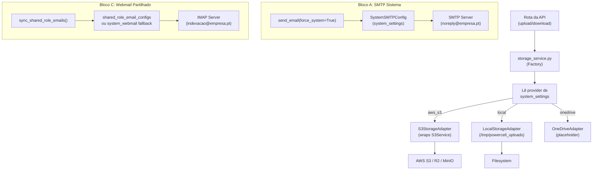

# PowerCell - Sistema de Gestão de Processos de Crédito

## Descrição

Sistema CRM completo para gestão de processos de crédito imobiliário, clientes, documentação e automação. Inclui formulário público dinâmico com campos personalizáveis, motor de automação "No-Code", gestão de permissões, templates de formulário, análise de documentos por IA, e dashboard financeiro.

## Tecnologias

- **Backend**: FastAPI (Python 3.11) + Motor (async MongoDB)
- **Frontend**: React 19 + Vite + Tailwind CSS 4 + Shadcn UI (New York style)
- **Base de dados**: MongoDB Atlas
- **Armazenamento**: AWS S3 (pre-signed URLs)
- **Armazenamento (Factory)**: AWS S3, Local (filesystem), OneDrive (placeholder) — agnóstico via `storage_service.py`
- **Cache**: Upstash Redis (REST API, degradação graciosa)
- **Filas**: ARQ (Redis-based background worker)
- **IA**: OpenAI GPT-4o + Gemini Flash (análise de documentos)
- **Email**: SMTP transacional (SystemConfig) + IMAP sync (per-user + shared Google OAuth)
- **Monitorização**: Sentry (frontend + backend)
- **Acessibilidade**: axe-core (testes automáticos em dev)
- **CI/CD**: GitHub Actions (Node.js 24 + Python 3.11)
- **Deploy**: Render (backend) + Vercel (frontend)

## Estrutura do Projeto

```
PowerCell/
├── backend/
│   ├── server.py              # Entry point FastAPI + middleware
│   ├── config.py              # Variáveis de ambiente e validação
│   ├── database.py            # Ligação MongoDB (Motor, singleton lazy)
│   ├── routes/                # ~45 rotas da API
│   │   ├── admin.py           # CRUD utilizadores, workflow, stats, impersonate
│   │   ├── auth.py            # Login, refresh token, registo
│   │   ├── automation.py      # Motor de automação (regras)
│   │   ├── clients.py         # CRUD clientes, cursor pagination
│   │   ├── documents.py       # Upload/download docs, rate limiting, S3 proxy
│   │   ├── emails.py          # Gmail sync, send-to-banks, rascunhos IA
│   │   ├── finance.py         # Dashboard financeiro, comissões
│   │   ├── form_config.py     # Config formulário + templates
│   │   ├── public.py          # Formulário público, registo clientes
│   │   ├── rgpd.py            # Consentimento RGPD, anonimização
│   │   ├── stats.py           # Estatísticas (com Redis cache)
│   │   └── ...
│   ├── services/              # ~60 ficheiros de lógica de negócio
│   │   ├── auth.py            # JWT, password hashing (passlib)
│   │   ├── encryption.py      # Encriptação AES (Fernet) + Blind Indexing
│   │   ├── redis_cache.py     # Cache Redis com fallback
│   │   ├── workflow_engine.py # Motor de regras de automação
│   │   ├── s3_storage.py      # Pre-signed URLs, organização automática
│   │   ├── storage_service.py  # Factory Pattern: Local/S3/OneDrive adapters
│   │   ├── ai_document_analyzer.py  # Análise de documentos com confiança
│   │   └── ...
│   ├── models/                # Esquemas Pydantic + modelos de dados
│   ├── worker/                # ARQ background worker
│   ├── middleware/             # Rate limiting (slowapi)
│   ├── utils/                 # Validação, sanitização, MIME
│   └── tests/                 # Unit + Integration + E2E tests
├── frontend/
│   ├── src/
│   │   ├── App.js             # Router + providers + lazy loading
│   │   ├── components/
│   │   │   ├── ui/            # Componentes Shadcn UI
│   │   │   ├── KanbanBoard.js # Quadro Kanban com drag-drop (@dnd-kit)
│   │   │   ├── S3FileManager.js # Explorador de ficheiros + IA
│   │   │   ├── NotificationsDropdown.js  # Polling com backoff
│   │   │   ├── ImpersonateBanner.js      # Barra de impersonate
│   │   │   ├── GlobalUploadProgress.js   # Progresso global de uploads
│   │   │   ├── TasksDropdown.js          # Centro de operações
│   │   │   └── UnifiedAuditTrail.js      # "Filme da Lead"
│   │   ├── pages/             # ~50 páginas (lazy loaded)
│   │   │   ├── PublicClientForm.js       # Formulário público dinâmico
│   │   │   ├── AdminDashboard.js         # Dashboard admin
│   │   │   ├── ProcessDetails.js         # Detalhes do processo
│   │   │   ├── StaffDashboard.js         # Dashboard staff (consultor)
│   │   │   ├── MyClientsPage.js          # Os Meus Processos (filtros)
│   │   │   ├── FinanceDashboard.js       # Dashboard financeiro
│   │   │   ├── KanbanPage.js             # Quadro Kanban
│   │   │   ├── ProfileSettingsPage.js    # Gestão permissões
│   │   │   ├── FormManagementPage.js     # Gestão formulário
│   │   │   ├── AutomationPage.js         # Motor automação No-Code
│   │   │   ├── WorkflowStatusesPage.js   # Gestão estados workflow
│   │   │   ├── ClientPortal.js           # Portal do cliente (magic link)
│   │   │   ├── RGPDPage.js               # Página pública de consentimento
│   │   │   └── ...
│   │   ├── hooks/             # Custom hooks
│   │   │   ├── useWebSocket.js  # WebSocket singleton + backoff
│   │   │   ├── queries/         # TanStack Query hooks
│   │   │   └── mutations/       # TanStack Mutation hooks
│   │   ├── contexts/          # React Context providers
│   │   │   ├── AuthContext.js   # Autenticação JWT + impersonate
│   │   │   ├── TasksContext.js  # Polling + circuit breaker
│   │   │   ├── UploadProgressContext.js
│   │   │   └── ThemeContext.js  # Light/Dark mode
│   │   ├── services/
│   │   │   └── api.js          # Axios + interceptors (429 retry)
│   │   └── layouts/
│   │       └── DashboardLayout.js # Sidebar + header
│   ├── vercel.json            # SPA rewrite + security headers
│   └── public/
├── .github/workflows/
│   └── ci.yml                 # CI/CD pipeline (Node 24 + Python 3.11)
├── memory/
│   └── PRD.md                 # Product Requirements Document
├── ARCHITECTURE.md            # Diagramas e padrões de design
├── CHANGELOG.md               # Histórico de versões
└── worklog.md                 # Registo de desenvolvimento
```

## Funcionalidades Principais

### Core
- Gestão de Processos de Crédito (CRUD completo com paginação)
- Gestão de Clientes e Leads com cursor pagination
- Upload e Gestão de Documentação (Storage agnóstico: S3 / Local / OneDrive via Factory Pattern)
- Quadro Kanban com drag-drop (@dnd-kit) e filtros (data, urgência)
- Dashboard e Estatísticas (com cache Redis)
- Sistema de Notificações em tempo real (WebSocket + polling fallback)
- Tarefas assíncronas com centro de operações (ARQ worker)

### Inteligência Artificial
- **Análise de documentos**: Extração automática de dados do CC, IRS, recibos vencimento
- **Confiança por campo**: Score 0.0-1.0 por campo extraído, alertas visuais para < 0.8
- **Auto-fill**: Sugestões automáticas de preenchimento com conflitos detetados
- **Organização automática**: Categorização e movimentação de ficheiros no S3
- **Rascunhos de emails IA**: Geração automática de emails quando faltam documentos
- **DSTI automático**: Cálculo da taxa de esforço a partir de dados financeiros extraídos
- **Conformidade PII**: Opt-out de treino de dados OpenAI habilitado

### Formulário Público Dinâmico
- Formulário multi-step (6 passos) com validação
- **Pré-visualização para consultores** (`/formulario-consultor`): Navegação livre pelo formulário sem preencher
- **Campos personalizáveis**: Admin pode criar campos de 6 tipos (texto, dropdown, checkbox, número, data, sim/não)
- **Editor de opções inline**: Para dropdowns e checkboxes
- **Templates de formulário**: 3 pré-definidos (Crédito Habitação, Refinanciamento, Crédito Pessoal) + personalizados
- **Pré-visualização de templates**: Ver como o formulário ficará antes de ativar
- Campos obrigatórios com indicador visual (* vermelho + "obrigatório")
- Rascunho automático (localStorage)

### Registo de Clientes
- Tabela mostra por defeito apenas clientes **sem processo atribuído**
- Quando o processo é criado, o cliente desaparece da vista principal
- Filtro disponível para ver "Todos", "Com Processo" ou "Sem Processo"
- Link S3 automático ao criar processo: `s3://powerprecision-docs-storage/Documentação Clientes/Nome_Do_Cliente/`

### Os Meus Processos (`/meus-clientes`)
- Vista personalizada por utilizador (apenas processos atribuídos)
- **Filtros por defeito**: Exclui status terminais (concluído, arquivo, perdido, desistências, cancelado)
- **Toggle "Mostrar Concluídos"**: Botão para incluir/excluir processos inativos
- 3 cards de estatísticas (Total, Com Tarefas Pendentes, Com Imóvel)
- Pesquisa com normalização de acentos (NFD)

### Dashboard
- **StaffDashboard**: Vista do consultor com processos sem atualização
- **AdminDashboard**: KPIs, funnel de conversão, atividade recente
- **FinanceDashboard** (admin/CEO): Comissões, performance, separação por áreas
- **Alerta de processos sem atualização**: Exclui processos concluídos, desistências e arquivados

### Administração
- **Gestão de Perfis e Permissões** (`/configuracoes-perfis`): Controlo granular de páginas e ações por utilizador
- **Gestão do Formulário** (`/gestao-formulario`): Ativar/desativar campos, criar campos personalizados, gerir templates
- **Motor de Automação** (`/automation`): Regras "Se X, Então Y" sem código
- **Gestão de Estados do Workflow** (`/workflow-estados`): Cores, labels, ordem
- **Configurações do Sistema** (`/configuracoes`): RGPD, DSTI, emails, backups, notificações, **Integrações (SMTP Sistema, Storage Provider, Webmail Partilhado)**

### RGPD
- **Página pública de consentimento** (`/rgpd/:token`): Assinatura digital do cliente
- **Gestor de RGPD** (admin): Templates editáveis, exportação de consentimentos
- **Anonimização de dados**: Eliminação de PII conforme GDPR
- **RGPD Migration**: Ferramenta de migração para processos legados

### Backup e Restauro Seguro (RGPD)
- **Backup automático diário**: Pipeline que corre às 03:00 UTC, cria ZIP JSON por coleção e faz upload para S3
- **Restauro seguro de Dev** (`restore_dev_from_backup.py`): Restaura a BD de Desenvolvimento a partir do backup mais recente de Produção no S3
- **Arquitetura fail-safe**: A BD de Dev **nunca é modificada** se o backup estiver corrompido (ZIP inválido, JSON inválido, validação de integridade falhar)
- **Fluxo**: S3 → Download ZIP → Extrair JSON → Importar para coleções `_restore_temp_*` → Sanitização RGPD → Validação de integridade → Swap atómico → Recriar índices → Cleanup
- **Disponível via API** (`/api/admin/sync-database`) e **CLI standalone**

### Pipeline de Sanitização de Dados (Prod → Dev)
- **Sincronização direta** (`sync_prod_to_dev.py`): Cópia de Produção para Dev com anonimização total de PII
- **Anonimização por coleção**:
  - **Clientes**: Nome (mantém primeiro nome, ofusca apelido), email (mascara para `@powercell.dev`), NIF (gera NIF falso com dígito de controlo válido), telefone (baralha mantendo prefixo)
  - **Utilizadores**: Mantém email e password para login, anonimiza telefone
  - **Processos**: Remove links S3, limpa campos financeiros ultra-sensíveis (IBAN, salários)
  - **Propriedades**: Arredonda coordenadas para ~1km de precisão
- **Metadados de rastreabilidade**: Cada documento recebe `_sanitized_at`, `_sanitized_source` e flags de anonimização
- **Disponível via API** e **CLI standalone** com suporte a `PROD_MONGO_URL`, `PROD_DB_NAME`, `DEV_MONGO_URL`, `DEV_DB_NAME`

### Webmail (Email IMAP)
- **Sincronização automática**: Background job sincroniza emails via IMAP (30 dias)
- **Sincronização manual**: Botão "Sincronizar" no WebmailPage para trigger imediato
- **Múltiplas contas**: Suporte a Precision Crédito e Power Real Estate (IMAP separado)
- **Per-user personal config**: Cada utilizador configura o seu IMAP/SMTP em Perfil > Config Webmail
- **Shared role accounts**: Indexação/Suporte usam conta partilhada global (Google OAuth ou IMAP)
- **System SMTP (Bloco A)**: Emails transacionais do sistema (documentação, alertas) via SMTP global configurado pelo Admin
- **Smart Threading**: Threading automático por In-Reply-To/References + tag `[Proc-{id}]` no assunto
- **Envio de emails B2B**: Envio de documentação para bancos com editor rich text (WYSIWYG)
- **Rascunhos automáticos IA**: Geração automática de emails quando faltam documentos
- **Factory Pattern Storage**: `storage_service.py` com adapters para S3, Local e OneDrive

### Documentos
- **Explorador S3**: Vista lista/grelha, preview lateral, renomear, mover
- **Organização automática IA**: Categorização por tipo (Financeiros, Identificação, etc.)
- **Anotações contextuais em PDFs**: 5 tipos de anotação (Nota, Questão, Aviso, Financeiro, Aprovação) em documentos, com resolução e estatísticas por processo
- **Enviar Documentação para Balcões (Email B2B)**: Envio de documentação para bancos com editor de texto rico (HTML), templates de email personalizáveis, gestão de destinatários BCC, validação de bloqueio por banco, e anexação automática de documentos
- **Links temporários**: Upload/download seguro por link único (sem login)

### Portal do Cliente
- **Magic Link**: Acesso sem password via link único
- **Upload de documentos**: Cliente envia documentação diretamente
- **Visualização**: Download de documentos disponíveis

### Perfis de Utilizador e Permissões

O sistema suporta os seguintes perfis (roles), cada um com permissões específicas de páginas e ações:

| Perfil | Páginas Acedidas | Ações Permitidas |
|-------|-------------------|------------------|
| **Admin** | Todas | Todas |
| **CEO** | Todas | Todas |
| **Diretor** | Dashboard, Kanban, Processos, Clientes, Docs, Calendário, Notificações, Stats, Imóveis, Minutas, Leads | CRUD processos/clientes, upload/delete docs, financeiros |
| **Consultor** | Dashboard, Kanban, Processos, Clientes, Docs, Calendário, Notificações, AI Insights, Imóveis, Minutas, Leads | CRUD processos/clientes, upload docs, financeiros, imóveis |
| **Mediador/Intermediário** | Dashboard, Kanban, Processos, Clientes, Docs, Calendário, Notificações, AI Insights, Minutas | CRUD processos/clientes, upload docs, financeiros |
| **Administrativo** | Dashboard, Kanban, Processos, Clientes, Docs, Calendário, Notificações, Registos, Validades | CRUD processos/clientes, upload/delete docs |
| **Indexação** | Kanban, Processos, Clientes, Docs, Notificações, **Meus Clientes** | Upload/delete/download docs, atribuir clientes, gerir tarefas, chat |
| **Cliente** | Nenhuma (acesso externo via Magic Link) | Upload/download docs |

#### Perfil INDEXACAO - Detalhes

O perfil de **Indexação** foi projetado para operadores focados na organização documental:

- **Páginas**: Acede a Kanban, Processos, Clientes, Documentos, Notificações e "Meus Clientes"
- **Não tem acesso a**: Dashboard, criar/editar clientes ou processos (dados base são **read-only**)
- **Funcionalidades permitidas**:
  - Upload, delete e download de documentos
  - Gestão de tarefas (criar, editar, completar)
  - Chat interno
  - Atribuição de utilizadores a processos (consultores, intermediários, indexação)
  - Atribuição de clientes
- **Proteção de dados**: O backend retorna HTTP 403 se o utilizador tentar editar dados base via API

### Segurança
- JWT com access token (24h) + refresh token (7d)
- Rate limiting por role (admin: 1000/min, consultor: 200/min, cliente: 100/min)
- Encriptação AES-128-CBC (Fernet) para dados sensíveis
- **Blind Indexing**: Hashes determinísticos (HMAC-SHA256) para pesquisa de dados encriptados
- DOMPurify para sanitização XSS
- Validação MIME type (magic bytes)
- Password strength validation (passlib)
- Input sanitization em todas as rotas da API
- Security headers: HSTS, CSP, X-Frame-Options, X-Content-Type-Options
- CORS fail-secure (sem wildcards)
- OpenAI PII opt-out (sem treino com dados)
- Impersonate control com restauro automático de sessão

#### Context Switcher / Impersonate
- **Admin visualiza como qualquer utilizador**: Gera novo JWT com a role do utilizador-alvo
- **Restauro automático**: O token original do admin é guardado no `localStorage` (`originalToken`)
- **Barra visual**: `ImpersonateBanner` exibe permanentemente o modo de visualização ativo
- **Terminar sessão**: Parar impersonate restaura automaticamente a conta de admin (via `/api/admin/stop-impersonate`)
- **Fallback em token expirado**: Se o token de impersonate expirar (401), o sistema restaura automaticamente a sessão original

#### Blind Indexing (Pesquisa de Dados Encriptados)

Para cumprir o RGPD, dados sensíveis como NIF, email e telefone são encriptados com Fernet (AES-128-CBC). No entanto, dados encriptados não são pesquisáveis diretamente. A solução é **Blind Indexing**:

```
┌─────────────────┐    ┌──────────────────────┐
│   NIF Original  │───▶│   Fernet Encrypt     │───▶ Armazenado encriptado
│   "123456789"   │    │   "ENC:xxxx..."       │
└─────────────────┘    └──────────────────────┘
         │
         ▼
┌─────────────────┐    ┌──────────────────────┐
│  HMAC-SHA256    │───▶│  nif_hash (índice)   │───▶ Pesquisável!
│  "a1b2c3..."     │    │  Único por NIF       │
└─────────────────┘    └──────────────────────┘
```

**Implementação:**
- `services/encryption.py`: `generate_nif_hash()`, `generate_email_hash()`
- Campos de hash: `nif_hash`, `email_hash`, `telefone_hash`
- Índices MongoDB em `*_hash`, nunca em dados encriptados

**Exemplo de query:**
```python
# Pesquisa por NIF
nif_hash = generate_nif_hash(nif)
client = await db.clients.find_one({"dados_pessoais.nif_hash": nif_hash})
```

### Arquitectura de Dados

#### Dedicated Collection Pattern (Histórico)

O histórico de processos NÃO é guardado em arrays embebidos no documento principal. Em vez disso, usa uma **coleção dedicada** (`history`) com documentos independentes:

```
┌─────────────────────────────┐     ┌─────────────────────────────┐
│     Collection: processes   │     │     Collection: history     │
├─────────────────────────────┤     ├─────────────────────────────┤
│ id: "proc-001"              │     │ id: "hist-001"             │
│ client_name: "João Silva"   │     │ process_id: "proc-001"      │
│ status: "em_analise"        │     │ user_id: "user-123"         │
│ ... (sem array history!)    │     │ action: "Alterou estado"    │
│                             │     │ field: "status"             │
│                             │     │ old_value: "clientes_espera"│
│                             │     │ new_value: "em_analise"     │
│                             │     │ created_at: "2024-01-15..." │
└─────────────────────────────┘     └─────────────────────────────┘
```

**Vantagens:**
- Evita limite de 16MB do MongoDB
- I/O otimizado (sem reescrever documento inteiro)
- Queries instantâneas via índice `process_id + created_at`
- Memory bloat eliminado nas listagens

### Arquitetura Agnóstica de Provedores

O sistema é totalmente independente de provedores de serviços:



**Configuração no Admin** (Definições > Integrações):
- **Bloco A**: SMTP Host, Port, Username, Password, From Email, TLS
- **Bloco B**: Provider (Local/S3/OneDrive) + credenciais condicionais
- **Bloco C**: IMAP Host, Port, Email/User, App Password

### Observabilidade
- Sentry SDK (frontend + backend) para monitorização de erros
- Redis health check no endpoint /api/health
- Testes de acessibilidade com axe-core (dev only)
- Audit trail unificado ("Filme da Lead")
- CI/CD com GitHub Actions (lint, build, testes)

### Resiliência
- **429 Retry com backoff**: API interceptor com 3 retries (2s → 4s → 8s + jitter), respeita `Retry-After`
- **Polling backoff**: Notifications polling escala de 30s → 60s → 120s → 5min em 429
- **Chunk error recovery**: `LazyChunkErrorBoundary` deteta stale deployments e faz reload automático
- **Circuit breaker**: TasksContext para polling de tarefas com falhas consecutivas
- **WebSocket singleton**: Uma ligação partilhada entre componentes com backoff exponencial

## API Endpoints Principais

### Públicos (sem autenticação)
| Método | Endpoint | Descrição |
|--------|----------|-----------|
| POST | `/api/public/client-registration` | Registo de cliente |
| GET | `/api/public/form-config` | Campos personalizados do formulário |
| GET | `/api/rgpd/{token}` | Status de consentimento RGPD |
| POST | `/api/rgpd/{token}/sign` | Assinar consentimento RGPD |
| GET/POST | `/api/upload/{token}` | Upload de documentos via link temporário |
| GET | `/api/download/{token}` | Download de documentos via link temporário |
| GET | `/api/health` | Health check |

### Admin (autenticação + role admin/ceo)
| Método | Endpoint | Descrição |
|--------|----------|-----------|
| GET/PUT | `/api/admin/users` | Gestão de utilizadores |
| POST | `/api/admin/impersonate/{id}` | Impersonate utilizador |
| POST | `/api/admin/stop-impersonate` | Parar impersonate |
| GET/PUT | `/api/admin/form-config/fields` | Configuração do formulário |
| POST/DELETE | `/api/admin/form-config/custom-field` | Campos personalizados |
| GET/POST/DELETE | `/api/admin/form-config/templates/*` | Templates de formulário |
| GET/POST | `/api/admin/automation/rules` | CRUD regras de automação |
| GET/PUT | `/api/system-config/*` | Configurações do sistema |
| GET | `/api/admin/ai-training/stats` | Estatísticas de chamadas IA |

## Configuração

### Variáveis de Ambiente

> Consulte o ficheiro [`.env.example`](.env.example) para a lista completa e organizada por categoria.

#### Backend — Obrigatórias
| Variável | Descrição |
|----------|-----------|
| `MONGO_URL` | URL de conexão MongoDB |
| `DB_NAME` | Nome da base de dados |
| `JWT_SECRET` | Chave secreta para JWT (mín. 32 caracteres) |
| `CORS_ORIGINS` | Origens permitidas (vírgulas, sem wildcards) |
| `ENVIRONMENT` | Ambiente: `production` / `development` |

#### Backend — Opcional (mas recomendado)
| Variável | Descrição | Predefinição |
|----------|-----------|--------------|
| `DSN_SENTRY_BACKEND` | DSN do Sentry (backend) | — |
| `SENTRY_ENVIRONMENT` | Ambiente Sentry | `development` |
| `AWS_ACCESS_KEY_ID` | Chave de acesso AWS S3 | — |
| `AWS_SECRET_ACCESS_KEY` | Chave secreta AWS S3 | — |
| `AWS_REGION` | Região AWS | `eu-north-1` |
| `AWS_BUCKET_NAME` | Nome do bucket S3 | — |
| `REDIS_URL` | URL de conexão Redis | `redis://localhost:6379` |
| `EMAIL_PROVIDER` | Provedor: `sendgrid` / `resend` / `smtp` | `sendgrid` |
| `EMAIL_API_KEY` | API key do provedor de email | — |
| `EMAIL_FROM` | Endereço de remetente | `noreply@powerealestate.pt` |
| `EMAIL_FROM_NAME` | Nome do remetente | `Power Real Estate...` |
| `OPENAI_API_KEY` | Chave API OpenAI (legado) | — |
| `EMERGENT_LLM_KEY` | Chave API LLM (GPT-4o/4o-mini) | — |
| `EMERGENT_BASE_URL` | URL base LLM (emergent) | `https://api.emergent.ai/v1` |
| `GEMINI_API_KEY` | Chave API Gemini | — |
| `ONEDRIVE_TENANT_ID` | Tenant ID do OneDrive | — |
| `ONEDRIVE_CLIENT_ID` | Client ID do OneDrive | — |
| `ONEDRIVE_CLIENT_SECRET` | Client Secret do OneDrive | — |
| `VAPID_PRIVATE_KEY` | Chave privada VAPID (Push) | — |
| `VAPID_PUBLIC_KEY` | Chave pública VAPID (Push) | — |
| `TRELLO_API_KEY` | API Key do Trello | — |
| `TRELLO_TOKEN` | Token do Trello | — |
| `TRELLO_BOARD_ID` | Board ID do Trello | — |
| `SCRAPERAPI_API_KEY` | API Key do ScraperAPI (Idealista) | — |

#### Backend — Sincronização Prod ↔ Dev (pipelines)
| Variável | Descrição |
|----------|-----------|
| `PROD_MONGO_URL` | URL MongoDB de Produção (fallback: `MONGO_URL`) |
| `PROD_DB_NAME` | Nome da BD de Produção (fallback: `DB_NAME`) |
| `DEV_MONGO_URL` | URL MongoDB de Desenvolvimento |
| `DEV_DB_NAME` | Nome da BD de Desenvolvimento |

#### Frontend (`.env`)
| Variável | Descrição |
|----------|-----------|
| `REACT_APP_BACKEND_URL` | URL do backend API |
| `REACT_APP_ENVIRONMENT` | Ambiente: `production` / `development` |
| `REACT_APP_VAPID_PUBLIC_KEY` | Chave pública para Push Notifications |
| `VITE_DSN_SENTRY_FRONTEND` | DSN do Sentry (frontend, preferido) |
| `VITE_SENTRY_DSN` | DSN do Sentry (frontend, legado) |

## Instalação e Configuração Local

### Pré-requisitos

- **Python 3.11+** com pip
- **Node.js 18+** (recomendado 24) com npm/yarn
- **MongoDB Atlas** (ou instância local) — connection string SRV
- **Conta AWS** (para S3) — opcional mas recomendado
- **Conta OpenAI** (para análise de documentos) — opcional

### Backend

```bash
# 1. Clonar o repositório
git clone https://github.com/powercell/powercell-crm.git
cd powercell-crm

# 2. Instalar dependências Python
cd backend
pip install -r requirements.txt

# 3. Configurar variáveis de ambiente
cp ../.env.example .env
# Editar .env e preencher MONGO_URL, DB_NAME, JWT_SECRET, CORS_ORIGINS

# 4. Executar seeds (dados de teste)
python seed.py

# 5. Iniciar o servidor
python server.py
# O servidor arranca em http://localhost:8000
```

### Frontend

```bash
# 1. Instalar dependências
cd frontend
npm install

# 2. Configurar variáveis de ambiente
# Criar .env na pasta frontend/ com:
#   REACT_APP_BACKEND_URL=http://localhost:8000
#   REACT_APP_ENVIRONMENT=development

# 3. Iniciar em modo desenvolvimento
npm start
# O frontend arranca em http://localhost:3000
```

### Worker (Background Tasks)

```bash
cd backend
python worker.py
# O worker lê da mesma BD e Redis, processando tarefas em fila
```

### Docker (Produção)

```bash
# Backend
cd backend
docker build -t powercell-backend .
docker run -p 8000:8000 --env-file .env powercell-backend

# Frontend (Vercel faz deploy automático)
# Basta fazer push para a branch main
```

## Credenciais de Teste

- **Admin**: admin@sistema.pt / admin
- **CEO**: pedroborges@powerealestate.pt / power2026
- **Consultor**: tiagoborges@powerealestate.pt / power2026

## Fluxo de Desenvolvimento

### Branches

| Branch | Propósito | Deploy |
|--------|-----------|--------|
| `main` | Produção | Render (backend) + Vercel (frontend) |
| `dev` | Desenvolvimento | Render (preview) + Vercel (preview) |

### Commits

- Mensagens de commit em **português (pt-PT)**
- Formato: `tipo: descrição curta`
- Tipos: `feat`, `fix`, `docs`, `refactor`, `test`, `chore`
- Exemplo: `feat: adicionar sincronização de webmail`

### CI/CD Pipeline

```
Push para branch → GitHub Actions
├── Frontend: ESLint + Vite build → Vercel deploy
├── Backend: Flake8 + Pytest → Render deploy
└── Testes E2E: Playwright (front-end)
```

### Testes

```bash
# Backend — Unit + Integration
cd backend
pytest tests/ -v

# Backend — com cobertura
pytest tests/ --cov=. --cov-report=html

# Frontend — lint
npm run lint

# Frontend — build de produção
npm run build
```

## Deploy

- **Backend**: Render (Docker) — porta via `PORT` env var
- **Frontend**: Vercel — SPA rewrite com exclusão de `/assets/`
- **CI/CD**: GitHub Actions — ESLint + Vite build + Flake8 + Pytest

## Branches

- `main` - Produção
- `dev` - Desenvolvimento

## Licença

Privado - Power Real Estate
